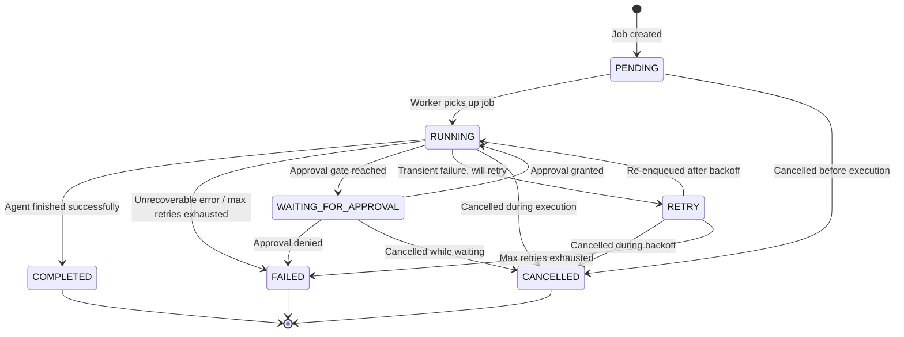

# Spike #24 — Job State Machine Schema

**Status:** Proposed
**Date:** 2026-02-23
**Author:** Cortex Plane Team
**Depends on:** [Spike #27 — Project Structure & Tooling](./027-project-structure.md)

---

## Table of Contents

1. [Context](#context)
2. [Design Overview](#design-overview)
3. [Relationship to Graphile Worker](#relationship-to-graphile-worker)
4. [Artifact: State Transition Diagram](#artifact-state-transition-diagram)
5. [Artifact: TypeScript Definitions](#artifact-typescript-definitions)
6. [Artifact: SQL DDL](#artifact-sql-ddl)
7. [Artifact: Kysely Type Definitions](#artifact-kysely-type-definitions)
8. [Artifact: Backoff Configuration](#artifact-backoff-configuration)
9. [Design Decisions](#design-decisions)

---

## Context

Cortex Plane orchestrates autonomous agent workflows on k3s. The execution engine is built on **Graphile Worker**, which provides durable job processing with its own internal queue in the `graphile_worker` schema.

Graphile Worker is excellent at what it does: reliable job queuing, automatic retries with exponential backoff, locking, and worker coordination. But it is an *execution engine*, not an *application state machine*. It has two terminal states for a job: completed (deleted) or permanently failed. Our domain requires richer semantics:

- **Approval gates** — a job pauses at a decision point, waits for human approval, then resumes.
- **Checkpointing** — agent workflows save progress incrementally so they can resume after a crash.
- **Audit trail** — completed and failed jobs must be queryable long after Graphile Worker has deleted them.
- **Application-level backoff** — configurable retry behavior per agent, independent of Worker's internal retry mechanism.
- **Workflow visibility** — the dashboard needs to display job status, history, and progress in real-time.

This spike defines the schema for the application-level job state machine that sits *on top of* Graphile Worker.

### Hard Constraints (from Spike #27)

| Constraint | Implication |
|---|---|
| Kysely for queries | Schema defined as SQL DDL; Kysely types match columns 1:1 |
| Graphile Worker owns its schema | Our tables live in `public` schema; we never modify `graphile_worker.*` |
| PostgreSQL is the single source of truth | No in-memory state; every state transition is a DB write |
| Stateless control plane | Any instance can process any job; no affinity |
| Shared `pg` connection pool | Kysely and Graphile Worker share the same `pg.Pool` |

---

## Design Overview

The design follows the **shadow table** pattern recommended by Graphile Worker's documentation. Our `job` table is the application-level record of work. When a job needs to be executed, we call `graphile_worker.add_job()` and store the returned Worker job ID on our record. When the Worker task runs, it receives our job's ID in the payload and updates our table with progress and state transitions.

```
┌─────────────────────────────────────────────────────┐
│  Application Layer (public schema)                  │
│                                                     │
│  job table ←──── Source of truth for business state  │
│  job_history table ←── Audit trail / event log      │
│  agent table ←── Agent definitions (referenced)     │
│                                                     │
├─────────────────────────────────────────────────────┤
│  Graphile Worker (graphile_worker schema)            │
│                                                     │
│  _private_jobs ←── Execution queue (transient)      │
│  _private_job_queues ←── Queue metadata             │
│  _private_known_crontabs ←── Cron locks             │
│                                                     │
│  Worker deletes jobs on success.                    │
│  Our job table persists forever.                    │
└─────────────────────────────────────────────────────┘
```

**Key insight:** Graphile Worker's `_private_jobs` table is transient — successful jobs are deleted. Our `job` table is permanent. The Worker job ID (`worker_job_id`) on our record is a nullable, ephemeral reference: it exists only while the Worker job is in-flight. After completion or failure, the Worker job is gone, and our record stands alone with the full history in `job_history`.

---

## Relationship to Graphile Worker

### What Graphile Worker Does (We Don't Duplicate)

| Concern | Graphile Worker's Responsibility |
|---|---|
| Job locking | `locked_at` / `locked_by` on `_private_jobs` — prevents double-processing |
| Worker coordination | Multiple Worker instances share the queue safely via advisory locks |
| Task dispatch | Matches `task_identifier` to registered task functions |
| Internal retries | Exponential backoff: `exp(least(10, attempt))` seconds between attempts |
| Dead job recovery | Unlocks jobs stuck for >4 hours (crashed workers) |

### What Our Schema Does (On Top of Worker)

| Concern | Our Responsibility |
|---|---|
| Application state machine | `PENDING → RUNNING → COMPLETED / FAILED / WAITING_FOR_APPROVAL` |
| Approval gates | `WAITING_FOR_APPROVAL` state with `approval_token` for external approval |
| Checkpointing | `checkpoint` JSONB column updated after each agent step |
| Application-level retries | `retry_count` / `max_retries` / `next_retry_at` with configurable backoff |
| Audit trail | `job_history` table records every state transition with timestamp and metadata |
| Job lifecycle after Worker deletes | Our `job` record persists in terminal states (`COMPLETED`, `FAILED`, `CANCELLED`) |
| Dashboard queries | Indexes optimized for filtering by status, agent, and time range |

### Lifecycle: How a Job Flows Through Both Layers

1. **API receives a job request.** We `INSERT` into `job` with status `PENDING`.
2. **We enqueue to Graphile Worker.** Call `graphile_worker.add_job('run_agent', { jobId: <our_id> })`. Store the returned Worker job ID as `worker_job_id` on our record.
3. **Worker picks up the job.** Our task handler reads `jobId` from the payload, sets status to `RUNNING` on our `job` record.
4. **Agent executes steps.** After each step, the task handler updates `checkpoint` on our record (JSONL buffer flush).
5. **Outcome:**
   - **Success:** Task handler sets our status to `COMPLETED`, returns normally. Worker deletes its internal job. Our `worker_job_id` becomes a dangling reference (harmless — it's nullable and we never query it after completion).
   - **Approval needed:** Task handler sets our status to `WAITING_FOR_APPROVAL`, generates an `approval_token`, and returns normally from the Worker task. Worker deletes its job. When approval arrives, we create a *new* Worker job to resume.
   - **Transient failure:** Task handler throws. Worker increments its internal `attempts` and re-queues with backoff. Our status stays `RUNNING`. If Worker exhausts its `max_attempts`, our task handler is called one final time; we set status to `FAILED`.
   - **Application-level retry:** For failures where we want our own backoff logic (e.g., rate-limited API), the task handler sets our status to `RETRY`, computes `next_retry_at`, increments `retry_count`, and returns normally. A separate scheduled task (or cron) picks up retryable jobs at `next_retry_at` and re-enqueues them to Worker.

### Why Not Use a Foreign Key to `_private_jobs`?

Graphile Worker's documentation notes that foreign keys to `_private_jobs` add performance overhead to the queue. More importantly, `_private_jobs` is a *private* implementation detail — the table name and structure may change in minor releases. We store `worker_job_id` as a plain `bigint` with no foreign key constraint. This is a soft reference for operational debugging only (correlating our records with Worker's queue during execution). After the Worker job completes or fails, the value is stale and irrelevant.

---

## Artifact: State Transition Diagram



### Valid Transitions Table

| From | To | Trigger |
|---|---|---|
| `PENDING` | `RUNNING` | Graphile Worker picks up the queued task |
| `PENDING` | `CANCELLED` | External cancellation before execution |
| `RUNNING` | `COMPLETED` | Agent workflow finishes all steps successfully |
| `RUNNING` | `FAILED` | Unrecoverable error or max retries exhausted |
| `RUNNING` | `WAITING_FOR_APPROVAL` | Agent reaches an approval gate |
| `RUNNING` | `RETRY` | Transient failure; agent will retry after backoff |
| `RUNNING` | `CANCELLED` | External cancellation during execution |
| `RETRY` | `RUNNING` | Re-enqueued to Worker after `next_retry_at` elapses |
| `RETRY` | `CANCELLED` | External cancellation during backoff wait |
| `RETRY` | `FAILED` | `retry_count` reaches `max_retries` |
| `WAITING_FOR_APPROVAL` | `RUNNING` | Approval token validated, job resumes |
| `WAITING_FOR_APPROVAL` | `FAILED` | Approval explicitly denied |
| `WAITING_FOR_APPROVAL` | `CANCELLED` | Cancelled while waiting for approval |

### Terminal States

`COMPLETED`, `FAILED`, and `CANCELLED` are terminal. No transitions out of these states. This is enforced by a database constraint (see DDL below).

---

## Artifact: TypeScript Definitions

### Job Status Enum

```typescript
/**
 * Application-level job states. These are independent of Graphile Worker's
 * internal job lifecycle. Worker jobs are transient; our states are permanent.
 */
export const JOB_STATUS = {
  /** Job created, queued to Graphile Worker, not yet picked up. */
  PENDING: "PENDING",
  /** Worker task is executing the agent workflow. */
  RUNNING: "RUNNING",
  /** Agent finished all steps successfully. Terminal state. */
  COMPLETED: "COMPLETED",
  /** Unrecoverable failure or max retries exhausted. Terminal state. */
  FAILED: "FAILED",
  /** Agent reached an approval gate. Waiting for external approval. */
  WAITING_FOR_APPROVAL: "WAITING_FOR_APPROVAL",
  /** Transient failure. Will retry after backoff. */
  RETRY: "RETRY",
  /** Job cancelled by external request. Terminal state. */
  CANCELLED: "CANCELLED",
} as const;

export type JobStatus = (typeof JOB_STATUS)[keyof typeof JOB_STATUS];

/** States from which no further transitions are possible. */
export const TERMINAL_STATUSES: ReadonlySet<JobStatus> = new Set([
  JOB_STATUS.COMPLETED,
  JOB_STATUS.FAILED,
  JOB_STATUS.CANCELLED,
]);
```

### Job Record Interface

```typescript
import type { JsonValue } from "type-fest";

/**
 * The application-level job record. This is the single source of truth for
 * job state. Graphile Worker's internal job table is transient — this persists.
 */
export interface JobRecord {
  /** UUIDv7 primary key. Sortable by creation time. */
  id: string;

  /** References the agent definition that this job executes. */
  agent_id: string;

  /** Current state in the job lifecycle. */
  status: JobStatus;

  /** Input data for the agent workflow. Immutable after creation. */
  payload: JsonValue;

  /**
   * Incremental agent progress. Updated after each step.
   * Structure is agent-defined (opaque JSONB). Null before first step.
   */
  checkpoint: JsonValue | null;

  /** Number of application-level retries attempted so far. */
  retry_count: number;

  /** Maximum application-level retries allowed. */
  max_retries: number;

  /**
   * When the next retry should be attempted. Set when status transitions
   * to RETRY. Null otherwise. Used by the retry polling query.
   */
  next_retry_at: Date | null;

  /**
   * Opaque token for approval gates. Generated when status transitions
   * to WAITING_FOR_APPROVAL. Null otherwise. Must be presented to approve/deny.
   */
  approval_token: string | null;

  /**
   * Soft reference to Graphile Worker's internal job ID.
   * Present only while a Worker job is in-flight. Null after Worker
   * job completes or is deleted. Not a foreign key — no constraint.
   */
  worker_job_id: string | null;

  /** Terminal error message. Set when status is FAILED. */
  error_message: string | null;

  /** When the job record was created. */
  created_at: Date;

  /** When the job record was last modified. Updated on every state change. */
  updated_at: Date;

  /** When the job reached a terminal state. Null while active. */
  finished_at: Date | null;
}
```

### Job History Record Interface

```typescript
/**
 * Immutable audit log entry. One row per state transition.
 * Append-only — rows are never updated or deleted.
 */
export interface JobHistoryRecord {
  /** UUIDv7 primary key. */
  id: string;

  /** References the job this event belongs to. */
  job_id: string;

  /** The state the job was in before this transition. Null for the initial PENDING entry. */
  previous_status: JobStatus | null;

  /** The state the job transitioned to. */
  new_status: JobStatus;

  /** Optional metadata about this transition (error details, approval info, etc.). */
  metadata: JsonValue | null;

  /** When this transition occurred. */
  created_at: Date;
}
```

---

## Artifact: SQL DDL

```sql
-- =============================================================================
-- Spike #24: Job State Machine Schema
-- =============================================================================
-- Application-level job tracking on top of Graphile Worker.
-- All tables live in the `public` schema. Graphile Worker manages its own
-- `graphile_worker` schema independently.
-- =============================================================================

-- ---------------------------------------------------------------------------
-- Extension: pgcrypto for gen_random_uuid() fallback, uuid-ossp not needed.
-- Node.js generates UUIDv7 IDs at the application layer, but we keep
-- gen_random_uuid() as a DDL default for direct SQL inserts during debugging.
-- ---------------------------------------------------------------------------
CREATE EXTENSION IF NOT EXISTS pgcrypto;

-- ---------------------------------------------------------------------------
-- Type: job_status
-- Using a PostgreSQL enum rather than a TEXT CHECK constraint.
-- Rationale: Enums are stored as 4-byte integers internally (compact),
-- provide type safety at the DB level, and produce clear error messages
-- on invalid values. Adding a new enum value is a non-blocking ALTER TYPE.
-- Removing a value is harder, but job statuses are append-only in practice.
-- ---------------------------------------------------------------------------
CREATE TYPE job_status AS ENUM (
  'PENDING',
  'RUNNING',
  'COMPLETED',
  'FAILED',
  'WAITING_FOR_APPROVAL',
  'RETRY',
  'CANCELLED'
);

-- ---------------------------------------------------------------------------
-- Table: job
-- ---------------------------------------------------------------------------
-- The application-level job record. This is the source of truth for job
-- state. Graphile Worker's internal job table is transient (deleted on
-- completion); this table persists the full lifecycle.
--
-- Primary key uses UUIDv7 (generated by the application layer). UUIDv7 is
-- time-ordered, so it provides natural chronological ordering without a
-- separate sequence, and is safe for distributed ID generation.
-- ---------------------------------------------------------------------------
CREATE TABLE job (
  -- Identity
  id              UUID PRIMARY KEY DEFAULT gen_random_uuid(),
  agent_id        UUID NOT NULL,

  -- State machine
  status          job_status NOT NULL DEFAULT 'PENDING',

  -- Payload & progress
  payload         JSONB NOT NULL DEFAULT '{}',
  checkpoint      JSONB,

  -- Retry mechanics
  retry_count     INT NOT NULL DEFAULT 0,
  max_retries     INT NOT NULL DEFAULT 3,
  next_retry_at   TIMESTAMPTZ,

  -- Approval gate
  approval_token  TEXT,

  -- Graphile Worker correlation (soft reference, no FK)
  worker_job_id   BIGINT,

  -- Outcome
  error_message   TEXT,

  -- Timestamps
  created_at      TIMESTAMPTZ NOT NULL DEFAULT now(),
  updated_at      TIMESTAMPTZ NOT NULL DEFAULT now(),
  finished_at     TIMESTAMPTZ
);

-- ---------------------------------------------------------------------------
-- Comments
-- ---------------------------------------------------------------------------
COMMENT ON TABLE job IS
  'Application-level job state machine. Sits on top of Graphile Worker.';
COMMENT ON COLUMN job.id IS
  'UUIDv7 primary key. Generated by the application layer for time-ordered IDs.';
COMMENT ON COLUMN job.agent_id IS
  'References the agent definition that this job executes.';
COMMENT ON COLUMN job.status IS
  'Current state in the job lifecycle. See job_status enum.';
COMMENT ON COLUMN job.payload IS
  'Input data for the agent workflow. Immutable after creation.';
COMMENT ON COLUMN job.checkpoint IS
  'Incremental agent progress. Updated after each step. Structure is agent-defined.';
COMMENT ON COLUMN job.retry_count IS
  'Number of application-level retries attempted so far.';
COMMENT ON COLUMN job.max_retries IS
  'Maximum application-level retries allowed before moving to FAILED.';
COMMENT ON COLUMN job.next_retry_at IS
  'When the next retry should be attempted. Set when status = RETRY.';
COMMENT ON COLUMN job.approval_token IS
  'Opaque token for approval gates. Set when status = WAITING_FOR_APPROVAL.';
COMMENT ON COLUMN job.worker_job_id IS
  'Soft reference to Graphile Worker internal job ID. Null when no Worker job is in-flight.';
COMMENT ON COLUMN job.error_message IS
  'Terminal error message. Set when status = FAILED.';
COMMENT ON COLUMN job.finished_at IS
  'When the job reached a terminal state (COMPLETED, FAILED, CANCELLED). Null while active.';

-- ---------------------------------------------------------------------------
-- Constraints
-- ---------------------------------------------------------------------------

-- Retry count must not exceed max retries.
ALTER TABLE job ADD CONSTRAINT chk_retry_count
  CHECK (retry_count >= 0 AND retry_count <= max_retries);

-- max_retries must be non-negative and bounded.
ALTER TABLE job ADD CONSTRAINT chk_max_retries
  CHECK (max_retries >= 0 AND max_retries <= 100);

-- next_retry_at must be set when status is RETRY, and only then.
ALTER TABLE job ADD CONSTRAINT chk_next_retry_at
  CHECK (
    (status = 'RETRY' AND next_retry_at IS NOT NULL) OR
    (status != 'RETRY')
  );

-- approval_token must be set when status is WAITING_FOR_APPROVAL, and only then.
ALTER TABLE job ADD CONSTRAINT chk_approval_token
  CHECK (
    (status = 'WAITING_FOR_APPROVAL' AND approval_token IS NOT NULL) OR
    (status != 'WAITING_FOR_APPROVAL')
  );

-- finished_at must be set for terminal states and null for active states.
ALTER TABLE job ADD CONSTRAINT chk_finished_at
  CHECK (
    (status IN ('COMPLETED', 'FAILED', 'CANCELLED') AND finished_at IS NOT NULL) OR
    (status NOT IN ('COMPLETED', 'FAILED', 'CANCELLED') AND finished_at IS NULL)
  );

-- error_message must be set when status is FAILED, and only then.
ALTER TABLE job ADD CONSTRAINT chk_error_message
  CHECK (
    (status = 'FAILED' AND error_message IS NOT NULL) OR
    (status != 'FAILED')
  );

-- ---------------------------------------------------------------------------
-- Function: validate_job_transition
-- ---------------------------------------------------------------------------
-- Enforces valid state transitions. Called by a BEFORE UPDATE trigger.
-- Invalid transitions raise an exception, rolling back the transaction.
-- ---------------------------------------------------------------------------
CREATE OR REPLACE FUNCTION validate_job_transition()
RETURNS TRIGGER AS $$
BEGIN
  -- No-op if status hasn't changed.
  IF OLD.status = NEW.status THEN
    RETURN NEW;
  END IF;

  -- Terminal states cannot transition to anything.
  IF OLD.status IN ('COMPLETED', 'FAILED', 'CANCELLED') THEN
    RAISE EXCEPTION 'Cannot transition from terminal state %', OLD.status;
  END IF;

  -- Validate specific transitions.
  CASE OLD.status
    WHEN 'PENDING' THEN
      IF NEW.status NOT IN ('RUNNING', 'CANCELLED') THEN
        RAISE EXCEPTION 'Invalid transition: PENDING → %', NEW.status;
      END IF;

    WHEN 'RUNNING' THEN
      IF NEW.status NOT IN ('COMPLETED', 'FAILED', 'WAITING_FOR_APPROVAL', 'RETRY', 'CANCELLED') THEN
        RAISE EXCEPTION 'Invalid transition: RUNNING → %', NEW.status;
      END IF;

    WHEN 'RETRY' THEN
      IF NEW.status NOT IN ('RUNNING', 'CANCELLED', 'FAILED') THEN
        RAISE EXCEPTION 'Invalid transition: RETRY → %', NEW.status;
      END IF;

    WHEN 'WAITING_FOR_APPROVAL' THEN
      IF NEW.status NOT IN ('RUNNING', 'FAILED', 'CANCELLED') THEN
        RAISE EXCEPTION 'Invalid transition: WAITING_FOR_APPROVAL → %', NEW.status;
      END IF;

    ELSE
      RAISE EXCEPTION 'Unknown status: %', OLD.status;
  END CASE;

  -- Auto-set updated_at on every transition.
  NEW.updated_at := now();

  -- Auto-set finished_at on terminal transitions.
  IF NEW.status IN ('COMPLETED', 'FAILED', 'CANCELLED') THEN
    NEW.finished_at := now();
  END IF;

  RETURN NEW;
END;
$$ LANGUAGE plpgsql;

CREATE TRIGGER trg_validate_job_transition
  BEFORE UPDATE OF status ON job
  FOR EACH ROW
  EXECUTE FUNCTION validate_job_transition();

-- ---------------------------------------------------------------------------
-- Function: update_job_updated_at
-- ---------------------------------------------------------------------------
-- Keeps updated_at current on any column change (not just status).
-- ---------------------------------------------------------------------------
CREATE OR REPLACE FUNCTION update_job_updated_at()
RETURNS TRIGGER AS $$
BEGIN
  NEW.updated_at := now();
  RETURN NEW;
END;
$$ LANGUAGE plpgsql;

CREATE TRIGGER trg_update_job_updated_at
  BEFORE UPDATE ON job
  FOR EACH ROW
  WHEN (OLD.* IS DISTINCT FROM NEW.*)
  EXECUTE FUNCTION update_job_updated_at();

-- ---------------------------------------------------------------------------
-- Indexes
-- ---------------------------------------------------------------------------

-- Queue polling: find PENDING jobs to dispatch, ordered by creation time.
-- This is the hot path — Worker polling runs every few seconds.
CREATE INDEX idx_job_pending ON job (created_at ASC)
  WHERE status = 'PENDING';

-- Retry polling: find RETRY jobs whose backoff has elapsed.
-- Used by the retry scheduler (runs on a timer, e.g., every 30 seconds).
CREATE INDEX idx_job_retry ON job (next_retry_at ASC)
  WHERE status = 'RETRY';

-- Approval lookup: find jobs waiting for a specific approval token.
-- Used when an approval callback arrives.
CREATE INDEX idx_job_approval_token ON job (approval_token)
  WHERE status = 'WAITING_FOR_APPROVAL';

-- Dashboard: filter jobs by agent. Covers "show me all jobs for agent X".
CREATE INDEX idx_job_agent_id ON job (agent_id, created_at DESC);

-- Dashboard: filter jobs by status. Covers status filter dropdowns.
CREATE INDEX idx_job_status ON job (status, created_at DESC);

-- Worker correlation: look up our job by Worker's internal job ID.
-- Used when we need to correlate during active execution.
CREATE INDEX idx_job_worker_job_id ON job (worker_job_id)
  WHERE worker_job_id IS NOT NULL;

-- ---------------------------------------------------------------------------
-- Table: job_history
-- ---------------------------------------------------------------------------
-- Append-only audit log. One row per state transition. Rows are never
-- updated or deleted. This table grows monotonically — consider
-- partitioning by created_at if it exceeds 10M+ rows.
-- ---------------------------------------------------------------------------
CREATE TABLE job_history (
  id              UUID PRIMARY KEY DEFAULT gen_random_uuid(),
  job_id          UUID NOT NULL REFERENCES job(id) ON DELETE CASCADE,
  previous_status job_status,
  new_status      job_status NOT NULL,
  metadata        JSONB,
  created_at      TIMESTAMPTZ NOT NULL DEFAULT now()
);

COMMENT ON TABLE job_history IS
  'Append-only audit log of job state transitions.';
COMMENT ON COLUMN job_history.previous_status IS
  'The state the job was in before this transition. NULL for the initial PENDING entry.';
COMMENT ON COLUMN job_history.new_status IS
  'The state the job transitioned to.';
COMMENT ON COLUMN job_history.metadata IS
  'Optional context: error details, approval info, retry backoff, etc.';

-- ---------------------------------------------------------------------------
-- Indexes for job_history
-- ---------------------------------------------------------------------------

-- Query history for a specific job, ordered chronologically.
CREATE INDEX idx_job_history_job_id ON job_history (job_id, created_at ASC);

-- ---------------------------------------------------------------------------
-- Function: record_job_history
-- ---------------------------------------------------------------------------
-- Automatically logs every status transition to job_history.
-- Fires AFTER the transition trigger validates and commits the change.
-- ---------------------------------------------------------------------------
CREATE OR REPLACE FUNCTION record_job_history()
RETURNS TRIGGER AS $$
BEGIN
  INSERT INTO job_history (job_id, previous_status, new_status, metadata)
  VALUES (
    NEW.id,
    OLD.status,
    NEW.status,
    -- Capture relevant context depending on the transition.
    CASE
      WHEN NEW.status = 'FAILED' THEN
        jsonb_build_object('error_message', NEW.error_message)
      WHEN NEW.status = 'RETRY' THEN
        jsonb_build_object(
          'retry_count', NEW.retry_count,
          'next_retry_at', NEW.next_retry_at
        )
      WHEN NEW.status = 'WAITING_FOR_APPROVAL' THEN
        jsonb_build_object('approval_token', NEW.approval_token)
      ELSE NULL
    END
  );
  RETURN NEW;
END;
$$ LANGUAGE plpgsql;

CREATE TRIGGER trg_record_job_history
  AFTER UPDATE OF status ON job
  FOR EACH ROW
  WHEN (OLD.status IS DISTINCT FROM NEW.status)
  EXECUTE FUNCTION record_job_history();

-- ---------------------------------------------------------------------------
-- Function: record_job_creation
-- ---------------------------------------------------------------------------
-- Records the initial PENDING entry in job_history when a job is created.
-- ---------------------------------------------------------------------------
CREATE OR REPLACE FUNCTION record_job_creation()
RETURNS TRIGGER AS $$
BEGIN
  INSERT INTO job_history (job_id, previous_status, new_status)
  VALUES (NEW.id, NULL, NEW.status);
  RETURN NEW;
END;
$$ LANGUAGE plpgsql;

CREATE TRIGGER trg_record_job_creation
  AFTER INSERT ON job
  FOR EACH ROW
  EXECUTE FUNCTION record_job_creation();
```

---

## Artifact: Kysely Type Definitions

These interfaces define the database types for Kysely's type-safe query builder. They live in `packages/control-plane/src/db/types.ts` and must match the SQL DDL exactly.

```typescript
import type { ColumnType, Generated, Insertable, Selectable, Updateable } from "kysely";

// ---------------------------------------------------------------------------
// Job status enum — matches PostgreSQL `job_status` type.
// Re-exported from @cortex/shared for use in both DB and application layers.
// ---------------------------------------------------------------------------
import type { JobStatus } from "@cortex/shared";

// ---------------------------------------------------------------------------
// Table: job
// ---------------------------------------------------------------------------
export interface JobTable {
  id: Generated<string>;
  agent_id: string;
  status: Generated<JobStatus>;
  payload: Generated<Record<string, unknown>>;
  checkpoint: Record<string, unknown> | null;
  retry_count: Generated<number>;
  max_retries: Generated<number>;
  next_retry_at: Date | null;
  approval_token: string | null;
  worker_job_id: string | null;
  error_message: string | null;
  created_at: Generated<Date>;
  updated_at: Generated<Date>;
  finished_at: Date | null;
}

export type Job = Selectable<JobTable>;
export type NewJob = Insertable<JobTable>;
export type JobUpdate = Updateable<JobTable>;

// ---------------------------------------------------------------------------
// Table: job_history
// ---------------------------------------------------------------------------
export interface JobHistoryTable {
  id: Generated<string>;
  job_id: string;
  previous_status: JobStatus | null;
  new_status: JobStatus;
  metadata: Record<string, unknown> | null;
  created_at: Generated<Date>;
}

export type JobHistory = Selectable<JobHistoryTable>;
export type NewJobHistory = Insertable<JobHistoryTable>;

// ---------------------------------------------------------------------------
// Database interface — register all tables here.
// ---------------------------------------------------------------------------
export interface Database {
  job: JobTable;
  job_history: JobHistoryTable;
}
```

### Usage Example

```typescript
import { Kysely, PostgresDialect } from "kysely";
import type { Database } from "./db/types.js";

const db = new Kysely<Database>({ dialect: new PostgresDialect({ pool }) });

// Type-safe query: find retryable jobs whose backoff has elapsed.
const retryableJobs = await db
  .selectFrom("job")
  .selectAll()
  .where("status", "=", "RETRY")
  .where("next_retry_at", "<=", new Date())
  .orderBy("next_retry_at", "asc")
  .execute();
// retryableJobs is typed as Job[]
```

---

## Artifact: Backoff Configuration

### Strategy: Exponential Backoff with Jitter

Application-level retries (our `RETRY` state) use exponential backoff with full jitter to prevent thundering herd when multiple agents hit a rate limit simultaneously.

```typescript
/**
 * Backoff configuration for application-level retries.
 * These are independent of Graphile Worker's internal retry mechanism.
 */
export interface BackoffConfig {
  /** Base delay in milliseconds. Default: 1000 (1 second). */
  baseDelayMs: number;
  /** Maximum delay in milliseconds. Default: 300_000 (5 minutes). */
  maxDelayMs: number;
  /** Multiplier applied per retry. Default: 2 (doubles each time). */
  multiplier: number;
  /** Whether to add random jitter. Default: true. */
  jitter: boolean;
}

export const DEFAULT_BACKOFF_CONFIG: BackoffConfig = {
  baseDelayMs: 1_000,
  maxDelayMs: 300_000,
  multiplier: 2,
  jitter: true,
};

/**
 * Compute the next retry timestamp.
 *
 * Formula: min(maxDelay, baseDelay * multiplier^retryCount)
 * With jitter: uniform random between 0 and the computed delay.
 *
 * Retry schedule with defaults (no jitter):
 *   Retry 1:   1s
 *   Retry 2:   2s
 *   Retry 3:   4s
 *   Retry 4:   8s
 *   Retry 5:  16s
 *   Retry 6:  32s
 *   Retry 7:  64s
 *   Retry 8: 128s
 *   Retry 9: 256s
 *   Retry 10: 300s (capped at maxDelay)
 */
export function computeNextRetryAt(
  retryCount: number,
  config: BackoffConfig = DEFAULT_BACKOFF_CONFIG,
): Date {
  const delay = Math.min(
    config.maxDelayMs,
    config.baseDelayMs * Math.pow(config.multiplier, retryCount),
  );
  const jitteredDelay = config.jitter ? Math.random() * delay : delay;
  return new Date(Date.now() + jitteredDelay);
}
```

### How This Differs from Graphile Worker's Backoff

| Aspect | Graphile Worker (internal) | Our backoff (application-level) |
|---|---|---|
| Formula | `exp(least(10, attempt))` seconds | `min(maxDelay, base * multiplier^retry)` + jitter |
| Purpose | Retry failed task execution | Retry after rate limits, transient API errors |
| Scope | Retries the same Worker job | Creates a *new* Worker job for each retry |
| Control | Fixed formula, not configurable per-job | Configurable per-agent via `BackoffConfig` |
| Max delay | ~6 hours (e^10) | 5 minutes (default, configurable) |
| State tracking | Worker's internal `attempts` column | Our `retry_count` + `next_retry_at` |

**Why both?** Graphile Worker's retries handle *infrastructure-level* failures (task crashes, uncaught exceptions). Our retries handle *application-level* failures (API rate limits, upstream timeouts) where we want shorter backoff and explicit state tracking.

---

## Design Decisions

### 1. UUIDv7 for Primary Keys

**Decision:** UUIDv7, generated at the application layer.

**Rationale:**
- UUIDv7 encodes a millisecond timestamp, making IDs chronologically sortable. This eliminates the need for a separate `created_at` sort in most queries.
- UUIDs are safe for distributed ID generation. If we ever run multiple control plane instances, there's no sequence contention.
- PostgreSQL stores UUID as 16 bytes — the same as `bigint` (8 bytes) plus one additional 8-byte block. The storage overhead vs. `bigserial` is marginal.
- `gen_random_uuid()` (UUIDv4) is the DDL default for direct SQL inserts during debugging. In application code, we generate UUIDv7 using a library (e.g., `uuidv7`).

### 2. PostgreSQL Enum for Job Status

**Decision:** `CREATE TYPE job_status AS ENUM (...)` rather than `TEXT` with a `CHECK` constraint.

**Rationale:**
- Enums are stored as 4-byte OIDs internally — more compact than variable-length TEXT.
- Adding a new enum value is `ALTER TYPE job_status ADD VALUE 'NEW_STATE'` — non-blocking, append-only.
- Error messages are explicit: `invalid input value for enum job_status: "INVALID"` vs. a generic CHECK violation.
- The status set is well-defined and changes rarely. Enums are the right tool.

### 3. Trigger-Based Transition Validation

**Decision:** A `BEFORE UPDATE` trigger validates state transitions rather than relying on application code.

**Rationale:**
- Defense in depth. Even if application code has a bug, the database rejects invalid transitions.
- The transition rules are defined in one place (the trigger function), not scattered across service methods.
- The trigger fires within the same transaction as the UPDATE — no race condition between validation and write.
- Trade-off: Triggers add slight overhead per UPDATE. For job state transitions (low frequency — maybe 10/second at peak), this is negligible.

### 4. Separate Audit Table (job_history) vs. Column-Level Tracking

**Decision:** Append-only `job_history` table rather than adding `previous_status` / `status_changed_at` columns to `job`.

**Rationale:**
- A job may transition through 5+ states in its lifetime. Column-level tracking only captures the *most recent* transition; `job_history` captures all of them.
- The `job` table stays lean for active query patterns (queue polling, dashboard filters). History is queried separately, typically for a specific job.
- Append-only tables are trivially partitionable by `created_at` if they grow large.
- The `AFTER UPDATE` trigger populates `job_history` automatically — application code doesn't need to remember to log transitions.

### 5. Partial Indexes for Queue Polling

**Decision:** Partial indexes (`WHERE status = 'PENDING'`, `WHERE status = 'RETRY'`) rather than full-column indexes.

**Rationale:**
- At any given time, most jobs are in terminal states (`COMPLETED`, `FAILED`). Only a small fraction are `PENDING` or `RETRY`.
- A full index on `status` would include millions of terminal-state rows that are never matched by polling queries.
- Partial indexes include only the rows that match the `WHERE` clause. They're smaller, fit in memory better, and are faster to scan.
- The `idx_job_pending` index is the hottest index in the system — it's queried every polling cycle.

### 6. No Foreign Key to Graphile Worker

**Decision:** `worker_job_id BIGINT` with no `REFERENCES` constraint.

**Rationale:**
- Graphile Worker's `_private_jobs` table is a private implementation detail. The table name may change in minor releases.
- Foreign keys to `_private_jobs` add write overhead to every Worker job insert/delete (FK validation).
- Worker deletes jobs on success. If we had an FK with `ON DELETE SET NULL`, every completed Worker job would trigger an update to our `job` table — unnecessary write amplification.
- The `worker_job_id` is purely diagnostic: useful for correlating logs during active execution. After the Worker job is gone, the value is stale. No FK needed.

### 7. JSONB for Payload and Checkpoint

**Decision:** `JSONB` rather than `JSON` or separate columns.

**Rationale:**
- `JSONB` is stored in a decomposed binary format. It supports indexing (GIN), efficient key access (`->`), and containment queries (`@>`).
- `JSON` stores the raw text — no indexing, reparsed on every access. No advantage.
- Separate columns for payload/checkpoint fields would require schema changes whenever an agent's data shape changes. JSONB is schema-flexible at the storage layer; TypeScript interfaces enforce shape at the application layer.
- We don't index payload or checkpoint contents today. If needed later, GIN indexes can be added without schema changes.

### 8. ON DELETE CASCADE for job_history

**Decision:** `job_history.job_id REFERENCES job(id) ON DELETE CASCADE`.

**Rationale:**
- If a job record is deleted (administrative cleanup), its history should be deleted too. Orphaned history rows serve no purpose.
- In normal operation, jobs are never deleted — they reach terminal states and stay. The CASCADE is a safety net for administrative operations.

---

## Open Questions

1. **Partitioning strategy for job_history.** If we accumulate millions of audit rows, we'll want range partitioning by `created_at`. Defer until we observe growth patterns.
2. **Job priority.** The current schema has no priority column. Graphile Worker supports priority on its internal jobs. If we need application-level priority, add an `INT` column with a partial index. Defer until needed.
3. **Job tags / labels.** Some workflows may need arbitrary key-value tags for filtering. A `tags JSONB` column with a GIN index would support this. Defer until needed.
4. **Approval token expiry.** Should `WAITING_FOR_APPROVAL` jobs time out? If so, add `approval_expires_at TIMESTAMPTZ` and a scheduled task to fail expired approvals. Defer until approval semantics are fully designed.
5. **Checkpoint size limits.** JSONB has a ~1GB limit per row, but large checkpoints bloat WAL and replication. Consider a separate `job_checkpoint` table or external storage if checkpoints exceed 1MB. Monitor during agent development.
