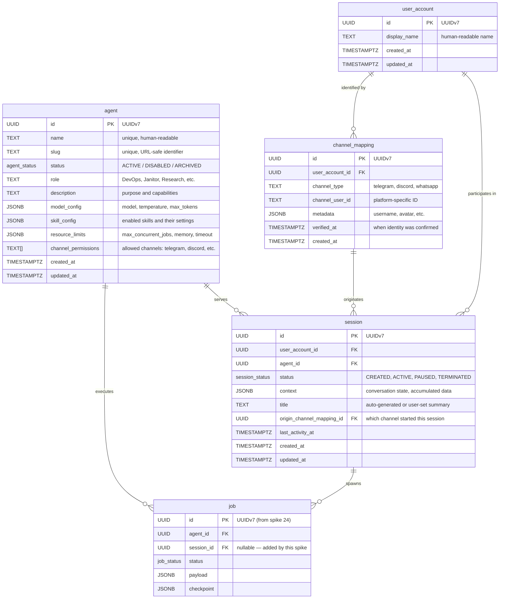
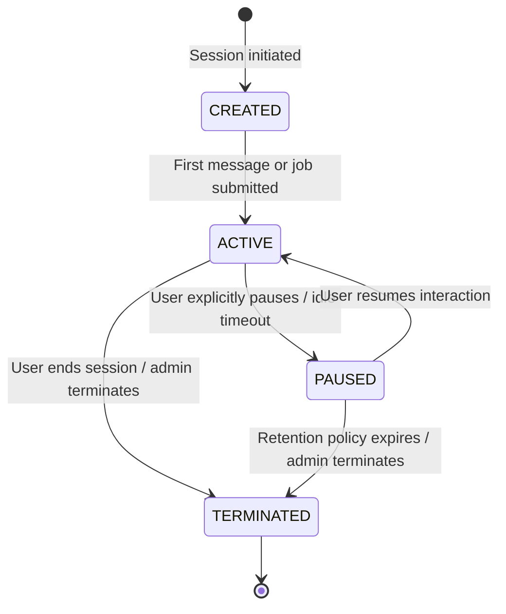

# Spike #25 — Agent Registry & Session Mapping

**Status:** Proposed
**Date:** 2026-02-23
**Author:** Cortex Plane Team
**Depends on:** [Spike #24 — Job State Machine](./024-job-state-machine.md), [Spike #27 — Project Structure & Tooling](./027-project-structure.md)

---

## Table of Contents

1. [Context](#context)
2. [Design Overview](#design-overview)
3. [Artifact: ER Diagram](#artifact-er-diagram)
4. [Artifact: Session Lifecycle State Diagram](#artifact-session-lifecycle-state-diagram)
5. [Artifact: SQL DDL](#artifact-sql-ddl)
6. [Artifact: TypeScript Interfaces](#artifact-typescript-interfaces)
7. [Artifact: Kysely Type Definitions](#artifact-kysely-type-definitions)
8. [Artifact: Example Queries](#artifact-example-queries)
9. [Design Decisions](#design-decisions)
10. [Open Questions](#open-questions)

---

## Context

Cortex Plane orchestrates autonomous agents that users interact with through multiple messaging platforms (Telegram, Discord, WhatsApp, and future channels). Three problems need solving:

1. **Agent definition.** Spike #24 introduced `agent_id` as a foreign key on the `job` table but deferred the agent table itself. We need a concrete schema for agent definitions — what an agent is, how it's configured, and what resources it's allowed to consume.

2. **Cross-channel identity.** A user may interact with the platform from Telegram, Discord, and WhatsApp simultaneously. Each platform uses its own identifier (Telegram `chat_id`, Discord `user_id`, WhatsApp phone number). The platform needs a unified identity layer that maps all of these to a single internal user, so that a user who starts a task on WhatsApp can check its status on Telegram and approve it on Discord.

3. **Session management.** A session is the stateful interaction context between a user and an agent. It spans multiple messages, can spawn multiple jobs, and must survive channel hops. The session lifecycle (created → active → paused → terminated) must be explicit and tracked.

### Hard Constraints

| Constraint                              | Implication                                                                                       |
| --------------------------------------- | ------------------------------------------------------------------------------------------------- |
| Spike #24: `job.agent_id UUID NOT NULL` | The `agent` table must exist and use UUID primary keys. Jobs reference agents.                    |
| Stateless control plane                 | Session state lives in PostgreSQL, not in-memory. Any control plane instance handles any request. |
| Cross-channel continuity                | The same session must be accessible from any platform the user is connected on.                   |
| Kysely for queries                      | All types match DDL 1:1. No ORM magic.                                                            |
| UUIDv7 for primary keys                 | Consistent with spike #24's decision. Time-ordered, distributed-safe.                             |

---

## Design Overview

The design introduces four new tables and one new enum:

```
┌─────────────────────────────────────────────────────────────────┐
│  Application Layer (public schema)                              │
│                                                                 │
│  agent ←────────── Agent definitions (roles, config, limits)    │
│  user_account ←─── Unified platform user identity               │
│  channel_mapping ← Platform ID → user_account mapping           │
│  session ←──────── Interaction context (user × agent)           │
│                                                                 │
│  Existing:                                                      │
│  job ←──────────── Work units (references agent, session)       │
│  job_history ←──── Audit trail for job transitions              │
│                                                                 │
├─────────────────────────────────────────────────────────────────┤
│  Graphile Worker (graphile_worker schema)                       │
│  (unchanged — manages its own execution queue)                  │
└─────────────────────────────────────────────────────────────────┘
```

### Entity Relationships

- An **agent** is a reusable definition. Multiple users share the same agent definition (e.g., there is one "DevOps Agent" that any authorized user can invoke). Agent definitions are created by administrators, not by end users.
- A **user_account** is the platform's internal representation of a person. It has no direct relationship to any channel — that's the channel_mapping's job.
- A **channel_mapping** links a platform-specific identity (Telegram chat_id, Discord user_id) to a `user_account`. A user_account can have multiple channel_mappings (one per platform). A platform identity maps to exactly one user_account.
- A **session** is the interaction context between one user_account and one agent. It tracks the conversation state and can spawn multiple jobs. Sessions have a lifecycle: `CREATED → ACTIVE → PAUSED → TERMINATED`.
- A **job** (from spike #24) is a unit of work within a session. A session can have zero or more jobs. Adding an optional `session_id` FK to the existing `job` table links them.

---

## Artifact: ER Diagram



---

## Artifact: Session Lifecycle State Diagram



### Session State Semantics

| State        | Meaning                                                                                                                                                                | Active Jobs Allowed?                          |
| ------------ | ---------------------------------------------------------------------------------------------------------------------------------------------------------------------- | --------------------------------------------- |
| `CREATED`    | Session record exists but no interaction has occurred yet. Placeholder state for sessions created programmatically (e.g., by a scheduled trigger).                     | No — session is not yet active.               |
| `ACTIVE`     | User and agent are actively interacting. Messages are being exchanged, jobs can be spawned.                                                                            | Yes.                                          |
| `PAUSED`     | Session is suspended. The user stepped away or an idle timeout fired. Existing running jobs continue to completion, but no new jobs are spawned. Context is preserved. | No new jobs. Existing jobs run to completion. |
| `TERMINATED` | Session is permanently closed. Context is retained for audit/history but the session cannot be resumed.                                                                | No. All pending jobs should be cancelled.     |

### Valid Transitions Table

| From      | To           | Trigger                                                            |
| --------- | ------------ | ------------------------------------------------------------------ |
| `CREATED` | `ACTIVE`     | First user message received or first job submitted                 |
| `ACTIVE`  | `PAUSED`     | User requests pause / idle timeout (configurable per agent)        |
| `ACTIVE`  | `TERMINATED` | User ends session / admin force-terminates / agent self-terminates |
| `PAUSED`  | `ACTIVE`     | User sends a new message / explicit resume command                 |
| `PAUSED`  | `TERMINATED` | Retention policy cleanup / admin force-terminates                  |

### Terminal State

`TERMINATED` is the only terminal state. Unlike job states, there is no `FAILED` state for sessions — a session with all-failed jobs is still `ACTIVE` or `PAUSED` until explicitly terminated. Sessions represent conversational context, not work outcomes.

---

## Artifact: SQL DDL

```sql
-- =============================================================================
-- Spike #25: Agent Registry & Session Mapping
-- =============================================================================
-- Introduces agent definitions, unified user identity, cross-channel mapping,
-- and session management. All tables in `public` schema.
--
-- Depends on:
--   - pgcrypto extension (from spike #24)
--   - job_status enum (from spike #24)
--   - job table (from spike #24)
-- =============================================================================

-- ---------------------------------------------------------------------------
-- Type: agent_status
-- ---------------------------------------------------------------------------
-- Agents can be disabled without deletion to preserve referential integrity.
-- ARCHIVED agents are hidden from the UI but preserved for historical jobs.
-- ---------------------------------------------------------------------------
CREATE TYPE agent_status AS ENUM (
  'ACTIVE',
  'DISABLED',
  'ARCHIVED'
);

-- ---------------------------------------------------------------------------
-- Type: session_status
-- ---------------------------------------------------------------------------
CREATE TYPE session_status AS ENUM (
  'CREATED',
  'ACTIVE',
  'PAUSED',
  'TERMINATED'
);

-- ---------------------------------------------------------------------------
-- Table: agent
-- ---------------------------------------------------------------------------
-- An agent is a reusable definition of an autonomous worker. It describes
-- the model, skills, resource limits, and channel permissions. Multiple
-- users share the same agent definition — agents are configured by
-- administrators, not created per-user.
--
-- The agent_id FK on the job table (spike #24) references this table.
-- ---------------------------------------------------------------------------
CREATE TABLE agent (
  -- Identity
  id                  UUID PRIMARY KEY DEFAULT gen_random_uuid(),
  name                TEXT NOT NULL,
  slug                TEXT NOT NULL,
  status              agent_status NOT NULL DEFAULT 'ACTIVE',

  -- Classification
  role                TEXT NOT NULL,
  description         TEXT,

  -- Configuration
  model_config        JSONB NOT NULL DEFAULT '{}',
  skill_config        JSONB NOT NULL DEFAULT '{}',
  resource_limits     JSONB NOT NULL DEFAULT '{}',

  -- Channel access control
  channel_permissions TEXT[] NOT NULL DEFAULT '{}',

  -- Timestamps
  created_at          TIMESTAMPTZ NOT NULL DEFAULT now(),
  updated_at          TIMESTAMPTZ NOT NULL DEFAULT now()
);

COMMENT ON TABLE agent IS
  'Reusable agent definition. Describes model, skills, resource limits, and permissions.';
COMMENT ON COLUMN agent.id IS
  'UUIDv7 primary key. Generated by the application layer.';
COMMENT ON COLUMN agent.name IS
  'Human-readable name. Unique within the platform. E.g., "DevOps Agent".';
COMMENT ON COLUMN agent.slug IS
  'URL-safe identifier. Unique. Used in API paths and CLI. E.g., "devops-agent".';
COMMENT ON COLUMN agent.status IS
  'Lifecycle status. DISABLED agents reject new sessions. ARCHIVED agents are hidden.';
COMMENT ON COLUMN agent.role IS
  'Functional role: DevOps, Janitor, Research, etc. Free-text, not an enum — roles evolve.';
COMMENT ON COLUMN agent.description IS
  'Human-readable description of the agent purpose and capabilities.';
COMMENT ON COLUMN agent.model_config IS
  'Model configuration: {"model": "claude-sonnet-4-20250514", "temperature": 0.7, "max_tokens": 4096}';
COMMENT ON COLUMN agent.skill_config IS
  'Skills enabled for this agent and their configuration. Schema is agent-defined.';
COMMENT ON COLUMN agent.resource_limits IS
  'Resource constraints: {"max_concurrent_jobs": 5, "max_memory_mb": 512, "timeout_seconds": 3600}';
COMMENT ON COLUMN agent.channel_permissions IS
  'Channels this agent is allowed to operate on. E.g., {"telegram", "discord"}. Empty = all channels.';

-- Constraints
ALTER TABLE agent ADD CONSTRAINT uq_agent_name UNIQUE (name);
ALTER TABLE agent ADD CONSTRAINT uq_agent_slug UNIQUE (slug);

ALTER TABLE agent ADD CONSTRAINT chk_agent_name_not_empty
  CHECK (length(trim(name)) > 0);
ALTER TABLE agent ADD CONSTRAINT chk_agent_slug_format
  CHECK (slug ~ '^[a-z0-9][a-z0-9-]*[a-z0-9]$' AND length(slug) >= 2);
ALTER TABLE agent ADD CONSTRAINT chk_agent_role_not_empty
  CHECK (length(trim(role)) > 0);

-- Indexes
-- Look up agent by slug (API path resolution).
CREATE INDEX idx_agent_slug ON agent (slug) WHERE status = 'ACTIVE';

-- List all active agents (dashboard, agent picker).
CREATE INDEX idx_agent_status ON agent (status, name);

-- ---------------------------------------------------------------------------
-- Table: user_account
-- ---------------------------------------------------------------------------
-- The platform's internal representation of a person. Decoupled from any
-- messaging channel. Channel-specific identities are linked via
-- channel_mapping.
--
-- Deliberately minimal. We don't store email, phone, or auth credentials
-- here — that's the channel_mapping's job. user_account is purely an
-- internal correlation point.
-- ---------------------------------------------------------------------------
CREATE TABLE user_account (
  id              UUID PRIMARY KEY DEFAULT gen_random_uuid(),
  display_name    TEXT NOT NULL,
  created_at      TIMESTAMPTZ NOT NULL DEFAULT now(),
  updated_at      TIMESTAMPTZ NOT NULL DEFAULT now()
);

COMMENT ON TABLE user_account IS
  'Unified platform user identity. Channel-specific IDs map here via channel_mapping.';
COMMENT ON COLUMN user_account.id IS
  'UUIDv7 primary key. This is the unified userId referenced throughout the platform.';
COMMENT ON COLUMN user_account.display_name IS
  'Human-readable display name. Initially set from the first channel mapping, user-editable.';

ALTER TABLE user_account ADD CONSTRAINT chk_display_name_not_empty
  CHECK (length(trim(display_name)) > 0);

-- ---------------------------------------------------------------------------
-- Table: channel_mapping
-- ---------------------------------------------------------------------------
-- Maps a platform-specific identity to a unified user_account.
--
-- Each row represents one identity on one platform. A user_account can have
-- multiple channel_mappings (one per platform). The combination of
-- (channel_type, channel_user_id) is globally unique — a platform identity
-- maps to exactly one user_account.
--
-- This table is the bridge between "Telegram chat_id 12345" and
-- "platform user 550e8400-...".
-- ---------------------------------------------------------------------------
CREATE TABLE channel_mapping (
  id                UUID PRIMARY KEY DEFAULT gen_random_uuid(),
  user_account_id   UUID NOT NULL REFERENCES user_account(id) ON DELETE CASCADE,
  channel_type      TEXT NOT NULL,
  channel_user_id   TEXT NOT NULL,
  metadata          JSONB NOT NULL DEFAULT '{}',
  verified_at       TIMESTAMPTZ,
  created_at        TIMESTAMPTZ NOT NULL DEFAULT now()
);

COMMENT ON TABLE channel_mapping IS
  'Maps platform-specific identities to unified user_accounts. One row per platform per user.';
COMMENT ON COLUMN channel_mapping.channel_type IS
  'Platform identifier: "telegram", "discord", "whatsapp". Lowercase, no enum — new channels added freely.';
COMMENT ON COLUMN channel_mapping.channel_user_id IS
  'The platform-native user ID. Telegram: chat_id as string. Discord: user snowflake. WhatsApp: phone number.';
COMMENT ON COLUMN channel_mapping.metadata IS
  'Platform-specific profile data: {"username": "jdoe", "avatar_url": "...", "language_code": "en"}';
COMMENT ON COLUMN channel_mapping.verified_at IS
  'When this identity was verified (e.g., via a challenge or OAuth). Null if unverified.';

-- The core uniqueness constraint: one platform identity → one user_account.
ALTER TABLE channel_mapping ADD CONSTRAINT uq_channel_identity
  UNIQUE (channel_type, channel_user_id);

ALTER TABLE channel_mapping ADD CONSTRAINT chk_channel_type_not_empty
  CHECK (length(trim(channel_type)) > 0);
ALTER TABLE channel_mapping ADD CONSTRAINT chk_channel_user_id_not_empty
  CHECK (length(trim(channel_user_id)) > 0);
ALTER TABLE channel_mapping ADD CONSTRAINT chk_channel_type_lowercase
  CHECK (channel_type = lower(channel_type));

-- Indexes

-- Look up user_account by platform identity. This is the hot path:
-- every incoming message does this lookup.
-- The UNIQUE constraint already creates an index on (channel_type, channel_user_id),
-- so no additional index is needed for the primary lookup.

-- Find all channel mappings for a user (profile page, cross-channel queries).
CREATE INDEX idx_channel_mapping_user ON channel_mapping (user_account_id);

-- ---------------------------------------------------------------------------
-- Table: session
-- ---------------------------------------------------------------------------
-- A session is the interaction context between one user and one agent.
-- It represents a conversation thread that can span multiple messages,
-- multiple jobs, and multiple channels.
--
-- A user can have multiple concurrent sessions with different agents,
-- but only one active session per agent at a time (enforced by a
-- partial unique index).
-- ---------------------------------------------------------------------------
CREATE TABLE session (
  -- Identity
  id                        UUID PRIMARY KEY DEFAULT gen_random_uuid(),
  user_account_id           UUID NOT NULL REFERENCES user_account(id) ON DELETE CASCADE,
  agent_id                  UUID NOT NULL REFERENCES agent(id) ON DELETE RESTRICT,

  -- State
  status                    session_status NOT NULL DEFAULT 'CREATED',

  -- Conversation context
  context                   JSONB NOT NULL DEFAULT '{}',
  title                     TEXT,

  -- Origin tracking
  origin_channel_mapping_id UUID REFERENCES channel_mapping(id) ON DELETE SET NULL,

  -- Timestamps
  last_activity_at          TIMESTAMPTZ NOT NULL DEFAULT now(),
  created_at                TIMESTAMPTZ NOT NULL DEFAULT now(),
  updated_at                TIMESTAMPTZ NOT NULL DEFAULT now()
);

COMMENT ON TABLE session IS
  'Interaction context between a user and an agent. Spans messages, jobs, and channels.';
COMMENT ON COLUMN session.id IS
  'UUIDv7 primary key.';
COMMENT ON COLUMN session.user_account_id IS
  'The user participating in this session.';
COMMENT ON COLUMN session.agent_id IS
  'The agent serving this session. ON DELETE RESTRICT — cannot delete agents with sessions.';
COMMENT ON COLUMN session.status IS
  'Session lifecycle state: CREATED → ACTIVE → PAUSED → TERMINATED.';
COMMENT ON COLUMN session.context IS
  'Accumulated conversation context. Updated as the session progresses. Schema is agent-defined.';
COMMENT ON COLUMN session.title IS
  'Short summary of the session. Auto-generated from the first message or user-set.';
COMMENT ON COLUMN session.origin_channel_mapping_id IS
  'Which channel mapping initiated this session. SET NULL on mapping deletion — session survives.';
COMMENT ON COLUMN session.last_activity_at IS
  'Updated on every message or job event. Used for idle timeout detection.';

-- Constraints

-- A user can have at most one non-terminated session per agent.
-- This prevents duplicate active conversations. To start a new session
-- with the same agent, the user must terminate the existing one.
CREATE UNIQUE INDEX uq_session_active_per_user_agent
  ON session (user_account_id, agent_id)
  WHERE status != 'TERMINATED';

-- Indexes

-- Find active sessions for a user (session picker, channel adapter routing).
CREATE INDEX idx_session_user_active ON session (user_account_id, last_activity_at DESC)
  WHERE status IN ('CREATED', 'ACTIVE', 'PAUSED');

-- Find sessions for an agent (admin dashboard).
CREATE INDEX idx_session_agent ON session (agent_id, created_at DESC);

-- Idle timeout: find sessions that haven't had activity in a while.
CREATE INDEX idx_session_idle ON session (last_activity_at ASC)
  WHERE status = 'ACTIVE';

-- ---------------------------------------------------------------------------
-- Function: validate_session_transition
-- ---------------------------------------------------------------------------
-- Enforces valid session state transitions via a BEFORE UPDATE trigger.
-- Same pattern as job transition validation in spike #24.
-- ---------------------------------------------------------------------------
CREATE OR REPLACE FUNCTION validate_session_transition()
RETURNS TRIGGER AS $$
BEGIN
  -- No-op if status hasn't changed.
  IF OLD.status = NEW.status THEN
    RETURN NEW;
  END IF;

  -- TERMINATED is terminal — no transitions out.
  IF OLD.status = 'TERMINATED' THEN
    RAISE EXCEPTION 'Cannot transition from terminal state TERMINATED';
  END IF;

  -- Validate specific transitions.
  CASE OLD.status
    WHEN 'CREATED' THEN
      IF NEW.status NOT IN ('ACTIVE', 'TERMINATED') THEN
        RAISE EXCEPTION 'Invalid transition: CREATED → %', NEW.status;
      END IF;

    WHEN 'ACTIVE' THEN
      IF NEW.status NOT IN ('PAUSED', 'TERMINATED') THEN
        RAISE EXCEPTION 'Invalid transition: ACTIVE → %', NEW.status;
      END IF;

    WHEN 'PAUSED' THEN
      IF NEW.status NOT IN ('ACTIVE', 'TERMINATED') THEN
        RAISE EXCEPTION 'Invalid transition: PAUSED → %', NEW.status;
      END IF;

    ELSE
      RAISE EXCEPTION 'Unknown session status: %', OLD.status;
  END CASE;

  -- Auto-set updated_at on every transition.
  NEW.updated_at := now();

  RETURN NEW;
END;
$$ LANGUAGE plpgsql;

CREATE TRIGGER trg_validate_session_transition
  BEFORE UPDATE OF status ON session
  FOR EACH ROW
  EXECUTE FUNCTION validate_session_transition();

-- ---------------------------------------------------------------------------
-- Function: update_session_updated_at
-- ---------------------------------------------------------------------------
CREATE OR REPLACE FUNCTION update_session_updated_at()
RETURNS TRIGGER AS $$
BEGIN
  NEW.updated_at := now();
  RETURN NEW;
END;
$$ LANGUAGE plpgsql;

CREATE TRIGGER trg_update_session_updated_at
  BEFORE UPDATE ON session
  FOR EACH ROW
  WHEN (OLD.* IS DISTINCT FROM NEW.*)
  EXECUTE FUNCTION update_session_updated_at();

-- ---------------------------------------------------------------------------
-- Function: update_agent_updated_at
-- ---------------------------------------------------------------------------
CREATE OR REPLACE FUNCTION update_agent_updated_at()
RETURNS TRIGGER AS $$
BEGIN
  NEW.updated_at := now();
  RETURN NEW;
END;
$$ LANGUAGE plpgsql;

CREATE TRIGGER trg_update_agent_updated_at
  BEFORE UPDATE ON agent
  FOR EACH ROW
  WHEN (OLD.* IS DISTINCT FROM NEW.*)
  EXECUTE FUNCTION update_agent_updated_at();

-- ---------------------------------------------------------------------------
-- Function: update_user_account_updated_at
-- ---------------------------------------------------------------------------
CREATE OR REPLACE FUNCTION update_user_account_updated_at()
RETURNS TRIGGER AS $$
BEGIN
  NEW.updated_at := now();
  RETURN NEW;
END;
$$ LANGUAGE plpgsql;

CREATE TRIGGER trg_update_user_account_updated_at
  BEFORE UPDATE ON user_account
  FOR EACH ROW
  WHEN (OLD.* IS DISTINCT FROM NEW.*)
  EXECUTE FUNCTION update_user_account_updated_at();

-- ---------------------------------------------------------------------------
-- Alter: job table — add session_id FK
-- ---------------------------------------------------------------------------
-- A job optionally belongs to a session. Nullable because:
-- 1. Jobs created before this migration have no session.
-- 2. Some jobs may be triggered programmatically without a user session
--    (e.g., scheduled maintenance tasks).
-- ---------------------------------------------------------------------------
ALTER TABLE job ADD COLUMN session_id UUID REFERENCES session(id) ON DELETE SET NULL;

COMMENT ON COLUMN job.session_id IS
  'Optional reference to the session that spawned this job. Null for sessionless jobs.';

CREATE INDEX idx_job_session_id ON job (session_id, created_at DESC)
  WHERE session_id IS NOT NULL;

-- ---------------------------------------------------------------------------
-- Alter: job table — add FK constraint on agent_id
-- ---------------------------------------------------------------------------
-- Spike #24 defined agent_id as UUID NOT NULL but deferred the FK
-- constraint because the agent table didn't exist yet. Now it does.
-- ---------------------------------------------------------------------------
ALTER TABLE job ADD CONSTRAINT fk_job_agent_id
  FOREIGN KEY (agent_id) REFERENCES agent(id) ON DELETE RESTRICT;
```

---

## Artifact: TypeScript Interfaces

These interfaces live in `packages/shared/src/types/` alongside the existing job types from spike #24.

### Agent Types

```typescript
/**
 * Agent lifecycle states.
 * - ACTIVE: agent accepts new sessions and jobs.
 * - DISABLED: agent rejects new sessions but existing sessions continue.
 * - ARCHIVED: agent is hidden from UI. Preserved for historical reference.
 */
export const AGENT_STATUS = {
  ACTIVE: "ACTIVE",
  DISABLED: "DISABLED",
  ARCHIVED: "ARCHIVED",
} as const

export type AgentStatus = (typeof AGENT_STATUS)[keyof typeof AGENT_STATUS]

/**
 * Model configuration for an agent. Defines which LLM to use and
 * generation parameters.
 */
export interface AgentModelConfig {
  /** Model identifier. E.g., "claude-sonnet-4-20250514". */
  model: string
  /** Sampling temperature. 0 = deterministic, 1 = creative. */
  temperature?: number
  /** Maximum tokens in the model's response. */
  max_tokens?: number
  /** System prompt for the agent. */
  system_prompt?: string
}

/**
 * Resource limits for an agent. Enforced by the control plane when
 * scheduling jobs and spawning agent pods.
 */
export interface AgentResourceLimits {
  /** Maximum concurrent jobs this agent can run. Default: 5. */
  max_concurrent_jobs?: number
  /** Maximum memory in MB for the agent pod. Default: 512. */
  max_memory_mb?: number
  /** Maximum execution time in seconds per job. Default: 3600 (1 hour). */
  timeout_seconds?: number
}

/**
 * The agent definition record. Describes an autonomous agent's identity,
 * configuration, and constraints.
 */
export interface Agent {
  /** UUIDv7 primary key. */
  id: string
  /** Human-readable name. Unique. E.g., "DevOps Agent". */
  name: string
  /** URL-safe identifier. Unique. E.g., "devops-agent". */
  slug: string
  /** Lifecycle status. */
  status: AgentStatus
  /** Functional role. E.g., "DevOps", "Janitor", "Research". */
  role: string
  /** Human-readable description of purpose and capabilities. */
  description: string | null
  /** LLM model configuration. */
  model_config: AgentModelConfig
  /** Enabled skills and their settings. */
  skill_config: Record<string, unknown>
  /** Resource constraints for job scheduling. */
  resource_limits: AgentResourceLimits
  /** Channels this agent is allowed to operate on. Empty = all. */
  channel_permissions: string[]
  /** When the agent was created. */
  created_at: Date
  /** When the agent was last modified. */
  updated_at: Date
}
```

### Session Types

```typescript
/**
 * Session lifecycle states.
 * TERMINATED is the only terminal state.
 */
export const SESSION_STATUS = {
  /** Session created but no interaction yet. */
  CREATED: "CREATED",
  /** Actively interacting. Jobs can be spawned. */
  ACTIVE: "ACTIVE",
  /** Paused. Context preserved, no new jobs. */
  PAUSED: "PAUSED",
  /** Permanently closed. Cannot be resumed. */
  TERMINATED: "TERMINATED",
} as const

export type SessionStatus = (typeof SESSION_STATUS)[keyof typeof SESSION_STATUS]

/**
 * A session is the interaction context between one user and one agent.
 * It spans messages, jobs, and channels.
 */
export interface Session {
  /** UUIDv7 primary key. */
  id: string
  /** The user participating in this session. */
  user_account_id: string
  /** The agent serving this session. */
  agent_id: string
  /** Current lifecycle state. */
  status: SessionStatus
  /** Accumulated conversation context. Agent-defined schema. */
  context: Record<string, unknown>
  /** Short summary of the session. */
  title: string | null
  /** Which channel mapping initiated this session. */
  origin_channel_mapping_id: string | null
  /** Last message or job event timestamp. */
  last_activity_at: Date
  /** When the session was created. */
  created_at: Date
  /** When the session was last modified. */
  updated_at: Date
}
```

### Channel Mapping Types

```typescript
/**
 * Supported messaging channel types. Not an enum — new channels are
 * added as strings. This const provides type hints for known channels.
 */
export const CHANNEL_TYPE = {
  TELEGRAM: "telegram",
  DISCORD: "discord",
  WHATSAPP: "whatsapp",
} as const

export type ChannelType = (typeof CHANNEL_TYPE)[keyof typeof CHANNEL_TYPE]

/**
 * Maps a platform-specific identity to a unified user_account.
 */
export interface ChannelMapping {
  /** UUIDv7 primary key. */
  id: string
  /** The unified user_account this identity belongs to. */
  user_account_id: string
  /** Platform identifier: "telegram", "discord", "whatsapp". */
  channel_type: string
  /** Platform-native user ID. Type varies by platform. */
  channel_user_id: string
  /** Platform-specific profile data. */
  metadata: Record<string, unknown>
  /** When this identity was verified. Null if unverified. */
  verified_at: Date | null
  /** When this mapping was created. */
  created_at: Date
}

/**
 * The platform's internal user identity. Decoupled from any channel.
 */
export interface UserAccount {
  /** UUIDv7 primary key. The unified userId. */
  id: string
  /** Human-readable display name. */
  display_name: string
  /** When the account was created. */
  created_at: Date
  /** When the account was last modified. */
  updated_at: Date
}
```

---

## Artifact: Kysely Type Definitions

These extend the `Database` interface from spike #24 in `packages/control-plane/src/db/types.ts`.

```typescript
import type { Generated, Insertable, Selectable, Updateable } from "kysely"
import type { AgentStatus, SessionStatus } from "@cortex/shared"

// ---------------------------------------------------------------------------
// Table: agent
// ---------------------------------------------------------------------------
export interface AgentTable {
  id: Generated<string>
  name: string
  slug: string
  status: Generated<AgentStatus>
  role: string
  description: string | null
  model_config: Generated<Record<string, unknown>>
  skill_config: Generated<Record<string, unknown>>
  resource_limits: Generated<Record<string, unknown>>
  channel_permissions: Generated<string[]>
  created_at: Generated<Date>
  updated_at: Generated<Date>
}

export type AgentRow = Selectable<AgentTable>
export type NewAgent = Insertable<AgentTable>
export type AgentUpdate = Updateable<AgentTable>

// ---------------------------------------------------------------------------
// Table: user_account
// ---------------------------------------------------------------------------
export interface UserAccountTable {
  id: Generated<string>
  display_name: string
  created_at: Generated<Date>
  updated_at: Generated<Date>
}

export type UserAccountRow = Selectable<UserAccountTable>
export type NewUserAccount = Insertable<UserAccountTable>
export type UserAccountUpdate = Updateable<UserAccountTable>

// ---------------------------------------------------------------------------
// Table: channel_mapping
// ---------------------------------------------------------------------------
export interface ChannelMappingTable {
  id: Generated<string>
  user_account_id: string
  channel_type: string
  channel_user_id: string
  metadata: Generated<Record<string, unknown>>
  verified_at: Date | null
  created_at: Generated<Date>
}

export type ChannelMappingRow = Selectable<ChannelMappingTable>
export type NewChannelMapping = Insertable<ChannelMappingTable>

// ---------------------------------------------------------------------------
// Table: session
// ---------------------------------------------------------------------------
export interface SessionTable {
  id: Generated<string>
  user_account_id: string
  agent_id: string
  status: Generated<SessionStatus>
  context: Generated<Record<string, unknown>>
  title: string | null
  origin_channel_mapping_id: string | null
  last_activity_at: Generated<Date>
  created_at: Generated<Date>
  updated_at: Generated<Date>
}

export type SessionRow = Selectable<SessionTable>
export type NewSession = Insertable<SessionTable>
export type SessionUpdate = Updateable<SessionTable>

// ---------------------------------------------------------------------------
// Updated Database interface — extends spike #24's definition.
// ---------------------------------------------------------------------------
export interface Database {
  job: JobTable
  job_history: JobHistoryTable
  agent: AgentTable
  user_account: UserAccountTable
  channel_mapping: ChannelMappingTable
  session: SessionTable
}
```

---

## Artifact: Example Queries

All examples use Kysely's type-safe query builder with the `Database` interface defined above.

### 1. Create an Agent

```typescript
const agent = await db
  .insertInto("agent")
  .values({
    id: uuidv7(),
    name: "DevOps Agent",
    slug: "devops-agent",
    role: "DevOps",
    description: "Handles infrastructure provisioning, deployment, and monitoring.",
    model_config: {
      model: "claude-sonnet-4-20250514",
      temperature: 0.3,
      max_tokens: 4096,
      system_prompt: "You are a DevOps engineer...",
    },
    skill_config: {
      kubectl: { enabled: true, namespaces: ["default", "staging"] },
      docker: { enabled: true },
      terraform: { enabled: false },
    },
    resource_limits: {
      max_concurrent_jobs: 3,
      max_memory_mb: 1024,
      timeout_seconds: 1800,
    },
    channel_permissions: ["telegram", "discord"],
  })
  .returningAll()
  .executeTakeFirstOrThrow()
```

### 2. Create a User Account and Map a Telegram Identity

```typescript
// Create the unified user account.
const user = await db
  .insertInto("user_account")
  .values({
    id: uuidv7(),
    display_name: "Alice",
  })
  .returningAll()
  .executeTakeFirstOrThrow()

// Map their Telegram identity to the account.
const mapping = await db
  .insertInto("channel_mapping")
  .values({
    id: uuidv7(),
    user_account_id: user.id,
    channel_type: "telegram",
    channel_user_id: "123456789", // Telegram chat_id
    metadata: {
      username: "alice_dev",
      first_name: "Alice",
      language_code: "en",
    },
  })
  .returningAll()
  .executeTakeFirstOrThrow()
```

### 3. Add a Discord Identity to an Existing User

```typescript
// Link a Discord identity to the same user account.
await db
  .insertInto("channel_mapping")
  .values({
    id: uuidv7(),
    user_account_id: user.id, // Same user as above
    channel_type: "discord",
    channel_user_id: "987654321012345678", // Discord snowflake
    metadata: {
      username: "alice#1234",
      avatar: "abc123",
    },
  })
  .executeTakeFirstOrThrow()
```

### 4. Find User Account by Telegram Chat ID

This is the hot path — executed on every incoming message from a channel adapter.

```typescript
const userAccount = await db
  .selectFrom("channel_mapping")
  .innerJoin("user_account", "user_account.id", "channel_mapping.user_account_id")
  .select([
    "user_account.id",
    "user_account.display_name",
    "channel_mapping.id as channel_mapping_id",
  ])
  .where("channel_mapping.channel_type", "=", "telegram")
  .where("channel_mapping.channel_user_id", "=", "123456789")
  .executeTakeFirst()

if (!userAccount) {
  // First-time user — create account and mapping in a transaction.
  // (See "First-Contact Flow" in Design Decisions.)
}
```

### 5. Create a Session

```typescript
const session = await db
  .insertInto("session")
  .values({
    id: uuidv7(),
    user_account_id: user.id,
    agent_id: agent.id,
    origin_channel_mapping_id: mapping.id,
    title: "Deploy staging environment",
  })
  .returningAll()
  .executeTakeFirstOrThrow()
```

### 6. Find Active Session for User + Agent (from Any Channel)

When a message arrives from any channel, the adapter resolves the user_account, then looks up the active session with the target agent. The session is channel-agnostic — the same session is returned whether the message came from Telegram or Discord.

```typescript
const activeSession = await db
  .selectFrom("session")
  .selectAll()
  .where("user_account_id", "=", userAccountId)
  .where("agent_id", "=", agentId)
  .where("status", "in", ["CREATED", "ACTIVE", "PAUSED"])
  .executeTakeFirst()
```

### 7. List All Jobs in a Session

```typescript
const sessionJobs = await db
  .selectFrom("job")
  .selectAll()
  .where("session_id", "=", sessionId)
  .orderBy("created_at", "desc")
  .execute()
```

### 8. Find All Channel Identities for a User

Useful for the dashboard profile page and for broadcasting session events across channels.

```typescript
const identities = await db
  .selectFrom("channel_mapping")
  .selectAll()
  .where("user_account_id", "=", userAccountId)
  .orderBy("created_at", "asc")
  .execute()
```

---

## Design Decisions

### 1. What Defines an Agent?

**Decision:** An agent is a reusable definition with identity (id, name, slug), classification (role, description), configuration (model_config, skill_config), constraints (resource_limits, channel_permissions), and lifecycle (status).

**Rationale:**

- **Identity fields:** `name` is human-readable for the dashboard; `slug` is URL-safe for API paths (`/agents/devops-agent`). Both are unique.
- **Role is free-text, not an enum.** Roles will evolve rapidly as we add new agent types. Enums require DDL changes; free-text with application-layer validation is more flexible. The cost is that typos aren't caught at the DB level — but agent creation is an admin-only, low-frequency operation where application validation suffices.
- **JSONB for configuration.** Model config, skill config, and resource limits are structured data with schemas that will evolve per agent type. Separate columns for every possible setting would be impractical. JSONB stores the data; TypeScript interfaces enforce shape at the application layer.
- **Status enum.** ACTIVE / DISABLED / ARCHIVED is a small, stable set. DISABLED preserves the agent definition but blocks new sessions — useful for maintenance. ARCHIVED hides the agent from the UI while preserving it for historical job/session references.

### 2. Unified Identity: user_account + channel_mapping

**Decision:** Two-table design. `user_account` is the internal identity; `channel_mapping` links platform-specific IDs to it.

**Rationale:**

- **Separation of concerns.** The user_account table knows nothing about Telegram, Discord, or WhatsApp. It's a pure correlation point. All platform-specific data lives in channel_mapping. Adding a new channel means adding rows, not columns.
- **One platform identity → one user_account.** The `UNIQUE (channel_type, channel_user_id)` constraint prevents a Telegram chat_id from being claimed by two different user_accounts. This is the fundamental integrity guarantee.
- **One user_account → many platform identities.** Alice can link her Telegram, Discord, and WhatsApp identities to the same user_account. All sessions and jobs are attributed to the user_account, not to any channel-specific identity.
- **channel_type is TEXT, not an enum.** New channels (Slack, Matrix, SMS) are added by inserting rows with a new `channel_type` value. No DDL changes needed. The constraint `chk_channel_type_lowercase` ensures consistency.

### 3. Cross-Channel Session Continuity

**Decision:** Sessions reference `user_account_id`, not any channel-specific identity. Any channel adapter that resolves to the same user_account reaches the same session.

**Rationale:**

The core requirement is: _a user starts a task on WhatsApp, checks status on Telegram, approves on Discord — same session._

This works because:

1. An incoming message arrives at the Telegram adapter.
2. The adapter looks up `channel_mapping WHERE channel_type = 'telegram' AND channel_user_id = '...'` → gets `user_account_id`.
3. The adapter looks up `session WHERE user_account_id = X AND agent_id = Y AND status != 'TERMINATED'` → gets the active session.
4. The session is the same regardless of which channel the message came from.

The `origin_channel_mapping_id` on session records which channel _started_ the session (for analytics and debugging), but it doesn't restrict which channels can interact with it.

**Can a user interact from Telegram AND Discord simultaneously?** Yes. Both channels resolve to the same user_account and therefore the same session. The session's `context` JSONB accumulates state from all channels. Message ordering is determined by `created_at` timestamps on events, not by channel. The agent sees a unified conversation stream.

### 4. One Active Session Per User Per Agent

**Decision:** The partial unique index `uq_session_active_per_user_agent` enforces at most one non-terminated session per (user_account, agent) pair.

**Rationale:**

- Prevents confusion. If Alice could have two concurrent sessions with the DevOps agent, the agent wouldn't know which context to use for an incoming message. One active session per agent gives a clear routing target.
- To start a fresh session, the user terminates the existing one. This is an explicit act, not an implicit side effect.
- A user can have multiple sessions with _different_ agents simultaneously (one with DevOps, one with Research). The constraint is per-agent, not global.

### 5. Session ↔ Job Relationship

**Decision:** `job.session_id` is a nullable FK to `session`. A session spawns zero or more jobs. Jobs can also exist without a session.

**Rationale:**

- **Nullable** because (a) jobs created before this migration have no session, and (b) some jobs are triggered programmatically without a user session (e.g., scheduled maintenance, cron-triggered workflows).
- **ON DELETE SET NULL** because if a session is deleted (admin cleanup), the jobs should survive. Jobs have their own lifecycle and audit trail. Orphaned jobs with `session_id = NULL` are equivalent to sessionless jobs — they just lost their parent context.
- **One-to-many.** A session can spawn multiple sequential or parallel jobs. For example, a DevOps session might create a "deploy staging" job, then a "run smoke tests" job, then a "promote to production" job. Each is a separate job with its own state machine.

### 6. Agent Deletion Semantics

**Decision:** `ON DELETE RESTRICT` for `session.agent_id` and `job.agent_id`.

**Rationale:**

- Agents with existing sessions or jobs cannot be deleted. This prevents orphaned records that reference a non-existent agent.
- To "remove" an agent, set its status to `ARCHIVED`. This preserves referential integrity while hiding it from the UI. Archiving is reversible; deletion is not.
- If an agent truly needs to be deleted (e.g., test data cleanup), all referencing sessions and jobs must be deleted first. This is an intentional friction — it prevents accidental data loss.

### 7. channel_mapping.metadata as JSONB

**Decision:** Platform-specific profile data (username, avatar, language) is stored in a JSONB `metadata` column rather than dedicated columns.

**Rationale:**

- Each platform has different profile fields. Telegram provides `first_name`, `last_name`, `username`, `language_code`. Discord provides `username`, `discriminator`, `avatar`. WhatsApp provides `pushname`. Creating columns for each platform's fields would be impractical and would require DDL changes for every new platform.
- The metadata is informational, not queried in the hot path. Channel routing uses `(channel_type, channel_user_id)` only. If we ever need to query by metadata fields, GIN indexes can be added.

### 8. Multi-Tenancy: Shared Agent Definitions

**Decision:** Agent definitions are shared across all users. Any authorized user can start a session with any active agent (subject to `channel_permissions`).

**Rationale:**

- The platform has one "DevOps Agent" definition, not one per user. Configuration (model, skills, limits) is set by administrators. Users invoke agents; they don't configure them.
- `channel_permissions` controls which platforms an agent is available on. An agent with `channel_permissions = ['telegram']` only accepts sessions from Telegram. Empty array means all channels are allowed.
- True multi-tenancy (isolated agent definitions per organization) is deferred. The current schema doesn't have a `tenant_id` or `organization_id` column. If multi-tenancy is needed later, adding `organization_id` to `agent`, `user_account`, and `session` with a partial unique index is a straightforward migration.

### 9. verified_at on channel_mapping

**Decision:** Optional `verified_at TIMESTAMPTZ` column on channel_mapping.

**Rationale:**

- Identity verification is a future concern. Initially, we trust that if a Telegram message comes from chat_id X, the sender is who they claim to be (Telegram authenticates users via their phone number).
- The column exists so that when we implement verification flows (e.g., link your Discord to your existing Telegram account via a challenge token), we have a timestamp for when the verification occurred.
- Unverified mappings (`verified_at IS NULL`) can be treated with lower trust — e.g., preventing account linking until verification is complete.

---

## Open Questions

1. **Account linking flow.** When a user who already has a user_account from Telegram wants to link their Discord identity, how does the verification work? A challenge token sent to both channels? OAuth? This needs a separate spike.

2. **Session idle timeout.** The `idx_session_idle` index supports finding stale active sessions, but the timeout policy itself (how long, per-agent configurable?) needs to be defined. A Graphile Worker cron task could sweep idle sessions periodically.

3. **Session context size limits.** The `context` JSONB column will grow as conversations accumulate. Should we cap it? Move old context to cold storage (Qdrant)? Monitor during agent development.

4. **Agent versioning.** When an agent's model_config or skill_config changes, should existing sessions continue with the old config or switch to the new one? Currently, sessions reference the agent by ID — config changes apply immediately. If immutable configs are needed, introduce agent_config_version rows.

5. **Rate limiting per user_account.** The current schema has resource_limits on agents but not on users. Should there be a per-user rate limit on session creation or job submission? Probably yes — add a `rate_limits` JSONB to user_account or a separate policy table.

6. **Display name conflicts.** Multiple user_accounts can have the same display_name. This is intentional (display names aren't identifiers), but the dashboard may need disambiguation strategies.

7. **GDPR / data deletion.** `ON DELETE CASCADE` from user_account propagates to channel_mapping and session, but jobs use `ON DELETE SET NULL`. Is this sufficient for GDPR right-to-erasure? Jobs may contain user data in their payload/checkpoint. A data purge strategy needs design.

8. **Channel routing ambiguity.** When a user has an active session with agent A and sends a message on Telegram, how does the adapter know the message is for agent A versus agent B? Currently the design assumes one active session per agent — the adapter needs routing logic (explicit agent selection or default agent per channel).
