# Spike #26 — Checkpoint & Approval Schema

**Status:** Proposed
**Date:** 2026-02-23
**Author:** Cortex Plane Team
**Depends on:** [Spike #24 — Job State Machine](./024-job-state-machine.md), [Spike #25 — Agent Registry & Session Mapping](./025-agent-registry-session-mapping.md), [Spike #27 — Project Structure & Tooling](./027-project-structure.md)

---

## Table of Contents

1. [Context](#context)
2. [Design Overview](#design-overview)
3. [Question 1: Checkpoint Fields](#question-1-checkpoint-fields)
4. [Question 2: State Blob Structure](#question-2-state-blob-structure)
5. [Question 3: Separate Table vs JSONB Column](#question-3-separate-table-vs-jsonb-column)
6. [Question 4: When to Write Checkpoints](#question-4-when-to-write-checkpoints)
7. [Question 5: Checkpoint Versioning](#question-5-checkpoint-versioning)
8. [Question 6: Corruption Handling](#question-6-corruption-handling)
9. [Question 7: Approval Token Generation](#question-7-approval-token-generation)
10. [Question 8: Approval Routing](#question-8-approval-routing)
11. [Question 9: Approval UX Flow](#question-9-approval-ux-flow)
12. [Question 10: Relationship to job.checkpoint](#question-10-relationship-to-jobcheckpoint)
13. [Artifact: JSON Schema for Checkpoint State Blob](#artifact-json-schema-for-checkpoint-state-blob)
14. [Artifact: Checkpoint Write Protocol](#artifact-checkpoint-write-protocol)
15. [Artifact: Recovery Sequence Diagram](#artifact-recovery-sequence-diagram)
16. [Artifact: Approval Flow Sequence Diagram](#artifact-approval-flow-sequence-diagram)
17. [Artifact: Approval Token Spec](#artifact-approval-token-spec)
18. [Artifact: SQL DDL](#artifact-sql-ddl)
19. [Artifact: TypeScript Interfaces](#artifact-typescript-interfaces)
20. [Artifact: Corruption Detection Algorithm](#artifact-corruption-detection-algorithm)
21. [Design Decisions](#design-decisions)

---

## Context

Spike #24 established the job state machine with a `checkpoint` JSONB column and an `approval_token` TEXT column. These were deliberately left underspecified — spike #24 noted checkpoint structure as "agent-defined (opaque JSONB)" and listed approval token expiry and checkpoint size limits as open questions.

This spike resolves those open questions. It defines:

1. **The checkpoint schema.** What exactly goes into a checkpoint, how it's versioned, and how it survives crashes.
2. **The approval protocol.** How tokens are generated, validated, routed to humans, and how agents resume after approval.

### The Problem: Crash Recovery on k8s

An agent pod running on k3s can be killed at any moment — OOM, node drain, preemption, network partition. When k8s replaces the pod, the new instance must resume the agent's work from the last checkpoint, not from the beginning.

This is the defining constraint. Every design decision flows from: _the checkpoint must contain enough state to resume an interrupted agent workflow from exactly the point where it stopped, and the checkpoint must be durable (in PostgreSQL) before the agent proceeds to the next step._

### The Problem: Human-in-the-Loop

Some agent actions require human approval — deploying to production, executing destructive operations, spending above a cost threshold. The agent must pause, notify the right human, wait for a decision, and resume or abort based on the response. The approval mechanism must be:

- **Secure.** Tokens must be unforgeable and time-bounded. A leaked URL must not grant perpetual approval power.
- **Routable.** The notification must reach the right human, on the right channel, with enough context to make an informed decision.
- **Resumable.** After approval, the agent must resume from exactly where it paused — same step, same tool, same context.

### Hard Constraints

| Constraint                                  | Implication                                                                 |
| ------------------------------------------- | --------------------------------------------------------------------------- |
| Spike #24: `job.checkpoint JSONB` exists    | We must either use this column or migrate away from it with clear rationale |
| Spike #24: `job.approval_token TEXT` exists | We build on this; add expiry and validation semantics                       |
| Stateless control plane                     | Any control plane instance can process any approval callback                |
| PostgreSQL is the single source of truth    | Checkpoints must be durable in PostgreSQL before proceeding                 |
| k3s pod replacement                         | New pod reads checkpoint from DB; no local disk state survives              |
| Kysely for queries                          | Types match DDL 1:1                                                         |
| UUIDv7 for primary keys                     | Consistent with spikes #24 and #25                                          |

---

## Design Overview

```
┌─────────────────────────────────────────────────────────────────────┐
│  Agent Pod (ephemeral)                                              │
│                                                                     │
│  Agent loop:                                                        │
│    1. Read checkpoint from job.checkpoint                           │
│    2. Execute next step (LLM call, tool call)                       │
│    3. Build new checkpoint (full state snapshot)                     │
│    4. Write checkpoint to job.checkpoint (single UPDATE)             │
│    5. If approval needed: generate token, pause, notify human       │
│    6. If more steps: goto 2                                         │
│    7. If done: set status = COMPLETED                               │
│                                                                     │
│  Crash at any point:                                                │
│    - Before step 4: checkpoint not written, step re-executes        │
│    - After step 4: checkpoint durable, next pod resumes from step 2 │
│                                                                     │
├─────────────────────────────────────────────────────────────────────┤
│  PostgreSQL (durable)                                               │
│                                                                     │
│  job.checkpoint     ← Full state snapshot (JSONB)                   │
│  job.approval_token ← Opaque token for pending approvals           │
│  approval_request   ← Audit trail + expiry + routing metadata      │
│                                                                     │
└─────────────────────────────────────────────────────────────────────┘
```

**Key insight:** The checkpoint write is the commit point. Everything before it is speculative work that may be lost to a crash. Everything after it is durable and resumable. The agent must never perform a side effect (send a message, call an external API) _after_ a checkpoint write without first checkpointing that the side effect was initiated. Otherwise, a crash-then-resume would re-execute the side effect.

---

## Question 1: Checkpoint Fields

A checkpoint needs the following fields:

| Field            | Type                | Purpose                                                                                                                                        |
| ---------------- | ------------------- | ---------------------------------------------------------------------------------------------------------------------------------------------- |
| `checkpoint_id`  | `string` (UUIDv7)   | Uniquely identifies this checkpoint snapshot. Enables deduplication and corruption detection.                                                  |
| `schema_version` | `number`            | Integer version of the checkpoint schema. Enables forward-compatible schema evolution.                                                         |
| `agent_id`       | `string` (UUID)     | Which agent definition produced this checkpoint. Guards against checkpoint/agent mismatch on resume.                                           |
| `created_at`     | `string` (ISO 8601) | When this checkpoint was written. For debugging and audit.                                                                                     |
| `step_index`     | `number`            | The index of the step that was just completed (0-based). The agent resumes from `step_index + 1`.                                              |
| `step_id`        | `string`            | A human-readable identifier for the current step (e.g., `"deploy-staging"`, `"run-tests"`). For logging and dashboard display.                 |
| `status`         | `enum`              | Checkpoint-level status: `"in_progress"`, `"awaiting_approval"`, `"completed"`, `"failed"`.                                                    |
| `active_tools`   | `array`             | List of tools currently in use or whose results are pending. Each entry includes tool name, invocation ID, and status.                         |
| `memory_context` | `object`            | Agent's working memory: accumulated facts, conversation snippets, intermediate results. Opaque to the control plane; interpreted by the agent. |
| `execution_log`  | `array`             | Ordered list of completed step summaries. Each entry: `{ step_index, step_id, started_at, finished_at, result_summary }`.                      |
| `crc32`          | `number`            | CRC-32 checksum of the serialized state (all fields except `crc32` itself). Corruption detection.                                              |

**Rationale for each field:**

- **`checkpoint_id`**: Without a unique ID, there's no way to distinguish "the agent re-read the same checkpoint" from "the agent read a different checkpoint." This is critical for idempotency: on resume, the agent checks if its last checkpoint_id matches the one in the DB. If yes, it's resuming from a crash. If no, something went wrong (concurrent execution, corruption).

- **`schema_version`**: An integer, not a semver string. When the agent code is updated (new deployment), the checkpoint schema may change. The recovery code checks `schema_version` against the expected version and applies a migration or fails gracefully. See [Question 5](#question-5-checkpoint-versioning).

- **`agent_id`**: A defensive check. If a checkpoint from agent A is somehow loaded by agent B (misconfiguration, database corruption), this field catches it immediately.

- **`step_index` + `step_id`**: The step_index is the machine-readable resume point. The step_id is for humans. Both are needed: the index for precise resume logic, the ID for log messages and dashboard display.

- **`active_tools`**: If the agent was midway through a tool call (e.g., "run kubectl apply") when it crashed, the resume logic needs to know whether the tool call was sent, whether the result was received, and whether the result was processed. This array tracks that state.

- **`memory_context`**: The agent's working memory. This is the hardest field to define rigidly because different agents accumulate different kinds of context. We define it as a structured object with known optional fields (see [Question 2](#question-2-state-blob-structure)), but allow agents to extend it.

- **`execution_log`**: An in-checkpoint audit trail. Unlike `job_history` (which logs state _transitions_), this logs step _completions_. It's useful for the dashboard ("step 3 of 7 completed") and for debugging ("the agent completed steps 1-4 before crashing, so step 5 is the resume point").

- **`crc32`**: A simple integrity check. Not cryptographic — not a security measure. Its purpose is detecting partial writes and data corruption. See [Question 6](#question-6-corruption-handling).

---

## Question 2: State Blob Structure

The checkpoint state blob is a JSON object with the following structure:

```
{
  checkpoint_id: string,
  schema_version: number,
  agent_id: string,
  created_at: string,
  step_index: number,
  step_id: string,
  status: "in_progress" | "awaiting_approval" | "completed" | "failed",
  active_tools: [
    {
      tool_name: string,
      invocation_id: string,
      status: "pending" | "running" | "completed" | "failed",
      input_hash: string,
      result: any | null
    }
  ],
  memory_context: {
    system_prompt_hash: string,
    conversation_summary: string | null,
    accumulated_facts: string[],
    working_data: Record<string, unknown>,
    token_usage: { prompt_tokens: number, completion_tokens: number }
  },
  execution_log: [
    {
      step_index: number,
      step_id: string,
      started_at: string,
      finished_at: string,
      result_summary: string,
      tool_calls: number
    }
  ],
  crc32: number
}
```

### `active_tools` Detail

Each tool invocation is tracked individually:

- **`tool_name`**: The tool being called (e.g., `"kubectl"`, `"http_request"`, `"file_write"`).
- **`invocation_id`**: UUIDv7 for this specific call. Used for idempotency — if the agent resumes and finds a `running` tool invocation, it can check the external system by invocation_id to see if the call already completed.
- **`status`**: Lifecycle of this specific tool call.
  - `pending`: Call prepared but not yet sent.
  - `running`: Call sent, awaiting result.
  - `completed`: Result received and processed.
  - `failed`: Call failed (timeout, error, etc.).
- **`input_hash`**: SHA-256 hash of the tool call input. Used during recovery to verify that the agent is re-executing the same call, not a different one with the same tool_name.
- **`result`**: The tool's return value. Null if the call hasn't completed. Stored here (not just in memory) so that on resume, the agent doesn't need to re-execute completed tool calls.

### `memory_context` Detail

- **`system_prompt_hash`**: SHA-256 hash of the system prompt used for this agent execution. If the agent's system prompt changes between checkpoint write and resume (due to a config update), this detects the mismatch and forces a decision: continue with the old prompt context (stale), or abort and restart.
- **`conversation_summary`**: A compressed summary of the conversation so far, if the full conversation exceeds the model's context window. Null if the full conversation fits.
- **`accumulated_facts`**: Key facts the agent has extracted during execution. These survive context window compression. E.g., `["staging URL is https://staging.example.com", "deploy requires VPN"]`.
- **`working_data`**: Arbitrary key-value pairs the agent uses during execution. This is the "scratchpad" — intermediate results, partial computations, etc. Fully opaque to the control plane.
- **`token_usage`**: Cumulative token usage for the entire job. Used for cost tracking and for enforcing budget limits.

### `execution_log` Detail

- Append-only within the checkpoint. Each completed step adds an entry.
- **`result_summary`**: A one-line summary of what the step accomplished. For dashboard display.
- **`tool_calls`**: Number of tool calls made during this step. For cost/performance monitoring.

This log is bounded by the number of steps in the workflow. For most agents, this is 5-20 entries — negligible size.

---

## Question 3: Separate Table vs JSONB Column

**Decision: Keep checkpoint in the `job.checkpoint` JSONB column. Do not create a separate table.**

### Why Not a Separate Table?

A separate `job_checkpoint` table was considered:

```sql
-- REJECTED: Separate checkpoint table
CREATE TABLE job_checkpoint (
  id UUID PRIMARY KEY,
  job_id UUID NOT NULL REFERENCES job(id),
  checkpoint JSONB NOT NULL,
  created_at TIMESTAMPTZ NOT NULL DEFAULT now()
);
```

This would enable checkpoint history (one row per checkpoint write) and reduce job table row size. Both are real benefits. But both are outweighed by the costs:

1. **Atomicity.** With a separate table, updating the checkpoint requires either (a) a multi-statement transaction (`UPDATE job SET status = ... ; INSERT INTO job_checkpoint ...`) or (b) accepting that the job status and the checkpoint can be temporarily inconsistent. The JSONB column approach is a single `UPDATE job SET checkpoint = ..., status = ..., updated_at = now() WHERE id = ...` — one row, one write, atomic by definition.

2. **Read amplification.** On resume, the agent reads the job row and its checkpoint. With a JSONB column, that's one `SELECT`. With a separate table, it's a `JOIN` or a second query. The resume path is latency-sensitive (the agent pod just started and is waiting to work), so one query is better than two.

3. **Checkpoint history is not needed.** We need the _latest_ checkpoint, not the history. If we need to debug "what did the checkpoint look like 3 steps ago," the `execution_log` inside the checkpoint already captures step summaries. Full checkpoint history would be write-heavy (one INSERT per step) and never queried in production.

4. **Size is manageable.** Spike #24 flagged checkpoint size as an open question, noting the 1GB JSONB limit. In practice, checkpoints will be 10KB-100KB. The `memory_context.conversation_summary` is the largest field, and it's explicitly compressed (summarized, not raw). If an agent's checkpoint exceeds 1MB, the agent is doing something wrong — storing raw file contents instead of references, or accumulating unbounded data. The right fix is to fix the agent, not to accommodate unbounded checkpoints with a separate table.

### What We Gain by Staying in job.checkpoint

- **Single-row atomicity.** Status, checkpoint, and timestamps are always consistent.
- **Single-query resume.** `SELECT * FROM job WHERE id = $1` gives the agent everything it needs.
- **Simplicity.** No additional table, no additional indexes, no additional migration, no additional Kysely type, no additional JOIN.
- **Compatible with spike #24.** No schema changes to the job table. The column already exists and is already typed as JSONB.

---

## Question 4: When to Write Checkpoints

**Decision: Write a checkpoint after every completed step. A "step" is defined as one LLM response that may include zero or more tool calls, with all tool calls resolved.**

### Checkpoint Trigger Points

```
Agent Loop:
  ┌──────────────────────────────────────────────────────────────────┐
  │  Step N                                                          │
  │                                                                  │
  │  1. LLM generates response (may include tool_use blocks)         │
  │  2. For each tool call in the response:                          │
  │     a. Write checkpoint with tool status = "pending"             │
  │     b. Execute tool call                                         │
  │     c. Write checkpoint with tool status = "completed"           │
  │  3. If more tool calls in response: goto 2                      │
  │  4. Step complete: write final checkpoint with step_index = N    │
  │                                                                  │
  │  ← CHECKPOINT WRITE (durable, in PostgreSQL)                     │
  │                                                                  │
  └──────────────────────────────────────────────────────────────────┘
  │
  ▼ Resume point after crash
  ┌──────────────────────────────────────────────────────────────────┐
  │  Step N+1                                                        │
  │  ...                                                             │
  └──────────────────────────────────────────────────────────────────┘
```

### Three Levels of Checkpoint Granularity

| Level                  | When                                                 | Trade-off                                                                                                                                  |
| ---------------------- | ---------------------------------------------------- | ------------------------------------------------------------------------------------------------------------------------------------------ |
| **Per-step** (default) | After all tool calls in an LLM response are resolved | Good balance: ~1 checkpoint per LLM turn. 5-20 checkpoints per job. Acceptable DB write overhead.                                          |
| **Per-tool-call**      | After each individual tool call completes            | Finer recovery: if step has 5 tool calls and crashes after tool 3, recovery resumes from tool 4 instead of re-doing all 5. More DB writes. |
| **Per-LLM-response**   | After each LLM API response, before tool execution   | Captures LLM output before expensive tool calls. Useful if tool calls have side effects (deploy, send message).                            |

**Default: per-step.** This is the right default because:

- Most steps involve 1-3 tool calls. Re-executing 1-3 tool calls on crash is acceptable.
- Tool calls are idempotent or have their own idempotency mechanisms (k8s apply is idempotent, HTTP PUT is idempotent).
- Fewer DB writes means lower load on PostgreSQL and lower transaction contention on the job row.

**Exception: side-effecting tool calls.** For tools that produce irreversible side effects (sending a message, creating a DNS record, executing a payment), the agent should checkpoint _before_ the tool call (marking it `pending`) and _after_ (marking it `completed`). This is per-tool-call granularity for those specific tools. The checkpoint protocol (next section) defines this.

**Configurable via agent definition.** The `agent.skill_config` JSONB can include a `checkpoint_granularity` field:

```json
{
  "checkpoint_granularity": "per_step",
  "side_effect_tools": ["send_message", "create_dns_record", "execute_payment"]
}
```

Tools listed in `side_effect_tools` always get per-tool-call checkpointing regardless of the `checkpoint_granularity` setting.

---

## Question 5: Checkpoint Versioning

**Decision: Integer `schema_version` with forward migration functions. No backward compatibility.**

### Schema Evolution Strategy

The `schema_version` field is an integer that starts at `1` and increments whenever the checkpoint structure changes in a way that affects recovery logic.

```typescript
const CURRENT_CHECKPOINT_SCHEMA_VERSION = 1
```

When the agent code is updated (new deployment), the new code may expect a different checkpoint structure. On resume, the agent:

1. Reads the checkpoint from `job.checkpoint`.
2. Checks `checkpoint.schema_version` against `CURRENT_CHECKPOINT_SCHEMA_VERSION`.
3. If they match: proceed with resume.
4. If checkpoint version < current: apply migration functions in sequence.
5. If checkpoint version > current: **fail the job.** This means a rollback occurred (new code is older than the checkpoint). We do not support backward migration because it would require every version to maintain a rollback path — unbounded complexity.

### Migration Functions

```typescript
type CheckpointMigration = (old: unknown) => CheckpointStateBlob

/**
 * Registry of forward migrations. Key is the source version;
 * the function migrates from that version to version + 1.
 *
 * Migrations are applied sequentially: v1 → v2 → v3 → ... → current.
 */
const CHECKPOINT_MIGRATIONS: Record<number, CheckpointMigration> = {
  // Example: v1 → v2 added the token_usage field to memory_context.
  // 1: (old) => ({
  //   ...old,
  //   schema_version: 2,
  //   memory_context: {
  //     ...old.memory_context,
  //     token_usage: { prompt_tokens: 0, completion_tokens: 0 },
  //   },
  // }),
}

function migrateCheckpoint(raw: unknown): CheckpointStateBlob {
  let checkpoint = raw as Record<string, unknown>
  let version = checkpoint.schema_version as number

  while (version < CURRENT_CHECKPOINT_SCHEMA_VERSION) {
    const migrate = CHECKPOINT_MIGRATIONS[version]
    if (!migrate) {
      throw new Error(
        `No migration from checkpoint schema version ${version} to ${version + 1}. ` +
          `Cannot resume job. Mark as FAILED and re-submit.`,
      )
    }
    checkpoint = migrate(checkpoint) as Record<string, unknown>
    version = checkpoint.schema_version as number
  }

  return checkpoint as unknown as CheckpointStateBlob
}
```

### What Counts as a Version Bump?

| Change                                          | Version Bump? | Rationale                                                                    |
| ----------------------------------------------- | ------------- | ---------------------------------------------------------------------------- |
| Adding a new optional field to `memory_context` | **No**        | Old checkpoints simply don't have the field. Agent code handles `undefined`. |
| Adding a new required field                     | **Yes**       | Old checkpoints would fail validation. Migration must supply a default.      |
| Removing a field                                | **No**        | Old checkpoints have an extra field. Ignored on deserialization.             |
| Renaming a field                                | **Yes**       | Old checkpoints use the old name. Migration renames it.                      |
| Changing a field's type                         | **Yes**       | Old checkpoints have the old type. Migration converts it.                    |
| Changing `active_tools` status enum values      | **Yes**       | Old checkpoints may have status values the new code doesn't recognize.       |

### Why Not Semver?

Semver implies backward compatibility guarantees (minor versions are compatible). We don't provide that. The version is a simple counter: "this checkpoint was written by code that expected structure version N." There's no concept of "compatible minor change" — either the version matches, or a migration runs. An integer is simpler and more honest.

---

## Question 6: Corruption Handling

**Decision: CRC-32 checksum embedded in the checkpoint blob, verified on every read.**

### How Corruption Happens

1. **Partial write.** The PostgreSQL UPDATE commits but the JSONB value is truncated (extremely rare — PostgreSQL's WAL prevents this in normal operation, but not impossible under catastrophic disk failure).
2. **Application bug.** The agent serializes an incomplete checkpoint (e.g., crashes during JSON.stringify due to circular references or huge objects).
3. **Manual database edit.** An operator modifies the checkpoint via `psql` and introduces a typo.
4. **Concurrent write.** Two instances of the same job (due to a bug or race condition) overwrite each other's checkpoints. The final state is valid JSON but semantically inconsistent.

### Detection Algorithm

```typescript
import { crc32 } from "@node-rs/crc32" // or buffer-crc32

/**
 * Compute CRC-32 of the checkpoint state, excluding the crc32 field itself.
 * The checkpoint is serialized with sorted keys to ensure deterministic output.
 */
function computeCheckpointCrc(checkpoint: Omit<CheckpointStateBlob, "crc32">): number {
  const serialized = JSON.stringify(checkpoint, Object.keys(checkpoint).sort())
  return crc32(Buffer.from(serialized, "utf-8"))
}

/**
 * Validate a checkpoint's integrity. Returns the validated checkpoint
 * or throws with a diagnostic error.
 */
function validateCheckpoint(raw: unknown): CheckpointStateBlob {
  // 1. Type check: is it an object?
  if (raw === null || typeof raw !== "object" || Array.isArray(raw)) {
    throw new CheckpointCorruptionError("Checkpoint is not a JSON object", raw)
  }

  const checkpoint = raw as Record<string, unknown>

  // 2. Required fields present?
  const required = [
    "checkpoint_id",
    "schema_version",
    "agent_id",
    "created_at",
    "step_index",
    "step_id",
    "status",
    "active_tools",
    "memory_context",
    "execution_log",
    "crc32",
  ]
  for (const field of required) {
    if (!(field in checkpoint)) {
      throw new CheckpointCorruptionError(`Missing required field: ${field}`, raw)
    }
  }

  // 3. CRC verification.
  const storedCrc = checkpoint.crc32 as number
  const { crc32: _, ...withoutCrc } = checkpoint
  const computedCrc = computeCheckpointCrc(withoutCrc as Omit<CheckpointStateBlob, "crc32">)

  if (storedCrc !== computedCrc) {
    throw new CheckpointCorruptionError(
      `CRC mismatch: stored=${storedCrc}, computed=${computedCrc}. ` +
        `Checkpoint data has been modified or partially written.`,
      raw,
    )
  }

  // 4. Schema version migration (may transform the checkpoint).
  return migrateCheckpoint(checkpoint)
}
```

### Recovery from Corruption

When corruption is detected:

1. **Log the corruption event** with full diagnostic details (stored CRC, computed CRC, raw checkpoint data) at `ERROR` level.
2. **Record in job_history.** Insert a history entry with `metadata: { corruption_detected: true, error: "..." }`.
3. **Fail the job.** Set status to `FAILED` with `error_message: "Checkpoint corruption detected: <details>"`.
4. **Do not attempt automatic recovery.** A corrupted checkpoint means the agent's state is unknown. Silently resuming from a corrupted checkpoint could produce incorrect results or repeat side effects. The correct action is to fail the job and let the operator decide whether to re-submit.
5. **Alert the operator.** The Pino log entry with `level: "error"` and structured fields (`jobId`, `agentId`, `corruptionType`) will trigger alerts via the log pipeline (Loki → Alertmanager).

### Why CRC-32 and Not SHA-256?

- CRC-32 is not a security mechanism. It detects accidental corruption (partial writes, serialization bugs, fat-finger edits), not malicious tampering. The checkpoint lives in a PostgreSQL database that only the control plane can write to — there's no adversarial threat model for checkpoint data.
- CRC-32 is fast (~3 GB/s). SHA-256 is ~500 MB/s. For checkpoints written after every step, speed matters.
- CRC-32 produces a 4-byte integer that fits cleanly in JSON. SHA-256 produces a 32-byte hash that requires hex or base64 encoding.
- If the threat model changes (e.g., multi-tenant database where tenants share tables), upgrade to HMAC-SHA-256 with a per-agent key.

---

## Question 7: Approval Token Generation

**Decision: 256-bit cryptographically random tokens, URL-safe base64 encoded, with configurable expiry and single-use enforcement.**

### Token Format

```
cortex_apr_1_<43 characters of URL-safe base64>
```

Breakdown:

- `cortex_apr` — prefix for greppability. "apr" = approval. If this token appears in a log, a search, or a leak, it's immediately identifiable.
- `1` — token format version. If the token format changes (e.g., different encoding, different length), the version lets the validator detect and handle old tokens.
- `<43 chars>` — 256 bits of `crypto.getRandomValues()` output, base64url-encoded (RFC 4648 §5, no padding).

Example: `cortex_apr_1_x7Kj2mN9pQ4rS6tU8vW0yA3cE5fG7hI9jK1lM3nO4pQ`

### Why 256 Bits?

- **Brute-force resistance.** 2^256 possible tokens. At 1 billion guesses per second, exhaustive search takes 3.67 × 10^60 years. Even at the rate limit of our API (say 1000 req/s), it's 1.16 × 10^66 years.
- **Collision resistance.** With the birthday paradox, a collision requires ~2^128 tokens. We'll generate maybe millions in the platform's lifetime. No collision risk.
- **Industry standard.** OWASP recommends at least 128 bits of entropy for session tokens. We use 256 for margin.

### Token Lifecycle

```
1. GENERATE
   - Agent reaches an approval gate during execution.
   - Control plane generates a 256-bit random token.
   - Token is stored hashed (SHA-256) in the approval_request table.
   - Plaintext token is included in the approval notification.

2. VALIDATE
   - Human clicks the approval link or submits the token via API/chat.
   - Control plane hashes the submitted token.
   - Looks up the hash in approval_request.
   - Checks: not expired, not already used, job still in WAITING_FOR_APPROVAL.
   - If valid: mark as used, transition job to RUNNING.
   - If invalid: reject with appropriate error.

3. EXPIRE
   - A scheduled task (Graphile Worker cron) scans for expired approvals.
   - Expired approvals transition the job to FAILED with error_message:
     "Approval timed out after <duration>."
```

### Why Store the Hash, Not the Plaintext?

Defense in depth. If the database is compromised (SQL injection, backup leak, insider threat), the attacker gets hashes, not tokens. They cannot approve pending jobs because they cannot produce a plaintext that hashes to the stored value. The token is effectively a one-time password — the same security model as password storage.

### Expiry

Default: **24 hours.** Configurable per-agent via `agent.skill_config`:

```json
{
  "approval": {
    "token_ttl_seconds": 86400,
    "max_ttl_seconds": 604800
  }
}
```

- `token_ttl_seconds`: How long the token is valid after generation. Default: 86400 (24h).
- `max_ttl_seconds`: Upper bound. Even if an agent requests a longer TTL, the control plane caps it here. Default: 604800 (7 days).

### Single-Use Enforcement

The `approval_request.used_at` column ensures each token can only be used once. The validation query uses `UPDATE ... WHERE used_at IS NULL RETURNING *` — an atomic check-and-set. Even if two concurrent requests submit the same token, only one succeeds (PostgreSQL's row-level locking guarantees this).

---

## Question 8: Approval Routing

**Decision: Route approval notifications to the session's user via all their linked channels, plus an optional explicit approver list.**

### Routing Logic

When an agent hits an approval gate:

1. **Determine the approver(s).** By default, the approver is the user who owns the session (the person who started the task). The agent can override this by specifying an `approvers` list in the approval gate configuration.

2. **Resolve notification channels.** For each approver:
   a. Look up their `user_account_id` in `channel_mapping`.
   b. Get all linked channels (Telegram, Discord, etc.).
   c. Send the approval notification to all channels. The notification includes: job description, what the agent wants to do, approval/deny links, and expiry time.

3. **Dashboard notification.** In addition to channel notifications, the approval request appears on the dashboard under the job's detail page. Any user with dashboard access can approve (if authorized).

### Routing Data Model

The `approval_request` table (see [SQL DDL](#artifact-sql-ddl)) stores:

- `requested_by_agent_id` — which agent requested approval.
- `approver_user_account_id` — which user should approve (nullable; null means "any authorized user").
- `notification_channels` — JSONB array of `{ channel_type, channel_user_id, notification_sent_at, message_id }`. Tracks which notifications were sent and their platform-specific message IDs (for updating the notification after approval).

### Why Not a Separate Approval Service?

The approval routing logic is part of the control plane, not a separate microservice. The control plane already has access to `channel_mapping`, `session`, and `agent` — it has all the data it needs to route notifications. A separate service would add network hops, deployment complexity, and a new failure mode, all for logic that's ~50 lines of code.

---

## Question 9: Approval UX Flow

End-to-end flow from agent hitting a gate to agent resuming:

### Happy Path

```
1. Agent executing job J reaches an approval gate.
   Agent calls: await requestApproval({ action: "Deploy to production", details: { ... } })

2. Control plane:
   a. Generates approval token T.
   b. Stores SHA-256(T) in approval_request table with expiry = now + 24h.
   c. Updates job: status = WAITING_FOR_APPROVAL, approval_token = SHA-256(T).
   d. Writes checkpoint with status = "awaiting_approval".
   e. The Graphile Worker task returns normally (Worker job completes).

3. Control plane sends notifications:
   a. Telegram: "🔒 Approval needed for job J. Agent DevOps wants to: Deploy to production.
      [Approve] [Deny] — expires in 24 hours."
   b. Discord: Same content via DM or designated approval channel.
   c. Dashboard: Approval card appears on job detail page.

4. Human approves:
   a. Clicks [Approve] link → hits POST /api/approvals/:token/approve
   b. Control plane validates token (hash match, not expired, not used).
   c. Updates approval_request: decision = "approved", used_at = now().
   d. Updates job: status = RUNNING, approval_token = NULL.
   e. Enqueues a new Graphile Worker job to resume: add_job('run_agent', { jobId: J }).
   f. Sends confirmation to all notification channels: "✅ Approved by Alice."

5. New agent pod starts:
   a. Reads job J from database.
   b. Reads checkpoint from job.checkpoint.
   c. Validates checkpoint (CRC, schema version, agent_id match).
   d. Resumes from step_index + 1 (the step after the approval gate).
```

### Denial Path

```
4b. Human denies:
   a. Clicks [Deny] link → hits POST /api/approvals/:token/deny
   b. Control plane validates token.
   c. Updates approval_request: decision = "denied", used_at = now().
   d. Updates job: status = FAILED, error_message = "Approval denied by Alice."
   e. Sends notification: "❌ Denied by Alice. Job failed."
```

### Timeout Path

```
4c. No response within 24 hours:
   a. Graphile Worker cron task scans for expired approval_requests.
   b. For each expired request:
      - Updates approval_request: decision = "expired".
      - Updates job: status = FAILED, error_message = "Approval timed out after 24 hours."
      - Sends notification: "⏰ Approval request expired. Job failed."
```

---

## Question 10: Relationship to job.checkpoint

**Decision: `job.checkpoint` is the single storage location for checkpoint data. This spike defines the schema of what goes into that JSONB column. No structural changes to the job table for checkpoints.**

Spike #24 defined:

```sql
checkpoint JSONB,
```

with the comment: _"Incremental agent progress. Updated after each step. Structure is agent-defined."_

This spike removes the "agent-defined" ambiguity. The checkpoint structure is **platform-defined** with agent-extensible fields. Specifically:

- The top-level checkpoint structure (Question 1) is fixed and enforced by the control plane's checkpoint validation code.
- The `memory_context.working_data` field is agent-defined — agents can store arbitrary data here.
- The `active_tools[].result` field is tool-defined — each tool's result shape varies.

The `job.checkpoint` column remains as-is. No ALTER TABLE needed for checkpoints.

For approvals, we add one new table (`approval_request`) and one new column on `job` (`approval_expires_at`). See the [SQL DDL](#artifact-sql-ddl) for details.

---

## Artifact: JSON Schema for Checkpoint State Blob

```json
{
  "$schema": "https://json-schema.org/draft/2020-12/schema",
  "$id": "https://cortex-plane.dev/schemas/checkpoint/v1.json",
  "title": "Cortex Plane Checkpoint State Blob v1",
  "description": "Versioned checkpoint schema for agent workflow state. Stored in job.checkpoint JSONB column.",
  "type": "object",
  "required": [
    "checkpoint_id",
    "schema_version",
    "agent_id",
    "created_at",
    "step_index",
    "step_id",
    "status",
    "active_tools",
    "memory_context",
    "execution_log",
    "crc32"
  ],
  "additionalProperties": false,
  "properties": {
    "checkpoint_id": {
      "type": "string",
      "format": "uuid",
      "description": "UUIDv7 uniquely identifying this checkpoint snapshot."
    },
    "schema_version": {
      "type": "integer",
      "minimum": 1,
      "description": "Integer version of the checkpoint schema. Current: 1."
    },
    "agent_id": {
      "type": "string",
      "format": "uuid",
      "description": "The agent definition that produced this checkpoint."
    },
    "created_at": {
      "type": "string",
      "format": "date-time",
      "description": "ISO 8601 timestamp of when this checkpoint was written."
    },
    "step_index": {
      "type": "integer",
      "minimum": 0,
      "description": "Zero-based index of the last completed step. Resume from step_index + 1."
    },
    "step_id": {
      "type": "string",
      "minLength": 1,
      "description": "Human-readable identifier for the current step."
    },
    "status": {
      "type": "string",
      "enum": ["in_progress", "awaiting_approval", "completed", "failed"],
      "description": "Checkpoint-level status."
    },
    "active_tools": {
      "type": "array",
      "items": {
        "type": "object",
        "required": ["tool_name", "invocation_id", "status", "input_hash"],
        "additionalProperties": false,
        "properties": {
          "tool_name": {
            "type": "string",
            "minLength": 1,
            "description": "Name of the tool being called."
          },
          "invocation_id": {
            "type": "string",
            "format": "uuid",
            "description": "UUIDv7 for this specific tool invocation."
          },
          "status": {
            "type": "string",
            "enum": ["pending", "running", "completed", "failed"],
            "description": "Lifecycle status of this tool call."
          },
          "input_hash": {
            "type": "string",
            "pattern": "^[a-f0-9]{64}$",
            "description": "SHA-256 hash of the tool call input."
          },
          "result": {
            "description": "The tool's return value. Null if not yet completed."
          }
        }
      },
      "description": "Tools currently in use or whose results are pending."
    },
    "memory_context": {
      "type": "object",
      "required": ["system_prompt_hash", "token_usage"],
      "additionalProperties": false,
      "properties": {
        "system_prompt_hash": {
          "type": "string",
          "pattern": "^[a-f0-9]{64}$",
          "description": "SHA-256 hash of the system prompt used for this execution."
        },
        "conversation_summary": {
          "type": ["string", "null"],
          "description": "Compressed summary of the conversation so far."
        },
        "accumulated_facts": {
          "type": "array",
          "items": { "type": "string" },
          "description": "Key facts extracted during execution."
        },
        "working_data": {
          "type": "object",
          "additionalProperties": true,
          "description": "Agent-defined scratchpad. Opaque to the control plane."
        },
        "token_usage": {
          "type": "object",
          "required": ["prompt_tokens", "completion_tokens"],
          "additionalProperties": false,
          "properties": {
            "prompt_tokens": {
              "type": "integer",
              "minimum": 0
            },
            "completion_tokens": {
              "type": "integer",
              "minimum": 0
            }
          }
        }
      }
    },
    "execution_log": {
      "type": "array",
      "items": {
        "type": "object",
        "required": [
          "step_index",
          "step_id",
          "started_at",
          "finished_at",
          "result_summary",
          "tool_calls"
        ],
        "additionalProperties": false,
        "properties": {
          "step_index": {
            "type": "integer",
            "minimum": 0
          },
          "step_id": {
            "type": "string",
            "minLength": 1
          },
          "started_at": {
            "type": "string",
            "format": "date-time"
          },
          "finished_at": {
            "type": "string",
            "format": "date-time"
          },
          "result_summary": {
            "type": "string"
          },
          "tool_calls": {
            "type": "integer",
            "minimum": 0
          }
        }
      },
      "description": "Ordered list of completed step summaries."
    },
    "crc32": {
      "type": "integer",
      "description": "CRC-32 checksum of the serialized checkpoint (excluding this field)."
    }
  }
}
```

---

## Artifact: Checkpoint Write Protocol

The checkpoint write protocol defines exactly how and when checkpoints are persisted.

### Protocol Rules

1. **Write-ahead principle.** The checkpoint must be durable in PostgreSQL _before_ the agent proceeds to the next step. The agent never moves forward until the UPDATE commits.

2. **Full snapshot, not delta.** Each checkpoint is a complete state snapshot, not a diff from the previous checkpoint. This eliminates the need to replay a chain of deltas on recovery and avoids the complexity of delta corruption cascading.

3. **Single-row atomic UPDATE.** The checkpoint write is always:

   ```sql
   UPDATE job
   SET checkpoint = $1,
       updated_at = now()
   WHERE id = $2
   ```

   No multi-statement transaction. No separate table. One row, one write.

4. **CRC computed before write.** The agent:
   a. Builds the checkpoint object (all fields except `crc32`).
   b. Serializes it with sorted keys.
   c. Computes CRC-32.
   d. Sets `checkpoint.crc32 = computed_value`.
   e. Writes to database.

5. **Checkpoint write failure is fatal.** If the UPDATE fails (connection error, constraint violation, timeout), the agent must not proceed. It should log the error and exit. The Graphile Worker task will be retried (or the pod will be replaced), and the previous checkpoint is still valid.

### Write Sequence (Per-Step)

```
Agent                                   PostgreSQL
  │                                          │
  │  Execute LLM call                        │
  │  ←── LLM response (with tool_use)        │
  │                                          │
  │  Execute tool call 1                     │
  │  Execute tool call 2                     │
  │  ... (all tool calls for this step)      │
  │                                          │
  │  Build checkpoint:                       │
  │    step_index = N                        │
  │    active_tools = [completed, completed]  │
  │    memory_context = updated              │
  │    execution_log += step N entry         │
  │    crc32 = compute()                     │
  │                                          │
  │  UPDATE job SET checkpoint = ...  ──────►│
  │                                          │  (WAL write, fsync)
  │  ◄──────────────────────── OK ───────────│
  │                                          │
  │  Proceed to step N+1                     │
```

### Write Sequence (Side-Effecting Tool Call)

```
Agent                                   PostgreSQL
  │                                          │
  │  Build pre-call checkpoint:              │
  │    active_tools = [{                     │
  │      tool_name: "send_message",          │
  │      invocation_id: "...",               │
  │      status: "pending",                  │
  │      input_hash: "..."                   │
  │    }]                                    │
  │                                          │
  │  UPDATE job SET checkpoint = ...  ──────►│
  │  ◄──────────────────────── OK ───────────│
  │                                          │
  │  Execute side-effecting tool call        │
  │  ←── Result                              │
  │                                          │
  │  Build post-call checkpoint:             │
  │    active_tools = [{                     │
  │      ...,                                │
  │      status: "completed",               │
  │      result: { ... }                     │
  │    }]                                    │
  │                                          │
  │  UPDATE job SET checkpoint = ...  ──────►│
  │  ◄──────────────────────── OK ───────────│
```

If the agent crashes between the pre-call and post-call checkpoints, the resume logic sees `status: "pending"` and knows the tool call may or may not have executed. The `invocation_id` and `input_hash` allow the agent to check the external system for the result (idempotency check) before deciding whether to re-execute.

---

## Artifact: Recovery Sequence Diagram

```mermaid
sequenceDiagram
    participant K as k8s/k3s
    participant P as New Agent Pod
    participant DB as PostgreSQL
    participant W as Graphile Worker

    Note over K: Original pod crashed/evicted

    K->>P: Schedule replacement pod
    W->>P: Dispatch task (run_agent, { jobId: J })

    P->>DB: SELECT * FROM job WHERE id = J
    DB-->>P: Job record (status=RUNNING, checkpoint={...})

    alt Checkpoint is NULL
        Note over P: First execution — no crash recovery needed
        P->>P: Start from step 0
    else Checkpoint exists
        P->>P: Parse checkpoint JSON
        P->>P: Validate required fields present

        alt CRC mismatch
            P->>DB: UPDATE job SET status='FAILED',<br/>error_message='Checkpoint corruption'
            P->>DB: INSERT INTO job_history (corruption event)
            Note over P: Exit — job failed
        else CRC valid
            P->>P: Check schema_version

            alt Version < CURRENT
                P->>P: Apply migration functions (v1→v2→...→current)
            else Version > CURRENT
                P->>DB: UPDATE job SET status='FAILED',<br/>error_message='Checkpoint from future version'
                Note over P: Exit — cannot downgrade
            else Version matches
                Note over P: No migration needed
            end

            P->>P: Verify agent_id matches

            alt Agent ID mismatch
                P->>DB: UPDATE job SET status='FAILED',<br/>error_message='Agent/checkpoint mismatch'
                Note over P: Exit — wrong agent
            else Agent ID matches
                P->>P: Check active_tools for pending/running calls

                alt Has pending tool call
                    P->>P: Query external system by invocation_id
                    alt Tool call already completed externally
                        P->>P: Record result, advance to next tool
                    else Tool call not executed
                        P->>P: Re-execute tool call
                    end
                end

                P->>P: Resume from step_index + 1
                Note over P: Normal execution continues
            end
        end
    end
```



---

## Artifact: Approval Flow Sequence Diagram


---

## Artifact: Approval Token Spec

### Generation

```typescript
import { randomBytes } from "node:crypto"
import { createHash } from "node:crypto"

const TOKEN_PREFIX = "cortex_apr"
const TOKEN_VERSION = 1
const TOKEN_ENTROPY_BYTES = 32 // 256 bits

/**
 * Generate a new approval token.
 * Returns both the plaintext (for the notification) and the hash (for storage).
 */
function generateApprovalToken(): { plaintext: string; hash: string } {
  const entropy = randomBytes(TOKEN_ENTROPY_BYTES)
  const encoded = entropy.toString("base64url") // RFC 4648 §5, no padding
  const plaintext = `${TOKEN_PREFIX}_${TOKEN_VERSION}_${encoded}`
  const hash = createHash("sha256").update(plaintext).digest("hex")
  return { plaintext, hash }
}

/**
 * Hash a plaintext token for lookup.
 * Used when validating an incoming approval/deny request.
 */
function hashApprovalToken(plaintext: string): string {
  return createHash("sha256").update(plaintext).digest("hex")
}
```

### Validation

```typescript
interface ApprovalValidationResult {
  valid: boolean
  error?: string
  approvalRequest?: ApprovalRequest
}

async function validateApprovalToken(
  db: Kysely<Database>,
  plaintext: string,
): Promise<ApprovalValidationResult> {
  // 1. Parse token format.
  const parts = plaintext.split("_")
  if (parts.length !== 4 || parts[0] !== "cortex" || parts[1] !== "apr") {
    return { valid: false, error: "Invalid token format" }
  }

  const version = parseInt(parts[2]!, 10)
  if (version !== TOKEN_VERSION) {
    return { valid: false, error: `Unsupported token version: ${version}` }
  }

  // 2. Hash and look up.
  const hash = hashApprovalToken(plaintext)

  const request = await db
    .selectFrom("approval_request")
    .selectAll()
    .where("token_hash", "=", hash)
    .executeTakeFirst()

  if (!request) {
    return { valid: false, error: "Token not found" }
  }

  // 3. Check expiry.
  if (request.expires_at < new Date()) {
    return { valid: false, error: "Token expired" }
  }

  // 4. Check single-use.
  if (request.used_at !== null) {
    return { valid: false, error: "Token already used" }
  }

  // 5. Check job state.
  const job = await db
    .selectFrom("job")
    .select(["id", "status"])
    .where("id", "=", request.job_id)
    .executeTakeFirst()

  if (!job || job.status !== "WAITING_FOR_APPROVAL") {
    return { valid: false, error: "Job is not waiting for approval" }
  }

  return { valid: true, approvalRequest: request }
}
```

### Approval Execution (Atomic)

```typescript
async function executeApproval(
  db: Kysely<Database>,
  worker: WorkerUtils,
  approvalRequestId: string,
  jobId: string,
  decidedBy: string,
  decision: "approved" | "denied",
  reason?: string,
): Promise<void> {
  await db.transaction().execute(async (tx) => {
    // 1. Mark the approval request as used (atomic check-and-set).
    const updated = await tx
      .updateTable("approval_request")
      .set({
        decision,
        decided_by: decidedBy,
        used_at: new Date(),
        reason: reason ?? null,
      })
      .where("id", "=", approvalRequestId)
      .where("used_at", "is", null) // Single-use guard
      .executeTakeFirst()

    if (!updated.numUpdatedRows || updated.numUpdatedRows === 0n) {
      throw new Error("Approval request already used (concurrent approval)")
    }

    // 2. Update the job.
    if (decision === "approved") {
      await tx
        .updateTable("job")
        .set({
          status: "RUNNING",
          approval_token: null,
          approval_expires_at: null,
        })
        .where("id", "=", jobId)
        .execute()

      // 3. Re-enqueue to Graphile Worker for resume.
      // Worker.addJob is called outside the transaction to avoid
      // coupling our transaction to Worker's internal transaction.
    } else {
      const errorMessage = reason
        ? `Approval denied by ${decidedBy}: ${reason}`
        : `Approval denied by ${decidedBy}`

      await tx
        .updateTable("job")
        .set({
          status: "FAILED",
          approval_token: null,
          approval_expires_at: null,
          error_message: errorMessage,
        })
        .where("id", "=", jobId)
        .execute()
    }
  })

  // Enqueue resume job outside the transaction.
  if (decision === "approved") {
    await worker.addJob("run_agent", { jobId })
  }
}
```

---

## Artifact: SQL DDL

```sql
-- =============================================================================
-- Spike #26: Checkpoint & Approval Schema
-- =============================================================================
-- Adds the approval_request table and approval_expires_at column on job.
-- Checkpoint schema is defined at the application layer (JSON Schema + TS types)
-- and stored in the existing job.checkpoint JSONB column from spike #24.
--
-- Depends on:
--   - job table (spike #24)
--   - job_status enum (spike #24)
--   - agent table (spike #25)
--   - user_account table (spike #25)
-- =============================================================================

-- ---------------------------------------------------------------------------
-- Type: approval_decision
-- ---------------------------------------------------------------------------
CREATE TYPE approval_decision AS ENUM (
  'approved',
  'denied',
  'expired'
);

-- ---------------------------------------------------------------------------
-- Alter: job table — add approval_expires_at
-- ---------------------------------------------------------------------------
-- Spike #24 defined approval_token as TEXT. This spike adds an expiry
-- timestamp. The approval_token column stores the SHA-256 hash of the
-- plaintext token (not the plaintext itself).
-- ---------------------------------------------------------------------------
ALTER TABLE job ADD COLUMN approval_expires_at TIMESTAMPTZ;

COMMENT ON COLUMN job.approval_expires_at IS
  'When the current approval token expires. Set when status = WAITING_FOR_APPROVAL. Null otherwise.';

-- Update the CHECK constraint to include approval_expires_at.
-- Drop the old constraint first, then recreate with the additional field.
ALTER TABLE job DROP CONSTRAINT IF EXISTS chk_approval_token;

ALTER TABLE job ADD CONSTRAINT chk_approval_token
  CHECK (
    (status = 'WAITING_FOR_APPROVAL'
      AND approval_token IS NOT NULL
      AND approval_expires_at IS NOT NULL) OR
    (status != 'WAITING_FOR_APPROVAL'
      AND approval_token IS NULL
      AND approval_expires_at IS NULL)
  );

-- ---------------------------------------------------------------------------
-- Table: approval_request
-- ---------------------------------------------------------------------------
-- Records every approval request. Serves as both an audit trail and the
-- runtime lookup table for token validation.
--
-- Design notes:
-- - token_hash stores SHA-256 of the plaintext token. The plaintext is
--   never stored in the database.
-- - used_at enables single-use enforcement via UPDATE ... WHERE used_at IS NULL.
-- - decision is NULL while pending, set on approve/deny/expire.
-- ---------------------------------------------------------------------------
CREATE TABLE approval_request (
  -- Identity
  id                      UUID PRIMARY KEY DEFAULT gen_random_uuid(),
  job_id                  UUID NOT NULL REFERENCES job(id) ON DELETE CASCADE,

  -- Token (stored as hash)
  token_hash              TEXT NOT NULL,

  -- Routing
  requested_by_agent_id   UUID NOT NULL REFERENCES agent(id) ON DELETE RESTRICT,
  approver_user_account_id UUID REFERENCES user_account(id) ON DELETE SET NULL,
  notification_channels   JSONB NOT NULL DEFAULT '[]',

  -- Request details (displayed to the approver)
  action_summary          TEXT NOT NULL,
  action_details          JSONB NOT NULL DEFAULT '{}',

  -- Lifecycle
  decision                approval_decision,
  decided_by              UUID REFERENCES user_account(id) ON DELETE SET NULL,
  reason                  TEXT,
  used_at                 TIMESTAMPTZ,
  expires_at              TIMESTAMPTZ NOT NULL,

  -- Timestamps
  created_at              TIMESTAMPTZ NOT NULL DEFAULT now()
);

COMMENT ON TABLE approval_request IS
  'Audit trail and runtime lookup for approval gates. One row per approval request.';
COMMENT ON COLUMN approval_request.token_hash IS
  'SHA-256 hash of the plaintext approval token. Plaintext is never stored.';
COMMENT ON COLUMN approval_request.requested_by_agent_id IS
  'The agent that triggered this approval gate.';
COMMENT ON COLUMN approval_request.approver_user_account_id IS
  'Designated approver. NULL means any authorized user can approve.';
COMMENT ON COLUMN approval_request.notification_channels IS
  'Array of {channel_type, channel_user_id, notification_sent_at, message_id}.';
COMMENT ON COLUMN approval_request.action_summary IS
  'Human-readable one-line description of what the agent wants to do.';
COMMENT ON COLUMN approval_request.action_details IS
  'Structured details about the action (resource names, parameters, etc.).';
COMMENT ON COLUMN approval_request.decision IS
  'Approval outcome. NULL while pending.';
COMMENT ON COLUMN approval_request.decided_by IS
  'Who approved/denied. NULL for expiry (system decision).';
COMMENT ON COLUMN approval_request.reason IS
  'Optional reason for denial. NULL for approvals and expiries.';
COMMENT ON COLUMN approval_request.used_at IS
  'When the token was consumed (approved or denied). NULL while pending. Enables single-use enforcement.';
COMMENT ON COLUMN approval_request.expires_at IS
  'When this approval request expires. After this time, the token is invalid.';

-- Constraints
ALTER TABLE approval_request ADD CONSTRAINT chk_action_summary_not_empty
  CHECK (length(trim(action_summary)) > 0);

-- The token_hash must be unique — two requests cannot share a token.
ALTER TABLE approval_request ADD CONSTRAINT uq_approval_token_hash
  UNIQUE (token_hash);

-- If a decision has been made, used_at must be set (and vice versa for approve/deny).
-- Expired requests have decision='expired' but used_at may be NULL (system-set, not user-consumed).
ALTER TABLE approval_request ADD CONSTRAINT chk_decision_used_at
  CHECK (
    (decision IN ('approved', 'denied') AND used_at IS NOT NULL) OR
    (decision = 'expired') OR
    (decision IS NULL AND used_at IS NULL)
  );

-- Indexes

-- Token lookup: hash the incoming token, look up by hash. This is the hot path
-- for approval/deny requests.
CREATE INDEX idx_approval_request_token_hash ON approval_request (token_hash)
  WHERE decision IS NULL;

-- Find pending approvals for a specific job.
CREATE INDEX idx_approval_request_job_id ON approval_request (job_id, created_at DESC);

-- Expiry scanner: find requests that have expired but haven't been processed.
CREATE INDEX idx_approval_request_expired ON approval_request (expires_at ASC)
  WHERE decision IS NULL;

-- Find approvals by approver (dashboard: "my pending approvals").
CREATE INDEX idx_approval_request_approver ON approval_request (approver_user_account_id, created_at DESC)
  WHERE decision IS NULL;
```

---

## Artifact: TypeScript Interfaces

These interfaces live in `packages/shared/src/types/` alongside existing types from spikes #24 and #25.

### Checkpoint Types

```typescript
/**
 * Checkpoint-level status. Independent of job-level status.
 * Maps to the `status` field inside the checkpoint blob.
 */
export const CHECKPOINT_STATUS = {
  /** Agent is actively executing steps. */
  IN_PROGRESS: "in_progress",
  /** Agent has paused at an approval gate. */
  AWAITING_APPROVAL: "awaiting_approval",
  /** Agent completed all steps. */
  COMPLETED: "completed",
  /** Agent encountered an unrecoverable error. */
  FAILED: "failed",
} as const

export type CheckpointStatus = (typeof CHECKPOINT_STATUS)[keyof typeof CHECKPOINT_STATUS]

/**
 * Status of an individual tool invocation within a checkpoint.
 */
export const TOOL_INVOCATION_STATUS = {
  /** Tool call prepared but not yet sent. */
  PENDING: "pending",
  /** Tool call sent, awaiting result. */
  RUNNING: "running",
  /** Result received and processed. */
  COMPLETED: "completed",
  /** Tool call failed. */
  FAILED: "failed",
} as const

export type ToolInvocationStatus =
  (typeof TOOL_INVOCATION_STATUS)[keyof typeof TOOL_INVOCATION_STATUS]

/**
 * A tracked tool invocation within a checkpoint.
 */
export interface ToolInvocation {
  /** Name of the tool being called. */
  tool_name: string
  /** UUIDv7 for this specific invocation. Used for idempotency on recovery. */
  invocation_id: string
  /** Lifecycle status of this tool call. */
  status: ToolInvocationStatus
  /** SHA-256 hash of the tool call input. For recovery verification. */
  input_hash: string
  /** The tool's return value. Null if not yet completed. */
  result: unknown | null
}

/**
 * Token usage tracking within a checkpoint.
 */
export interface TokenUsage {
  prompt_tokens: number
  completion_tokens: number
}

/**
 * Agent's working memory context.
 * The control plane understands the structure; the agent populates the content.
 */
export interface MemoryContext {
  /** SHA-256 hash of the system prompt. Detects prompt changes between resume. */
  system_prompt_hash: string
  /** Compressed conversation summary. Null if full conversation fits in context. */
  conversation_summary: string | null
  /** Key facts extracted during execution. Survives context compression. */
  accumulated_facts: string[]
  /** Agent-defined scratchpad. Opaque to the control plane. */
  working_data: Record<string, unknown>
  /** Cumulative token usage for the entire job. */
  token_usage: TokenUsage
}

/**
 * A completed step entry in the execution log.
 */
export interface ExecutionLogEntry {
  /** Zero-based step index. */
  step_index: number
  /** Human-readable step identifier. */
  step_id: string
  /** When the step started (ISO 8601). */
  started_at: string
  /** When the step completed (ISO 8601). */
  finished_at: string
  /** One-line summary of the step result. */
  result_summary: string
  /** Number of tool calls made during this step. */
  tool_calls: number
}

/**
 * The full checkpoint state blob. Stored in `job.checkpoint` JSONB column.
 *
 * This is a full state snapshot — not a delta. Each checkpoint contains
 * everything needed to resume the agent from the point where it stopped.
 */
export interface CheckpointStateBlob {
  /** UUIDv7 uniquely identifying this checkpoint snapshot. */
  checkpoint_id: string
  /** Integer version of the checkpoint schema. Current: 1. */
  schema_version: number
  /** The agent definition that produced this checkpoint. */
  agent_id: string
  /** ISO 8601 timestamp of when this checkpoint was written. */
  created_at: string
  /** Zero-based index of the last completed step. Resume from step_index + 1. */
  step_index: number
  /** Human-readable identifier for the current step. */
  step_id: string
  /** Checkpoint-level status. */
  status: CheckpointStatus
  /** Tools currently in use or whose results are pending. */
  active_tools: ToolInvocation[]
  /** Agent's working memory context. */
  memory_context: MemoryContext
  /** Ordered list of completed step summaries. */
  execution_log: ExecutionLogEntry[]
  /** CRC-32 checksum of the serialized checkpoint (excluding this field). */
  crc32: number
}

/** Current checkpoint schema version. */
export const CURRENT_CHECKPOINT_SCHEMA_VERSION = 1
```

### Approval Types

```typescript
/**
 * Approval decision outcomes.
 */
export const APPROVAL_DECISION = {
  APPROVED: "approved",
  DENIED: "denied",
  EXPIRED: "expired",
} as const

export type ApprovalDecision = (typeof APPROVAL_DECISION)[keyof typeof APPROVAL_DECISION]

/**
 * An approval request record.
 */
export interface ApprovalRequest {
  /** UUIDv7 primary key. */
  id: string
  /** The job this approval is for. */
  job_id: string
  /** SHA-256 hash of the plaintext token. */
  token_hash: string
  /** The agent that triggered this approval gate. */
  requested_by_agent_id: string
  /** Designated approver. Null means any authorized user. */
  approver_user_account_id: string | null
  /** Channels where notifications were sent. */
  notification_channels: ApprovalNotificationChannel[]
  /** One-line description of the requested action. */
  action_summary: string
  /** Structured details about the action. */
  action_details: Record<string, unknown>
  /** Approval outcome. Null while pending. */
  decision: ApprovalDecision | null
  /** Who approved/denied. Null for expiry. */
  decided_by: string | null
  /** Reason for denial. */
  reason: string | null
  /** When the token was consumed. Null while pending. */
  used_at: Date | null
  /** When this request expires. */
  expires_at: Date
  /** When the request was created. */
  created_at: Date
}

/**
 * Tracks a notification sent for an approval request.
 */
export interface ApprovalNotificationChannel {
  /** Platform type (telegram, discord, etc.). */
  channel_type: string
  /** Platform-specific user/chat ID. */
  channel_user_id: string
  /** When the notification was sent. */
  notification_sent_at: string
  /** Platform-specific message ID. For updating the notification after decision. */
  message_id: string | null
}

/**
 * Configuration for approval behavior, stored in agent.skill_config.
 */
export interface ApprovalConfig {
  /** Token validity duration in seconds. Default: 86400 (24h). */
  token_ttl_seconds: number
  /** Maximum allowed TTL in seconds. Default: 604800 (7d). */
  max_ttl_seconds: number
}

export const DEFAULT_APPROVAL_CONFIG: ApprovalConfig = {
  token_ttl_seconds: 86_400,
  max_ttl_seconds: 604_800,
}
```

### Kysely Type Definitions

```typescript
import type { Generated, Insertable, Selectable, Updateable } from "kysely"
import type { ApprovalDecision } from "@cortex/shared"

// ---------------------------------------------------------------------------
// Table: approval_request
// ---------------------------------------------------------------------------
export interface ApprovalRequestTable {
  id: Generated<string>
  job_id: string
  token_hash: string
  requested_by_agent_id: string
  approver_user_account_id: string | null
  notification_channels: Generated<Record<string, unknown>[]>
  action_summary: string
  action_details: Generated<Record<string, unknown>>
  decision: ApprovalDecision | null
  decided_by: string | null
  reason: string | null
  used_at: Date | null
  expires_at: Date
  created_at: Generated<Date>
}

export type ApprovalRequestRow = Selectable<ApprovalRequestTable>
export type NewApprovalRequest = Insertable<ApprovalRequestTable>
export type ApprovalRequestUpdate = Updateable<ApprovalRequestTable>

// ---------------------------------------------------------------------------
// Updated JobTable — add approval_expires_at
// ---------------------------------------------------------------------------
// (Extends the definition from spike #24. Only the new column is shown.)
//
// In the actual types.ts file, add this field to the existing JobTable:
//   approval_expires_at: Date | null;
//
// And add to the Database interface:
//   approval_request: ApprovalRequestTable;
// ---------------------------------------------------------------------------
```

---

## Artifact: Corruption Detection Algorithm

Complete algorithm for detecting and handling checkpoint corruption:

```typescript
import { crc32 } from "@node-rs/crc32"

/**
 * Error thrown when checkpoint corruption is detected.
 * Includes diagnostic information for logging and alerting.
 */
export class CheckpointCorruptionError extends Error {
  constructor(
    message: string,
    public readonly rawCheckpoint: unknown,
    public readonly jobId?: string,
  ) {
    super(message)
    this.name = "CheckpointCorruptionError"
  }
}

/**
 * Compute CRC-32 of a checkpoint state, excluding the crc32 field.
 *
 * Uses sorted keys to ensure deterministic serialization.
 * The same checkpoint data always produces the same CRC
 * regardless of property insertion order.
 */
export function computeCheckpointCrc(checkpoint: Omit<CheckpointStateBlob, "crc32">): number {
  // Deep-sort the object for deterministic serialization.
  const serialized = JSON.stringify(checkpoint, (_, value) => {
    if (value !== null && typeof value === "object" && !Array.isArray(value)) {
      return Object.keys(value)
        .sort()
        .reduce<Record<string, unknown>>((sorted, key) => {
          sorted[key] = (value as Record<string, unknown>)[key]
          return sorted
        }, {})
    }
    return value as unknown
  })

  return crc32(Buffer.from(serialized, "utf-8"))
}

/**
 * Build a checkpoint with a computed CRC-32.
 * Call this before writing to the database.
 */
export function finalizeCheckpoint(
  checkpoint: Omit<CheckpointStateBlob, "crc32">,
): CheckpointStateBlob {
  const crcValue = computeCheckpointCrc(checkpoint)
  return { ...checkpoint, crc32: crcValue }
}

/**
 * Full checkpoint validation pipeline.
 *
 * 1. Structural validation (is it an object? are required fields present?)
 * 2. CRC integrity check
 * 3. Schema version check and migration
 * 4. Agent ID verification
 *
 * Returns a validated, possibly migrated CheckpointStateBlob.
 * Throws CheckpointCorruptionError on any failure.
 */
export function validateCheckpoint(
  raw: unknown,
  expectedAgentId: string,
  jobId: string,
): CheckpointStateBlob {
  // --- Step 1: Structural validation ---

  if (raw === null || typeof raw !== "object" || Array.isArray(raw)) {
    throw new CheckpointCorruptionError("Checkpoint is not a JSON object", raw, jobId)
  }

  const obj = raw as Record<string, unknown>

  const requiredFields = [
    "checkpoint_id",
    "schema_version",
    "agent_id",
    "created_at",
    "step_index",
    "step_id",
    "status",
    "active_tools",
    "memory_context",
    "execution_log",
    "crc32",
  ] as const

  for (const field of requiredFields) {
    if (!(field in obj)) {
      throw new CheckpointCorruptionError(`Missing required field: ${field}`, raw, jobId)
    }
  }

  // --- Step 2: CRC integrity check ---

  const storedCrc = obj.crc32
  if (typeof storedCrc !== "number") {
    throw new CheckpointCorruptionError(
      `crc32 field is not a number: ${typeof storedCrc}`,
      raw,
      jobId,
    )
  }

  const { crc32: _, ...withoutCrc } = obj
  const computedCrc = computeCheckpointCrc(
    withoutCrc as unknown as Omit<CheckpointStateBlob, "crc32">,
  )

  if (storedCrc !== computedCrc) {
    throw new CheckpointCorruptionError(
      `CRC mismatch: stored=${storedCrc}, computed=${computedCrc}. ` +
        `Checkpoint data has been modified or partially written.`,
      raw,
      jobId,
    )
  }

  // --- Step 3: Schema version check and migration ---

  const version = obj.schema_version
  if (typeof version !== "number" || !Number.isInteger(version) || version < 1) {
    throw new CheckpointCorruptionError(`Invalid schema_version: ${String(version)}`, raw, jobId)
  }

  if (version > CURRENT_CHECKPOINT_SCHEMA_VERSION) {
    throw new CheckpointCorruptionError(
      `Checkpoint schema version ${version} is newer than current ` +
        `version ${CURRENT_CHECKPOINT_SCHEMA_VERSION}. Cannot downgrade. ` +
        `Was a deployment rolled back?`,
      raw,
      jobId,
    )
  }

  let checkpoint: CheckpointStateBlob
  if (version < CURRENT_CHECKPOINT_SCHEMA_VERSION) {
    checkpoint = migrateCheckpoint(obj)
  } else {
    checkpoint = obj as unknown as CheckpointStateBlob
  }

  // --- Step 4: Agent ID verification ---

  if (checkpoint.agent_id !== expectedAgentId) {
    throw new CheckpointCorruptionError(
      `Agent ID mismatch: checkpoint has ${checkpoint.agent_id}, ` +
        `expected ${expectedAgentId}. Wrong agent processing this job?`,
      raw,
      jobId,
    )
  }

  return checkpoint
}
```

---

## Design Decisions

### 1. Full Snapshot vs Delta Checkpoints

**Decision:** Full snapshot. Each checkpoint contains the complete state.

**Rationale:**

- **Simplicity.** Resume reads one checkpoint and has everything. No need to replay a chain of deltas from the beginning.
- **Corruption isolation.** If a delta is corrupted, all subsequent state is lost. With full snapshots, only the corrupted checkpoint is lost — the previous checkpoint is still valid (though we don't keep it, because we overwrite the JSONB column).
- **Size is acceptable.** Checkpoints are 10-100KB. The overhead of storing redundant data (steps 1-3 repeated in the checkpoint for step 4) is negligible.
- **Trade-off acknowledged:** Delta checkpoints would reduce write size (only the changes since last checkpoint). But for 10-100KB writes occurring 5-20 times per job, the PostgreSQL write overhead is trivially small. Premature optimization.

### 2. CRC-32 vs SHA-256 for Integrity

**Decision:** CRC-32 for integrity checking.

**Rationale:** See [Question 6](#question-6-corruption-handling). CRC-32 detects accidental corruption. SHA-256 detects both accidental and malicious tampering. Since checkpoints are written and read by the control plane within a secured PostgreSQL database, there is no adversarial threat model. CRC-32 is 6x faster and produces a compact integer.

### 3. Storing Token Hash vs Plaintext

**Decision:** Store SHA-256 hash of the approval token. Send plaintext only in notifications.

**Rationale:** Defense in depth. If the database is compromised (SQL injection, backup leak), the attacker gets hashes, not tokens. They cannot forge approvals. This is the same security model as password hashing — store the hash, verify against the hash, never store the plaintext.

### 4. Separate approval_request Table vs Columns on job

**Decision:** Separate `approval_request` table rather than adding more columns to `job`.

**Rationale:**

- **Audit trail.** A job might go through multiple approval gates in its lifetime (approve deploy, then approve DNS change, then approve certificate rotation). Each gate produces a separate approval*request. Columns on the job table can only represent the \_current* approval.
- **Separation of concerns.** The job table tracks job state. The approval_request table tracks approval state. They have different lifecycles: a job persists forever; an approval request is consumed and becomes historical.
- **Clean queries.** "Show me all pending approvals for user X" is a simple query on approval_request. Adding this to the job table would require filtering by status + approval columns.

### 5. Approval Routing to All Channels

**Decision:** Send approval notifications to all of the approver's linked channels, not just the one that started the session.

**Rationale:**

- **Reliability.** The user might not be on the channel that started the session. If they started on Telegram but switched to Discord, the notification needs to reach Discord too.
- **Urgency.** Approval gates block agent progress. Multi-channel notification increases the chance of a timely response.
- **Trade-off:** The user might receive duplicate notifications (same approval on Telegram and Discord). This is intentional and acceptable — duplicate notification is better than missed notification. The first channel the user responds on consumes the token; the others show "already decided."

### 6. Expiry Scanner as Graphile Worker Cron

**Decision:** Expired approvals are detected by a Graphile Worker cron task, not by a database trigger or a TTL mechanism.

**Rationale:**

- **Consistency with existing patterns.** Spike #24 already uses Graphile Worker for scheduled work (retry polling). The expiry scanner is the same pattern.
- **Controllable timing.** The cron interval (60 seconds) determines the worst-case delay between token expiry and job failure. A database trigger would fire on every query involving the row — unpredictable timing and potential performance impact.
- **PostgreSQL has no built-in row TTL.** Unlike Redis or DynamoDB, PostgreSQL rows don't auto-expire. We need an active scanner regardless.

### 7. No Backward Compatibility for Checkpoint Schema

**Decision:** Forward migration only. If checkpoint version > current code version, fail the job.

**Rationale:**

- Backward migration requires every version to maintain rollback logic. This is unbounded complexity — version N must know how to roll back to N-1, N-2, etc.
- The scenario (code rollback with in-flight jobs) is rare and should be handled operationally: drain jobs before rollback, or accept that in-flight jobs will fail and be re-submitted.
- Forward migration is linear: v1 → v2 → v3. Each version adds one migration function. Clean and testable.

---

## Open Questions

1. **Checkpoint size monitoring.** The design assumes checkpoints stay under 1MB. We should add Pino log entries for checkpoint size and alert if any checkpoint exceeds a threshold (e.g., 512KB). No schema change needed — just application-level monitoring.

2. **Approval escalation.** If the designated approver doesn't respond within N hours, should the request escalate to a supervisor? This requires an escalation chain model that doesn't exist yet. Defer to a future spike.

3. **Bulk approval.** Can an operator approve multiple pending approvals at once from the dashboard? The API supports individual approval by token. Bulk approval would be a dashboard-only feature that calls the API in a loop. No schema change needed.

4. **Approval audit in job_history.** The `record_job_history` trigger from spike #24 already logs the `RUNNING → WAITING_FOR_APPROVAL` and `WAITING_FOR_APPROVAL → RUNNING/FAILED` transitions. The approval_request table provides additional detail (who approved, when, reason). Consider whether the job_history metadata should include the approval_request_id for cross-referencing.

5. **Checkpoint compression.** If checkpoints grow large due to `memory_context.working_data`, consider gzip-compressing the JSONB before storage. PostgreSQL TOAST already compresses large JSONB values transparently, so this may be unnecessary. Monitor before optimizing.

6. **Multi-approver gates.** Some actions might require approval from 2 of 3 designated approvers (quorum). The current design supports single-approver gates only. Multi-approver gates would require a different data model (multiple approval_request rows per gate, with a quorum counter). Defer until the use case materializes.
