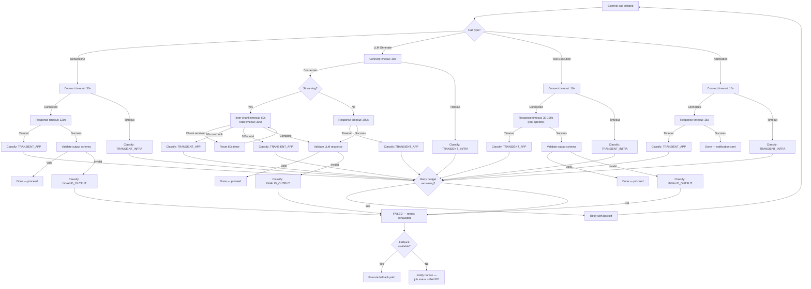
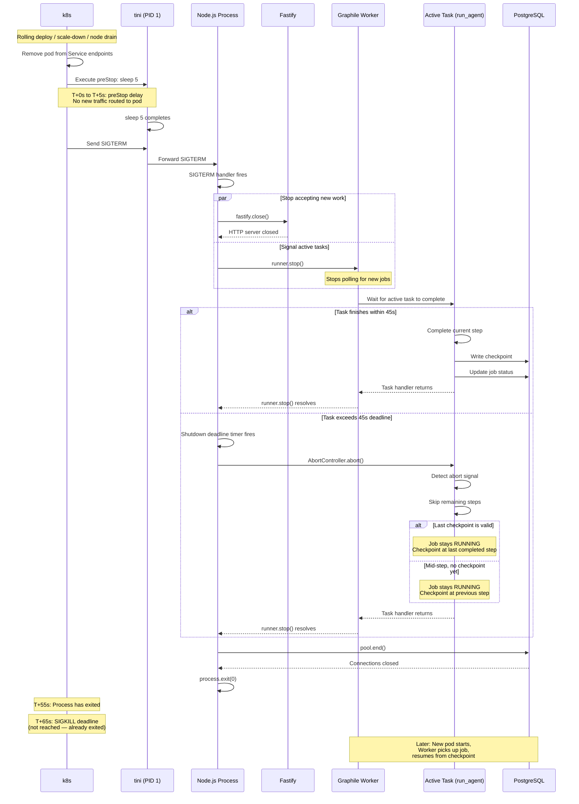
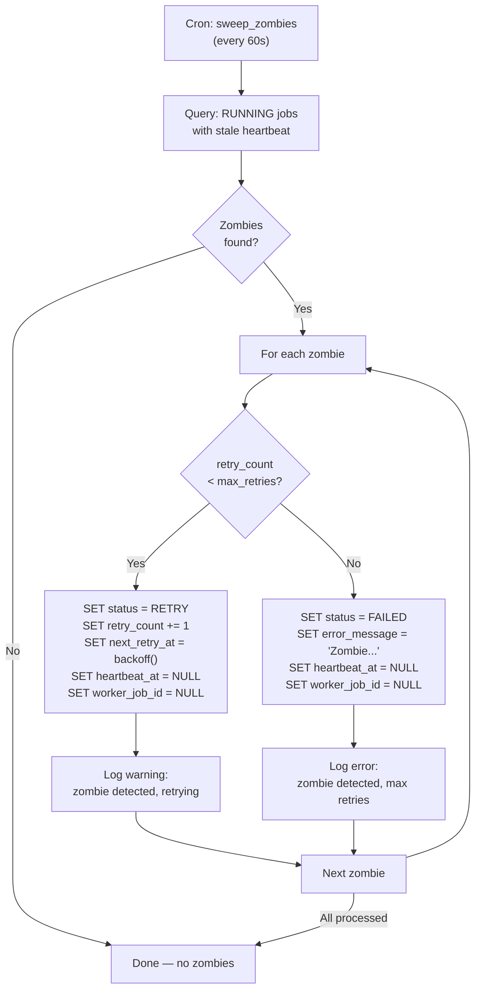

# Spike #28 — Graphile Retry, Timeout & Shutdown Patterns

**Status:** Proposed
**Date:** 2026-02-23
**Author:** Cortex Plane Team
**Depends on:** [Spike #24 — Job State Machine](./024-job-state-machine.md), [Spike #26 — Checkpoint & Approval Schema](./026-checkpoint-approval-schema.md), [Spike #27 — Project Structure & Tooling](./027-project-structure.md)

---

## Table of Contents

1. [Context](#context)
2. [Question 1: Max Retry Count Per Job Type](#question-1-max-retry-count-per-job-type)
3. [Question 2: Exponential Backoff Configuration](#question-2-exponential-backoff-configuration)
4. [Question 3: Hard Timeout Per Job Type](#question-3-hard-timeout-per-job-type)
5. [Question 4: Graceful Shutdown and k8s SIGTERM](#question-4-graceful-shutdown-and-k8s-sigterm)
6. [Question 5: Mid-LLM-Call Pod Drain](#question-5-mid-llm-call-pod-drain)
7. [Question 6: Zombie Job Detection](#question-6-zombie-job-detection)
8. [Question 7: Response Validation](#question-7-response-validation)
9. [Artifact: Retry Configuration Spec](#artifact-retry-configuration-spec)
10. [Artifact: Timeout Decision Tree](#artifact-timeout-decision-tree)
11. [Artifact: Graceful Shutdown Sequence Diagram](#artifact-graceful-shutdown-sequence-diagram)
12. [Artifact: Zombie Job Detection Pattern](#artifact-zombie-job-detection-pattern)
13. [Artifact: TypeScript Error Classification Enum](#artifact-typescript-error-classification-enum)
14. [Design Decisions](#design-decisions)

---

## Context

Spikes #24 and #26 established the job state machine and checkpoint schema. Spike #24 defined two retry layers: Graphile Worker's internal retries (infrastructure-level) and our application-level retries (RETRY state with configurable backoff). Spike #26 defined how checkpoints survive crashes.

This spike closes the operational gaps by answering: *how many times do we retry, how long do we wait, how do we shut down cleanly, and how do we detect jobs that got stuck?*

### The Problem

The control plane runs as a stateless Deployment on k3s. At any moment:

- A pod can receive SIGTERM (rolling deploy, scale-down, node drain).
- An LLM call can take 30-120 seconds (streaming response from Claude).
- A tool call can hit a rate limit (429) or a transient network error (ECONNRESET).
- A Graphile Worker task can crash with an uncaught exception.
- A pod can be OOM-killed mid-execution, leaving a job in RUNNING with no worker processing it.

Each of these scenarios needs an explicit, tested recovery path. Ad-hoc handling leads to zombie jobs, orphaned state, and user-facing failures.

### Hard Constraints

| Constraint | Implication |
|---|---|
| Graphile Worker's internal retry formula is `exp(least(10, attempt))` seconds | We cannot change this formula; we layer on top of it |
| Application-level retries create new Worker jobs (spike #24) | Each retry is a fresh Worker dispatch, not a Worker re-attempt |
| Checkpoints are durable in PostgreSQL (spike #26) | Resume-after-crash is handled; this spike handles retry/timeout/shutdown |
| `tini` is PID 1 in the container (spike #27) | SIGTERM is forwarded correctly to the Node.js process |
| Stateless control plane | No in-memory state survives pod replacement; all recovery reads from PostgreSQL |
| Shared `pg.Pool` (spike #27) | Graphile Worker and Kysely share the same connection pool |

---

## Question 1: Max Retry Count Per Job Type

Different job types have different failure modes and different costs of retrying.

### Job Type Taxonomy

| Job Type | Task Identifier | Failure Profile | Max Retries (Worker) | Max Retries (App) |
|---|---|---|---|---|
| **Network I/O** | `http_request`, `webhook_dispatch` | Transient: ECONNRESET, DNS timeout, 502/503. Usually succeeds on retry. | 5 | 3 |
| **LLM Call** | `llm_generate`, `run_agent` | Rate limit (429), context too long (400), model overloaded (529). Expensive to retry — each attempt costs tokens. | 3 | 5 |
| **Tool Execution** | `execute_tool` | Tool-specific: kubectl timeout, file system error, permission denied. Some are retryable, some are not. | 3 | 3 |
| **Notification** | `send_notification`, `approval_notify` | Channel adapter failures: Telegram API rate limit, Discord API error. Must succeed eventually. | 10 | 5 |
| **Scheduled Maintenance** | `sweep_zombies`, `expire_approvals` | Internal tasks. Should almost never fail. If they do, it's a bug, not a transient error. | 2 | 0 |

### Why Two Retry Layers Have Different Counts

**Worker retries** handle infrastructure-level failures: the task handler threw an uncaught exception, the process crashed, the database connection dropped. These are blunt retries — Worker doesn't know *why* the task failed, only that it did.

**Application-level retries** (spike #24's RETRY state) handle domain-level failures where the task handler caught the error, classified it, and decided a retry is worthwhile after a backoff period. The handler returns normally (Worker considers the task done), and our retry scheduler re-enqueues a new Worker job later.

Notifications get the highest Worker retry count (10) because delivery failures are almost always transient (rate limits, momentary API outages) and the cost of retrying is near-zero. LLM calls get a lower Worker retry count (3) because each retry consumes tokens and may hit the same rate limit, but a higher application-level retry count (5) because application retries use longer backoff periods that give rate limits time to clear.

### Configuration

Per-job-type retry limits are specified in the task registry, not in Worker's global config. Each task passes `maxAttempts` when calling `addJob`:

```typescript
await worker.addJob("http_request", payload, {
  maxAttempts: RETRY_CONFIG.http_request.workerMaxAttempts,
  queueName: `job-${jobId}`,
});
```

The application-level `max_retries` is set on the `job` table row when the job is created, based on the job type:

```typescript
await db.insertInto("job").values({
  id: uuidv7(),
  agent_id: agentId,
  max_retries: RETRY_CONFIG.llm_generate.appMaxRetries,
  // ...
}).execute();
```

---

## Question 2: Exponential Backoff Configuration

### Graphile Worker's Internal Backoff

Graphile Worker uses a fixed formula: the delay between attempt N and attempt N+1 is `exp(least(10, N))` seconds.

| Attempt | Delay (seconds) | Delay (human-readable) |
|---|---|---|
| 1 | 2.7 | ~3 seconds |
| 2 | 7.4 | ~7 seconds |
| 3 | 20.1 | ~20 seconds |
| 4 | 54.6 | ~55 seconds |
| 5 | 148.4 | ~2.5 minutes |
| 6 | 403.4 | ~6.7 minutes |
| 7 | 1096.6 | ~18 minutes |
| 8 | 2981.0 | ~50 minutes |
| 9 | 8103.1 | ~2.25 hours |
| 10 | 22026.5 | ~6.1 hours (cap) |

This formula is aggressive — by attempt 7, you're waiting 18 minutes. This is appropriate for infrastructure-level failures where the system needs significant time to recover. We do not modify it; we accept it as the baseline.

### Application-Level Backoff (Our Control)

Our application-level retries (spike #24) use configurable exponential backoff with jitter. The default config from spike #24:

```typescript
const DEFAULT_BACKOFF_CONFIG: BackoffConfig = {
  baseDelayMs: 1_000,
  maxDelayMs: 300_000,   // 5 minutes
  multiplier: 2,
  jitter: true,
};
```

Different job types override these defaults:

| Job Type | Base Delay | Max Delay | Multiplier | Rationale |
|---|---|---|---|---|
| `http_request` | 1s | 60s | 2 | Network errors recover fast. 60s cap prevents excessive wait. |
| `llm_generate` | 5s | 300s (5 min) | 3 | Rate limits need longer backoff. Multiplier of 3 spaces retries wider. |
| `execute_tool` | 2s | 120s | 2 | Tool errors vary. 120s cap is a middle ground. |
| `send_notification` | 2s | 60s | 2 | Channel API rate limits are short-lived. |

### How the Two Layers Interact

```
Failure occurs in task handler
│
├─ Error is CLASSIFIED (see Question 7)
│
├─ Classification: TRANSIENT_INFRA
│  │  (uncaught exception, connection drop, OOM)
│  └─ Task handler THROWS → Worker retries with exp(N) backoff
│     └─ Same Worker job, same attempt counter
│
├─ Classification: TRANSIENT_APP
│  │  (429 rate limit, upstream timeout, temporary unavailable)
│  └─ Task handler CATCHES, sets job.status = RETRY
│     └─ Returns normally (Worker considers task done)
│     └─ Retry scheduler creates NEW Worker job after backoff
│
├─ Classification: PERMANENT
│  │  (400 bad request, 404 not found, validation error)
│  └─ Task handler sets job.status = FAILED
│     └─ No retry at either layer
│
└─ Classification: UNKNOWN
   └─ Treated as TRANSIENT_INFRA (throw, let Worker retry)
   └─ If Worker exhausts retries → job.status = FAILED
```

### Why Jitter Matters for LLM Calls

Without jitter, if 10 agents hit a rate limit at the same time, all 10 retry at `baseDelay * multiplier^N` — the same moment. They hit the rate limit again. This is the thundering herd problem.

With full jitter, each retry is uniformly distributed between 0 and the computed delay. The 10 agents spread their retries over the full interval, reducing peak load on the upstream API.

Spike #24 already specified jitter in the `computeNextRetryAt` function. This spike confirms: **jitter is always on for application-level retries. There is no use case for disabling it.**

---

## Question 3: Hard Timeout Per Job Type

### Timeout Hierarchy

Every external call has a hard timeout. Timeouts are layered — inner timeouts fire before outer timeouts:

```
┌─────────────────────────────────────────────────────────┐
│  Job-level timeout (outermost)                          │
│  Default: 3600s (1 hour)                                │
│  Source: agent.resource_limits.timeout_seconds           │
│                                                         │
│  ┌─────────────────────────────────────────────────┐    │
│  │  Step-level timeout                              │    │
│  │  Default: 600s (10 minutes)                      │    │
│  │  Rationale: no single step should take >10 min   │    │
│  │                                                  │    │
│  │  ┌─────────────────────────────────────────┐     │    │
│  │  │  Individual call timeout (innermost)     │     │    │
│  │  │                                          │     │    │
│  │  │  Network I/O:  30s connect, 120s total   │     │    │
│  │  │  LLM generate: 30s connect, 300s total   │     │    │
│  │  │  Tool exec:    varies by tool (30-120s)  │     │    │
│  │  │  Notification: 15s                       │     │    │
│  │  └─────────────────────────────────────────┘     │    │
│  └─────────────────────────────────────────────────┘    │
└─────────────────────────────────────────────────────────┘
```

### Individual Call Timeouts

| Call Type | Connect Timeout | Response Timeout | Rationale |
|---|---|---|---|
| **Network I/O** (HTTP/webhook) | 30s | 120s | 120s accommodates slow APIs. 30s connect timeout catches DNS/routing failures fast. |
| **LLM Generation** | 30s | 300s (5 min) | Claude Opus can take 60-120s for complex responses. 300s gives headroom for long chains-of-thought and tool-use sequences. Streaming responses keep the connection alive. |
| **LLM Generation (streaming)** | 30s | 300s total, 60s inter-chunk | Streaming uses an additional inter-chunk timeout: if no new token arrives for 60s, assume the stream is stuck. |
| **Tool Execution** | 10s | 30-120s (tool-specific) | `kubectl apply`: 30s. `file_write`: 10s. `browser_navigate`: 120s. Each tool registers its timeout. |
| **Notification** (Telegram/Discord API) | 10s | 15s | Channel APIs should respond fast. 15s total is generous. Retry handles failures. |

### LLM Timeout: Why 300s?

LLM generation is the only call type where 120s is insufficient. Three factors drive the 300s timeout:

1. **Model thinking time.** Claude Opus processing a complex multi-tool-use request can take 60-120s for the initial response. With extended thinking enabled, this can exceed 120s.

2. **Streaming response accumulation.** A streaming response may produce tokens for 30-90 seconds after the first token arrives. The total wall-clock time from request to final token can exceed 120s.

3. **Retry cost is high.** An LLM call that times out at 120s and is retried wastes the tokens from the first attempt. A 300s timeout is more forgiving — it's better to wait an extra minute than to throw away a 90-second partial response and start over.

The 60s inter-chunk timeout for streaming catches the case where the API stalls mid-response without closing the connection. If no token arrives for 60 seconds, the stream is dead and we should abort rather than wait for the full 300s.

### Step-Level Timeout

A single agent step (one LLM response + all resulting tool calls) has a 600-second (10-minute) timeout. This is the sum of the LLM call timeout (300s) plus reasonable time for tool execution. If a step exceeds 10 minutes, something is wrong — the agent is stuck in a loop, a tool is hanging, or the LLM is generating an unbounded number of tool calls.

The step timeout is enforced by an `AbortController` in the step execution loop:

```typescript
const stepController = new AbortController();
const stepTimer = setTimeout(() => stepController.abort(), STEP_TIMEOUT_MS);

try {
  await executeStep(stepController.signal);
} finally {
  clearTimeout(stepTimer);
}
```

### Job-Level Timeout

The outermost timeout comes from `agent.resource_limits.timeout_seconds` (spike #25). Default: 3600s (1 hour). This is the total wall-clock time from when the Worker task starts to when it must finish. If the job hasn't completed by then, the task handler sets `job.status = FAILED` with `error_message: "Job timed out after 3600 seconds"` and returns.

This timeout is a safety net. Under normal operation, jobs complete in minutes. The 1-hour limit catches pathological cases: infinite loops, unbounded tool call chains, or unresponsive external services that the inner timeouts failed to catch.

### Graphile Worker's `job_expiry`

Graphile Worker has its own timeout mechanism: `job_expiry`. When passed to `addJob`, it sets the maximum time the Worker job can run before Worker considers it failed and unlocks it. We set this to `agent.resource_limits.timeout_seconds + 60` — 60 seconds longer than our job timeout, so our application-level timeout fires first and produces a useful error message. If our timeout somehow fails to fire (process crash, OOM), Worker's `job_expiry` acts as the final backstop.

---

## Question 4: Graceful Shutdown and k8s SIGTERM

### The k8s Pod Termination Sequence

When k8s terminates a pod (deploy, scale-down, node drain):

1. k8s sends `SIGTERM` to PID 1 (tini in our case).
2. tini forwards `SIGTERM` to the Node.js process.
3. k8s starts the `terminationGracePeriodSeconds` countdown (default: 30s).
4. If the process hasn't exited by the deadline, k8s sends `SIGKILL`.

### preStop Hook Timing

We add a `preStop` hook to the pod spec that sleeps for 5 seconds:

```yaml
lifecycle:
  preStop:
    exec:
      command: ["sleep", "5"]
```

**Why?** The `preStop` hook runs *before* SIGTERM is sent. During those 5 seconds, k8s has already removed the pod from the Service's endpoint list — no new traffic is routed to the pod. This prevents a race condition: without the preStop delay, the pod might receive new HTTP requests or Graphile Worker jobs *after* SIGTERM but *before* the load balancer updates its endpoint list.

The 5-second preStop hook does not reduce the grace period. k8s starts the `terminationGracePeriodSeconds` timer when the preStop hook *starts*, so the effective time for the process to shut down is `terminationGracePeriodSeconds - preStop_duration` = 30 - 5 = 25 seconds.

### Our Grace Period Configuration

We set `terminationGracePeriodSeconds: 65` in the pod spec. Combined with the 5-second preStop hook, this gives the Node.js process **60 seconds** to flush active jobs.

Why 60 seconds? LLM calls can take up to 300 seconds, so we cannot guarantee that every in-flight job finishes within the grace period. But 60 seconds is enough to:

1. Stop accepting new jobs (immediately).
2. Checkpoint any running agent steps (sub-second).
3. Wait for in-flight network calls to complete or timeout (most finish within 30s).
4. Abort any calls that haven't completed after 45 seconds (our shutdown abort deadline).
5. Update job state in PostgreSQL for any jobs that couldn't finish.

### Interaction with `.gracefulShutdown()`

Graphile Worker provides a `runner.stop()` method (equivalent to graceful shutdown). When called:

1. Worker stops polling for new jobs.
2. Worker waits for currently executing tasks to finish.
3. Worker releases advisory locks.
4. Worker resolves the stop promise.

Our shutdown sequence integrates this:

```typescript
async function shutdown(signal: string): Promise<void> {
  logger.info({ signal }, "Shutdown signal received");

  // 1. Stop accepting new HTTP requests.
  await fastify.close();

  // 2. Stop Graphile Worker — no new jobs, wait for active jobs.
  //    Use a deadline: if active jobs don't finish in 45s, force-stop.
  const workerStopPromise = runner.stop();
  const deadline = setTimeout(() => {
    logger.warn("Worker stop deadline exceeded, forcing shutdown");
  }, 45_000);

  await Promise.race([
    workerStopPromise,
    new Promise((resolve) => setTimeout(resolve, 50_000)),
  ]);
  clearTimeout(deadline);

  // 3. Close the database pool.
  await pool.end();

  // 4. Exit.
  process.exit(0);
}

process.on("SIGTERM", () => void shutdown("SIGTERM"));
process.on("SIGINT", () => void shutdown("SIGINT"));
```

### Why `terminationGracePeriodSeconds: 65`?

| Time Window | What Happens |
|---|---|
| T+0s | k8s starts preStop hook (sleep 5) and starts the 65s countdown |
| T+5s | preStop completes. k8s sends SIGTERM. Node.js begins shutdown. |
| T+5s | `fastify.close()` — stops accepting HTTP requests |
| T+5s | `runner.stop()` — Worker stops polling, waits for active tasks |
| T+5s to T+50s | Active tasks finish (checkpoint, complete, or timeout) |
| T+50s | 45s deadline — if Worker hasn't stopped, we force-proceed |
| T+55s | `pool.end()` — close DB connections |
| T+55s | `process.exit(0)` |
| T+65s | k8s sends SIGKILL (but we've already exited by T+55s) |

The 10-second buffer between our exit (T+55s) and SIGKILL (T+65s) accounts for slow DB pool draining or delayed I/O.

---

## Question 5: Mid-LLM-Call Pod Drain

### The Scenario

1. Agent is mid-execution. Step 3 of 7.
2. The agent issued an LLM call to Claude. Claude is generating a response (streaming tokens).
3. k8s sends SIGTERM (rolling deploy).
4. The LLM call is mid-stream — tokens are arriving but the response isn't complete.

### What Happens

When `runner.stop()` is called, Worker waits for the currently executing task to finish. The task is in the middle of an LLM call. Two outcomes:

**Outcome A: LLM call finishes within the 45-second shutdown deadline.**

1. The LLM response completes.
2. The task handler processes the response, executes any tool calls, and writes a checkpoint.
3. The task handler returns normally.
4. Worker marks the internal job as complete.
5. Shutdown proceeds cleanly.

This is the happy path. Most LLM responses complete within 60 seconds. If the call was already 30 seconds in when SIGTERM arrived, there's a good chance it finishes within the remaining 45 seconds.

**Outcome B: LLM call does NOT finish within the 45-second deadline.**

1. The shutdown timer fires at T+50s.
2. We propagate an abort signal to the task handler via `AbortController`.
3. The task handler catches the abort:
   - If the last checkpoint is valid (step 2 was fully completed), the job is still in RUNNING. Worker's internal job is forcefully released (Worker's `gracefulShutdown` timeout expires, and Worker releases the lock).
   - The job stays in RUNNING with a valid checkpoint at step 2.
4. When the pod is replaced, Worker dispatches the task to the new pod.
5. The new pod reads the checkpoint and resumes from step 3.

**The critical insight:** The checkpoint write is the commit point (spike #26). If the LLM call hadn't completed, no checkpoint was written for step 3. The agent resumes from the last good checkpoint (step 2) and re-issues the LLM call. The cost is one wasted LLM call — the partial response from the killed connection is lost. This is acceptable: the alternative (trying to save partial LLM responses) would introduce enormous complexity for a marginal saving.

### Abort Signal Propagation

The task handler receives an `AbortSignal` that fires during shutdown:

```typescript
export async function runAgentTask(
  payload: { jobId: string },
  helpers: JobHelpers,
): Promise<void> {
  const abortController = new AbortController();

  // Wire up shutdown signal.
  const onShutdown = (): void => abortController.abort();
  helpers.addJob; // Graphile Worker helpers
  process.once("SIGTERM", onShutdown);

  try {
    await executeAgentLoop(payload.jobId, abortController.signal);
  } finally {
    process.removeListener("SIGTERM", onShutdown);
  }
}
```

Inside the agent loop, every I/O operation checks `signal.aborted`:

```typescript
async function executeAgentLoop(
  jobId: string,
  signal: AbortSignal,
): Promise<void> {
  // ... load job, validate checkpoint ...

  for (let step = resumeStep; step < maxSteps; step++) {
    if (signal.aborted) {
      logger.info({ jobId, step }, "Abort signal received, stopping after checkpoint");
      return; // Return normally — Worker marks task as done.
               // Job stays RUNNING; checkpoint is at previous step.
    }

    // LLM call passes the abort signal.
    const response = await callLLM(prompt, { signal });

    // Tool calls pass the abort signal.
    for (const toolCall of response.toolCalls) {
      if (signal.aborted) {
        // Don't start new tool calls. Return with current checkpoint.
        return;
      }
      await executeTool(toolCall, { signal });
    }

    // Write checkpoint for this step.
    await writeCheckpoint(jobId, step, ...);
  }
}
```

### What About Non-Idempotent Tool Calls Mid-Drain?

If the agent was in the middle of a side-effecting tool call (e.g., `send_message`) when SIGTERM arrived:

1. The tool call was checkpointed as `pending` before execution (spike #26's side-effect protocol).
2. On resume, the agent sees `status: "pending"` in the checkpoint.
3. The agent queries the external system by `invocation_id` to check if the call completed.
4. If completed: record the result, advance. If not: re-execute.

This is the same recovery path as a crash — the pod drain is operationally equivalent to a crash from the agent's perspective.

---

## Question 6: Zombie Job Detection

A zombie job is a job stuck in `RUNNING` with no Graphile Worker task actively processing it. This can happen when:

1. **Pod OOM-killed.** Worker couldn't release the lock. Worker's built-in dead job recovery unlocks after 4 hours (default `gracefulShutdown` timeout). That's too long.
2. **Network partition.** The worker process is alive but cannot reach PostgreSQL. Worker thinks the job is running; our job table thinks the job is running; but no progress is being made.
3. **Task handler bug.** The handler entered an infinite loop or deadlock. Worker's lock is still held, so the job isn't picked up by another worker.

### Detection: Heartbeat Pattern

Each running task periodically updates a `heartbeat_at` timestamp on the job row. If `heartbeat_at` is older than a threshold (default: 5 minutes), the job is considered a zombie.

#### Schema Addition

```sql
ALTER TABLE job ADD COLUMN heartbeat_at TIMESTAMPTZ;

COMMENT ON COLUMN job.heartbeat_at IS
  'Last heartbeat timestamp from the executing worker. Updated every 30s during RUNNING. '
  'Used by zombie detection — if stale by >5 minutes, the job is likely abandoned.';

CREATE INDEX idx_job_zombie ON job (heartbeat_at ASC)
  WHERE status = 'RUNNING' AND heartbeat_at IS NOT NULL;
```

#### Heartbeat Writer

The task handler updates `heartbeat_at` every 30 seconds:

```typescript
function startHeartbeat(
  db: Kysely<Database>,
  jobId: string,
  signal: AbortSignal,
): void {
  const interval = setInterval(async () => {
    if (signal.aborted) {
      clearInterval(interval);
      return;
    }
    try {
      await db
        .updateTable("job")
        .set({ heartbeat_at: new Date() })
        .where("id", "=", jobId)
        .where("status", "=", "RUNNING")
        .execute();
    } catch (err) {
      // Log but don't crash — the sweep will catch it.
      logger.warn({ jobId, err }, "Heartbeat write failed");
    }
  }, 30_000);

  signal.addEventListener("abort", () => clearInterval(interval));
}
```

#### Zombie Sweep Task

A Graphile Worker cron task (`sweep_zombies`) runs every 60 seconds:

```typescript
export async function sweepZombies(
  db: Kysely<Database>,
  worker: WorkerUtils,
  logger: Logger,
): Promise<void> {
  const threshold = new Date(Date.now() - ZOMBIE_THRESHOLD_MS); // 5 minutes

  const zombies = await db
    .selectFrom("job")
    .select(["id", "agent_id", "heartbeat_at", "retry_count", "max_retries"])
    .where("status", "=", "RUNNING")
    .where((eb) =>
      eb.or([
        eb("heartbeat_at", "<", threshold),
        eb("heartbeat_at", "is", null),  // Never heartbeated — started and died
      ])
    )
    .execute();

  for (const zombie of zombies) {
    logger.warn({ jobId: zombie.id, lastHeartbeat: zombie.heartbeat_at },
      "Zombie job detected");

    if (zombie.retry_count < zombie.max_retries) {
      // Transition to RETRY — will be re-enqueued by retry scheduler.
      await db.updateTable("job").set({
        status: "RETRY",
        retry_count: zombie.retry_count + 1,
        next_retry_at: computeNextRetryAt(zombie.retry_count + 1),
        heartbeat_at: null,
        worker_job_id: null,
      }).where("id", "=", zombie.id).execute();
    } else {
      // Exhausted retries — fail permanently.
      await db.updateTable("job").set({
        status: "FAILED",
        error_message: `Zombie job detected: no heartbeat since ${zombie.heartbeat_at?.toISOString() ?? "never"}. Max retries exhausted.`,
        heartbeat_at: null,
        worker_job_id: null,
      }).where("id", "=", zombie.id).execute();
    }
  }
}
```

### Why Not Lease-Based Locks?

Lease-based locks (set a lock expiry, refresh while holding) are an alternative to heartbeats. They're conceptually similar but introduce additional complexity:

1. **Graphile Worker already holds an advisory lock.** Adding our own lock creates a two-lock system. If the advisory lock is released (Worker timeout) but our lease is still valid, or vice versa, the system is in an inconsistent state.
2. **PostgreSQL advisory locks don't expire.** They're released when the session ends (connection closes) or explicitly unlocked. There's no TTL mechanism. We'd need to build lease expiry on top of timestamps anyway — which is exactly what the heartbeat pattern does, without the lock semantics.
3. **Heartbeats are simpler to reason about.** A heartbeat is a timestamp. The sweep query is a single `SELECT WHERE heartbeat_at < threshold`. No lock contention, no deadlock risk, no two-phase unlock.

### Zombie Threshold: 5 Minutes

The threshold is 5 minutes (10 heartbeat intervals of 30 seconds). This accommodates:

- **Normal variance.** A heartbeat write might be delayed by a busy event loop or a slow DB connection. Missing 1-2 heartbeats should not trigger zombie detection.
- **Network blips.** A 60-second network partition shouldn't cause a zombie false positive.
- **Long LLM calls.** An LLM call takes up to 300 seconds (5 minutes). The heartbeat runs on a separate interval (not blocked by the LLM call), so the heartbeat should still fire during a long call. But if the event loop is blocked (synchronous operation, though this shouldn't happen in our async code), the heartbeat might miss. The 5-minute threshold gives headroom.

If a job is truly abandoned, 5 minutes of detection delay is acceptable. The user sees "RUNNING" for 5 minutes longer than reality, then the job transitions to RETRY or FAILED.

### Cron Task Registration

```typescript
const runner = await run({
  pgPool: pool,
  taskList: {
    run_agent: runAgentTask,
    sweep_zombies: sweepZombiesTask,
    expire_approvals: expireApprovalsTask,
    // ...
  },
  crontab: [
    // Sweep zombies every 60 seconds.
    { task: "sweep_zombies", match: "* * * * *", options: { backfillPeriod: 0 } },
    // Expire approvals every 60 seconds.
    { task: "expire_approvals", match: "* * * * *", options: { backfillPeriod: 0 } },
  ],
});
```

---

## Question 7: Response Validation

### What Counts as Valid Tool Output?

A tool execution can produce four outcomes:

1. **Valid result.** The tool returned structured data that matches the expected schema. The agent proceeds.
2. **Retry-worthy failure.** The tool returned an error that is transient and will likely succeed on retry (rate limit, timeout, temporary unavailability).
3. **Permanent failure.** The tool returned an error that will never succeed on retry (invalid input, permission denied, resource not found).
4. **Invalid output.** The tool returned data that doesn't match the expected schema — wrong shape, missing fields, unexpected type.

### Classification Rules

```typescript
function classifyToolResult(
  toolName: string,
  result: unknown,
  error: unknown,
): ErrorClassification {
  // 1. No error, result matches schema → VALID
  if (!error && isValidToolOutput(toolName, result)) {
    return ErrorClassification.VALID;
  }

  // 2. No error, result doesn't match schema → INVALID_OUTPUT
  if (!error && !isValidToolOutput(toolName, result)) {
    return ErrorClassification.INVALID_OUTPUT;
  }

  // 3. Error classification by type
  if (error instanceof Error) {
    const classified = classifyError(error);
    return classified;
  }

  // 4. Unknown error shape → TRANSIENT_INFRA (let Worker retry)
  return ErrorClassification.TRANSIENT_INFRA;
}
```

### Tool Output Validation

Each tool defines a validation function that checks the shape of its output:

```typescript
interface ToolOutputValidator {
  /** Returns true if the output matches the expected schema. */
  validate(output: unknown): boolean;
  /** Returns a human-readable description of the expected output shape. */
  describe(): string;
}

const TOOL_VALIDATORS: Record<string, ToolOutputValidator> = {
  http_request: {
    validate: (output) =>
      isObject(output) &&
      typeof (output as Record<string, unknown>).status === "number" &&
      typeof (output as Record<string, unknown>).body !== "undefined",
    describe: () => "{ status: number, headers: Record<string, string>, body: unknown }",
  },
  kubectl: {
    validate: (output) =>
      isObject(output) &&
      typeof (output as Record<string, unknown>).exitCode === "number",
    describe: () => "{ exitCode: number, stdout: string, stderr: string }",
  },
  // ... per-tool validators
};
```

### What Happens on Invalid Output?

Invalid output (schema mismatch) is treated as a **permanent failure** — the tool returned something, but it's not what the agent expected. Retrying is unlikely to produce a different shape. The agent records the invalid output in the checkpoint and either:

1. **Falls back to a degraded path.** If the tool output is optional (enrichment data, non-critical check), the agent continues without it.
2. **Fails the step.** If the tool output is required (deployment status, validation result), the agent fails the step and the job transitions to FAILED.

The decision is made by the agent's step logic, not by the platform. The platform classifies; the agent acts.

---

## Artifact: Retry Configuration Spec

```typescript
/**
 * Retry configuration for each job type. Controls both Graphile Worker's
 * internal retries and our application-level retries.
 *
 * Worker retries: handle infrastructure failures (crash, connection drop).
 * App retries: handle domain failures (rate limit, upstream timeout).
 */
export interface JobRetryConfig {
  /** Task identifier used by Graphile Worker. */
  taskIdentifier: string;
  /** Max Worker-level retry attempts. Passed to addJob({ maxAttempts }). */
  workerMaxAttempts: number;
  /** Max application-level retries. Set on job.max_retries at creation. */
  appMaxRetries: number;
  /** Backoff config for application-level retries. */
  backoff: BackoffConfig;
  /** Hard timeout for the entire job (seconds). */
  jobTimeoutSeconds: number;
  /** Hard timeout for a single call within the job (milliseconds). */
  callTimeoutMs: number;
  /** Connect timeout for outbound connections (milliseconds). */
  connectTimeoutMs: number;
}

export const RETRY_CONFIG: Record<string, JobRetryConfig> = {
  http_request: {
    taskIdentifier: "http_request",
    workerMaxAttempts: 5,
    appMaxRetries: 3,
    backoff: { baseDelayMs: 1_000, maxDelayMs: 60_000, multiplier: 2, jitter: true },
    jobTimeoutSeconds: 600,
    callTimeoutMs: 120_000,
    connectTimeoutMs: 30_000,
  },
  llm_generate: {
    taskIdentifier: "llm_generate",
    workerMaxAttempts: 3,
    appMaxRetries: 5,
    backoff: { baseDelayMs: 5_000, maxDelayMs: 300_000, multiplier: 3, jitter: true },
    jobTimeoutSeconds: 3_600,
    callTimeoutMs: 300_000,
    connectTimeoutMs: 30_000,
  },
  run_agent: {
    taskIdentifier: "run_agent",
    workerMaxAttempts: 3,
    appMaxRetries: 5,
    backoff: { baseDelayMs: 5_000, maxDelayMs: 300_000, multiplier: 3, jitter: true },
    jobTimeoutSeconds: 3_600,
    callTimeoutMs: 300_000,
    connectTimeoutMs: 30_000,
  },
  execute_tool: {
    taskIdentifier: "execute_tool",
    workerMaxAttempts: 3,
    appMaxRetries: 3,
    backoff: { baseDelayMs: 2_000, maxDelayMs: 120_000, multiplier: 2, jitter: true },
    jobTimeoutSeconds: 1_200,
    callTimeoutMs: 120_000,
    connectTimeoutMs: 10_000,
  },
  send_notification: {
    taskIdentifier: "send_notification",
    workerMaxAttempts: 10,
    appMaxRetries: 5,
    backoff: { baseDelayMs: 2_000, maxDelayMs: 60_000, multiplier: 2, jitter: true },
    jobTimeoutSeconds: 300,
    callTimeoutMs: 15_000,
    connectTimeoutMs: 10_000,
  },
  sweep_zombies: {
    taskIdentifier: "sweep_zombies",
    workerMaxAttempts: 2,
    appMaxRetries: 0,
    backoff: { baseDelayMs: 1_000, maxDelayMs: 1_000, multiplier: 1, jitter: false },
    jobTimeoutSeconds: 60,
    callTimeoutMs: 30_000,
    connectTimeoutMs: 5_000,
  },
  expire_approvals: {
    taskIdentifier: "expire_approvals",
    workerMaxAttempts: 2,
    appMaxRetries: 0,
    backoff: { baseDelayMs: 1_000, maxDelayMs: 1_000, multiplier: 1, jitter: false },
    jobTimeoutSeconds: 60,
    callTimeoutMs: 30_000,
    connectTimeoutMs: 5_000,
  },
} as const;
```

---

## Artifact: Timeout Decision Tree



---

## Artifact: Graceful Shutdown Sequence Diagram



---

## Artifact: Zombie Job Detection Pattern

### Schema

```sql
-- Migration: add heartbeat_at to job table
ALTER TABLE job ADD COLUMN heartbeat_at TIMESTAMPTZ;

COMMENT ON COLUMN job.heartbeat_at IS
  'Last heartbeat from the executing worker. Updated every 30s during RUNNING. '
  'Null when job is not running. Zombie detection threshold: 5 minutes.';

-- Partial index for zombie sweep query.
CREATE INDEX idx_job_zombie ON job (heartbeat_at ASC)
  WHERE status = 'RUNNING' AND heartbeat_at IS NOT NULL;
```

### Constants

```typescript
/** Heartbeat interval in milliseconds. Worker updates heartbeat_at this often. */
export const HEARTBEAT_INTERVAL_MS = 30_000; // 30 seconds

/** Zombie detection threshold in milliseconds.
 *  A RUNNING job with heartbeat_at older than this is considered a zombie. */
export const ZOMBIE_THRESHOLD_MS = 300_000; // 5 minutes

/** Cron interval for zombie sweep. */
export const ZOMBIE_SWEEP_CRON = "* * * * *"; // Every 60 seconds
```

### Detection Query

```sql
-- Find zombie jobs: RUNNING with stale or missing heartbeat.
SELECT id, agent_id, heartbeat_at, retry_count, max_retries
FROM job
WHERE status = 'RUNNING'
  AND (
    heartbeat_at < now() - interval '5 minutes'
    OR (heartbeat_at IS NULL AND updated_at < now() - interval '5 minutes')
  );
```

### Recovery Flow



---

## Artifact: TypeScript Error Classification Enum

```typescript
/**
 * Error classification for all external calls. Determines the retry
 * strategy at both the Graphile Worker level and the application level.
 *
 * The classification drives the retry decision tree:
 * - TRANSIENT_INFRA → throw (Worker retries with exp(N) backoff)
 * - TRANSIENT_APP   → catch, set RETRY, return (app retries with configurable backoff)
 * - PERMANENT       → catch, set FAILED, return (no retry)
 * - INVALID_OUTPUT  → catch, set FAILED, return (output schema mismatch)
 * - VALID           → proceed (no error)
 */
export enum ErrorClassification {
  /** No error. Output matches expected schema. Proceed. */
  VALID = "VALID",

  /**
   * Infrastructure-level transient failure.
   * Examples: ECONNRESET, ECONNREFUSED, DNS failure, connection timeout,
   *           database connection lost, out of memory (recoverable).
   *
   * Action: Throw from task handler → Graphile Worker retries.
   * Worker uses its internal exp(N) backoff.
   */
  TRANSIENT_INFRA = "TRANSIENT_INFRA",

  /**
   * Application-level transient failure.
   * Examples: HTTP 429 (rate limit), HTTP 503 (service unavailable),
   *           HTTP 529 (overloaded), response timeout, upstream temporary error.
   *
   * Action: Catch, set job.status = RETRY with backoff, return normally.
   * Application-level retry scheduler re-enqueues after backoff.
   */
  TRANSIENT_APP = "TRANSIENT_APP",

  /**
   * Permanent failure. Retrying will not help.
   * Examples: HTTP 400 (bad request), HTTP 401 (unauthorized),
   *           HTTP 403 (forbidden), HTTP 404 (not found),
   *           validation error, permission denied, resource deleted.
   *
   * Action: Catch, set job.status = FAILED with error_message, return.
   */
  PERMANENT = "PERMANENT",

  /**
   * Tool or API returned a response, but the output doesn't match
   * the expected schema. The data is unusable.
   * Examples: Missing required fields, wrong types, unexpected structure.
   *
   * Action: Treated as permanent failure. Log the invalid output for debugging.
   */
  INVALID_OUTPUT = "INVALID_OUTPUT",
}

/**
 * HTTP status code → error classification mapping.
 */
export function classifyHttpStatus(status: number): ErrorClassification {
  if (status >= 200 && status < 300) return ErrorClassification.VALID;
  if (status === 429) return ErrorClassification.TRANSIENT_APP;
  if (status === 408) return ErrorClassification.TRANSIENT_APP;
  if (status === 502) return ErrorClassification.TRANSIENT_INFRA;
  if (status === 503) return ErrorClassification.TRANSIENT_APP;
  if (status === 504) return ErrorClassification.TRANSIENT_INFRA;
  if (status === 529) return ErrorClassification.TRANSIENT_APP;
  if (status >= 400 && status < 500) return ErrorClassification.PERMANENT;
  if (status >= 500) return ErrorClassification.TRANSIENT_INFRA;
  return ErrorClassification.PERMANENT;
}

/**
 * Node.js error code → error classification mapping.
 */
export function classifyNodeError(code: string): ErrorClassification {
  const transientInfraCodes = new Set([
    "ECONNRESET",
    "ECONNREFUSED",
    "ECONNABORTED",
    "EPIPE",
    "ETIMEDOUT",
    "ENETUNREACH",
    "EHOSTUNREACH",
    "EAI_AGAIN",     // DNS temporary failure
    "UND_ERR_SOCKET", // Undici socket error
  ]);

  const permanentCodes = new Set([
    "ENOTFOUND",     // DNS permanent failure
    "EACCES",        // Permission denied
    "ENOENT",        // File not found
  ]);

  if (transientInfraCodes.has(code)) return ErrorClassification.TRANSIENT_INFRA;
  if (permanentCodes.has(code)) return ErrorClassification.PERMANENT;
  return ErrorClassification.TRANSIENT_INFRA; // Unknown → assume transient
}

/**
 * Classify an error from any source (HTTP, Node.js, LLM, tool).
 */
export function classifyError(error: unknown): ErrorClassification {
  if (!(error instanceof Error)) {
    return ErrorClassification.TRANSIENT_INFRA;
  }

  // AbortError — shutdown or timeout. Treated as transient.
  if (error.name === "AbortError") {
    return ErrorClassification.TRANSIENT_APP;
  }

  // HTTP errors with status codes.
  if ("status" in error && typeof (error as Record<string, unknown>).status === "number") {
    return classifyHttpStatus((error as Record<string, unknown>).status as number);
  }

  // Node.js system errors.
  if ("code" in error && typeof (error as Record<string, unknown>).code === "string") {
    return classifyNodeError((error as Record<string, unknown>).code as string);
  }

  // Anthropic SDK errors.
  if (error.constructor.name === "RateLimitError") return ErrorClassification.TRANSIENT_APP;
  if (error.constructor.name === "APIConnectionError") return ErrorClassification.TRANSIENT_INFRA;
  if (error.constructor.name === "AuthenticationError") return ErrorClassification.PERMANENT;
  if (error.constructor.name === "BadRequestError") return ErrorClassification.PERMANENT;
  if (error.constructor.name === "InternalServerError") return ErrorClassification.TRANSIENT_INFRA;
  if (error.constructor.name === "OverloadedError") return ErrorClassification.TRANSIENT_APP;

  // Default: unknown errors are treated as transient infrastructure failures.
  // Let Worker retry. If retries are exhausted, the job fails.
  return ErrorClassification.TRANSIENT_INFRA;
}

/**
 * Graceful degradation path. Called when all retries are exhausted.
 * Determines whether a fallback state is available or if human
 * notification is required.
 */
export interface DegradationResult {
  /** Whether a fallback path exists. */
  hasFallback: boolean;
  /** If true, the fallback action to take. */
  fallbackAction?: string;
  /** Human notification message if no fallback. */
  notificationMessage: string;
}

export function determineDegradation(
  jobType: string,
  lastError: ErrorClassification,
): DegradationResult {
  // Notifications have a fallback: log the notification content.
  if (jobType === "send_notification") {
    return {
      hasFallback: true,
      fallbackAction: "log_notification_content",
      notificationMessage: "Notification delivery failed after all retries. Content logged.",
    };
  }

  // Tool executions with non-critical results can be skipped.
  if (jobType === "execute_tool" && lastError === ErrorClassification.TRANSIENT_APP) {
    return {
      hasFallback: false,
      notificationMessage: "Tool execution failed after all retries. Manual intervention required.",
    };
  }

  // Default: no fallback, notify human.
  return {
    hasFallback: false,
    notificationMessage: `Job failed after exhausting all retries. Last error class: ${lastError}. Manual review required.`,
  };
}
```

---

## Design Decisions

### 1. Heartbeat Pattern Over Lease-Based Locks

**Decision:** Use periodic heartbeat writes (`heartbeat_at` timestamp) for zombie detection instead of lease-based locks.

**Rationale:**

- Graphile Worker already holds PostgreSQL advisory locks on active jobs. Adding a second locking mechanism creates potential for inconsistency between the two lock states.
- PostgreSQL advisory locks have no TTL — they release when the session closes. Leases would require us to build TTL semantics on top of timestamps, which is exactly what the heartbeat approach does, without the lock abstraction overhead.
- The heartbeat pattern is transparent: `SELECT ... WHERE heartbeat_at < threshold` is a simple, debuggable query. Lease contention and deadlock scenarios don't exist.
- Trade-off: heartbeats add one UPDATE per 30 seconds per running job. At 100 concurrent jobs, that's ~200 writes/minute — negligible for PostgreSQL.

### 2. 65-Second terminationGracePeriodSeconds

**Decision:** Set `terminationGracePeriodSeconds: 65` with a 5-second preStop hook, giving the process 60 seconds for graceful shutdown.

**Rationale:**

- 60 seconds is long enough for most in-flight operations to complete (network calls, tool executions, checkpoint writes).
- 60 seconds is NOT long enough for a 300-second LLM call to complete. This is intentional: we don't hold pods hostage for 5 minutes during a rolling deploy. The LLM call is aborted, the agent resumes from the last checkpoint on the new pod, and re-issues the LLM call. The cost is one wasted API call — acceptable.
- The 5-second preStop ensures endpoint removal propagates before SIGTERM, preventing in-flight request failures during shutdown.
- The 10-second buffer before SIGKILL (T+55s exit vs T+65s kill) protects against slow cleanup.

### 3. Separate Error Classification Enum

**Decision:** A single `ErrorClassification` enum classifies all errors from all sources (HTTP, Node.js, LLM SDK, tool outputs) into five categories.

**Rationale:**

- Every error in the system needs the same three-way decision: retry (Worker), retry (app), or fail. A unified enum forces every error path through the same decision tree. No special cases, no ad-hoc handling.
- The `classifyError` function is the single point of truth for error classification. When a new error type appears (new SDK, new tool), one function is updated. The retry logic downstream doesn't change.
- `INVALID_OUTPUT` is separated from `PERMANENT` because invalid outputs need different logging (the full output is logged for debugging) and may have different fallback paths (skip the tool result vs fail the job).

### 4. Two-Layer Retry Design

**Decision:** Keep Graphile Worker's built-in retries for infrastructure failures AND our application-level RETRY state for domain failures. Do not collapse to one layer.

**Rationale:**

- Worker retries and application retries serve different purposes, use different backoff strategies, and have different visibility:
  - Worker retries are invisible to our application state. The job stays in RUNNING. The user sees "running." Worker retries silently in the background.
  - Application retries are visible. The job transitions to RETRY. The user sees "retrying." The dashboard shows the retry count and next retry time. History is logged.
- Worker retries use a fixed, aggressive backoff (exp(N)). This is appropriate for infra failures that might resolve quickly (connection reset) or need significant recovery time (database restart).
- Application retries use configurable, domain-appropriate backoff. LLM rate limits need longer waits than network blips.
- Collapsing to one layer would mean either losing Worker's built-in retry handling (reimplementing it) or losing the configurable domain-level retry semantics. Both are worse.

### 5. 5-Minute Zombie Threshold

**Decision:** Jobs are declared zombies if `heartbeat_at` is older than 5 minutes (10 heartbeat intervals).

**Rationale:**

- Too short (e.g., 2 heartbeats = 60s): false positives during garbage collection pauses, slow DB connections, or momentary network partitions.
- Too long (e.g., 30 minutes): users wait too long for stuck jobs to be detected and retried.
- 5 minutes (10 heartbeats) balances detection speed with false-positive resistance. A healthy job would need to miss 10 consecutive heartbeats to be flagged — this requires a genuine process failure, not a transient hiccup.
- For the rare case where a legitimate job has a long-running synchronous operation that blocks the heartbeat, the solution is to fix the blocking operation (make it async), not to increase the zombie threshold.

### 6. LLM Timeout: 300 Seconds

**Decision:** LLM generation calls have a 300-second (5-minute) hard timeout, with a 60-second inter-chunk timeout for streaming.

**Rationale:**

- Anthropic's Claude Opus can take 60-120 seconds for complex responses. With extended thinking, responses can exceed 120 seconds.
- A 120-second timeout (the same as network I/O) would cause false timeouts on legitimate long-running LLM calls, wasting tokens and causing unnecessary retries.
- The 60-second inter-chunk timeout catches the specific failure mode of a stalled stream (API connection alive but no data flowing) without timing out a slow-but-progressing response.
- 300 seconds is a reasonable upper bound: any LLM call taking more than 5 minutes is almost certainly stuck (infinite loop in thinking, model overload that won't resolve). Better to abort and retry than to wait indefinitely.

---

## Open Questions

1. **Per-tool timeout registry.** The current design has a single `callTimeoutMs` per job type. Some tools within `execute_tool` need different timeouts (kubectl: 30s, browser navigation: 120s). A per-tool timeout registry would be more precise. Implement when tool diversity increases.

2. **Backpressure from zombie sweep.** If hundreds of jobs become zombies simultaneously (e.g., database outage), the sweep task re-enqueues them all at once, potentially overwhelming the system on recovery. Consider rate-limiting the sweep to N recoveries per cycle.

3. **Heartbeat write failures.** If the heartbeat write fails (DB connection lost), the job might be incorrectly flagged as a zombie while still actively running. The sweep should verify that the Worker advisory lock is not held before declaring a zombie. This requires querying `pg_locks`.

4. **Graceful shutdown and database transactions.** If the active task is mid-transaction when SIGTERM arrives, the transaction should be committed (if checkpoint write) or rolled back (if incomplete step). The current `AbortController` approach relies on the task handler to check `signal.aborted` between steps, but doesn't handle mid-transaction abort. PostgreSQL will roll back uncommitted transactions when the connection closes, which is the correct behavior.

5. **Client-visible retry state.** When a job transitions to RETRY, should the dashboard show the backoff countdown? (`next_retry_at` is available.) This is a UX question, not a backend question. The data is there; the dashboard spike should decide how to present it.

6. **Dynamic retry config.** The current retry config is static (compile-time constants). Should we support per-agent retry overrides via `agent.resource_limits`? For example, an agent that calls a notoriously slow API might need higher timeouts. Defer until a concrete use case emerges.
