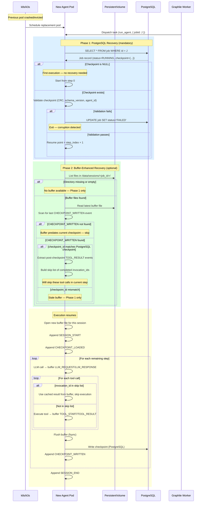

# Spike #31 — JSONL Session Buffer & Recovery

**Status:** Proposed
**Date:** 2026-02-23
**Author:** Cortex Plane Team
**Depends on:** [Spike #24 — Job State Machine](./024-job-state-machine.md), [Spike #26 — Checkpoint & Approval Schema](./026-checkpoint-approval-schema.md), [Spike #27 — Project Structure & Tooling](./027-project-structure.md)

---

## Table of Contents

1. [Context](#context)
2. [Question 1: What Gets Written Per Checkpoint](#question-1-what-gets-written-per-checkpoint)
3. [Question 2: Schema Versioning & Migration](#question-2-schema-versioning--migration)
4. [Question 3: Flush Frequency](#question-3-flush-frequency)
5. [Question 4: fsync Guarantees](#question-4-fsync-guarantees)
6. [Question 5: File Rotation & Retention](#question-5-file-rotation--retention)
7. [Question 6: Recovery Sequence](#question-6-recovery-sequence)
8. [Question 7: Corruption Handling](#question-7-corruption-handling)
9. [Question 8: Per-Agent Isolation](#question-8-per-agent-isolation)
10. [Artifact: JSONL Checkpoint JSON Schema](#artifact-jsonl-checkpoint-json-schema)
11. [Artifact: Write Protocol Spec](#artifact-write-protocol-spec)
12. [Artifact: Recovery Sequence Diagram](#artifact-recovery-sequence-diagram)
13. [Artifact: Corruption Detection Algorithm](#artifact-corruption-detection-algorithm)
14. [Artifact: File Naming Convention & Rotation Policy](#artifact-file-naming-convention--rotation-policy)
15. [Design Decisions](#design-decisions)

---

## Context

Spike #26 established that the durable checkpoint — the source of truth for agent workflow state — lives in `job.checkpoint` (JSONB column in PostgreSQL). That design is correct: PostgreSQL provides transactional atomicity, WAL-based durability, and single-query resume. Nothing in this spike changes that.

This spike addresses a different problem: **what happens between PostgreSQL checkpoint writes?**

### The Gap Between Checkpoints

Spike #26 defines the checkpoint write protocol as per-step: one PostgreSQL UPDATE after all tool calls in an LLM response are resolved. A "step" consists of an LLM call plus its associated tool calls. Between two PostgreSQL checkpoints, significant work happens:

1. The LLM response itself (prompt tokens, completion tokens, reasoning, tool_use blocks).
2. Individual tool call inputs and outputs.
3. Agent reasoning and intermediate state transitions.
4. Error messages, retries, and diagnostics.

If the agent pod crashes mid-step, the PostgreSQL checkpoint captures the state at the _start_ of the step (the previous checkpoint), but everything that happened during the in-progress step is lost. This is acceptable for crash recovery — the step re-executes from the beginning, which is by design. But it is _not_ acceptable for:

- **Debugging.** When an agent fails, the operator needs to see _what happened_ during the step that failed. "The LLM said X, then the agent called tool Y with input Z, and it returned error W" — this narrative is essential for diagnosing failures. Without it, the operator sees only the checkpoint before the failure and the error message.

- **Audit & compliance.** For agents that interact with external systems (deploy to production, modify DNS, execute financial operations), there must be a complete record of every action attempted, not just the ones that completed successfully.

- **Cost tracking.** LLM API calls are the dominant cost. Per-call token usage must be logged for cost attribution and budget enforcement. The PostgreSQL checkpoint stores cumulative `token_usage`, but if the pod crashes before checkpointing, the tokens are consumed (billed by the LLM provider) but untracked.

- **Real-time observability.** The dashboard streams agent activity via SSE. Without a buffer of recent events, a dashboard reconnection (or initial connection after an agent is already running) has no history to display.

### The JSONL Session Buffer

The JSONL session buffer is a **local append-only log** on the agent pod's filesystem. It captures every significant event during agent execution — LLM responses, tool calls, state transitions, errors — as newline-delimited JSON. It is:

- **Not the source of truth.** PostgreSQL is. The JSONL buffer is a detailed journal that supplements the checkpoint, not replaces it.
- **Ephemeral per pod.** When a pod is replaced, the new pod starts a fresh buffer. The previous pod's buffer is retained on the PersistentVolume (if one exists) or lost (if using emptyDir).
- **Write-optimized.** Appending a line to a file is orders of magnitude cheaper than a PostgreSQL UPDATE. The buffer can capture events at tool-call granularity without database overhead.
- **Recovery-optional.** The agent can resume from the PostgreSQL checkpoint alone. The JSONL buffer enables _enhanced_ recovery (skip completed tool calls within a step) and _diagnostic_ recovery (understand what happened before a crash). Neither is required for correctness.

### Hard Constraints

| Constraint                                              | Implication                                                                               |
| ------------------------------------------------------- | ----------------------------------------------------------------------------------------- |
| Spike #26: PostgreSQL checkpoint is the source of truth | The JSONL buffer is supplementary — never authoritative for state recovery                |
| Spike #27: Node.js 24, Pino for logging                 | JSONL writes use Node.js `fs` API; event format is compatible with Pino's structured JSON |
| k3s pod lifecycle                                       | Pod filesystems are ephemeral unless backed by a PersistentVolumeClaim (PVC)              |
| Stateless control plane                                 | The control plane never reads the JSONL buffer directly; it reads PostgreSQL              |
| ARM64 + x64                                             | No native dependencies for buffer writes — pure Node.js `fs` module                       |
| Graphile Worker task handler                            | The buffer is opened when the task handler starts and closed when it returns              |

### Relationship to Existing Checkpoints

```
┌───────────────────────────────────────────────────────────────────────┐
│  Agent Pod (ephemeral)                                                │
│                                                                       │
│  ┌─────────────────────────────────┐                                  │
│  │  JSONL Session Buffer           │ ← Append-only, per-step detail   │
│  │  /data/sessions/<job>/<file>    │    Every LLM response, tool call │
│  │                                 │    ~100 writes per job            │
│  └─────────────────────────────────┘                                  │
│                                                                       │
│  Agent loop:                                                          │
│    1. Read checkpoint from PostgreSQL                                 │
│    2. Open/resume JSONL buffer                                        │
│    3. LLM call → append LLM_RESPONSE to buffer                       │
│    4. Tool call → append TOOL_START, TOOL_RESULT to buffer            │
│    5. Flush buffer (fsync)                                            │
│    6. Write checkpoint to PostgreSQL (source of truth)                │
│    7. Append CHECKPOINT_WRITTEN to buffer                             │
│    8. Goto 3 (next step)                                              │
│                                                                       │
├───────────────────────────────────────────────────────────────────────┤
│  PersistentVolume (durable across pod restarts)                       │
│                                                                       │
│  /data/sessions/                                                      │
│    <job_id>/                                                          │
│      session_<timestamp>_<pod>.jsonl  ← Survives pod restart          │
│      session_<timestamp>_<pod>.jsonl  ← Previous pod's buffer         │
│                                                                       │
├───────────────────────────────────────────────────────────────────────┤
│  PostgreSQL (durable, source of truth)                                │
│                                                                       │
│  job.checkpoint JSONB  ← Full state snapshot per step                 │
│  job_history           ← State transition audit trail                 │
│                                                                       │
└───────────────────────────────────────────────────────────────────────┘
```

---

## Question 1: What Gets Written Per Checkpoint

**Decision: Full state snapshot in PostgreSQL (unchanged from spike #26). Incremental events in the JSONL buffer.**

The JSONL buffer does not write "checkpoints." It writes **events** — discrete, timestamped records of things that happened during agent execution. The PostgreSQL checkpoint remains a full state snapshot, exactly as spike #26 defined.

### JSONL Event Types

| Event Type           | Written When                        | Purpose                                                                                |
| -------------------- | ----------------------------------- | -------------------------------------------------------------------------------------- |
| `SESSION_START`      | Task handler begins                 | Marks the start of an execution session on this pod                                    |
| `CHECKPOINT_LOADED`  | Checkpoint read from PostgreSQL     | Records the checkpoint that this session resumes from (or null for first run)          |
| `LLM_REQUEST`        | Before sending LLM API call         | Captures the prompt sent (or hash of prompt + model params)                            |
| `LLM_RESPONSE`       | After LLM response received         | Captures token usage, finish reason, tool_use blocks (content is truncated/summarized) |
| `TOOL_START`         | Before executing a tool call        | Records tool name, invocation_id, input hash, and the input itself                     |
| `TOOL_RESULT`        | After tool call completes           | Records result (or error), duration, and invocation_id for correlation                 |
| `CHECKPOINT_WRITTEN` | After PostgreSQL checkpoint commits | Confirms that the checkpoint was durably written; includes checkpoint_id               |
| `APPROVAL_REQUESTED` | Approval gate reached               | Records the approval action, token hash (not plaintext), and routing info              |
| `STATE_TRANSITION`   | Job status changes                  | Records old and new status                                                             |
| `ERROR`              | Any error during execution          | Captures error message, stack trace (truncated), and context                           |
| `SESSION_END`        | Task handler returns                | Marks normal termination of this session (success, approval pause, or failure)         |

### Why Events, Not Snapshots

The PostgreSQL checkpoint already captures full snapshots. Duplicating snapshots in the JSONL buffer would be wasteful: a 50KB checkpoint written 20 times produces 1MB of largely redundant data. Events are compact (typically 200 bytes–2KB each) and capture the _narrative_ — the sequence of actions — not the _state_.

The combination is powerful: the PostgreSQL checkpoint tells you _where_ the agent is, and the JSONL buffer tells you _how it got there_.

### What Is NOT Written to the Buffer

- **Full LLM conversation history.** The buffer captures summaries and token counts, not the full prompt/response text. Full LLM transcripts would be multi-megabyte and are the LLM provider's responsibility to retain (via their API logs).
- **Raw tool outputs exceeding 4KB.** Tool results are truncated to 4KB in the buffer. If the full result is needed for debugging, it's available via the tool's own logs or the external system.
- **Checkpoint state blobs.** The buffer records `CHECKPOINT_WRITTEN` with the `checkpoint_id`, not the full checkpoint content. The content is in PostgreSQL.

---

## Question 2: Schema Versioning & Migration

**Decision: Integer `buffer_schema_version` in the `SESSION_START` event. Forward-compatible: new event types are ignored by older readers. No migration of old buffer files — they are read-only historical records.**

### Versioning Strategy

The JSONL buffer is fundamentally different from the PostgreSQL checkpoint when it comes to versioning:

- **Checkpoints must be migrated** because the agent _resumes from them_. A checkpoint with an old schema must be transformed to the current schema for the resume logic to work.
- **Buffer files are never migrated** because they are _historical records_. No code path reads a buffer file and uses it to reconstruct state. Buffer files are read by humans (debugging), by log pipelines (shipping to Loki), and by the enhanced recovery logic (scanning for completed tool calls within the current step). None of these require the data to match the current schema exactly.

### Schema Version Semantics

```typescript
/**
 * Buffer schema version. Incremented when:
 * - An existing event type's field set changes incompatibly.
 * - Event type names are renamed (not when new types are added).
 */
const BUFFER_SCHEMA_VERSION = 1
```

The `SESSION_START` event includes `buffer_schema_version`. A reader encountering a buffer file:

1. Reads the first line (`SESSION_START`).
2. Checks `buffer_schema_version`.
3. If the version is recognized: parse all events normally.
4. If the version is unrecognized: parse best-effort. Every event has `type`, `timestamp`, and `job_id` as guaranteed fields. Unknown event types and unknown fields are ignored.

### Forward Compatibility Rules

| Change                                           | Version Bump? | Rationale                                          |
| ------------------------------------------------ | ------------- | -------------------------------------------------- |
| Adding a new event type                          | **No**        | Unknown event types are skipped by older readers.  |
| Adding a new optional field to an existing event | **No**        | Unknown fields are ignored by older readers.       |
| Removing a field from an existing event          | **No**        | Readers handle missing optional fields already.    |
| Renaming an event type or required field         | **Yes**       | Old readers can't find the field/type they expect. |
| Changing a field's type                          | **Yes**       | Old readers would parse it incorrectly.            |

This is a deliberate asymmetry with the checkpoint versioning (spike #26). Checkpoints are _consumed_ by critical recovery logic — they must be exact. Buffer files are _consumed_ by diagnostic tooling — they can be approximate.

---

## Question 3: Flush Frequency

**Decision: Append after every event. Flush (fsync) after every tool result and before every PostgreSQL checkpoint write. Configurable via agent definition.**

### Default Flush Points

The buffer is opened with a write file descriptor at `SESSION_START`. Events are appended using buffered writes (Node.js `fs.writeFile` in append mode, or a write stream). The key question is when to call `fsync` to guarantee the data has reached disk:

| Flush Point                                  | Why                                                                                                                                                                                                                              | Cost                    |
| -------------------------------------------- | -------------------------------------------------------------------------------------------------------------------------------------------------------------------------------------------------------------------------------- | ----------------------- |
| After `TOOL_RESULT` for side-effecting tools | If the pod crashes after a side-effecting tool call completes but before the PostgreSQL checkpoint, the buffer is the only record that the side effect occurred. Without fsync, the OS might not have flushed the write to disk. | ~1ms per fsync on SSD   |
| Before `CHECKPOINT_WRITTEN`                  | The buffer must be consistent with the PostgreSQL checkpoint. If the buffer says "tool X completed" but the pod crashes before the buffer is flushed, the recovery logic might re-execute the tool.                              | ~1ms per fsync          |
| At `SESSION_END`                             | Final flush before the task handler returns. Ensures the complete session is on disk.                                                                                                                                            | ~1ms (once per session) |

### What About After Every Event?

Calling `fsync` after every event would guarantee that _no_ events are lost on crash. But it's unnecessary and expensive:

- **Unnecessary** because events between flush points are reconstructable. If the buffer loses an `LLM_RESPONSE` event (crash between write and fsync), the agent will re-execute the LLM call on resume anyway (since the PostgreSQL checkpoint doesn't reflect the step). The lost event is a minor diagnostic gap, not a correctness issue.
- **Expensive** because fsync is a blocking I/O call. At ~1ms per fsync, 100 events per job would add 100ms of pure sync overhead. For the flush points defined above, the overhead is ~5-15ms per job (3-10 tool results + 5-20 checkpoint writes).

### Configurable Flush Modes

The `agent.skill_config` JSONB can include a `buffer_flush_mode` field:

```json
{
  "buffer_flush_mode": "default"
}
```

| Mode         | Behavior                                      | Use Case                                                                          |
| ------------ | --------------------------------------------- | --------------------------------------------------------------------------------- |
| `"default"`  | Flush at tool results + before checkpoints    | Most agents                                                                       |
| `"paranoid"` | Flush after every event (`O_SYNC`-equivalent) | Agents performing financial operations or irreversible actions                    |
| `"lazy"`     | Flush only at `SESSION_END`                   | Low-stakes agents where diagnostic completeness is less important than throughput |

### Implementation

```typescript
import { open, type FileHandle } from "node:fs/promises"

interface BufferWriter {
  append(event: BufferEvent): Promise<void>
  flush(): Promise<void>
  close(): Promise<void>
}

async function createBufferWriter(
  filePath: string,
  flushMode: "default" | "paranoid" | "lazy",
): Promise<BufferWriter> {
  const handle: FileHandle = await open(filePath, "a")
  let pendingBytes = 0

  return {
    async append(event: BufferEvent): Promise<void> {
      const line = JSON.stringify(event) + "\n"
      await handle.appendFile(line, { encoding: "utf-8" })
      pendingBytes += Buffer.byteLength(line, "utf-8")

      if (flushMode === "paranoid") {
        await handle.sync()
        pendingBytes = 0
      }
    },

    async flush(): Promise<void> {
      if (pendingBytes > 0 && flushMode !== "lazy") {
        await handle.sync()
        pendingBytes = 0
      }
    },

    async close(): Promise<void> {
      await handle.sync()
      await handle.close()
    },
  }
}
```

---

## Question 4: fsync Guarantees

**Decision: Periodic `fsync` at defined flush points (see Question 3). Not `O_SYNC`. Not `O_DSYNC`. The JSONL buffer is not a WAL — it does not need write-barrier semantics.**

### Why Not O_SYNC?

`O_SYNC` opens the file in synchronous mode: every `write()` call blocks until the data and metadata are flushed to disk. This is what databases use for their write-ahead logs (WAL) because WAL correctness depends on every write being durable before the next operation proceeds.

The JSONL buffer is not a WAL. Its correctness properties are weaker:

1. **No operation depends on reading the buffer back before proceeding.** The agent reads the PostgreSQL checkpoint, not the buffer, to determine its resume point. The buffer is written and (mostly) never read during normal execution.
2. **Lost events are a diagnostic gap, not a correctness bug.** If the OS buffers 3 events and the pod crashes, those 3 events are lost. The agent will re-execute the step from the last PostgreSQL checkpoint. The buffer will have a gap — the SESSION_START and early events from the crashed session are missing — but this is acceptable.
3. **The only exception is side-effecting tool calls.** For these, we call `fsync` explicitly (Question 3) to ensure the buffer records that the side effect was initiated. This is best-effort: if the fsync itself fails (disk error), the agent should continue anyway — the PostgreSQL checkpoint is the authority.

### Why Not O_DSYNC?

`O_DSYNC` is a weaker form: it syncs data but not metadata (file size, timestamps). It's faster than `O_SYNC` but still blocks every write. The cost/benefit tradeoff is the same as `O_SYNC` — unnecessary for a non-authoritative log.

### What We Actually Need

```
Guarantee: "If the pod crashes, the buffer file on disk contains all events
            up to and including the last explicit fsync() call."

Not guaranteed: "Events written after the last fsync() are on disk."
```

This is exactly what the POSIX `write()` + explicit `fsync()` model provides. Write calls go to the kernel page cache (fast, ~1μs). `fsync` calls flush the page cache to disk (slow, ~1ms). Between fsync calls, data is in the page cache — durable against application crashes (the kernel still has it) but not against power loss or kernel panics.

For k3s pod replacement (the common crash scenario — OOM kill, node drain, preemption), the kernel page cache is flushed during normal shutdown. Events in the page cache survive pod replacement in most cases. For hard power loss, some events are lost — acceptable, per the analysis above.

### Summary

| Approach                       | Per-write cost         | Guarantee                      | Decision                                                     |
| ------------------------------ | ---------------------- | ------------------------------ | ------------------------------------------------------------ |
| `O_SYNC`                       | ~1ms                   | Every write durable            | **Rejected** — too expensive for a non-authoritative log     |
| `O_DSYNC`                      | ~0.5ms                 | Every write data-durable       | **Rejected** — same reasoning                                |
| `write()` + periodic `fsync()` | ~1μs write, ~1ms fsync | Data durable up to last fsync  | **Accepted** — right balance for a supplementary buffer      |
| `write()` only, no `fsync`     | ~1μs                   | Best-effort (kernel may flush) | **Rejected** — too weak for side-effecting tool call records |

---

## Question 5: File Rotation & Retention

**Decision: Rotate by session (one file per pod execution of a job). Retain for 7 days or until job reaches terminal state + 24 hours, whichever is longer.**

### Rotation Strategy: One File Per Session

A "session" is one execution of a Graphile Worker task on one pod. A job may have multiple sessions:

- Session 1: Pod runs steps 0-3, crashes.
- Session 2: Pod resumes from step 3 checkpoint, runs steps 4-6, reaches approval gate, pauses.
- Session 3: After approval, new pod runs steps 7-9, completes.

Each session produces one JSONL file. This is the natural rotation boundary because:

1. **Crash isolation.** If a session crashes mid-write, only that session's file may have a truncated last line. Previous sessions' files are complete and closed.
2. **Simple naming.** The file name encodes the job ID, session start time, and pod identity — enough to reconstruct the execution timeline.
3. **No size-based rotation needed.** A session's buffer is bounded by the number of events in a single execution span. With ~10-50 events per step and ~5-20 steps per session, a buffer file is 50KB-500KB. Even a pathologically long session (100 steps, 200 events each) produces ~20MB — well within filesystem limits.

### Why Not Rotate by Size?

Size-based rotation (e.g., rotate at 10MB) is appropriate for continuously running services that produce unbounded log output (web server access logs). Agent sessions are bounded: they start, execute a finite number of steps, and end. The file closes naturally when the session ends. Size-based rotation would split a session across multiple files, complicating correlation.

### Why Not Rotate by Time?

Time-based rotation (e.g., hourly) has the same problem: it would split sessions across files. A 90-minute session would span two hourly files, making it harder to read the complete session.

### Retention Policy

```typescript
interface BufferRetentionConfig {
  /** Minimum retention after job reaches terminal state. Default: 24h. */
  postTerminalRetentionMs: number
  /** Maximum retention regardless of job state. Default: 7 days. */
  maxRetentionMs: number
}

const DEFAULT_RETENTION: BufferRetentionConfig = {
  postTerminalRetentionMs: 24 * 60 * 60 * 1000, // 24 hours
  maxRetentionMs: 7 * 24 * 60 * 60 * 1000, // 7 days
}
```

**Cleanup process:** A Graphile Worker cron task (`cleanup_session_buffers`) runs daily. For each job directory in `/data/sessions/`:

1. Query the job's status and `finished_at` from PostgreSQL.
2. If the job is in a terminal state and `finished_at + postTerminalRetentionMs < now()`: delete the job's buffer directory.
3. If any buffer file's mtime exceeds `maxRetentionMs`: delete it regardless of job state (safety net for orphaned files from deleted jobs).

**PersistentVolume sizing:** With 500KB average per session, 3 sessions per job, and 7-day retention at 100 jobs/day, the steady-state storage is:

```
500KB × 3 sessions × 100 jobs/day × 7 days = ~1GB
```

A 5GB PersistentVolume provides comfortable headroom.

---

## Question 6: Recovery Sequence

**Decision: On pod restart, recovery reads the PostgreSQL checkpoint first (authoritative), then optionally scans the JSONL buffer from the previous session for completed tool calls within the current step (enhanced recovery).**

### Two-Phase Recovery

**Phase 1: PostgreSQL Recovery (mandatory, unchanged from spike #26)**

The new pod reads `job.checkpoint` from PostgreSQL. This tells the agent:

- Which step to resume from (`step_index + 1`).
- The state of active tools at the checkpoint write time.
- The full memory context and execution log.

This is sufficient for correctness. The agent can resume from here without any JSONL buffer.

**Phase 2: Buffer-Enhanced Recovery (optional, new)**

If the previous session's buffer file exists on the PersistentVolume, the agent scans it for events that occurred _after_ the last `CHECKPOINT_WRITTEN` event. These events represent work done during the in-progress step that crashed:

1. Scan backward from the end of the file to find the last `CHECKPOINT_WRITTEN` event.
2. Read all events after it.
3. For each `TOOL_RESULT` event: record that this tool call (by `invocation_id`) was completed.
4. When executing the current step, skip tool calls whose `invocation_id` appears in the buffer as completed.

This saves re-executing tool calls that already completed but weren't captured in the PostgreSQL checkpoint (because the checkpoint is written after _all_ tool calls in a step, not after each one).

### When Buffer-Enhanced Recovery Is Skipped

- **No PersistentVolume.** If the buffer directory uses `emptyDir`, the previous session's files are gone. Phase 2 is skipped entirely. Phase 1 is sufficient.
- **Buffer file is corrupted.** If the last line is truncated (Question 7), the scanner skips the truncated line and processes everything before it. If the file is unreadable, Phase 2 is skipped.
- **Different pod.** If the new pod is scheduled on a different node (common in k3s), the PersistentVolume may not be accessible. Phase 2 is skipped.
- **Checkpoint ID mismatch.** If the `CHECKPOINT_WRITTEN` event's `checkpoint_id` doesn't match the PostgreSQL checkpoint's `checkpoint_id`, the buffer is from a different checkpoint cycle. Phase 2 is skipped (stale buffer).

### Recovery Decision Tree

```
Pod starts → Read PostgreSQL checkpoint
  │
  ├── Checkpoint is NULL → First execution, start from step 0
  │                         Skip Phase 2 (no previous session)
  │
  └── Checkpoint exists → Validate (CRC, schema version, agent_id)
        │
        ├── Validation fails → Fail job (spike #26 protocol)
        │
        └── Validation passes → Determine resume point: step_index + 1
              │
              ├── Buffer dir exists?
              │     │
              │     ├── No → Execute step from scratch (Phase 1 only)
              │     │
              │     └── Yes → Find latest buffer file for this job
              │           │
              │           ├── File unreadable → Phase 1 only
              │           │
              │           └── File readable → Scan for post-checkpoint events
              │                 │
              │                 ├── Last CHECKPOINT_WRITTEN matches PG →
              │                 │     Extract completed tool invocation_ids
              │                 │     Skip those tool calls in current step
              │                 │
              │                 └── Mismatch or not found → Phase 1 only
              │
              └── Execute step (with or without skip list)
```

---

## Question 7: Corruption Handling

**Decision: Line-level detection. A truncated last line is expected (crash mid-write) and is silently discarded. Interior corruption fails the scan gracefully — the buffer is treated as unavailable.**

### How Buffer Corruption Happens

Unlike the PostgreSQL checkpoint (where corruption is rare due to WAL), JSONL buffer corruption is _expected_:

1. **Truncated last line.** The most common case. The agent appended `{"type":"TOOL_RESULT","inv` and then the pod was killed. The write was incomplete — the line is not valid JSON.
2. **Missing events.** Events in the kernel page cache that weren't fsync'd before the pod was killed. The file ends cleanly at a previous event, but some events are missing.
3. **Interleaved writes.** If a bug causes two goroutines/async tasks to write to the same file concurrently, lines may be interleaved (`{"type":"LLM_R{"type":"TOOL_`). This shouldn't happen (the buffer writer is single-threaded per session), but defensive code handles it.

### Detection Algorithm

```typescript
interface BufferScanResult {
  /** Events successfully parsed from the buffer. */
  events: BufferEvent[]
  /** Number of lines that failed to parse. */
  corruptedLines: number
  /** Whether the last line was truncated (expected on crash). */
  lastLineTruncated: boolean
}

/**
 * Scan a JSONL buffer file, tolerating corruption.
 *
 * Each line is independently parsed. A corrupt line is skipped
 * and counted. The scan continues with the next line.
 *
 * This is fundamentally different from checkpoint corruption handling
 * (spike #26), where any corruption fails the job. Buffer corruption
 * is expected and tolerated because the buffer is not authoritative.
 */
function scanBufferFile(content: string): BufferScanResult {
  const lines = content.split("\n")
  const events: BufferEvent[] = []
  let corruptedLines = 0
  let lastLineTruncated = false

  for (let i = 0; i < lines.length; i++) {
    const line = lines[i]!.trim()
    if (line === "") continue // Skip empty lines (including trailing newline)

    try {
      const parsed = JSON.parse(line) as unknown

      // Minimal structural validation: must be an object with type and timestamp.
      if (
        parsed !== null &&
        typeof parsed === "object" &&
        !Array.isArray(parsed) &&
        "type" in parsed &&
        "timestamp" in parsed
      ) {
        events.push(parsed as BufferEvent)
      } else {
        corruptedLines++
      }
    } catch {
      // JSON parse failure. If this is the last non-empty line,
      // it's likely a truncated write (crash mid-append).
      const isLastLine = lines.slice(i + 1).every((l) => l.trim() === "")
      if (isLastLine) {
        lastLineTruncated = true
      } else {
        corruptedLines++
      }
    }
  }

  return { events, corruptedLines, lastLineTruncated }
}
```

### Corruption Response

| Scenario                                      | Response                                                   | Rationale                                                                                        |
| --------------------------------------------- | ---------------------------------------------------------- | ------------------------------------------------------------------------------------------------ |
| Last line truncated                           | Discard last line silently. Log at `DEBUG` level.          | Expected on crash. The event was being written when the pod died.                                |
| Interior line corrupted (1-2 lines)           | Skip corrupted lines, use remaining events. Log at `WARN`. | Minor corruption — the rest of the buffer is still useful for diagnostics and enhanced recovery. |
| Many interior lines corrupted (>10% of lines) | Discard entire buffer. Log at `WARN`. Use Phase 1 only.    | The buffer is too damaged to be trustworthy. Don't use it for enhanced recovery.                 |
| File unreadable (permissions, missing)        | Skip buffer entirely. Log at `WARN`. Use Phase 1 only.     | The buffer is unavailable. Phase 1 is sufficient.                                                |

### Why Tolerate Corruption?

The JSONL buffer is a _supplementary_ log, not the source of truth. The PostgreSQL checkpoint provides correctness. The buffer provides diagnostics and optimization. If the buffer is partially corrupted, the diagnostic value is reduced but the agent's correctness is unaffected. Failing the job because of buffer corruption would be an overreaction — like canceling a flight because the in-flight magazine has a torn page.

---

## Question 8: Per-Agent Isolation

**Decision: Separate file per session (which is per-job, per-pod). No multiplexing. Multiple concurrent jobs on the same pod each get their own buffer file.**

### Why Not Multiplex?

Multiplexing (multiple jobs writing to the same file) was considered and rejected:

1. **Correlation complexity.** Every line would need a `job_id` field (which it has anyway), but reading a single job's history requires scanning and filtering the entire file. With separate files, reading a job's history is `cat <file>`.

2. **Rotation complexity.** If jobs A and B share a file, and job A completes but job B is still running, when do you rotate? You can't delete the file because job B is still writing. You can't rotate mid-job because that breaks the single-file-per-session guarantee.

3. **Concurrency.** Separate files mean separate file handles — no write contention, no locking, no interleaving risk.

4. **Size predictability.** Each file's size is bounded by one session's event count. With multiplexing, a file's size depends on the total concurrency — harder to predict and size the volume.

### Directory Structure

```
/data/sessions/
├── <job_id_1>/
│   ├── session_20260223T143022Z_pod-abc12.jsonl   ← Session 1 (crashed)
│   └── session_20260223T144518Z_pod-def34.jsonl   ← Session 2 (completed)
├── <job_id_2>/
│   └── session_20260223T150000Z_pod-abc12.jsonl   ← Single session
└── <job_id_3>/
    ├── session_20260223T120000Z_pod-ghi56.jsonl   ← Session 1 (approval pause)
    ├── session_20260223T160000Z_pod-jkl78.jsonl   ← Session 2 (post-approval)
    └── session_20260223T161500Z_pod-jkl78.jsonl   ← Session 3 (retry)
```

### Concurrency Model

Graphile Worker can run multiple tasks concurrently (controlled by `GRAPHILE_WORKER_CONCURRENCY`). Each concurrent task execution:

1. Creates its own buffer file in `/data/sessions/<job_id>/`.
2. Holds its own file handle.
3. Writes independently — no shared state.

Since each job has a unique `job_id` directory, there's no risk of two different jobs writing to the same directory simultaneously. Within a job's directory, each session has a unique filename (timestamped), so there's no collision even if the same job is somehow executed twice concurrently (which the state machine prevents, but defense in depth).

---

## Artifact: JSONL Checkpoint JSON Schema

The schema below defines the structure of individual lines in the JSONL buffer file. Each line is a self-contained JSON object representing one event.

### Base Event Schema

```json
{
  "$schema": "https://json-schema.org/draft/2020-12/schema",
  "$id": "https://cortex-plane.dev/schemas/buffer-event/v1.json",
  "title": "Cortex Plane JSONL Buffer Event v1",
  "description": "Base schema for all JSONL buffer events. Each line in a .jsonl buffer file conforms to this schema.",
  "type": "object",
  "required": ["type", "timestamp", "job_id", "session_id"],
  "properties": {
    "type": {
      "type": "string",
      "enum": [
        "SESSION_START",
        "CHECKPOINT_LOADED",
        "LLM_REQUEST",
        "LLM_RESPONSE",
        "TOOL_START",
        "TOOL_RESULT",
        "CHECKPOINT_WRITTEN",
        "APPROVAL_REQUESTED",
        "STATE_TRANSITION",
        "ERROR",
        "SESSION_END"
      ],
      "description": "The event type. Determines which additional fields are present."
    },
    "timestamp": {
      "type": "string",
      "format": "date-time",
      "description": "ISO 8601 timestamp of when this event occurred."
    },
    "job_id": {
      "type": "string",
      "format": "uuid",
      "description": "The job this event belongs to."
    },
    "session_id": {
      "type": "string",
      "format": "uuid",
      "description": "UUIDv7 identifying this execution session. Unique per pod execution."
    },
    "seq": {
      "type": "integer",
      "minimum": 0,
      "description": "Monotonically increasing sequence number within this session. Enables gap detection."
    }
  }
}
```

### Event-Specific Schemas

#### SESSION_START

```json
{
  "type": "object",
  "required": [
    "type",
    "timestamp",
    "job_id",
    "session_id",
    "seq",
    "buffer_schema_version",
    "agent_id",
    "pod_name"
  ],
  "properties": {
    "type": { "const": "SESSION_START" },
    "buffer_schema_version": {
      "type": "integer",
      "minimum": 1,
      "description": "Version of the buffer event schema. Current: 1."
    },
    "agent_id": {
      "type": "string",
      "format": "uuid",
      "description": "The agent executing this job."
    },
    "pod_name": {
      "type": "string",
      "description": "Kubernetes pod name or hostname. For correlation with k8s logs."
    },
    "worker_job_id": {
      "type": ["string", "null"],
      "description": "Graphile Worker's internal job ID for this execution."
    }
  }
}
```

#### CHECKPOINT_LOADED

```json
{
  "type": "object",
  "required": ["type", "timestamp", "job_id", "session_id", "seq", "checkpoint_id", "step_index"],
  "properties": {
    "type": { "const": "CHECKPOINT_LOADED" },
    "checkpoint_id": {
      "type": ["string", "null"],
      "format": "uuid",
      "description": "The checkpoint_id from the loaded checkpoint. Null if no checkpoint (first execution)."
    },
    "step_index": {
      "type": ["integer", "null"],
      "minimum": 0,
      "description": "The step_index from the loaded checkpoint. Null if no checkpoint."
    },
    "schema_version": {
      "type": ["integer", "null"],
      "description": "The schema_version of the loaded checkpoint."
    }
  }
}
```

#### LLM_REQUEST

```json
{
  "type": "object",
  "required": ["type", "timestamp", "job_id", "session_id", "seq", "model", "step_index"],
  "properties": {
    "type": { "const": "LLM_REQUEST" },
    "model": {
      "type": "string",
      "description": "LLM model identifier (e.g., 'claude-sonnet-4-5-20250929')."
    },
    "step_index": {
      "type": "integer",
      "minimum": 0,
      "description": "The step being executed."
    },
    "prompt_hash": {
      "type": "string",
      "pattern": "^[a-f0-9]{64}$",
      "description": "SHA-256 hash of the full prompt. For deduplication and correlation."
    },
    "message_count": {
      "type": "integer",
      "minimum": 1,
      "description": "Number of messages in the conversation sent to the LLM."
    }
  }
}
```

#### LLM_RESPONSE

```json
{
  "type": "object",
  "required": [
    "type",
    "timestamp",
    "job_id",
    "session_id",
    "seq",
    "step_index",
    "prompt_tokens",
    "completion_tokens",
    "finish_reason"
  ],
  "properties": {
    "type": { "const": "LLM_RESPONSE" },
    "step_index": { "type": "integer", "minimum": 0 },
    "prompt_tokens": { "type": "integer", "minimum": 0 },
    "completion_tokens": { "type": "integer", "minimum": 0 },
    "finish_reason": {
      "type": "string",
      "enum": ["end_turn", "tool_use", "max_tokens", "stop_sequence"],
      "description": "Why the LLM stopped generating."
    },
    "tool_use_count": {
      "type": "integer",
      "minimum": 0,
      "description": "Number of tool_use blocks in the response."
    },
    "duration_ms": {
      "type": "integer",
      "minimum": 0,
      "description": "Wall-clock time for the LLM API call."
    }
  }
}
```

#### TOOL_START

```json
{
  "type": "object",
  "required": [
    "type",
    "timestamp",
    "job_id",
    "session_id",
    "seq",
    "invocation_id",
    "tool_name",
    "input_hash"
  ],
  "properties": {
    "type": { "const": "TOOL_START" },
    "invocation_id": {
      "type": "string",
      "format": "uuid",
      "description": "UUIDv7 for this tool invocation. Matches checkpoint active_tools[].invocation_id."
    },
    "tool_name": { "type": "string", "minLength": 1 },
    "input_hash": {
      "type": "string",
      "pattern": "^[a-f0-9]{64}$",
      "description": "SHA-256 hash of the tool input."
    },
    "input_summary": {
      "type": "string",
      "maxLength": 1024,
      "description": "Truncated human-readable summary of the tool input."
    },
    "is_side_effect": {
      "type": "boolean",
      "description": "Whether this tool is classified as side-effecting."
    }
  }
}
```

#### TOOL_RESULT

```json
{
  "type": "object",
  "required": [
    "type",
    "timestamp",
    "job_id",
    "session_id",
    "seq",
    "invocation_id",
    "tool_name",
    "success",
    "duration_ms"
  ],
  "properties": {
    "type": { "const": "TOOL_RESULT" },
    "invocation_id": {
      "type": "string",
      "format": "uuid",
      "description": "Matches the TOOL_START invocation_id."
    },
    "tool_name": { "type": "string", "minLength": 1 },
    "success": { "type": "boolean" },
    "duration_ms": { "type": "integer", "minimum": 0 },
    "result_summary": {
      "type": "string",
      "maxLength": 4096,
      "description": "Truncated result (success) or error message (failure)."
    },
    "error_code": {
      "type": ["string", "null"],
      "description": "Machine-readable error code if the tool call failed."
    }
  }
}
```

#### CHECKPOINT_WRITTEN

```json
{
  "type": "object",
  "required": ["type", "timestamp", "job_id", "session_id", "seq", "checkpoint_id", "step_index"],
  "properties": {
    "type": { "const": "CHECKPOINT_WRITTEN" },
    "checkpoint_id": {
      "type": "string",
      "format": "uuid",
      "description": "The checkpoint_id of the checkpoint just written to PostgreSQL."
    },
    "step_index": { "type": "integer", "minimum": 0 },
    "checkpoint_size_bytes": {
      "type": "integer",
      "minimum": 0,
      "description": "Serialized size of the checkpoint blob. For monitoring."
    }
  }
}
```

#### SESSION_END

```json
{
  "type": "object",
  "required": ["type", "timestamp", "job_id", "session_id", "seq", "reason", "total_events"],
  "properties": {
    "type": { "const": "SESSION_END" },
    "reason": {
      "type": "string",
      "enum": ["completed", "failed", "approval_pause", "cancelled"],
      "description": "Why the session ended."
    },
    "total_events": {
      "type": "integer",
      "minimum": 0,
      "description": "Total events written in this session (including this one)."
    },
    "final_step_index": {
      "type": "integer",
      "minimum": 0,
      "description": "The last step_index reached in this session."
    }
  }
}
```

---

## Artifact: Write Protocol Spec

The write protocol defines exactly when and how events are written to the JSONL buffer.

### Protocol Rules

1. **One buffer writer per task execution.** When a Graphile Worker task handler starts, it creates a `BufferWriter` (see Question 3) with a new file. When the task handler returns, the writer is closed.

2. **Sequential writes only.** Events are appended in the order they occur. The `seq` field is a monotonically increasing integer starting at 0 for each session. Gaps in `seq` indicate lost events (kernel page cache not flushed before crash).

3. **One JSON object per line.** No pretty-printing. No multi-line JSON. Each event is serialized with `JSON.stringify()` (no indentation) and terminated with `\n`. This ensures that line-level parsing works and that truncated writes only affect the last line.

4. **No newlines in values.** String values in events must not contain `\n`. If a tool result or error message contains newlines, they are escaped as `\\n` by `JSON.stringify()` (this is the default behavior).

5. **Flush before PostgreSQL write.** Before writing the checkpoint to PostgreSQL, the buffer must be flushed (`fsync`). This ensures that if the PostgreSQL write succeeds but the pod crashes before the `CHECKPOINT_WRITTEN` event is appended, the buffer still contains all events up to the checkpoint — the `CHECKPOINT_WRITTEN` marker is missing, but the events themselves are durable.

6. **Checkpoint marker after PostgreSQL write.** After the PostgreSQL checkpoint UPDATE commits, a `CHECKPOINT_WRITTEN` event is appended to the buffer. This marker is the delimiter for enhanced recovery: "everything before this marker is covered by the PostgreSQL checkpoint; everything after it is in-progress work."

### Write Sequence

```
Task handler starts
  │
  ├── Create buffer file: /data/sessions/<job_id>/session_<ts>_<pod>.jsonl
  ├── Append SESSION_START (seq=0)
  ├── Read checkpoint from PostgreSQL
  ├── Append CHECKPOINT_LOADED (seq=1)
  │
  │  ┌── Step N loop ───────────────────────────────────────────────┐
  │  │                                                               │
  │  │  Append LLM_REQUEST (seq=S)                                   │
  │  │  Call LLM API                                                 │
  │  │  Append LLM_RESPONSE (seq=S+1)                                │
  │  │                                                               │
  │  │  For each tool_use in LLM response:                           │
  │  │    Append TOOL_START (seq=S+K)                                │
  │  │    Execute tool                                               │
  │  │    Append TOOL_RESULT (seq=S+K+1)                             │
  │  │    If side-effecting tool: flush(fsync)                       │
  │  │                                                               │
  │  │  Flush buffer (fsync)                  ← Before PG write      │
  │  │  Write checkpoint to PostgreSQL        ← Source of truth      │
  │  │  Append CHECKPOINT_WRITTEN (seq=S+M)   ← After PG write      │
  │  │                                                               │
  │  └── Next step ─────────────────────────────────────────────────┘
  │
  ├── Append SESSION_END (seq=final)
  ├── Close buffer file (final fsync + close)
  │
  └── Task handler returns
```

### Failure Modes

| Failure                                                      | Buffer State                                               | Recovery Behavior                                                                                                                                                                                 |
| ------------------------------------------------------------ | ---------------------------------------------------------- | ------------------------------------------------------------------------------------------------------------------------------------------------------------------------------------------------- |
| Pod crash during LLM API call                                | Buffer has `LLM_REQUEST` but no `LLM_RESPONSE`             | Phase 1 only. Step re-executes from scratch. Buffer gap is diagnostic.                                                                                                                            |
| Pod crash during tool execution                              | Buffer has `TOOL_START` but no `TOOL_RESULT`               | Phase 1 only. If Phase 2 available, tool call is known to have started but not completed — may need idempotency check.                                                                            |
| Pod crash after tool result, before fsync                    | `TOOL_RESULT` may be in page cache but not on disk         | If page cache was flushed by kernel: event is on disk, Phase 2 can use it. If not: event is lost, Phase 1 only.                                                                                   |
| Pod crash after fsync, before PG write                       | Buffer has complete events but no `CHECKPOINT_WRITTEN`     | Phase 1 resumes from previous checkpoint. Buffer events after last `CHECKPOINT_WRITTEN` represent work that will be re-done.                                                                      |
| Pod crash after PG write, before `CHECKPOINT_WRITTEN` marker | PG checkpoint is durable but marker is missing from buffer | Phase 1 resumes from the just-written checkpoint. Buffer lacks the marker — Phase 2 will not find a matching `CHECKPOINT_WRITTEN` and falls back to Phase 1 only. Safe but slightly less optimal. |
| Pod crash during `SESSION_END` write                         | Buffer may have truncated `SESSION_END`                    | No impact. `SESSION_END` is informational.                                                                                                                                                        |

---

## Artifact: Recovery Sequence Diagram



---

## Artifact: Corruption Detection Algorithm

The buffer corruption detection operates at two levels: line-level (per JSONL line) and file-level (overall integrity assessment).

### Line-Level Detection

Each line in the JSONL buffer is independently parseable. Corruption detection is built into the line parser:

```typescript
import type { Logger } from "pino"

/**
 * Corruption severity levels for buffer scanning.
 */
const enum CorruptionSeverity {
  /** Last line truncated — expected on crash. */
  TRUNCATED_TAIL = "truncated_tail",
  /** One or more interior lines are invalid JSON. */
  CORRUPT_INTERIOR = "corrupt_interior",
  /** File is completely unreadable. */
  UNREADABLE = "unreadable",
}

interface LineScanResult {
  /** The parsed event, or null if the line is corrupt. */
  event: BufferEvent | null
  /** Line number (1-based) in the file. */
  lineNumber: number
  /** Raw line content (for diagnostics). Truncated to 200 chars. */
  rawPreview: string
  /** Whether this line was successfully parsed. */
  valid: boolean
}

/**
 * Parse a single JSONL line with corruption tolerance.
 */
function parseLine(raw: string, lineNumber: number): LineScanResult {
  const trimmed = raw.trim()
  const rawPreview = trimmed.slice(0, 200)

  if (trimmed === "") {
    return { event: null, lineNumber, rawPreview, valid: true } // Empty line — skip
  }

  try {
    const parsed = JSON.parse(trimmed) as unknown

    if (parsed === null || typeof parsed !== "object" || Array.isArray(parsed)) {
      return { event: null, lineNumber, rawPreview, valid: false }
    }

    const obj = parsed as Record<string, unknown>

    // Minimum required fields for any buffer event.
    if (typeof obj.type !== "string" || typeof obj.timestamp !== "string") {
      return { event: null, lineNumber, rawPreview, valid: false }
    }

    return { event: obj as unknown as BufferEvent, lineNumber, rawPreview, valid: true }
  } catch {
    return { event: null, lineNumber, rawPreview, valid: false }
  }
}
```

### File-Level Assessment

```typescript
interface BufferIntegrityReport {
  /** Total non-empty lines in the file. */
  totalLines: number
  /** Lines successfully parsed as valid events. */
  validLines: number
  /** Lines that failed parsing (excluding truncated tail). */
  corruptLines: number
  /** Whether the last line appears truncated (incomplete JSON). */
  tailTruncated: boolean
  /** Overall assessment. */
  severity: CorruptionSeverity | null
  /** Corruption ratio (corruptLines / totalLines). */
  corruptionRatio: number
}

/**
 * Assess the overall integrity of a buffer file.
 *
 * Returns a report that the recovery logic uses to decide
 * whether to trust the buffer for Phase 2 recovery.
 */
function assessBufferIntegrity(content: string, logger: Logger): BufferIntegrityReport {
  const lines = content.split("\n")
  const nonEmptyLines: Array<{ raw: string; index: number }> = []

  for (let i = 0; i < lines.length; i++) {
    if (lines[i]!.trim() !== "") {
      nonEmptyLines.push({ raw: lines[i]!, index: i })
    }
  }

  if (nonEmptyLines.length === 0) {
    return {
      totalLines: 0,
      validLines: 0,
      corruptLines: 0,
      tailTruncated: false,
      severity: CorruptionSeverity.UNREADABLE,
      corruptionRatio: 0,
    }
  }

  let validLines = 0
  let corruptLines = 0
  let tailTruncated = false

  for (let i = 0; i < nonEmptyLines.length; i++) {
    const { raw, index } = nonEmptyLines[i]!
    const result = parseLine(raw, index + 1)

    if (result.valid && result.event !== null) {
      validLines++
    } else if (!result.valid) {
      // Is this the last non-empty line?
      if (i === nonEmptyLines.length - 1) {
        tailTruncated = true
        // Don't count truncated tail as corruption — it's expected.
      } else {
        corruptLines++
        logger.warn(
          { lineNumber: index + 1, rawPreview: result.rawPreview },
          "Corrupt line in JSONL buffer",
        )
      }
    }
  }

  const totalLines = nonEmptyLines.length
  const corruptionRatio = totalLines > 0 ? corruptLines / totalLines : 0

  // Determine severity.
  let severity: CorruptionSeverity | null = null

  if (corruptLines === 0 && tailTruncated) {
    severity = CorruptionSeverity.TRUNCATED_TAIL
  } else if (corruptionRatio > 0.1) {
    severity = CorruptionSeverity.CORRUPT_INTERIOR
  } else if (corruptLines > 0) {
    severity = CorruptionSeverity.CORRUPT_INTERIOR
  }

  return {
    totalLines,
    validLines,
    corruptLines,
    tailTruncated,
    severity,
    corruptionRatio,
  }
}
```

### Recovery Decision Based on Integrity

```typescript
const CORRUPTION_RATIO_THRESHOLD = 0.1 // 10%

function shouldUseBufferForRecovery(report: BufferIntegrityReport, logger: Logger): boolean {
  if (report.totalLines === 0) {
    logger.debug("Buffer file is empty — skipping Phase 2")
    return false
  }

  if (report.severity === CorruptionSeverity.UNREADABLE) {
    logger.warn("Buffer file is unreadable — skipping Phase 2")
    return false
  }

  if (report.corruptionRatio > CORRUPTION_RATIO_THRESHOLD) {
    logger.warn(
      {
        corruptLines: report.corruptLines,
        totalLines: report.totalLines,
        ratio: report.corruptionRatio,
      },
      "Buffer corruption exceeds threshold — skipping Phase 2",
    )
    return false
  }

  if (report.tailTruncated) {
    logger.debug("Buffer has truncated tail (expected on crash) — proceeding with Phase 2")
  }

  if (report.corruptLines > 0) {
    logger.warn(
      { corruptLines: report.corruptLines },
      "Buffer has minor corruption — proceeding with Phase 2 using valid events only",
    )
  }

  return true
}
```

---

## Artifact: File Naming Convention & Rotation Policy

### File Naming Convention

```
/data/sessions/<job_id>/session_<ISO8601_compact>_<pod_name>.jsonl
```

Components:

| Component     | Format              | Example                                 | Purpose                                                                                  |
| ------------- | ------------------- | --------------------------------------- | ---------------------------------------------------------------------------------------- |
| Base path     | `/data/sessions/`   | `/data/sessions/`                       | Root directory for all session buffers. Mounted as PVC or emptyDir.                      |
| Job directory | `<job_id>/`         | `01956a3b-7c4d-7e8f-9a1b-2c3d4e5f6789/` | UUIDv7 job ID. Groups all sessions for a single job.                                     |
| File prefix   | `session_`          | `session_`                              | Fixed prefix for greppability and glob matching.                                         |
| Timestamp     | `<ISO8601_compact>` | `20260223T143022Z`                      | Session start time in compact ISO 8601 (UTC). Enables chronological sorting by filename. |
| Pod name      | `<pod_name>`        | `agent-worker-7b9f4-xk2n3`              | Kubernetes pod name. Correlates buffer files with k8s logs and events.                   |
| Extension     | `.jsonl`            | `.jsonl`                                | JSONL (newline-delimited JSON).                                                          |

Full example:

```
/data/sessions/01956a3b-7c4d-7e8f-9a1b-2c3d4e5f6789/session_20260223T143022Z_agent-worker-7b9f4-xk2n3.jsonl
```

### Why This Naming Scheme

1. **Job-level grouping.** All sessions for a job are in one directory. `ls /data/sessions/<job_id>/` shows the complete execution history. Cleanup is `rm -rf /data/sessions/<job_id>/`.

2. **Chronological ordering.** ISO 8601 compact timestamps sort lexicographically = chronologically. `ls` output shows sessions in execution order without any parsing.

3. **Pod correlation.** The pod name in the filename lets operators correlate buffer files with `kubectl logs <pod>` output and k8s events. Essential when debugging "why did pod X crash?"

4. **Glob-friendly.** Finding all buffer files: `glob('/data/sessions/**/*.jsonl')`. Finding buffers for a job: `glob('/data/sessions/<job_id>/*.jsonl')`. Finding buffers from a specific pod: `glob('/data/sessions/*/session_*_<pod>.jsonl')`.

### Rotation Policy

There is no active rotation. Files rotate naturally by session lifecycle:

| Trigger              | Action                             | Rationale                                               |
| -------------------- | ---------------------------------- | ------------------------------------------------------- |
| Task handler starts  | Create new file                    | Each session gets a fresh file.                         |
| Task handler returns | Close file (fsync + close)         | Session is complete. File is immutable from this point. |
| Pod crash            | File may have truncated last line  | Handled by corruption detection (Question 7).           |
| Job completes + 24h  | Cleanup cron deletes job directory | Retention policy (Question 5).                          |
| File age > 7 days    | Cleanup cron deletes file          | Safety net for orphaned files.                          |

### Retention Policy (Formal)

```typescript
interface RetentionPolicy {
  /**
   * After a job reaches a terminal state (COMPLETED, FAILED, CANCELLED),
   * retain its buffer files for this duration before deletion.
   * Default: 24 hours.
   */
  postTerminalRetentionMs: number

  /**
   * Maximum age for any buffer file, regardless of job state.
   * Prevents unbounded growth from orphaned files (deleted jobs,
   * stuck jobs, etc.).
   * Default: 7 days.
   */
  maxFileAgeMs: number
}

const DEFAULT_RETENTION_POLICY: RetentionPolicy = {
  postTerminalRetentionMs: 24 * 60 * 60 * 1000,
  maxFileAgeMs: 7 * 24 * 60 * 60 * 1000,
}
```

### Cleanup Cron Task

```typescript
/**
 * Graphile Worker cron task: cleanup_session_buffers
 * Schedule: daily at 03:00 UTC
 *
 * Pseudocode:
 *
 * 1. List all job directories in /data/sessions/.
 * 2. For each job directory:
 *    a. Query job status and finished_at from PostgreSQL.
 *    b. If job not found (deleted): delete directory.
 *    c. If job is terminal AND finished_at + postTerminalRetention < now():
 *       delete directory.
 *    d. Else: scan files in the directory.
 *       For each file older than maxFileAge: delete it.
 *       If directory is now empty: delete directory.
 * 3. Log summary: { deletedDirs, deletedFiles, retainedDirs }.
 */
```

### Volume Configuration

**Development (docker-compose):**

```yaml
services:
  control-plane:
    volumes:
      - session_data:/data/sessions

volumes:
  session_data:
```

**Production (k3s):**

```yaml
apiVersion: v1
kind: PersistentVolumeClaim
metadata:
  name: session-buffer-pvc
spec:
  accessModes:
    - ReadWriteOnce
  resources:
    requests:
      storage: 5Gi
  storageClassName: local-path # k3s default
```

The PVC is mounted at `/data/sessions` in the agent worker pod. `ReadWriteOnce` is sufficient because each pod writes to its own files — there's no concurrent access to the same file.

**Fallback (no PVC):**

If no PVC is available, the buffer directory uses `emptyDir`. Buffer files are lost on pod replacement. Phase 2 recovery is unavailable. Phase 1 (PostgreSQL checkpoint) provides full correctness. This is an acceptable degradation for development and non-critical deployments.

---

## Design Decisions

### 1. Supplementary Buffer vs Authoritative WAL

**Decision:** The JSONL buffer is supplementary. PostgreSQL is authoritative.

**Rationale:**

The alternative was to make the JSONL buffer the primary write path and sync to PostgreSQL periodically — essentially implementing a custom WAL. This was rejected because:

- **PostgreSQL already has a WAL.** Implementing our own would be reimplementing (badly) what PostgreSQL does with decades of engineering. Our single-row UPDATE to `job.checkpoint` is atomic, durable, and recoverable. We can't beat that with file writes.
- **Complexity.** An authoritative buffer requires write ordering guarantees, crash-consistent recovery replay, and careful fsync choreography. The supplementary model requires none of this — if the buffer is lost, the system still works.
- **Operational burden.** An authoritative buffer means "if this file is lost, the job state is gone." That elevates the JSONL file to infrastructure-critical, requiring monitoring, backup, and RAID. A supplementary buffer is "nice to have" — losing it degrades diagnostics, not correctness.

### 2. Events vs Snapshots in Buffer

**Decision:** The buffer stores events (things that happened), not snapshots (state at a point in time).

**Rationale:**

- Events are compact. A `TOOL_RESULT` event is ~500 bytes. A full checkpoint snapshot is ~50KB. Writing snapshots to the buffer after every tool call would produce 50KB × 50 tool calls = 2.5MB of mostly redundant data per job.
- Events capture _causality_. "LLM said use tool X, tool X returned Y, then LLM said use tool Z" is a narrative that snapshots don't convey.
- The PostgreSQL checkpoint already provides the snapshot. Duplicating it in the buffer adds no information.

### 3. Per-Job Directories vs Flat File Layout

**Decision:** One directory per job (`/data/sessions/<job_id>/`), with one file per session inside.

**Rationale:**

- **Cleanup atomicity.** Deleting a job's buffers is `rm -rf /data/sessions/<job_id>/`. No risk of accidentally deleting another job's files.
- **Lookup efficiency.** Finding buffers for a job doesn't require scanning all files. The directory structure provides indexing.
- **Bounded directory size.** Each directory has 1-5 files (sessions per job). The parent directory has one entry per active/recent job. Even at 1000 jobs, this is well within filesystem limits.

The alternative (flat layout: `/data/sessions/session_<job>_<ts>_<pod>.jsonl`) was rejected because cleanup requires glob-matching filenames, and a directory with thousands of files is slower to list and scan.

### 4. Sequence Numbers for Gap Detection

**Decision:** Each event has a `seq` field (0-based, monotonically increasing within a session).

**Rationale:**

When scanning a buffer for recovery or debugging, gaps in `seq` reveal lost events. If events 0-14 and 17-22 are present but 15-16 are missing, the operator knows that two events were lost (likely in the page cache during a crash). Without `seq`, there's no way to distinguish "nothing happened between events 14 and 17" from "two events were lost."

The sequence number is cheap (one integer per event) and provides high diagnostic value.

### 5. No CRC per Buffer Line

**Decision:** Buffer events do not have a CRC field, unlike PostgreSQL checkpoints.

**Rationale:**

- **Checkpoint CRC catches partial PostgreSQL writes.** These are catastrophic and rare — the CRC is worth the cost.
- **Buffer line corruption is detectable by JSON parsing.** A truncated or garbled line fails `JSON.parse()`. There's no need for a separate integrity check — the parser _is_ the integrity check.
- **CRC per line would slow writes.** Computing CRC-32 for every event adds ~1μs per event. For 100 events per job, that's 0.1ms total — negligible in absolute terms, but it's complexity for zero additional detection capability (JSON.parse already catches corruption).

### 6. Session ID for Cross-Session Correlation

**Decision:** Each session gets a `session_id` (UUIDv7) that appears in every event and in the filename.

**Rationale:**

A job may have multiple sessions (crash → resume → approval → resume). When analyzing a job's complete history, the operator needs to know which events belong to which session. The `session_id` provides this grouping without requiring filename-based correlation.

UUIDv7 is time-ordered, so session IDs sort chronologically — matching the session start order.

---

## Open Questions

1. **Log pipeline integration.** Should the JSONL buffer files be shipped to Loki/Elasticsearch via Fluent Bit? If so, the Fluent Bit configuration needs a tail input for `/data/sessions/**/*.jsonl` with multiline handling disabled (JSONL is single-line by definition). This is an operational concern, not a schema concern. Defer to deployment spike.

2. **Dashboard live streaming.** The dashboard streams agent activity via SSE. Should the SSE stream be backed by the JSONL buffer (read from file) or by an in-memory event bus? The buffer approach is simpler (read the file, stream new lines) but introduces I/O latency. The in-memory approach is faster but loses events on pod crash. Consider a hybrid: in-memory bus for live streaming, buffer for reconnection/catch-up. Defer to dashboard spike.

3. **Buffer encryption at rest.** If agent executions process sensitive data (API keys, PII in tool results), the JSONL buffer may contain sensitive information on disk. The PersistentVolume can be encrypted at the storage class level (k3s + LUKS), but application-level encryption of individual files would provide defense in depth. Defer until security model is formalized.

4. **Cross-node PVC access.** The current design assumes `ReadWriteOnce` PVC — the buffer is only accessible from the node where the pod runs. If a job's pod is rescheduled to a different node, the previous session's buffer is inaccessible and Phase 2 recovery is skipped. For multi-node k3s clusters, consider `ReadWriteMany` (NFS) or accept that Phase 2 is best-effort. Defer to infrastructure spike.

5. **Buffer size monitoring.** Add Pino log entries for buffer file sizes and total session directory sizes. Alert if any single buffer file exceeds 10MB or any job directory exceeds 50MB. These thresholds indicate a misbehaving agent (infinite loops, unbounded tool calls).
