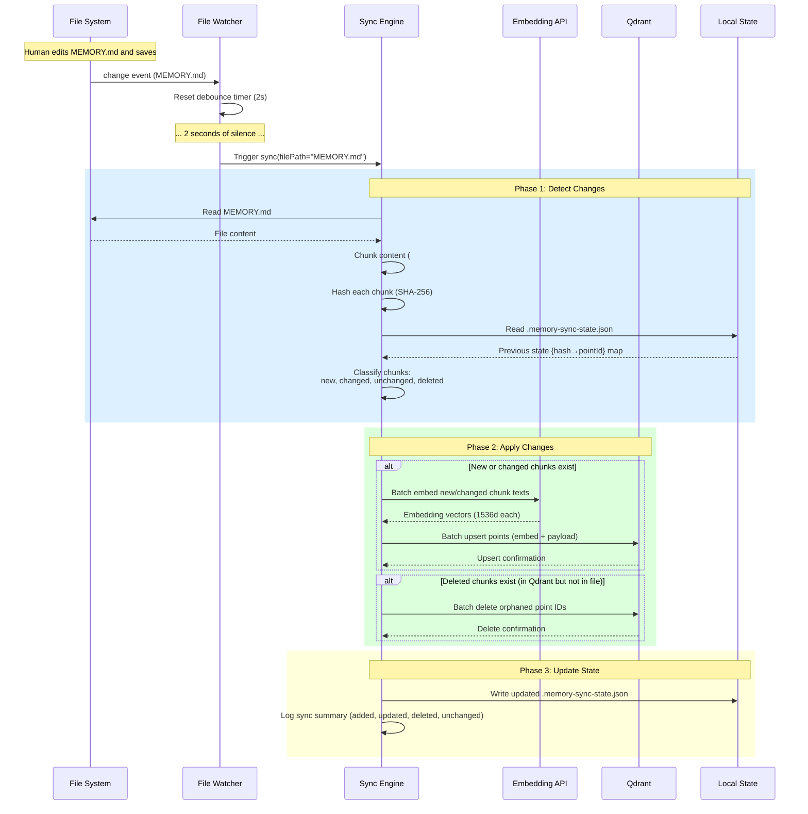
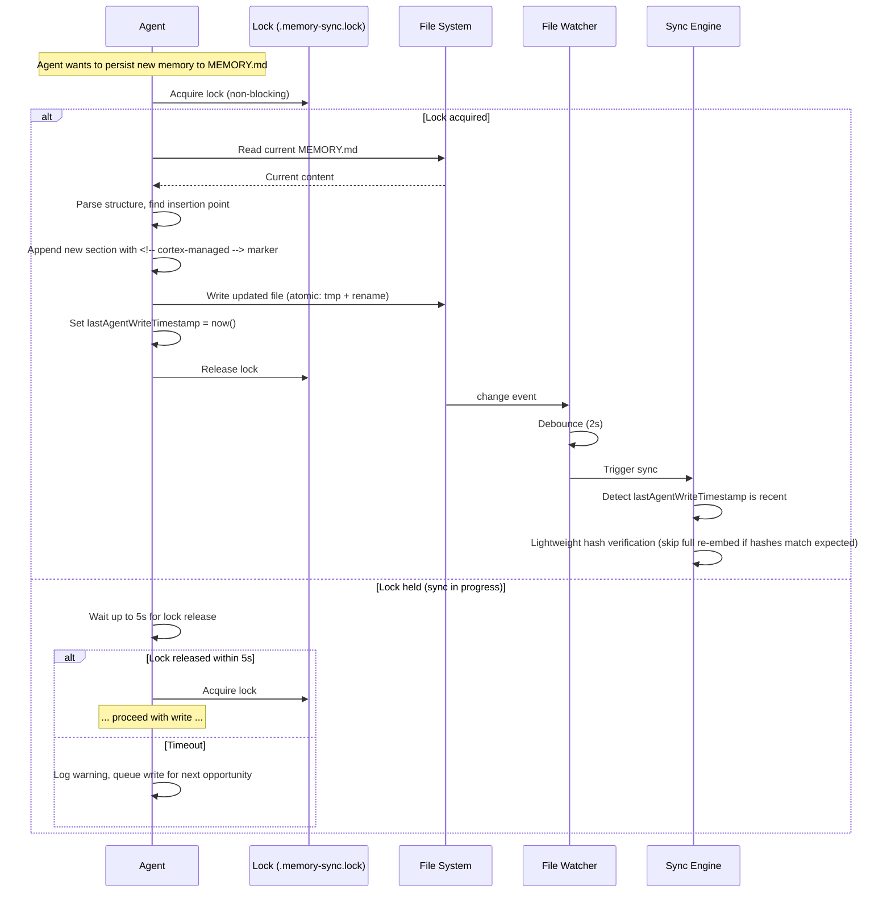
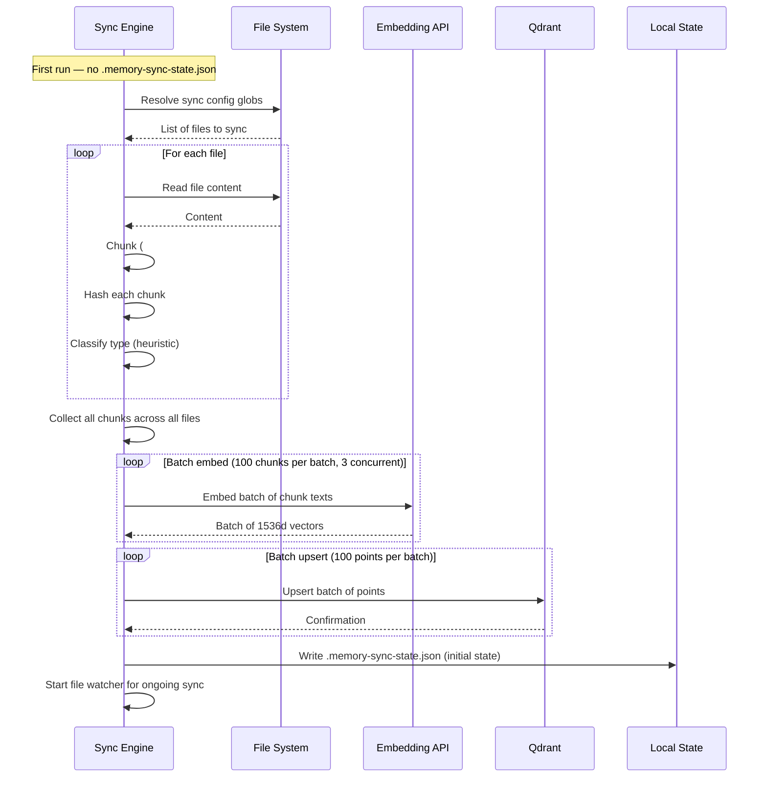

# Spike #32 — Memory Sync: Markdown Chunking & Conflict Resolution

**Status:** Proposed
**Date:** 2026-02-24
**Author:** Cortex Plane Team
**Depends on:** [Spike #29 — Qdrant Collection Schema & Decay Model](./029-qdrant-schema.md), [Spike #31 — JSONL Session Buffer & Recovery](./031-jsonl-buffer.md), [Spike #27 — Project Structure & Tooling](./027-project-structure.md)

---

## Table of Contents

1. [Context](#context)
2. [Question 1: Chunking Strategy](#question-1-chunking-strategy)
3. [Question 2: Content Hashing](#question-2-content-hashing)
4. [Question 3: Change Detection](#question-3-change-detection)
5. [Question 4: Deletion Propagation](#question-4-deletion-propagation)
6. [Question 5: Human Wins Lock](#question-5-human-wins-lock)
7. [Question 6: Conflict Resolution](#question-6-conflict-resolution)
8. [Question 7: Batch Import](#question-7-batch-import)
9. [Question 8: Which Files to Sync](#question-8-which-files-to-sync)
10. [Artifact: Sync Protocol Specification](#artifact-sync-protocol-specification)
11. [Artifact: Chunking Algorithm](#artifact-chunking-algorithm)
12. [Artifact: Conflict Resolution Decision Tree](#artifact-conflict-resolution-decision-tree)
13. [Artifact: File Watcher Configuration Spec](#artifact-file-watcher-configuration-spec)
14. [Artifact: Edge Case Catalog](#artifact-edge-case-catalog)
15. [Design Decisions](#design-decisions)
16. [Open Questions](#open-questions)

---

## Context

Spike #29 established the Qdrant collection schema and decay model for agent long-term memory. Memories are stored as individual `MemoryRecord` points with embeddings, metadata, and decay parameters. That design assumes memories are created programmatically — agents extract facts from conversation, embed them, and upsert them to Qdrant.

This spike addresses a different ingestion path: **synchronizing human-authored markdown files into Qdrant.** The primary use case is the agent's `MEMORY.md` file — a persistent, human-editable document that Claude Code (and similar agent frameworks) maintain across sessions. Humans can edit this file directly to correct, add, or remove agent knowledge. The system must detect these edits and propagate them to Qdrant so that the agent's vector memory reflects the current state of the markdown.

### Why This Matters

Without markdown sync, there are two disconnected sources of agent knowledge:

1. **Qdrant vector memory** — agent-written, searchable by embedding similarity, subject to decay and scoring (spike #29).
2. **Markdown files on disk** — human-editable, versioned in git, readable as plain text.

If a human adds a section to `MEMORY.md` saying "Always use `node:24-slim`, never Alpine," that knowledge must be searchable in Qdrant. If the human later deletes that section, the corresponding Qdrant point must be removed. Without sync, the agent's vector memory diverges from the human-curated ground truth.

### Relationship to Spike #29

Spike #29's `MemoryRecord` schema supports markdown-sourced memories. The relevant fields:

| Field | Value for markdown-sourced memories |
|---|---|
| `source` | `"markdown_sync"` (new source type, extending `MEMORY_SOURCE` from spike #29) |
| `type` | Inferred from content or section context (e.g., `fact`, `preference`, `project`) |
| `importance` | Default 0.8 — human-curated content is presumed important |
| `confidence` | 1.0 — human-written content is authoritative |
| `sessionId` | Null or a synthetic "sync session" ID |
| `agentId` | The agent whose workspace contains the markdown file |
| `userId` | The workspace owner (single-user assumption for now) |

### Relationship to Spike #31

Spike #31's JSONL session buffer is the audit log for agent execution events. Markdown sync operations are logged as events in the same buffer when they occur during an agent session, or to a dedicated sync log when triggered by file watcher events outside of a session.

### Hard Constraints

| Constraint | Implication |
|---|---|
| Spike #29: per-agent Qdrant collections | Markdown-sourced memories go into the same collection as agent-created memories |
| Spike #29: `text-embedding-3-small` (1536d) | Chunk text is embedded with the same model as conversation-derived memories |
| Spike #27: Node.js 24, TypeScript, ESM | File watching and sync logic runs in Node.js |
| Stateless control plane | The sync service runs in the agent pod, not the control plane |
| Human edits are authoritative | When a human and an agent disagree, the human's version wins |
| k3s on ARM64 + x64 | File watcher must work on both architectures (no native deps) |

---

## Question 1: Chunking Strategy

**Question:** Split on `##` headers? Paragraph-level? Configurable?

**Decision: Split on `##` headers by default. Fall back to paragraph-level for headerless content. Configurable via sync config.**

### Why Header-Based Chunking

Markdown files — especially `MEMORY.md` — are structured documents. Authors use `##` headers to organize knowledge into logical sections. Each section typically contains a cohesive unit of knowledge: a fact, a preference, a project description, or a list of related items. Splitting on `##` headers preserves this semantic structure.

Paragraph-level chunking (splitting on blank lines) would fragment coherent sections into individual paragraphs. A section like:

```markdown
## Deployment Setup

The production cluster runs k3s on ARM64 nodes.
We use node:24-slim as the Docker base image.

Deployments go through ArgoCD with auto-sync disabled.
Manual sync is required for production.
```

...should be one chunk, not four. The information is cohesive — splitting it into paragraphs would produce four embeddings where one suffices, and each paragraph would lack the context of the section header.

### Chunking Rules

| Rule | Description |
|---|---|
| Primary split | `##` headers (level 2). Each `##` section becomes one chunk. |
| Nested headers | `###` and deeper headers are included within their parent `##` chunk. They do not create separate chunks. |
| Top-level header | The `#` (level 1) header is treated as document title metadata, not as a chunk boundary. Content between `#` and the first `##` is the "preamble" chunk. |
| Preamble content | Content before the first `##` header (after any `#` title) becomes the "preamble" chunk. If empty, no chunk is created. |
| Headerless files | Files with no `##` headers are chunked at paragraph level (double newline boundaries). |
| Maximum chunk size | 4096 characters. If a `##` section exceeds this, it is split at paragraph boundaries within the section. The section header is prepended to each sub-chunk for context. |
| Minimum chunk size | 32 characters (after whitespace trimming). Shorter chunks are discarded — they lack enough content for meaningful embedding. |
| Front matter | YAML front matter (between `---` delimiters) is parsed as metadata, not as chunk content. |

### Why Not Configurable Heading Level?

We considered making the split level configurable (`#`, `##`, `###`). Rejected because:

- `#` is too coarse. Most markdown files have one `#` title. Splitting on `#` produces one giant chunk per file — useless.
- `###` is too fine. Subsections within a topic fragment the semantic unit. A section about "Deployment Setup" with `###` subsections for "Docker" and "ArgoCD" should be one search result, not two.
- `##` is the universal standard for major sections. Every markdown style guide and documentation framework uses `##` as the primary structural unit.

The split level is hardcoded to `##`. If a future use case genuinely needs a different level, it's a one-line change in the chunking function — not worth a configuration option today.

### Why 4096 Character Max?

- OpenAI's `text-embedding-3-small` handles up to 8191 tokens (~32K characters). Our 4096-character limit is well within this.
- Embedding quality degrades with very long inputs. Studies show that embedding models produce more specific (less diluted) vectors for shorter, focused texts. A 4096-character chunk is approximately 1000 tokens — a sweet spot for embedding granularity.
- 4096 characters accommodates virtually all well-written markdown sections. A section exceeding this limit is likely a dumping ground that should be split anyway.
- The limit matches the JSONL buffer's `result_summary` truncation limit (spike #31, `TOOL_RESULT` maxLength: 4096), providing consistency across the system.

---

## Question 2: Content Hashing

**Question:** SHA-256 of chunk text? Include metadata in hash?

**Decision: SHA-256 of the normalized chunk text only. Metadata is excluded from the hash.**

### Hash Construction

```
hash = SHA-256(normalize(chunkText))
```

Where `normalize` applies:
1. Trim leading/trailing whitespace.
2. Collapse multiple consecutive blank lines into a single blank line.
3. Strip trailing whitespace from each line.
4. Normalize line endings to `\n` (strip `\r`).

The hash does not include:
- The file path (a renamed file with identical content should match).
- The section header text (it's part of the chunk text already).
- Any metadata (type classification, importance, timestamps).
- The chunk's position within the file (reordering sections should not trigger re-embedding).

### Why Exclude Metadata From Hash?

The hash answers one question: **has this chunk's content changed?** Metadata changes (reclassifying a chunk from `fact` to `preference`, adjusting importance) should update the Qdrant point's payload without re-embedding. Including metadata in the hash would trigger unnecessary re-embedding when only metadata changed.

### Why Normalize Before Hashing?

Without normalization, trivially different whitespace would produce different hashes:

```markdown
## Deployment Setup
Cluster runs k3s on ARM64.
```
vs.
```markdown
## Deployment Setup

Cluster runs k3s on ARM64.

```

These are semantically identical. Normalization ensures they produce the same hash, avoiding unnecessary re-embedding.

### Hash Storage

The hash is stored in two places:

1. **Qdrant point payload** — as a new field `contentHash: string` on the `MemoryRecord`. This enables the sync process to compare the current file's chunk hashes against stored hashes without re-embedding.
2. **Local sync state file** — `.memory-sync-state.json` in the workspace root (gitignored). Maps `{filePath, chunkIndex}` → `{contentHash, pointId}` for fast comparison without querying Qdrant.

### Schema Extension

The `MemoryRecord` interface (spike #29) is extended with optional fields for markdown-sourced memories:

```typescript
export interface MemoryRecord {
  // ... existing fields from spike #29 ...

  /** SHA-256 hash of normalized chunk content. Null for non-markdown memories. */
  contentHash: string | null;
  /** Source file path relative to workspace root. Null for non-markdown memories. */
  sourceFile: string | null;
  /** Chunk index within the source file (0-based). Null for non-markdown memories. */
  chunkIndex: number | null;
  /** Section header text (e.g., "## Deployment Setup"). Null if preamble chunk. */
  sectionHeader: string | null;
}
```

These fields are nullable because the majority of `MemoryRecord` points are agent-created (from conversation), not markdown-sourced.

---

## Question 3: Change Detection

**Question:** File watcher (chokidar/fsnotify) vs polling? Debounce interval?

**Decision: File watcher using `node:fs.watch` (Node.js native recursive watcher) with a 2-second debounce. No chokidar dependency.**

### Why Not Chokidar?

Chokidar was the standard Node.js file watcher for a decade. But:

1. **Node.js 20+ has recursive `fs.watch`.** The `recursive: true` option in `fs.watch` is stable on Linux (inotify), macOS (FSEvents), and Windows (ReadDirectoryChanges). This eliminates chokidar's primary value — recursive watching without native deps.

2. **Chokidar adds a dependency.** Spike #27 established a principle of minimizing dependencies. `node:fs` is built-in; chokidar is not. For watching a handful of markdown files, the native API is sufficient.

3. **Chokidar's reliability issues.** Chokidar v3 has known issues on Linux with high inotify watch counts. We're watching a small number of files, but adding a dependency that's known to misbehave adds risk for no benefit.

### Why Not Polling?

Polling (`fs.stat` on an interval) works everywhere but:

- **Wastes CPU** on every poll cycle, even when nothing has changed. With a 2-second poll interval, that's 43,200 stat calls per day per file — for files that change perhaps a few times per day.
- **Higher latency.** Polling detects changes at most `interval` seconds late. A 2-second poll means up to 2 seconds of delay. File watchers detect changes within milliseconds.
- **Doesn't scale.** If we later expand to watching all `.md` files in a workspace (Question 8), polling N files requires N stat calls per interval. inotify handles any number of files with kernel-level efficiency.

### Debounce Strategy

Editors save files in multiple operations. Vim writes to a temp file and renames (two events). VS Code may write partial content then complete content (multiple events). Without debounce, each intermediate write triggers a sync cycle.

| Parameter | Value | Rationale |
|---|---|---|
| Debounce interval | 2000 ms | Covers multi-event save patterns from all major editors. Vim rename is <10ms. VS Code multi-write is <500ms. 2s provides comfortable margin. |
| Debounce strategy | Trailing edge | Sync fires 2s after the *last* change event. If the user makes rapid edits, only the final state is synced. |
| Restart on new event | Yes | If a new change event arrives during the debounce window, the timer resets. This prevents syncing intermediate states during continuous editing. |

### Watcher Lifecycle

The file watcher runs in the agent pod alongside the agent execution loop. It starts when the agent process starts and stops when it exits.

```
Agent pod starts
  │
  ├── Start file watcher on configured paths
  │     ├── Watch MEMORY.md (always)
  │     └── Watch additional paths from sync config
  │
  │  ┌── Change event arrives ──────────────────────────┐
  │  │                                                    │
  │  │  Reset 2s debounce timer                           │
  │  │                                                    │
  │  │  ... 2s of silence ...                             │
  │  │                                                    │
  │  │  Debounce fires → trigger sync cycle               │
  │  │    1. Read file from disk                          │
  │  │    2. Chunk the file                                │
  │  │    3. Hash each chunk                               │
  │  │    4. Compare against local sync state              │
  │  │    5. Embed changed/new chunks                      │
  │  │    6. Upsert to Qdrant                              │
  │  │    7. Delete orphaned points                        │
  │  │    8. Update local sync state                       │
  │  │                                                    │
  │  └── Wait for next change event ────────────────────┘
  │
Agent pod exits → stop watcher
```

### inotify Limit Considerations

Linux's inotify has a system-wide limit on watches (default: 8192). Each watched file consumes one watch. We're watching at most a few dozen markdown files — well within limits. If the user configures a large glob (Question 8), the watcher emits a warning if the file count exceeds 100.

---

## Question 4: Deletion Propagation

**Question:** Human removes a section from `MEMORY.md` → how does Qdrant learn?

**Decision: Full reconciliation on every sync cycle. Chunks present in Qdrant but absent from the current file are deleted from Qdrant.**

### The Reconciliation Model

Every sync cycle produces a set of chunks from the current file. This set is compared against the set of chunks in Qdrant (filtered by `sourceFile`). The difference determines the operations:

| Chunk in file? | Chunk in Qdrant? | Action |
|---|---|---|
| Yes | No | **Insert** — new chunk. Embed and upsert. |
| Yes | Yes, same hash | **No-op** — unchanged. Skip. |
| Yes | Yes, different hash | **Update** — content changed. Re-embed and upsert. |
| No | Yes | **Delete** — section removed by human. Delete from Qdrant. |

This is a set reconciliation, not an event-driven model. The sync process doesn't need to know *how* a section was removed (user deleted it, git revert, editor undo). It only observes the current state and the stored state, and reconciles the difference.

### Why Full Reconciliation, Not Event-Driven Deletion?

Event-driven deletion would require tracking "section X was present in the previous version but is absent in the current version." This requires either:

- **Diffing** the old and new file versions — complex, error-prone with rename detection.
- **Tracking file versions** — maintaining a history of file states, which is git's job, not ours.

Full reconciliation is simpler and more robust: read the file, chunk it, compare chunk hashes against stored hashes, act on the differences. It handles all edit patterns — deletions, insertions, rewrites, reorderings — with one algorithm.

### Deletion Mechanics

When a chunk's hash is present in Qdrant (via the `contentHash` payload field) but absent from the current file's chunks:

1. **Delete the Qdrant point.** Hard delete, not soft-deprecation via `supersededById`. The human intentionally removed the content — there's no "previous version" to preserve.
2. **Remove from local sync state.** Delete the entry from `.memory-sync-state.json`.
3. **Log the deletion.** Emit a structured log event (`memory_sync_delete`) with the file path, section header, and point ID.

### Why Hard Delete, Not Supersession?

Spike #29's supersession chain (`supersedesId` / `supersededById`) is designed for *evolved* knowledge — "the cluster has 5 nodes now, not 3." When a human deletes a section from `MEMORY.md`, they're not evolving the knowledge — they're saying "this is no longer true" or "this doesn't belong here." Hard deletion is the correct semantic.

If the deletion was a mistake, git history preserves the content. The human can re-add the section, and the next sync cycle will re-create the Qdrant point.

### File Deletion

If an entire watched file is deleted (not just a section within it):

1. All Qdrant points with `sourceFile` matching the deleted file are deleted.
2. All entries in `.memory-sync-state.json` for that file are removed.
3. The file watcher stops watching the deleted file.
4. A `memory_sync_file_deleted` log event is emitted.

---

## Question 5: Human Wins Lock

**Question:** How do we detect concurrent human + agent writes?

**Decision: Advisory lock via filesystem lockfile (`.memory-sync.lock`). The agent acquires the lock before writing to any synced markdown file. If the lock is held, the agent queues the write and retries after the lock is released. Humans are never blocked — the lock is advisory and only applies to the agent process.**

### The Concurrency Problem

Two writers can modify `MEMORY.md` simultaneously:

1. **The agent** — appending new memories at the end of a session, updating existing sections with new information.
2. **The human** — editing the file in their editor (Vim, VS Code, etc.).

If the agent writes to the file while the human is editing, the human's editor may see a conflict (VS Code shows "file changed on disk") or silently overwrite the agent's changes on next save (Vim's default behavior). Both outcomes are bad.

### The Lock Protocol

The lock is a simple filesystem lockfile. The agent acquires it before any write to a synced markdown file and releases it after the write completes. The lock is advisory — it only coordinates between the agent process and the sync process within the same pod.

```
Agent wants to write to MEMORY.md
  │
  ├── Attempt to acquire .memory-sync.lock (exclusive, non-blocking)
  │     │
  │     ├── Lock acquired → write to file → release lock → trigger sync
  │     │
  │     └── Lock not acquired (sync in progress) →
  │           Wait for lock release (max 5s) → retry
  │           If timeout → log warning, skip write, queue for next opportunity
  │
Human edits MEMORY.md
  │
  ├── File watcher detects change
  ├── Debounce (2s)
  ├── Acquire .memory-sync.lock
  ├── Read file, chunk, hash, reconcile with Qdrant
  ├── Release .memory-sync.lock
```

### Detecting Human vs Agent Writes

The sync process needs to distinguish "the file changed because the agent wrote to it" from "the file changed because the human edited it." This matters because agent writes should not trigger a full re-sync (the agent already knows what it wrote), while human writes must trigger reconciliation.

Detection mechanism:

1. **Write marker.** When the agent writes to a markdown file, it sets a transient flag in memory: `lastAgentWriteTimestamp`. The flag records the timestamp of the write.
2. **Change event arrives.** The debounce fires and the sync cycle begins.
3. **Compare timestamps.** If `lastAgentWriteTimestamp` is within 3 seconds of the change event, the change is agent-originated. The sync process performs a lightweight verification (hash check) but skips re-embedding.
4. **Otherwise,** the change is human-originated. Full reconciliation runs.

This is a heuristic, not a guarantee. If a human edits the file within 3 seconds of an agent write, the human's edit is incorrectly classified as agent-originated. The hash comparison in step 3 catches this: if the file content doesn't match what the agent wrote, the sync process runs full reconciliation anyway.

### Why Not File Locking (flock/fcntl)?

POSIX file locks (`flock`, `fcntl`) are process-level primitives that lock the data file itself. Problems:

1. **Editors don't respect locks.** Vim, VS Code, and other editors don't check for `flock` before writing. A lock on `MEMORY.md` wouldn't prevent the human from editing.
2. **Cross-process coordination requires shared convention.** Both the agent and the editor would need to agree on the locking protocol. This is impractical for arbitrary editors.
3. **Stale locks on crash.** If the agent crashes while holding a `flock`, the lock is released by the kernel (process exit), but `fcntl` locks may persist depending on the OS.

The advisory lockfile (`.memory-sync.lock`) coordinates only between the agent process and the sync goroutine within the same process. It's not intended to coordinate with external editors — the human always wins because the sync process reconciles the file's current state after the human's edit, not before.

### "Human Wins" Semantics

The name "Human Wins" is deliberate. When a conflict is detected between the human's file content and the agent's intended write:

1. The file on disk reflects the human's version.
2. Qdrant is synced to match the file on disk.
3. The agent's intended write is discarded.
4. A structured log event records the conflict for audit.

The agent can re-attempt the write in a future session if the information is still relevant. But it never overwrites human edits — the human is the authority over their own files.

---

## Question 6: Conflict Resolution

**Question:** Last-write-wins, or merge? What about semantic conflicts?

**Decision: File-level, human-wins. No automatic merging. No semantic conflict detection in v1.**

### Why Not Merge?

Automatic merging (three-way merge of agent's version, human's version, and common ancestor) is complex, error-prone, and unnecessary:

1. **No common ancestor.** The sync process doesn't maintain a version history of the file. Git does, but integrating git merge logic adds significant complexity.
2. **Merge conflicts in markdown.** If the agent adds a paragraph to a section and the human edits the same section, a three-way merge might produce a syntactically valid but semantically incoherent result.
3. **The human's intent is unknowable.** When a human deletes a section, they might mean "this is wrong," "this is no longer relevant," or "I'm reorganizing." A merge algorithm can't distinguish these intents.

### Why Not Last-Write-Wins?

Last-write-wins sounds simple but creates a frustrating UX:

1. Human edits file, saves.
2. Agent finishes a session, writes new memories to file.
3. Agent's write clobbers the human's edit (or vice versa).

The "last writer" depends on timing — a race condition that's invisible to both parties. This is worse than "human wins" because the outcome is unpredictable.

### Conflict Resolution Protocol

```
Sync cycle begins (file changed on disk)
  │
  ├── Read file from disk (human's version)
  ├── Chunk and hash
  ├── Compare against local sync state
  │
  ├── For each chunk:
  │     │
  │     ├── New chunk (no matching hash in state) →
  │     │     Embed and upsert to Qdrant
  │     │
  │     ├── Changed chunk (hash differs from state) →
  │     │     Re-embed and upsert to Qdrant
  │     │     The human's version replaces whatever was in Qdrant
  │     │
  │     └── Unchanged chunk (hash matches state) →
  │           No-op
  │
  ├── For each orphaned point (in Qdrant but not in file) →
  │     Delete from Qdrant
  │
  └── Update local sync state
```

There is no "conflict" in this model — the file on disk is always authoritative. The sync process is unidirectional: file → Qdrant. The agent writes to the file (updating it), and then the sync process reads the file and updates Qdrant. At no point does the sync process write to the file.

### Semantic Conflict Detection (Deferred)

Semantic conflicts occur when a markdown chunk contradicts an agent-created memory in Qdrant. For example:

- `MEMORY.md` says: "User prefers Terraform."
- Agent-created memory (from conversation) says: "User prefers Pulumi."

In v1, this is not detected or resolved. Both memories coexist in Qdrant with different `source` values (`markdown_sync` vs `conversation`). The scoring function (spike #29) will surface whichever memory is more relevant, recent, and frequently accessed.

A future spike could add semantic deduplication: after upserting a markdown-sourced memory, query Qdrant for high-similarity existing memories from other sources, and flag conflicts for human review. This requires careful design to avoid false positives (two memories about similar but not contradictory topics) and is deferred.

### Agent Write Protocol

When the agent wants to write new knowledge to `MEMORY.md`:

1. Acquire `.memory-sync.lock`.
2. Read the current file from disk.
3. Parse the file structure (headers, sections).
4. Append new content at the end, or update an existing section if the agent identifies one by header match.
5. Write the updated file atomically (write to temp file, rename).
6. Release `.memory-sync.lock`.
7. The file watcher detects the change and triggers a sync cycle.

The agent never deletes human-written sections. It only appends or updates sections it previously created (identified by a `<!-- cortex-managed -->` HTML comment marker).

---

## Question 7: Batch Import

**Question:** How to seed Qdrant from existing markdown files on first run?

**Decision: Batch import is the same code path as ongoing sync, with an empty initial state. On first run, all chunks are "new" and are embedded and upserted in batches.**

### First Run Behavior

When the sync process starts and `.memory-sync-state.json` does not exist (or is empty):

1. Discover all files matching the sync config (Question 8).
2. For each file: chunk, hash, embed all chunks.
3. Batch upsert all points to Qdrant.
4. Create `.memory-sync-state.json` with the initial state.

This is identical to the ongoing sync cycle, except that the "compare against local sync state" step finds no existing state, so every chunk is classified as "new."

### Batch Embedding

OpenAI's embeddings API supports batch requests (multiple texts in one call). On first run with many chunks, we batch embed rather than making one API call per chunk:

```typescript
interface BatchEmbedConfig {
  /** Maximum texts per embedding API call. OpenAI limit: 2048. */
  batchSize: number;
  /** Maximum concurrent embedding API calls. */
  concurrency: number;
  /** Delay between batches to respect rate limits. */
  batchDelayMs: number;
}

const DEFAULT_BATCH_EMBED_CONFIG: BatchEmbedConfig = {
  batchSize: 100,
  concurrency: 3,
  batchDelayMs: 200,
};
```

### Batch Upsert

Qdrant supports batch upsert (multiple points in one request). After embedding, chunks are upserted in batches of 100 points per request.

### Import Sequence

```
First run detected (no .memory-sync-state.json)
  │
  ├── Discover files: resolve sync config globs
  │     └── Default: ["MEMORY.md"] in workspace root
  │
  ├── For each file:
  │     ├── Read file content
  │     ├── Chunk (## headers, paragraph fallback)
  │     ├── Hash each chunk
  │     ├── Classify type for each chunk (heuristic or default to "fact")
  │     └── Collect all chunks
  │
  ├── Batch embed all chunks
  │     ├── Split into batches of 100
  │     ├── Embed batches (3 concurrent, 200ms delay between)
  │     └── Collect embeddings
  │
  ├── Batch upsert to Qdrant
  │     ├── Construct MemoryRecord payload for each chunk
  │     ├── Upsert in batches of 100 points
  │     └── Log results
  │
  ├── Write .memory-sync-state.json
  │
  └── Start file watcher for ongoing sync
```

### Idempotency

The batch import is idempotent. If the process crashes mid-import and restarts:

1. `.memory-sync-state.json` was not written (crash before final step).
2. The import restarts from scratch.
3. Points already in Qdrant (from the partial first run) are overwritten by the upsert — not duplicated.
4. Idempotency is guaranteed by using deterministic point IDs derived from `{agentId, sourceFile, chunkIndex}`.

### Deterministic Point IDs

For markdown-sourced memories, the Qdrant point ID is a UUIDv5 (name-based, deterministic) derived from:

```
pointId = UUIDv5(namespace=MEMORY_SYNC_NS, name="{agentId}:{sourceFile}:{chunkIndex}")
```

This ensures that the same chunk in the same file always maps to the same point ID. Re-importing produces upserts (updates), not duplicates.

---

## Question 8: Which Files to Sync

**Question:** MEMORY.md only? All workspace `.md` files? Configurable glob?

**Decision: `MEMORY.md` only by default. Configurable via `sync.include` glob list in agent config. Explicit exclude list to prevent syncing large or irrelevant files.**

### Default: MEMORY.md Only

The primary use case is Claude Code's `MEMORY.md` — a small, focused file that the agent and human co-maintain. Syncing all `.md` files in a workspace would ingest READMEs, changelogs, documentation, and other files that are not memory-relevant and would pollute the vector store with noise.

### Configuration Schema

```typescript
interface MemorySyncConfig {
  /** Glob patterns for files to sync. Relative to workspace root. */
  include: string[];
  /** Glob patterns to exclude. Checked after include. */
  exclude: string[];
  /** Whether sync is enabled at all. Default: true. */
  enabled: boolean;
  /** Debounce interval in ms. Default: 2000. */
  debounceMs: number;
  /** Batch embedding config. */
  batchEmbed: BatchEmbedConfig;
}

const DEFAULT_MEMORY_SYNC_CONFIG: MemorySyncConfig = {
  include: ["MEMORY.md"],
  exclude: [
    "node_modules/**",
    ".git/**",
    "dist/**",
    "**/CHANGELOG.md",
    "**/LICENSE.md",
  ],
  enabled: true,
  debounceMs: 2000,
  batchEmbed: DEFAULT_BATCH_EMBED_CONFIG,
};
```

### Example Configurations

**Minimal (default):**

```json
{
  "sync": {
    "include": ["MEMORY.md"]
  }
}
```

**Project documentation:**

```json
{
  "sync": {
    "include": ["MEMORY.md", "docs/**/*.md"],
    "exclude": ["docs/archive/**"]
  }
}
```

**All markdown in workspace:**

```json
{
  "sync": {
    "include": ["**/*.md"],
    "exclude": ["node_modules/**", ".git/**", "CHANGELOG.md"]
  }
}
```

### Safety Limits

| Limit | Value | Rationale |
|---|---|---|
| Maximum files | 50 | Prevents accidentally syncing thousands of markdown files. Emits warning at 50, hard-fails at 200. |
| Maximum total size | 5 MB (sum of all synced files) | Prevents embedding cost explosion. A 5 MB corpus at ~$0.02/1M tokens costs ~$0.05 to embed — acceptable for initial import. |
| Maximum chunk count | 500 | Prevents Qdrant collection pollution. 500 markdown-sourced memories is generous for any workspace. |

When a limit is exceeded, the sync process logs a warning and truncates to the limit (syncing the first N files by alphabetical order). The user is informed via the agent's next conversation turn.

---

## Artifact: Sync Protocol Specification

### Sync Cycle Sequence Diagram



### Agent Write Sequence Diagram



### Batch Import Sequence Diagram



---

## Artifact: Chunking Algorithm

### Pseudocode

```
function chunkMarkdownFile(content: string, filePath: string): Chunk[]
  // Step 1: Extract front matter (if any)
  frontMatter, body = extractFrontMatter(content)

  // Step 2: Find the document title (# header)
  title = extractH1Title(body)

  // Step 3: Split on ## headers
  sections = splitOnH2Headers(body)
  // sections is an array of { header: string | null, body: string }
  // The first element may have header=null (preamble before first ##)

  chunks = []

  for each section in sections:
    // Step 4: Normalize the section text
    text = normalize(section.header + "\n" + section.body)
    // Include the ## header in the chunk text for embedding context

    // Step 5: Skip empty/tiny sections
    if trimmedLength(text) < MIN_CHUNK_SIZE (32 chars):
      continue

    // Step 6: Handle oversized sections
    if length(text) > MAX_CHUNK_SIZE (4096 chars):
      subChunks = splitAtParagraphBoundaries(text, MAX_CHUNK_SIZE)
      for each subChunk in subChunks:
        // Prepend section header to sub-chunks for context
        if subChunk does not start with section.header:
          subChunk = section.header + "\n\n" + subChunk
        chunks.append(Chunk {
          text: subChunk,
          header: section.header,
          index: chunks.length,
          filePath: filePath,
        })
    else:
      chunks.append(Chunk {
        text: text,
        header: section.header,
        index: chunks.length,
        filePath: filePath,
      })

  // Step 7: Fallback — if no ## headers were found, chunk at paragraphs
  if sections has only one element and sections[0].header is null:
    chunks = splitAtParagraphBoundaries(body, MAX_CHUNK_SIZE)
      .filter(c => trimmedLength(c) >= MIN_CHUNK_SIZE)
      .map((text, index) => Chunk {
        text: normalize(text),
        header: null,
        index: index,
        filePath: filePath,
      })

  return chunks


function splitOnH2Headers(text: string): Section[]
  // Split using regex: /^## /m
  // Each match starts a new section
  // Text before the first match is the preamble (header=null)
  sections = []
  currentHeader = null
  currentBody = []

  for each line in text.split("\n"):
    if line matches /^## /:
      // Flush previous section
      if currentBody is not empty or currentHeader is not null:
        sections.append({ header: currentHeader, body: join(currentBody, "\n") })
      currentHeader = line
      currentBody = []
    else:
      currentBody.append(line)

  // Flush final section
  if currentBody is not empty or currentHeader is not null:
    sections.append({ header: currentHeader, body: join(currentBody, "\n") })

  return sections


function splitAtParagraphBoundaries(text: string, maxSize: number): string[]
  // Split on double newlines (paragraph boundaries)
  paragraphs = text.split(/\n\n+/)
  chunks = []
  currentChunk = ""

  for each paragraph in paragraphs:
    if length(currentChunk + "\n\n" + paragraph) > maxSize:
      if currentChunk is not empty:
        chunks.append(currentChunk)
      currentChunk = paragraph
    else:
      if currentChunk is empty:
        currentChunk = paragraph
      else:
        currentChunk = currentChunk + "\n\n" + paragraph

  if currentChunk is not empty:
    chunks.append(currentChunk)

  return chunks


function normalize(text: string): string
  return text
    .replace(/\r\n/g, "\n")         // Normalize line endings
    .replace(/[ \t]+$/gm, "")        // Strip trailing whitespace per line
    .replace(/\n{3,}/g, "\n\n")      // Collapse multiple blank lines
    .trim()                           // Trim leading/trailing whitespace
```

### Chunk Data Structure

```typescript
interface Chunk {
  /** Normalized chunk text (what gets embedded and stored as MemoryRecord.content). */
  text: string;
  /** Section header (e.g., "## Deployment Setup"). Null for preamble or headerless files. */
  header: string | null;
  /** 0-based index of this chunk within the file. */
  index: number;
  /** File path relative to workspace root. */
  filePath: string;
  /** SHA-256 of normalize(text). Computed after chunking. */
  contentHash?: string;
}
```

### Type Classification Heuristic

Each chunk needs a `MemoryType` (spike #29). For markdown-sourced chunks, the type is inferred from content heuristics:

```typescript
function classifyChunkType(chunk: Chunk): MemoryType {
  const text = chunk.text.toLowerCase();
  const header = (chunk.header ?? "").toLowerCase();

  // Check header keywords first
  if (/prefer|style|convention|always|never/.test(header)) return "preference";
  if (/project|repo|stack|deploy/.test(header)) return "project";
  if (/decision|chose|decided|rationale/.test(header)) return "decision";
  if (/correct|mistake|wrong|fix/.test(header)) return "correction";
  if (/task|todo|done|completed/.test(header)) return "task";

  // Check body keywords
  if (/prefers?\b|always use|never use|convention/.test(text)) return "preference";
  if (/deployed|repository|sprint|deadline/.test(text)) return "project";
  if (/decided|chose|because|rationale|trade-?off/.test(text)) return "decision";
  if (/was wrong|corrected|mistake|actually/.test(text)) return "correction";

  // Default
  return "fact";
}
```

This is a best-effort heuristic. Misclassification affects decay half-life but not retrieval correctness (similarity search finds the memory regardless of type). The human can override by adding a type hint comment in the markdown: `<!-- type: preference -->`.

---

## Artifact: Conflict Resolution Decision Tree

```
File change detected → debounce → sync cycle starts
  │
  ├── Is the file readable?
  │     │
  │     ├── No → Log error. Skip this file. Retain existing Qdrant points.
  │     │         (File might be mid-save. Retry on next change event.)
  │     │
  │     └── Yes → Continue.
  │
  ├── Is .memory-sync.lock held?
  │     │
  │     ├── Yes → Agent is writing. Wait up to 5s for release.
  │     │         │
  │     │         ├── Released within 5s → Acquire lock, continue.
  │     │         └── Timeout → Log warning. Skip sync cycle.
  │     │                       (Next change event will trigger retry.)
  │     │
  │     └── No → Acquire lock, continue.
  │
  ├── Was this change agent-originated?
  │     │
  │     ├── Yes (lastAgentWriteTimestamp within 3s) →
  │     │     Lightweight sync: hash-compare only.
  │     │     If hashes match expected state → no-op (agent wrote what it intended).
  │     │     If hashes don't match → full reconciliation (human edited during window).
  │     │
  │     └── No (human edit) → Full reconciliation.
  │
  ├── Full reconciliation:
  │     │
  │     ├── Chunk current file content.
  │     ├── Hash each chunk.
  │     ├── Load previous state from .memory-sync-state.json.
  │     │
  │     ├── For each chunk in current file:
  │     │     │
  │     │     ├── Hash matches state → UNCHANGED. Skip.
  │     │     │
  │     │     ├── Hash not in state (new chunk) → NEW.
  │     │     │     Embed and upsert to Qdrant.
  │     │     │
  │     │     └── Hash differs from state (same index, different hash) → CHANGED.
  │     │           Re-embed and upsert to Qdrant.
  │     │           The file's version (human's version) wins unconditionally.
  │     │
  │     ├── For each entry in state not present in current file → DELETED.
  │     │     Delete point from Qdrant.
  │     │     The human removed this section. Qdrant follows.
  │     │
  │     └── Update .memory-sync-state.json.
  │
  ├── Semantic conflict check (v1: DEFERRED):
  │     │
  │     └── After upsert, query Qdrant for high-similarity memories
  │           from other sources. If found, log potential conflict.
  │           Do NOT auto-resolve. Human reviews in future version.
  │
  └── Release .memory-sync.lock.
```

### Conflict Scenarios and Outcomes

| Scenario | Outcome | Rationale |
|---|---|---|
| Human adds new section | New chunk embedded and upserted | Normal operation |
| Human edits existing section | Chunk re-embedded, old Qdrant point updated | Human's version is authoritative |
| Human deletes section | Qdrant point deleted | Human decided this knowledge is no longer valid |
| Human reorders sections | Chunk indices change, hashes unchanged | No re-embedding (content unchanged). State file updated with new indices. |
| Human renames section header | Hash changes (header is part of chunk text) | Re-embedded as content changed |
| Agent writes, then human edits before sync | Human's final version wins | Sync reads current file state, not intermediate states |
| Agent and human edit simultaneously | Human's save wins (file on disk) | Agent's write is either before or after human's. The last save to disk is what sync reads. |
| File deleted then recreated | All points deleted, then re-created on next sync | Sync sees deletion first, then new file on next event |

---

## Artifact: File Watcher Configuration Spec

### Configuration Interface

```typescript
interface FileWatcherConfig {
  /** Glob patterns for files to watch. Resolved relative to workspace root. */
  include: string[];
  /** Glob patterns to exclude from watching. */
  exclude: string[];
  /** Debounce interval in milliseconds. Default: 2000. */
  debounceMs: number;
  /** Whether to use native fs.watch (true) or polling fallback (false). */
  useNativeWatcher: boolean;
  /** Polling interval in ms (only used if useNativeWatcher is false). Default: 5000. */
  pollIntervalMs: number;
  /** Maximum number of files to watch. Exceeding this emits a warning. */
  maxWatchedFiles: number;
}

const DEFAULT_FILE_WATCHER_CONFIG: FileWatcherConfig = {
  include: ["MEMORY.md"],
  exclude: [
    "node_modules/**",
    ".git/**",
    "dist/**",
    ".memory-sync-state.json",
    ".memory-sync.lock",
  ],
  debounceMs: 2000,
  useNativeWatcher: true,
  pollIntervalMs: 5000,
  maxWatchedFiles: 50,
};
```

### Watcher Implementation

```typescript
import { watch, type FSWatcher } from "node:fs";
import { stat } from "node:fs/promises";
import { resolve, relative } from "node:path";
import type { Logger } from "pino";

interface WatcherEvents {
  onFileChanged: (filePath: string) => void;
  onFileDeleted: (filePath: string) => void;
  onError: (error: Error) => void;
}

interface ManagedWatcher {
  /** Start watching. Resolves when the watcher is active. */
  start(): Promise<void>;
  /** Stop watching and clean up resources. */
  stop(): void;
  /** List of currently watched file paths. */
  watchedFiles(): string[];
}

function createFileWatcher(
  workspaceRoot: string,
  config: FileWatcherConfig,
  events: WatcherEvents,
  logger: Logger,
): ManagedWatcher {
  const watchers: FSWatcher[] = [];
  const debounceTimers = new Map<string, NodeJS.Timeout>();

  function handleChange(eventType: string, filePath: string): void {
    // Clear existing debounce timer for this file
    const existing = debounceTimers.get(filePath);
    if (existing) clearTimeout(existing);

    // Set new debounce timer
    debounceTimers.set(
      filePath,
      setTimeout(async () => {
        debounceTimers.delete(filePath);
        try {
          await stat(resolve(workspaceRoot, filePath));
          // File exists — it was created or modified
          events.onFileChanged(filePath);
        } catch {
          // File doesn't exist — it was deleted
          events.onFileDeleted(filePath);
        }
      }, config.debounceMs),
    );
  }

  return {
    async start(): Promise<void> {
      // Resolve include globs to actual file paths
      // (implementation uses glob library or fs.readdir)
      const files = await resolveGlobs(
        workspaceRoot,
        config.include,
        config.exclude,
      );

      if (files.length > config.maxWatchedFiles) {
        logger.warn(
          { fileCount: files.length, max: config.maxWatchedFiles },
          "File count exceeds maximum — watching first %d files only",
          config.maxWatchedFiles,
        );
      }

      const filesToWatch = files.slice(0, config.maxWatchedFiles);

      for (const file of filesToWatch) {
        const absPath = resolve(workspaceRoot, file);
        try {
          const watcher = watch(absPath, (eventType) => {
            handleChange(eventType, file);
          });
          watcher.on("error", events.onError);
          watchers.push(watcher);
        } catch (err) {
          logger.warn({ file, err }, "Failed to watch file");
        }
      }

      logger.info(
        { fileCount: filesToWatch.length },
        "File watcher started for memory sync",
      );
    },

    stop(): void {
      for (const watcher of watchers) {
        watcher.close();
      }
      watchers.length = 0;
      for (const timer of debounceTimers.values()) {
        clearTimeout(timer);
      }
      debounceTimers.clear();
      logger.info("File watcher stopped");
    },

    watchedFiles(): string[] {
      return []; // Implementation tracks watched paths
    },
  };
}
```

### Polling Fallback

If `useNativeWatcher` is set to `false` (e.g., on network filesystems where inotify doesn't work), the watcher falls back to polling:

```typescript
function createPollingWatcher(
  workspaceRoot: string,
  config: FileWatcherConfig,
  events: WatcherEvents,
  logger: Logger,
): ManagedWatcher {
  const mtimes = new Map<string, number>();
  let interval: NodeJS.Timeout | null = null;

  return {
    async start(): Promise<void> {
      const files = await resolveGlobs(
        workspaceRoot,
        config.include,
        config.exclude,
      );

      // Initialize mtime map
      for (const file of files) {
        try {
          const s = await stat(resolve(workspaceRoot, file));
          mtimes.set(file, s.mtimeMs);
        } catch {
          // File doesn't exist yet — will be detected on next poll
        }
      }

      interval = setInterval(async () => {
        for (const file of files) {
          try {
            const s = await stat(resolve(workspaceRoot, file));
            const prevMtime = mtimes.get(file);
            if (prevMtime === undefined || s.mtimeMs !== prevMtime) {
              mtimes.set(file, s.mtimeMs);
              events.onFileChanged(file);
            }
          } catch {
            if (mtimes.has(file)) {
              mtimes.delete(file);
              events.onFileDeleted(file);
            }
          }
        }
      }, config.pollIntervalMs);

      logger.info(
        { fileCount: files.length, pollInterval: config.pollIntervalMs },
        "Polling file watcher started for memory sync",
      );
    },

    stop(): void {
      if (interval) clearInterval(interval);
      mtimes.clear();
    },

    watchedFiles(): string[] {
      return Array.from(mtimes.keys());
    },
  };
}
```

---

## Artifact: Edge Case Catalog

### 1. Large Files

| Scenario | Behavior | Mitigation |
|---|---|---|
| Single markdown file >1 MB | Chunks normally but may produce many chunks | Safety limit: max 500 chunks. File >1 MB triggers a warning. |
| Single section >4096 chars | Split at paragraph boundaries within section | Header prepended to each sub-chunk for context. |
| Total synced content >5 MB | Sync process truncates at file limit (50 files) | Warning emitted. User should narrow the include glob. |
| Binary file matching glob | `chunkMarkdownFile` produces garbage chunks | Pre-check: skip files where >10% of bytes are non-UTF-8. Log warning. |

### 2. Rapid Edits

| Scenario | Behavior | Mitigation |
|---|---|---|
| User saves 10 times in 5 seconds | Debounce collapses to one sync cycle (fires 2s after last save) | Only the final file state is synced. |
| User saves, sync starts, user saves again during sync | Second save triggers new debounce. Sync-in-progress completes with slightly stale data. Next sync cycle picks up the latest version. | No corruption — sync reads file at start and doesn't re-read mid-cycle. |
| Editor creates temp file, renames | Watcher sees two events (temp file create + rename). Debounce collapses them. | Exclude common temp file patterns: `*.swp`, `*~`, `.#*`. |
| Git checkout changes file | Watcher fires for each changed file. Debounce per-file. | Multiple sync cycles may fire, each processing one file. Rate limit embedding API calls. |

### 3. Network Partitions

| Scenario | Behavior | Mitigation |
|---|---|---|
| Qdrant unreachable during sync | Upsert/delete fails. Sync cycle errors out. | Retry with exponential backoff: 1s, 2s, 4s, max 30s. After 5 retries, skip sync cycle and retry on next file change. |
| Embedding API unreachable | Embed call fails. Sync cycle errors out. | Same retry policy. Un-embedded chunks are tracked in state as "pending" and retried on next cycle. |
| Qdrant unreachable during deletion | Delete fails. Orphaned points remain. | Deletion is retried on next sync cycle. Orphaned points are harmless (they'll be filtered out eventually by the next successful sync). |
| Partial upsert (some points succeed, some fail) | State file is not updated for failed points. | Next sync cycle detects the failed points as "changed" (hash mismatch) and retries. |

### 4. Concurrent Access

| Scenario | Behavior | Mitigation |
|---|---|---|
| Agent writes while sync reads | Lock prevents overlap. Agent waits for sync to release lock. | 5-second timeout on lock acquisition. If exceeded, agent queues write. |
| Two agent sessions write simultaneously | Only one pod runs per agent (Graphile Worker job uniqueness). | Architecture prevents this case. |
| Human edits file, agent also edits | Agent's write goes to disk first (lock acquired), then human's editor shows "file changed on disk" prompt. | Human decides: reload (accepting agent's edit) or overwrite (human wins on next sync). |
| File watcher missed an event (inotify overflow) | File change is not detected until next event or process restart. | On startup, sync process runs a full reconciliation regardless of watcher state. This catches any missed events. |

### 5. State Corruption

| Scenario | Behavior | Mitigation |
|---|---|---|
| `.memory-sync-state.json` is corrupted or missing | Treated as first run. Full re-import. | Idempotent point IDs (UUIDv5) ensure re-import produces upserts, not duplicates. |
| `.memory-sync-state.json` is out of sync with Qdrant | State says chunk X exists, but Qdrant doesn't have it. | On upsert, Qdrant creates the point. On delete, Qdrant returns success even if point doesn't exist. Self-healing. |
| Qdrant has points not in state file | Orphaned points from a previous sync engine version or manual insertion. | Periodic full reconciliation (daily cron) compares Qdrant points with `source="markdown_sync"` against current file state. Orphans are deleted. |

### 6. File System Edge Cases

| Scenario | Behavior | Mitigation |
|---|---|---|
| Symlinked MEMORY.md | `fs.watch` follows symlinks on most platforms. | Watch the symlink target, not the link itself. Resolve with `fs.realpath` before watching. |
| File on NFS/network mount | inotify doesn't work on NFS. | Detect network mount and auto-switch to polling fallback. |
| File permissions change (read-only) | Read succeeds, but agent can't write. | Agent write fails gracefully. Sync (read-only) continues normally. |
| File moved/renamed | Watcher sees deletion of old path. | Treats as deletion (old points removed). When file appears at new path (if included in glob), treats as new file. |
| Encoding issues (non-UTF-8 file) | `JSON.stringify` of chunk text fails or produces garbage. | Pre-check: read file with `{ encoding: "utf-8" }` and validate. Skip files that produce replacement characters (U+FFFD) in >1% of content. |

### 7. Embedding API Edge Cases

| Scenario | Behavior | Mitigation |
|---|---|---|
| Rate limit (429) | Embedding API returns 429 with Retry-After header. | Respect Retry-After. Back off and retry. |
| Embedding returns different dimensions | Qdrant rejects the upsert (dimension mismatch). | Validate embedding dimension matches collection config (1536) before upsert. If mismatch, log error and skip. |
| Empty chunk text after normalization | Embedding API may return zero vector or error. | Skip chunks with empty text (MIN_CHUNK_SIZE filter catches this). |
| Identical chunks across files | Same text produces same embedding. Two points in Qdrant (different point IDs due to different `sourceFile`). | Acceptable. Semantic deduplication is deferred. |

---

## Design Decisions

### 1. Unidirectional Sync (File → Qdrant)

**Decision:** The sync process reads markdown files and writes to Qdrant. It never writes to markdown files. The agent writes to markdown files independently, and the sync process picks up those changes.

**Rationale:** Bidirectional sync (Qdrant ↔ file) would require conflict resolution for simultaneous edits to the same logical entity in different systems. This is the same problem that plagues tools like Dropbox and Evernote. By making the file authoritative and the sync unidirectional, we eliminate an entire class of conflicts. Qdrant is a derived view of the file's content, not an independent data source.

### 2. Local Sync State File, Not Database

**Decision:** Sync state (chunk hashes, point IDs) is stored in a local JSON file (`.memory-sync-state.json`), not in PostgreSQL.

**Rationale:**
- The sync process runs in the agent pod, which may not have PostgreSQL access (future architecture where agents run in isolated pods).
- The state file is small (<100KB for 500 chunks) and changes infrequently.
- If the state file is lost, the system self-heals by re-importing (idempotent point IDs).
- PostgreSQL is for authoritative state (spike #26, #27). Sync state is reconstructable and ephemeral — the wrong level for database storage.

### 3. Deterministic Point IDs (UUIDv5)

**Decision:** Markdown-sourced memory points use UUIDv5 (deterministic, name-based) instead of UUIDv7 (time-ordered, random).

**Rationale:** Deterministic IDs enable idempotent upserts. If the sync process crashes and restarts, re-processing the same chunks produces the same point IDs → upserts (updates), not duplicates. UUIDv7 (spike #29) would create new points on every re-import.

This creates a divergence: agent-created memories use UUIDv7, markdown-sourced memories use UUIDv5. This is acceptable because the two sources are distinguished by the `source` field, and the ID scheme serves different purposes (time-ordering vs idempotency).

### 4. New Memory Source Type

**Decision:** Add `"markdown_sync"` to the `MEMORY_SOURCE` enum (spike #29).

**Rationale:** The sync process needs a distinct source type to:
- Filter markdown-sourced memories during reconciliation (find all points with `source = "markdown_sync"` and `sourceFile = "MEMORY.md"`).
- Enable different default importance/confidence for human-curated content.
- Allow agents to distinguish between memories they created and memories the human wrote.

### 5. No Incremental Embedding Cache

**Decision:** We do not cache embeddings locally. If a chunk is unchanged (same hash), we skip embedding entirely. If it's changed, we re-embed.

**Rationale:**
- Embedding is idempotent: the same text always produces the same vector (for a given model version). If the hash is unchanged, the embedding is unchanged — no need to cache or re-embed.
- An embedding cache would need invalidation logic, storage management, and model-version tracking. The cost of occasionally re-embedding a changed chunk ($0.000002 per chunk) does not justify this complexity.
- Spike #29, Open Question #1, already deferred embedding caching for the same reasons.

### 6. `<!-- cortex-managed -->` Markers

**Decision:** When the agent writes sections to markdown files, it marks them with an HTML comment `<!-- cortex-managed -->`. This enables the sync process to distinguish agent-written sections from human-written sections.

**Rationale:** The marker is invisible when rendering markdown (HTML comments are hidden) and survives all markdown processors. It enables future features:
- The agent can update its own sections without touching human sections.
- The UI can highlight agent-written vs human-written sections.
- The conflict resolver can apply different policies to agent-written sections (agent can overwrite its own, but not human-written).

---

## Open Questions

1. **Multi-file cross-references.** If `MEMORY.md` says "See docs/architecture.md for details" and `docs/architecture.md` is also synced, should the chunks be linked in Qdrant? Cross-references would enable richer retrieval (query matches MEMORY.md chunk, related architecture.md chunks are also surfaced). Deferred — requires a graph structure on top of Qdrant's flat point model.

2. **Git-aware sync.** Should the sync process be aware of git? For example: on `git checkout`, many files change simultaneously. A git-aware sync could batch-process the diff instead of firing individual change events. Also: git blame could attribute sections to authors, enabling per-author importance scoring. Deferred — adds git dependency to the sync engine.

3. **Embedding model migration.** Spike #29, Open Question #6, identified the risk of switching embedding models. For markdown-sourced memories, the migration is simpler: delete all points with `source = "markdown_sync"` and re-import. The sync process handles this as a first-run scenario. But it requires re-embedding all chunks, which has cost implications for large corpora.

4. **Structured metadata extraction.** Some markdown sections contain structured data (tables, YAML code blocks, key-value pairs). Should the chunker extract structured metadata and store it in the Qdrant payload (e.g., `tags`, custom fields)? Currently, the entire section text is embedded as-is. Structured extraction could improve retrieval precision but adds parser complexity. Deferred.

5. **Conflict UI.** When semantic conflicts are detected (v2), how does the human resolve them? A CLI prompt? A dashboard page? A comment in the markdown file? The resolution UX significantly affects the design of conflict detection. Deferred until semantic conflict detection is implemented.

6. **Webhook alternative to file watcher.** In environments where the markdown files are stored in a remote repository (not local filesystem), a git webhook could trigger sync instead of a file watcher. This would require a webhook endpoint on the control plane and a different change detection mechanism (git diff instead of file watcher). Deferred — current scope is local filesystem.

7. **Chunk stability under reordering.** If a human reorders sections (moves "## Deployment" above "## Database"), the chunk indices change but the content hashes don't. The current design uses `{agentId, sourceFile, chunkIndex}` for point IDs, meaning reordering changes point IDs and causes delete+re-create of the same content. An alternative is to use `{agentId, sourceFile, contentHash}` for point IDs, making them order-independent. Trade-off: order-independent IDs handle reordering gracefully but break if two sections have identical content (same hash → same point ID → collision). Since identical sections are unlikely in practice, the order-independent approach may be preferable. Decision deferred to implementation.

8. **MEMORY.md format standardization.** Should we define a standard format for `MEMORY.md` that makes chunking more predictable? For example: require `##` headers, forbid nested headers beyond `###`, require one topic per section. This would simplify the chunker but constrain the human. Current approach: the chunker handles arbitrary markdown gracefully. Standardization is a documentation concern, not a system concern.
