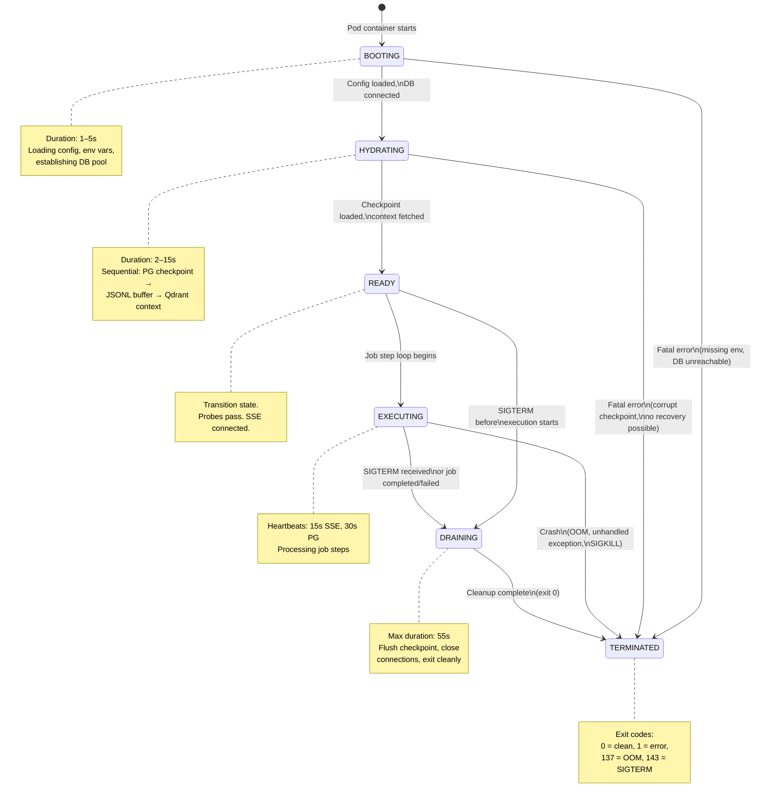
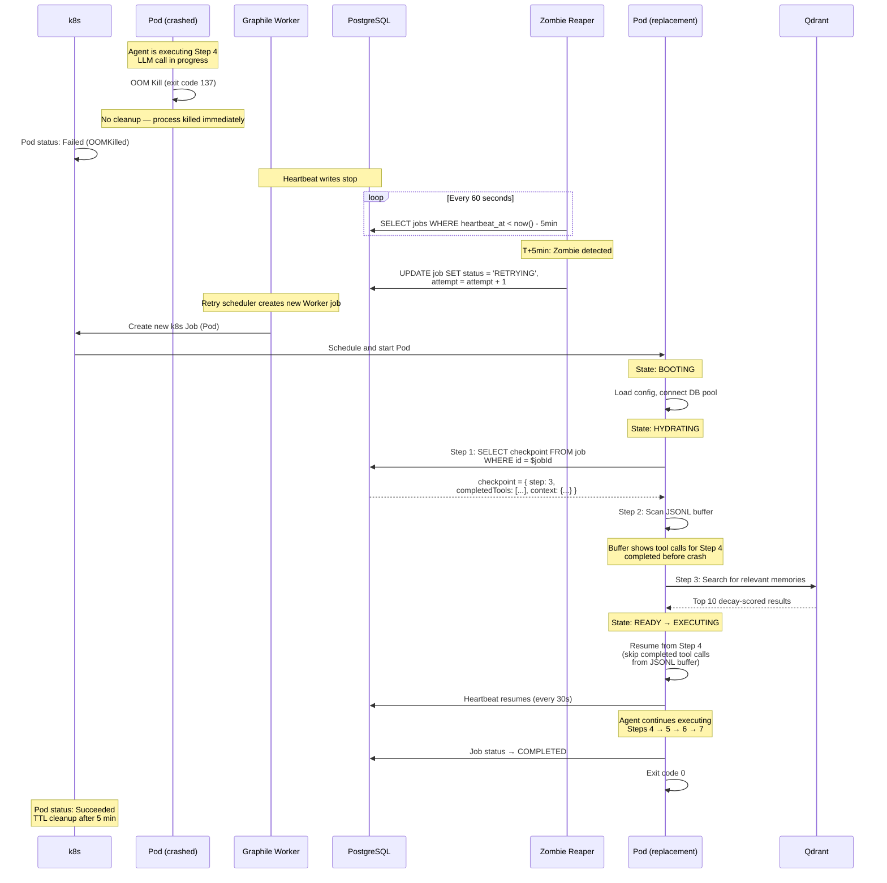
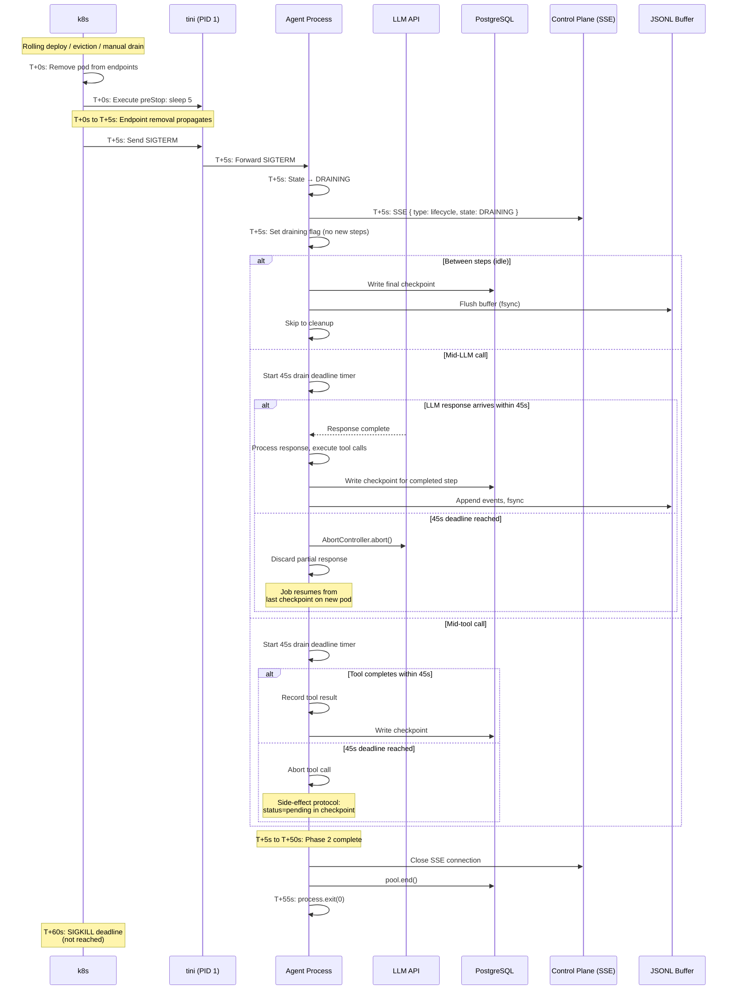
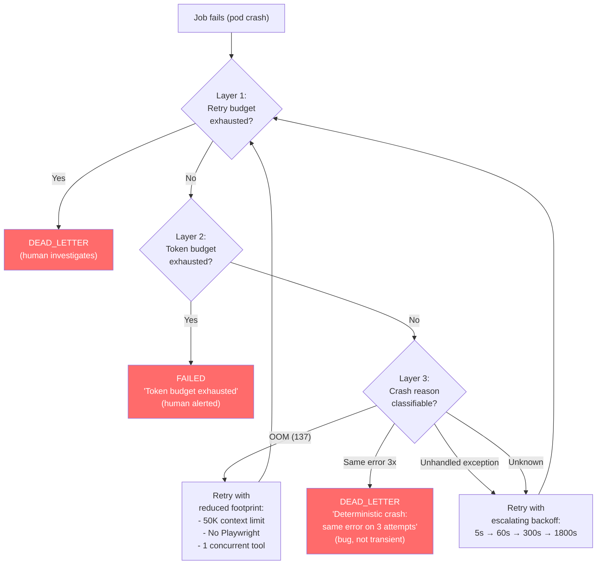

# Spike #34 — Agent Lifecycle: State Machine & Health Monitoring

**Status:** Proposed
**Date:** 2026-02-24
**Author:** Cortex Plane Team
**Depends on:** [Spike #24 — Job State Machine](./024-job-state-machine.md), [Spike #28 — Graphile Retry, Timeout & Shutdown](./028-graphile-patterns.md), [Spike #31 — JSONL Session Buffer](./031-jsonl-buffer.md), [Spike #33 — Agent Pods: Security Model](./033-pod-security.md)

---

## Table of Contents

1. [Context](#context)
2. [Question 1: State Machine — Missing States](#question-1-state-machine--missing-states)
3. [Question 2: SSE Heartbeat Interval & Unhealthy Timeout](#question-2-sse-heartbeat-interval--unhealthy-timeout)
4. [Question 3: Stuck Detection — LLM Calls vs Network I/O](#question-3-stuck-detection--llm-calls-vs-network-io)
5. [Question 4: Graceful Drain — SIGKILL Deadline](#question-4-graceful-drain--sigkill-deadline)
6. [Question 5: Hydration Order](#question-5-hydration-order)
7. [Question 6: Liveness vs Readiness Probes](#question-6-liveness-vs-readiness-probes)
8. [Question 7: Pod Restart Policy & CrashLoopBackOff Mitigation](#question-7-pod-restart-policy--crashloopbackoff-mitigation)
9. [Question 8: Scale-to-Zero](#question-8-scale-to-zero)
10. [Artifact: Agent Lifecycle State Machine Diagram](#artifact-agent-lifecycle-state-machine-diagram)
11. [Artifact: Health Check Specification](#artifact-health-check-specification)
12. [Artifact: Recovery Sequence Diagram](#artifact-recovery-sequence-diagram)
13. [Artifact: Drain Protocol Spec](#artifact-drain-protocol-spec)
14. [Artifact: CrashLoopBackOff Mitigation Strategy](#artifact-crashloopbackoff-mitigation-strategy)
15. [Design Decisions](#design-decisions)
16. [Open Questions](#open-questions)

---

## Context

Spikes #24 and #28 define the **job** state machine — the lifecycle of a unit of work. Spike #33 defines how agent **pods** are secured and resource-constrained. But neither addresses the lifecycle of the **agent process itself** — the runtime inside the pod that boots, hydrates state, processes jobs, and eventually shuts down or crashes.

The spec (§12.1) sketches five phases: Boot → Hydration → Ready → Runtime → Crash/Recovery. This spike expands that sketch into a complete state machine, answering: what states are missing? How does the control plane know the agent is alive? How do we distinguish a stuck agent from one legitimately waiting 90 seconds for Claude to think? When is it safe to kill a pod, and how do we prevent crash loops from burning API tokens?

### Scope Boundary

This spike covers the **agent pod process lifecycle** — the states and transitions of the Node.js process running inside a container. It does NOT cover:

- **Job state machine** (spike #24) — jobs have their own independent state machine. An agent pod can process multiple jobs across its lifetime; a job can survive across multiple pod incarnations (via checkpointing).
- **k8s Job resource lifecycle** — the k8s batch/v1 Job wrapping the pod is an implementation detail; this spike covers what happens inside the pod.
- **Control plane lifecycle** — the control plane has its own graceful shutdown (spike #28, §Q4); this spike is about agent pods.

### Two Lifecycle Layers

The system has two independent but interconnected lifecycle layers:

```
┌───────────────────────────────────────────────────┐
│  Job Lifecycle (spike #24)                        │
│  PENDING → SCHEDULED → RUNNING → COMPLETED       │
│  Persisted in PostgreSQL. Survives pod crashes.   │
│  One job may span multiple pod incarnations.      │
└───────────────┬───────────────────────────────────┘
                │ dispatches to
┌───────────────▼───────────────────────────────────┐
│  Agent Pod Lifecycle (this spike)                 │
│  BOOTING → HYDRATING → READY → EXECUTING →       │
│  DRAINING → TERMINATED                            │
│  Ephemeral. Lives and dies with the container.    │
│  One pod processes one job (k8s Job, not Graphile │
│  Worker task — the pod IS the job execution).     │
└───────────────────────────────────────────────────┘
```

The job state machine is the **durable** layer — it survives across pods. The agent lifecycle is the **ephemeral** layer — it describes a single pod execution. This spike defines the ephemeral layer.

### Hard Constraints

| Constraint | Implication |
|---|---|
| Agent pods are k8s batch/v1 Jobs (spike #33) | `restartPolicy: Never`. k8s does not restart the container. Retries are managed by Graphile Worker. |
| `terminationGracePeriodSeconds: 65` with 5s preStop (spike #28) | Agent has 60 seconds for graceful drain after SIGTERM. |
| Heartbeat writes every 30s, zombie threshold 5 minutes (spike #28) | Agent process must emit heartbeats; the reaper handles detection. |
| PostgreSQL checkpoint is the resume point (spike #26, #31) | Agent reads checkpoint on hydration, writes checkpoint after each completed step. |
| JSONL buffer is supplementary, not authoritative (spike #31) | Buffer enhances recovery (skip completed tool calls) but is not required for correctness. |
| Agent pods have no k8s API access (spike #33) | `automountServiceAccountToken: false`. Cannot query pod status, events, or other k8s resources. |
| Burstable QoS, PriorityClass `agent-workload` (spike #33) | Agents are evictable under memory pressure. Eviction is operationally equivalent to a crash. |

---

## Question 1: State Machine — Missing States

**Question:** The spec sketches Boot → Hydration → Ready → Runtime → Crash/Recovery. Are there missing states? What about Draining? Paused? Suspended?

**Decision:** Six states. Add `EXECUTING` (replaces the vague "Runtime") and `DRAINING`. Reject Paused and Suspended as agent-level states — they are job-level concerns, not pod-level.

### The Complete Agent Lifecycle States

| State | Description | Duration |
|---|---|---|
| `BOOTING` | Container started. Process initializing: loading config, establishing DB connection, parsing environment. | 1–5 seconds |
| `HYDRATING` | Loading execution context: reading checkpoint from PostgreSQL, fetching Qdrant context, loading JSONL buffer for enhanced recovery. | 2–15 seconds |
| `READY` | Hydration complete. Agent is ready to execute its assigned job. SSE connection to control plane established. Readiness probe passes. | Instantaneous (transition state) |
| `EXECUTING` | Agent is actively processing its job: LLM calls, tool execution, checkpoint writes. Heartbeats emitted every 30s. | Seconds to hours |
| `DRAINING` | SIGTERM received (or job completed). Agent is flushing state: writing final checkpoint, closing connections, flushing JSONL buffer. No new steps started. | 1–60 seconds |
| `TERMINATED` | Process has exited. Exit code indicates outcome: 0 = clean completion, 1 = error, 137 = OOM kill, 143 = SIGTERM. | Terminal |

### Why NOT Paused or Suspended

**Paused** (`/agents/{agentId}/pause` endpoint in the spec) is a **job-level** operation, not an agent-process-level state. When a pause is requested:

1. The control plane sets the job's status to `WAITING_FOR_APPROVAL` (spike #24).
2. The agent process continues running — it's still alive, still emitting heartbeats — but it has no work to do. It's in `EXECUTING` state with no active step.
3. When the job is un-paused, the agent resumes from its checkpoint.

The agent process doesn't need a "Paused" state because pausing is about stopping the *work*, not the *process*. The process stays alive, healthy, and ready. If we killed the process on pause, we'd need to cold-start it on unpause, which is wasteful.

**Exception: Long pauses.** If a job is paused for hours (waiting for human approval overnight), keeping the pod alive burns cluster resources. The control plane should implement an **idle timeout**: if a job remains in `WAITING_FOR_APPROVAL` for longer than `agent.resource_limits.idle_timeout_seconds` (default: 1800 = 30 minutes), the control plane terminates the pod. When the job is un-paused, a new pod is cold-started and hydrates from the checkpoint. This is the scale-to-zero pattern (see Question 8).

**Suspended** implies an external actor pausing the entire pod (like `kubectl debug` or a cluster-level suspension). This is a k8s-level operation, not an application-level state. The agent process doesn't observe suspension — it simply stops executing and resumes when unsuspended. There's no state to model.

### State Transition Rules

```
BOOTING     → HYDRATING              (config loaded, DB connected)
BOOTING     → TERMINATED             (fatal error: missing env var, DB unreachable)

HYDRATING   → READY                  (checkpoint loaded, Qdrant context fetched)
HYDRATING   → TERMINATED             (fatal error: checkpoint corrupted, Qdrant timeout after retries)

READY       → EXECUTING              (job step loop begins)
READY       → DRAINING               (SIGTERM received before execution starts)

EXECUTING   → DRAINING               (SIGTERM received, or job completed/failed)
EXECUTING   → TERMINATED             (crash: unhandled exception, OOM kill, SIGKILL)

DRAINING    → TERMINATED             (cleanup complete, process exits)
DRAINING    → TERMINATED             (drain timeout — SIGKILL from k8s)
```

### Where Each State Lives

Agent lifecycle state is **not persisted to PostgreSQL**. It's ephemeral — it exists only in the agent process's memory and is reflected in health probes and SSE heartbeats. If the pod crashes, the state is lost; the job's persisted state in PostgreSQL is what matters for recovery.

The control plane observes agent state through:
1. **SSE heartbeats** — the agent reports its current lifecycle state in each heartbeat payload.
2. **k8s pod status** — `Running`, `Succeeded`, `Failed`, `Unknown`.
3. **Job heartbeat_at** in PostgreSQL — the zombie detection mechanism (spike #28).

---

## Question 2: SSE Heartbeat Interval & Unhealthy Timeout

**Question:** What interval for SSE heartbeats? What's the timeout before declaring unhealthy?

**Decision:** 15-second heartbeat interval. 45-second timeout before declaring unhealthy. This is separate from the job-level heartbeat (30s interval, 5-minute zombie threshold) defined in spike #28.

### Two Heartbeat Systems

The system has two independent heartbeat mechanisms:

| Heartbeat | Medium | Interval | Threshold | Purpose |
|---|---|---|---|---|
| **Job heartbeat** (spike #28) | PostgreSQL `heartbeat_at` UPDATE | 30 seconds | 5 minutes (zombie) | Detect abandoned **jobs** — the job is stuck in RUNNING with no worker processing it. |
| **Agent heartbeat** (this spike) | SSE event stream to control plane | 15 seconds | 45 seconds (unhealthy) | Detect unhealthy **pods** — the agent process is alive but unresponsive, or the network path is broken. |

The job heartbeat is coarse-grained (5-minute detection) and writes to PostgreSQL. The agent heartbeat is fine-grained (45-second detection) and uses an in-memory SSE connection. They serve different purposes:

- **Job heartbeat** answers: "Is any process working on this job?" It's the recovery trigger — when stale, the zombie reaper transitions the job to RETRY.
- **Agent heartbeat** answers: "Is this specific pod healthy and communicating?" It's the health signal — when stale, the control plane can take targeted action (alert, prepare replacement, preemptively checkpoint).

### Heartbeat Payload

```typescript
interface AgentHeartbeat {
  type: 'heartbeat';
  timestamp: string;           // ISO 8601
  agentId: string;
  jobId: string;
  podName: string;             // From HOSTNAME env var
  lifecycleState: AgentLifecycleState;
  currentStep: number | null;  // Step in the agent loop, null if not executing
  metrics: {
    heapUsedMb: number;        // process.memoryUsage().heapUsed / 1MB
    uptimeSeconds: number;     // process.uptime()
    stepsCompleted: number;
    llmCallsTotal: number;
    toolCallsTotal: number;
  };
}

type AgentLifecycleState =
  | 'BOOTING'
  | 'HYDRATING'
  | 'READY'
  | 'EXECUTING'
  | 'DRAINING'
  | 'TERMINATED';
```

### Why 15 Seconds, Not 30

The job heartbeat uses 30 seconds because it writes to PostgreSQL — each heartbeat is a database UPDATE. At 100 concurrent agents, that's 200 writes/minute, which is fine but shouldn't be more frequent.

The SSE heartbeat is stateless — it's a message on an existing TCP connection. No database write. The marginal cost of a 15-second interval over 30 seconds is zero. A tighter interval provides:

1. **Faster detection.** At 45-second timeout (3 missed heartbeats), the control plane knows a pod is unhealthy 4+ minutes before the zombie reaper would detect it via the job heartbeat. This gives the control plane time to take preemptive action.
2. **Smoother dashboard updates.** The dashboard polls agent status. A 15-second heartbeat means the dashboard shows a status update within 15 seconds of any change.
3. **SSE keep-alive.** Some proxies and load balancers close idle SSE connections after 30–60 seconds. A 15-second heartbeat prevents spurious disconnections.

### Unhealthy Timeout: 45 Seconds

Three missed heartbeats (3 × 15s = 45s) triggers the unhealthy state. This accommodates:

- **Garbage collection pauses** — Node.js GC can freeze the event loop for up to ~500ms in pathological cases. One missed heartbeat is normal.
- **Network blips** — A 15-second network interruption drops one heartbeat. Two consecutive misses suggest a real problem.
- **But not legitimate stalls** — An agent that's frozen for 45 seconds is genuinely unhealthy, even during an LLM call (the heartbeat runs on a separate timer, not blocked by the LLM call).

### Control Plane Response to Unhealthy

When the SSE heartbeat times out:

```
T+0s    Last heartbeat received
T+15s   Heartbeat expected but not received — mark WARNING
T+30s   Second heartbeat missed — mark UNHEALTHY
T+45s   Third heartbeat missed — escalate:
        1. Log warning with pod name, agent ID, last known state
        2. Emit Prometheus metric: cortex_agent_unhealthy_total
        3. If job is in RUNNING: the zombie reaper (spike #28) handles recovery
           when heartbeat_at goes stale after 5 minutes
        4. Do NOT preemptively kill the pod — it may recover
```

The control plane does not kill unhealthy pods proactively. Killing a pod that's temporarily network-partitioned would waste the in-flight work. Instead, it relies on the job heartbeat zombie reaper as the authoritative timeout. The SSE heartbeat provides early warning and observability.

---

## Question 3: Stuck Detection — LLM Calls vs Network I/O

**Question:** The legacy system detects "stuck sessions" after 120 seconds for network I/O. But LLM calls can take 60s+ legitimately. How do we distinguish a stuck agent from one legitimately waiting for a slow response?

**Decision:** Activity-based detection, not wall-clock timeouts. The heartbeat proves the process is alive; the inter-chunk timeout proves the external call is progressing. A 120-second wall-clock timeout is wrong for LLM calls.

### The Fundamental Problem

A simple "is it stuck?" check based on elapsed time fails for LLM workloads:

| Scenario | Wall Clock | Stuck? |
|---|---|---|
| Network I/O to a dead host | 120s | Yes — nothing is happening |
| Claude Opus thinking about a complex problem | 90s | No — tokens will arrive soon |
| Claude streaming a long response | 120s total | No — tokens arriving every second |
| Claude streaming, stalled mid-response | 65s since last token | Yes — stream is dead |
| Tool call to kubectl on a large cluster | 45s | No — kubectl is working |
| Tool call to a hung webhook | 120s | Yes — no response will come |

The distinction is not how long something takes, but **whether progress is being made**.

### Three-Layer Stuck Detection

```
┌───────────────────────────────────────────────────────────────┐
│  Layer 1: Process Liveness (Agent Heartbeat)                  │
│  Interval: 15s SSE heartbeat                                  │
│  Threshold: 45s (3 missed heartbeats)                         │
│  Detects: Process crash, event loop freeze, network partition │
│  Action: Mark pod unhealthy in control plane                  │
└───────────────────────────────────────────────────────────────┘

┌───────────────────────────────────────────────────────────────┐
│  Layer 2: Call-Level Progress (Per-Call Timeouts)              │
│  Mechanism: AbortController with call-type-specific timeouts  │
│  Detects: Stuck external calls (HTTP, LLM, tool)              │
│  Action: Abort the call, classify the error, retry or fail    │
└───────────────────────────────────────────────────────────────┘

┌───────────────────────────────────────────────────────────────┐
│  Layer 3: Job-Level Progress (Zombie Reaper)                  │
│  Mechanism: PostgreSQL heartbeat_at timestamp (spike #28)     │
│  Threshold: 5 minutes                                         │
│  Detects: Abandoned jobs (pod died, process stuck)            │
│  Action: Transition job to RETRY or FAILED                    │
└───────────────────────────────────────────────────────────────┘
```

### Layer 2: Call-Level Progress Detection

This is where the LLM vs network distinction matters. Each external call type uses a progress-aware timeout:

#### Network I/O (HTTP, Webhooks)

```typescript
const controller = new AbortController();

// Connect timeout: 30s — if TCP handshake doesn't complete, fail fast.
const connectTimer = setTimeout(() => controller.abort('CONNECT_TIMEOUT'), 30_000);

// Response timeout: 120s total wall clock. Network I/O should complete
// within this window. No partial progress tracking needed — HTTP responses
// arrive atomically (or stream with chunked transfer, handled below).
const responseTimer = setTimeout(() => controller.abort('RESPONSE_TIMEOUT'), 120_000);
```

#### LLM Calls (Streaming)

```typescript
const controller = new AbortController();

// Connect timeout: 30s — same as network I/O.
const connectTimer = setTimeout(() => controller.abort('CONNECT_TIMEOUT'), 30_000);

// Total timeout: 300s (5 minutes). The absolute maximum wall clock for any
// LLM call, regardless of progress.
const totalTimer = setTimeout(() => controller.abort('TOTAL_TIMEOUT'), 300_000);

// Inter-chunk timeout: 60s. This is the key differentiator.
// Reset every time a chunk (token) arrives. If 60 seconds pass with no new
// token, the stream is dead — the API is connected but not sending data.
let chunkTimer: NodeJS.Timeout;

function resetChunkTimer(): void {
  clearTimeout(chunkTimer);
  chunkTimer = setTimeout(() => controller.abort('CHUNK_TIMEOUT'), 60_000);
}

// Start the chunk timer when the first byte arrives (not at request time,
// because the model may "think" for 60–90 seconds before the first token).
stream.on('data', (chunk) => {
  clearTimeout(connectTimer);  // Connection established
  resetChunkTimer();
  // ... process chunk
});
```

#### Why 60 Seconds Inter-Chunk, Not 30?

Extended thinking (Anthropic's feature for Claude) causes legitimate gaps in token output. The model may "think" for 30–45 seconds between output bursts. A 30-second inter-chunk timeout would false-positive on thinking pauses. 60 seconds provides headroom:

- Normal token gap: <5 seconds
- Extended thinking gap: 15–45 seconds
- Something is wrong: >60 seconds

#### Tool Execution

Tools use per-tool timeouts registered at startup:

```typescript
const TOOL_TIMEOUTS: Record<string, number> = {
  kubectl_apply:       30_000,
  kubectl_get:         15_000,
  file_read:           10_000,
  file_write:          10_000,
  browser_navigate:   120_000,
  browser_screenshot:  30_000,
  http_request:       120_000,
  git_clone:          300_000,
  git_push:            60_000,
};

async function executeTool(
  name: string,
  args: unknown,
  signal: AbortSignal,
): Promise<ToolResult> {
  const timeout = TOOL_TIMEOUTS[name] ?? 60_000; // Default: 60s
  const toolController = AbortController.withTimeout(timeout);

  // Link to parent abort signal (shutdown).
  signal.addEventListener('abort', () => toolController.abort());

  return runToolWithSignal(name, args, toolController.signal);
}
```

### How the Layers Interact

```
Agent is executing step 4
  └── LLM call to Claude (streaming)
      ├── Layer 1 (heartbeat): Timer fires every 15s → SSE heartbeat sent ✓
      │   (heartbeat runs on setInterval, not blocked by LLM call)
      ├── Layer 2 (call progress): Inter-chunk timer resets on each token ✓
      │   (if tokens stop for 60s → abort the call → classify TRANSIENT_APP → retry)
      └── Layer 3 (job heartbeat): Timer fires every 30s → PG UPDATE ✓
          (heartbeat_at updated; zombie reaper sees fresh timestamp)
```

If the Node.js event loop freezes (catastrophic GC, deadlock):
- Layer 1: SSE heartbeats stop → control plane marks unhealthy at T+45s
- Layer 2: All timers stop (they're on the same event loop)
- Layer 3: PostgreSQL heartbeat writes stop → zombie reaper detects at T+5min

If the LLM API connection dies mid-stream:
- Layer 1: SSE heartbeats continue ✓ (agent process is alive)
- Layer 2: Inter-chunk timer fires at T+60s → aborts the call → retry
- Layer 3: Job heartbeats continue ✓ (heartbeat runs independent of call)

If the pod is OOM-killed:
- Layer 1: SSE connection drops → control plane detects immediately
- Layer 2: N/A (process is dead)
- Layer 3: Job heartbeat writes stop → zombie reaper detects at T+5min

---

## Question 4: Graceful Drain — SIGKILL Deadline

**Question:** How long does the control plane wait before SIGKILL? What's the drain protocol?

**Decision:** The drain protocol is already defined in spike #28 (`terminationGracePeriodSeconds: 65`, 5s preStop, 60s drain). This spike specifies the agent-side behavior during drain — what happens inside the process when SIGTERM arrives.

### Drain Protocol: Agent-Side Sequence

```
SIGTERM received
  │
  ├── Transition lifecycle state: EXECUTING → DRAINING
  │
  ├── Phase 1: Stop new work (immediate)
  │   ├── Set draining flag — agent loop checks this before starting next step
  │   ├── Stop accepting new jobs from control plane (if multiplexing — N/A for k8s Jobs)
  │   └── Send SSE event: { type: 'lifecycle', state: 'DRAINING' }
  │
  ├── Phase 2: Complete or abort current step (0–45 seconds)
  │   │
  │   ├── Case A: Between steps (no active I/O)
  │   │   ├── Write final checkpoint to PostgreSQL
  │   │   ├── Flush JSONL buffer (fsync)
  │   │   └── Proceed to Phase 3
  │   │
  │   ├── Case B: In LLM call (streaming)
  │   │   ├── Wait for current chunk to arrive (up to 45s deadline)
  │   │   ├── If response completes within 45s:
  │   │   │   ├── Process the response
  │   │   │   ├── Execute resulting tool calls (with abort checking between each)
  │   │   │   ├── Write checkpoint for completed step
  │   │   │   └── Proceed to Phase 3
  │   │   ├── If deadline reached:
  │   │   │   ├── Abort the LLM call (AbortController.abort())
  │   │   │   ├── Discard partial response (no checkpoint for incomplete step)
  │   │   │   └── Proceed to Phase 3
  │   │   └── Cost of abort: one wasted LLM call. Agent resumes from last checkpoint.
  │   │
  │   └── Case C: In tool call
  │       ├── Wait for tool call to complete (up to 45s deadline)
  │       ├── If completes:
  │       │   ├── Record tool result
  │       │   ├── Write checkpoint
  │       │   └── Proceed to Phase 3
  │       ├── If deadline reached:
  │       │   ├── Abort the tool call
  │       │   ├── Side-effect protocol (spike #26): pending → re-check on resume
  │       │   └── Proceed to Phase 3
  │
  ├── Phase 3: Cleanup (0–10 seconds)
  │   ├── Close SSE connection to control plane
  │   ├── Close Qdrant client connection
  │   ├── Flush any remaining JSONL buffer entries
  │   └── Close database connection pool
  │
  └── Phase 4: Exit
      └── process.exit(0) — clean exit, k8s records `Completed`
```

### Timing Budget

```
T+0s    SIGTERM received (after 5s preStop)
T+0s    Phase 1: Stop new work (instant)
T+0–45s Phase 2: Complete or abort current step
T+45s   Phase 2 deadline — abort any remaining I/O
T+45–55s Phase 3: Cleanup
T+55s   process.exit(0)
T+60s   SIGKILL from k8s (not reached)
```

The 5-second buffer between process exit (T+55s) and SIGKILL (T+60s) handles:
- Slow `pool.end()` (waiting for in-flight queries to complete)
- OS-level cleanup (file descriptor release, socket TIME_WAIT)
- Any unexpected delay in `process.exit()`

### Implementation

```typescript
class AgentProcess {
  private state: AgentLifecycleState = 'BOOTING';
  private drainController = new AbortController();
  private readonly DRAIN_DEADLINE_MS = 45_000;

  constructor() {
    process.on('SIGTERM', () => this.drain());
  }

  private async drain(): Promise<void> {
    if (this.state === 'DRAINING' || this.state === 'TERMINATED') return;

    this.state = 'DRAINING';
    this.sseClient.send({ type: 'lifecycle', state: 'DRAINING' });

    // Set the drain deadline.
    const drainTimer = setTimeout(() => {
      this.drainController.abort();
    }, this.DRAIN_DEADLINE_MS);

    try {
      // Phase 2: Wait for current step to complete or abort.
      await this.currentStepPromise;
    } catch {
      // Step was aborted — expected during drain.
    } finally {
      clearTimeout(drainTimer);
    }

    // Phase 3: Cleanup.
    await this.cleanup();

    // Phase 4: Exit.
    this.state = 'TERMINATED';
    process.exit(0);
  }
}
```

### Drain vs Crash: What Happens to the Job

| Scenario | Job State After | Resume Point |
|---|---|---|
| Clean drain (step completed before deadline) | `RUNNING` with fresh checkpoint | Next step after checkpoint |
| Drain with aborted LLM call | `RUNNING` with last good checkpoint | Re-issue the LLM call |
| Drain with aborted tool call | `RUNNING` with pending side-effect record | Verify side-effect, then continue |
| Crash (OOM, SIGKILL, unhandled exception) | `RUNNING` with last good checkpoint | Same as drain-with-abort |
| Clean completion during drain | `COMPLETED` | N/A — job is done |

In all cases, the zombie reaper (spike #28) eventually detects the stale job heartbeat and transitions it to RETRY. The new pod reads the checkpoint and resumes.

---

## Question 5: Hydration Order

**Question:** What order does hydration follow? Qdrant context first, then JSONL checkpoint? Or parallel?

**Decision:** Sequential with a critical-path optimization. PostgreSQL checkpoint first (mandatory), then JSONL buffer scan (optional), then Qdrant context fetch (optional). Not parallel.

### Why Sequential, Not Parallel

Parallel hydration would fetch PostgreSQL checkpoint, JSONL buffer, and Qdrant context simultaneously. This seems faster but creates ordering problems:

1. **The JSONL buffer scan depends on the PostgreSQL checkpoint.** The buffer contains events from the last session. To identify which events occurred after the last checkpoint (and thus which tool calls can be skipped on resume), the agent must first know what the checkpoint says. Fetching both in parallel means the agent can't interpret the buffer until the checkpoint arrives anyway.

2. **Qdrant context depends on job payload.** The agent needs to know *what* it's working on (from the job's payload or checkpoint) before it can construct a meaningful Qdrant query. Fetching "all recent memories" without a query context retrieves noise.

3. **Failure modes differ.** PostgreSQL is mandatory — if the checkpoint can't be loaded, the agent cannot start. JSONL buffer is optional — if it's missing or corrupt, Phase 1 recovery (checkpoint-only) is still correct. Qdrant is optional — if it's unavailable, the agent can execute without long-term memory context. Sequential hydration lets the agent fail fast on the mandatory step and gracefully degrade on the optional steps.

### Hydration Sequence

```
HYDRATING state entered
  │
  ├── Step 1: PostgreSQL Checkpoint (MANDATORY, 1–3 seconds)
  │   ├── Query: SELECT checkpoint, checkpoint_crc, status FROM job WHERE id = $jobId
  │   ├── Validate CRC-32 integrity
  │   ├── If checkpoint exists and valid:
  │   │   └── Extract: resumeStep, completedToolCalls, agentContext
  │   ├── If checkpoint is NULL (fresh job, first attempt):
  │   │   └── Start from step 0 with empty context
  │   ├── If checkpoint exists but CRC mismatch:
  │   │   ├── Log error: "Checkpoint CRC mismatch for job {jobId}"
  │   │   ├── Check for previous checkpoint in checkpoint_history
  │   │   └── If no valid checkpoint: fail → TERMINATED (exit code 1)
  │   └── If PostgreSQL unreachable:
  │       ├── Retry 3 times with 2s backoff
  │       └── If still unreachable: fail → TERMINATED (exit code 1)
  │
  ├── Step 2: JSONL Buffer Scan (OPTIONAL, 0–2 seconds)
  │   ├── Locate buffer file: /data/sessions/{jobId}/session_*.jsonl
  │   ├── Find latest session file
  │   ├── Scan for CHECKPOINT_WRITTEN markers
  │   ├── If checkpoint_id matches PostgreSQL checkpoint:
  │   │   ├── Extract tool call results after the checkpoint marker
  │   │   └── Mark those tool calls as "skip on resume" in the execution plan
  │   ├── If no matching checkpoint marker, or file missing/corrupt:
  │   │   └── Skip Phase 2 recovery — checkpoint-only resume is correct
  │   └── Timeout: 5 seconds. If buffer scan takes longer, skip it.
  │
  ├── Step 3: Qdrant Context (OPTIONAL, 1–5 seconds)
  │   ├── Construct query from job payload + checkpoint context
  │   │   (e.g., "Previous task context for DevOps agent working on deployment pipeline")
  │   ├── Embed query text → 1536-dim vector
  │   ├── Search agent's Qdrant collection: top 10, decay-scored
  │   ├── Inject retrieved memories into the LLM system prompt
  │   ├── If Qdrant is unreachable:
  │   │   ├── Log warning: "Qdrant unavailable, proceeding without memory context"
  │   │   └── Continue — long-term memory is an enhancement, not a requirement
  │   └── Timeout: 10 seconds. If Qdrant doesn't respond, proceed without.
  │
  └── Transition: HYDRATING → READY
      └── Total hydration: 2–20 seconds (typical: 3–5 seconds)
```

### Why Not Qdrant First?

The spec (§12.1) says "queries Qdrant for immediate context, loads the last checkpoint from PostgreSQL." This ordering is wrong. The checkpoint tells the agent *where it is* in the job execution. Without the checkpoint, the agent doesn't know what step it's on, what context has already been assembled, or what memories are relevant. Qdrant context is a refinement that enhances the LLM prompt — it's useless without the execution context that the checkpoint provides.

**Corrected order:** Checkpoint → Buffer → Qdrant. This is the order of decreasing criticality and increasing optionality.

---

## Question 6: Liveness vs Readiness Probes

**Question:** What does each probe check?

**Decision:** Liveness checks process health. Readiness checks execution readiness. Separate concerns, separate endpoints.

### Probe Specification

| Probe | Endpoint | Checks | Failure Means |
|---|---|---|---|
| **Liveness** | `GET /healthz` | Process is alive, event loop is responsive, DB connection pool has ≥1 available connection | k8s kills the container (but `restartPolicy: Never` means it stays dead) |
| **Readiness** | `GET /readyz` | Process has completed hydration, SSE connection to control plane is established | k8s removes pod from Service endpoints (agents don't serve traffic, so this is primarily informational) |
| **Startup** | `GET /healthz` | Same as liveness | k8s waits longer before beginning liveness checks |

### Why Agents Need Probes Even Without Inbound Traffic

Agent pods don't serve HTTP traffic — they're consumers, not servers. But probes still serve critical purposes:

1. **Liveness → prevents zombie containers.** If the Node.js process hangs (event loop deadlock, uncaught promise rejection that doesn't crash), the container appears "running" to k8s but is doing nothing. The liveness probe detects this and kills the container. (With `restartPolicy: Never`, the pod enters `Failed` state, and the zombie reaper handles job recovery.)

2. **Readiness → provides lifecycle visibility.** The readiness probe tells the control plane (via k8s API or pod status) whether the agent has finished hydrating and is actively working. The dashboard can show "Agent is starting up..." vs "Agent is executing..." based on readiness.

3. **Startup → avoids false kills during hydration.** Hydration can take 10–20 seconds (Qdrant query, large JSONL buffer scan). Without a startup probe, the liveness probe would fire during hydration and kill the pod before it's ready. The startup probe gives the agent time to hydrate before liveness checks begin.

### Probe Implementation

```typescript
// Minimal HTTP server for health probes — separate from any application HTTP server.
// Runs on port 8086 (unprivileged, not exposed via Service).
import { createServer } from 'node:http';

function startHealthServer(agent: AgentProcess): void {
  const server = createServer((req, res) => {
    if (req.url === '/healthz') {
      // Liveness: is the process functioning?
      const isAlive =
        agent.state !== 'TERMINATED' &&
        agent.dbPool.availableCount > 0 &&
        !agent.eventLoopBlocked;

      res.writeHead(isAlive ? 200 : 503);
      res.end(isAlive ? 'ok' : 'unhealthy');
      return;
    }

    if (req.url === '/readyz') {
      // Readiness: is the agent executing or ready to execute?
      const isReady =
        agent.state === 'READY' ||
        agent.state === 'EXECUTING';

      res.writeHead(isReady ? 200 : 503);
      res.end(isReady ? 'ok' : 'not ready');
      return;
    }

    res.writeHead(404);
    res.end('not found');
  });

  server.listen(8086);
}
```

### Event Loop Blocked Detection

The liveness probe must detect a blocked event loop — the most insidious failure mode where the process is "alive" but not processing work.

```typescript
class EventLoopMonitor {
  private lastCheck = Date.now();
  private _isBlocked = false;
  private readonly THRESHOLD_MS = 5_000; // 5 seconds

  constructor() {
    setInterval(() => {
      const now = Date.now();
      const drift = now - this.lastCheck - 1_000; // Expected interval: 1s
      this._isBlocked = drift > this.THRESHOLD_MS;
      this.lastCheck = now;
    }, 1_000);
  }

  get isBlocked(): boolean {
    return this._isBlocked;
  }
}
```

If the event loop is blocked for >5 seconds (the 1-second interval timer fires 5+ seconds late), the monitor sets `isBlocked = true`, and the liveness probe returns 503.

### Probe Configuration (k8s)

```yaml
containers:
  - name: agent
    livenessProbe:
      httpGet:
        path: /healthz
        port: 8086
      periodSeconds: 10
      timeoutSeconds: 5
      failureThreshold: 3     # 3 failures × 10s = 30s before kill
    readinessProbe:
      httpGet:
        path: /readyz
        port: 8086
      periodSeconds: 5
      timeoutSeconds: 3
      failureThreshold: 2     # 2 failures × 5s = 10s before marking unready
    startupProbe:
      httpGet:
        path: /healthz
        port: 8086
      periodSeconds: 5
      timeoutSeconds: 5
      failureThreshold: 12    # 12 failures × 5s = 60s max startup time
```

### Probe Timing Rationale

| Probe | Period | Timeout | Failures | Max Detection Time |
|---|---|---|---|---|
| **Startup** | 5s | 5s | 12 | 60 seconds — generous startup window for slow hydration |
| **Liveness** | 10s | 5s | 3 | 30 seconds — detect dead processes quickly |
| **Readiness** | 5s | 3s | 2 | 10 seconds — fast lifecycle visibility updates |

**Liveness failure action with `restartPolicy: Never`:** When the liveness probe fails, k8s kills the container. But because agent pods use `restartPolicy: Never` (spike #33), k8s does NOT restart the container. The pod enters `Failed` state. The job's heartbeat goes stale, the zombie reaper detects it, and the job transitions to RETRY with a new pod. This is intentional — we don't want k8s blindly restarting a process that can't pass liveness checks (it would crash loop, burning tokens).

---

## Question 7: Pod Restart Policy & CrashLoopBackOff Mitigation

**Question:** Pod restart policy: Always? How to prevent crash loops from burning tokens?

**Decision:** `restartPolicy: Never` for agent pods. CrashLoopBackOff is not a concern at the k8s level — it's prevented at the Graphile Worker level through token-budget-aware retry limits.

### Why `restartPolicy: Never`, Not `Always`

Agent pods are k8s batch/v1 Jobs (spike #33). Jobs use `restartPolicy: Never` or `OnFailure`, never `Always`. The reasons:

1. **CrashLoopBackOff prevention.** With `restartPolicy: Always`, a crashing container is restarted with exponential backoff (10s, 20s, 40s, ... up to 5 minutes). Each restart of an agent pod triggers hydration, which triggers Qdrant queries and potentially an LLM call. If the crash is caused by a bug in the agent code (not a transient error), each restart burns tokens for zero benefit. `restartPolicy: Never` stops this immediately — one crash, one pod failure, done.

2. **Retry logic belongs in the application layer.** Graphile Worker's retry mechanism (spike #28) is purpose-built for this: it classifies errors, applies appropriate backoff, tracks retry counts, and respects per-job-type limits. k8s restarts are dumb — they don't know whether the crash was a rate limit (retry after 30s), a bad request (never retry), or a configuration error (never retry). Worker knows.

3. **Job-level budgets.** Each job has `max_attempts` (spike #24). Worker tracks attempts. When a pod crashes, Worker creates a new pod for the next attempt. The attempt counter prevents unbounded retries. k8s restarts don't respect this counter.

### The CrashLoopBackOff Problem

Even with `restartPolicy: Never`, crash loops can occur at the Worker level:

```
Worker dispatches job → Pod starts → Agent crashes during LLM call (tokens burned)
Worker retries        → Pod starts → Agent crashes during LLM call (tokens burned)
Worker retries        → Pod starts → Agent crashes during LLM call (tokens burned)
... max_attempts exhausted → job.status = DEAD_LETTER
```

If the crash happens after an LLM call completes but before the checkpoint is written, the agent re-issues the LLM call on retry — wasting tokens. This is the "crash loop token burn" problem.

### Token-Budget-Aware Retry Strategy

The mitigation is not to prevent retries (which would sacrifice reliability) but to limit the damage:

#### 1. Track Token Expenditure Per Job

```sql
ALTER TABLE job ADD COLUMN tokens_consumed JSONB NOT NULL DEFAULT '{}';

-- Example value:
-- { "input": 45000, "output": 12000, "cost_usd": 0.85 }
```

After each LLM call, the agent updates `tokens_consumed` in the job record. This survives crashes (it's in PostgreSQL).

#### 2. Token Budget Per Job

```sql
ALTER TABLE agent ADD COLUMN token_budget JSONB NOT NULL DEFAULT '{}';

-- Example value:
-- { "max_input_tokens_per_job": 500000, "max_cost_usd_per_job": 5.00 }
```

Before each LLM call, the agent checks:

```typescript
async function checkTokenBudget(jobId: string, agent: Agent): Promise<boolean> {
  const job = await db.selectFrom('job')
    .select('tokens_consumed')
    .where('id', '=', jobId)
    .executeTakeFirst();

  const consumed = job?.tokens_consumed as TokensConsumed;
  const budget = agent.token_budget as TokenBudget;

  if (budget.max_cost_usd_per_job && consumed.cost_usd >= budget.max_cost_usd_per_job) {
    return false; // Budget exhausted
  }

  if (budget.max_input_tokens_per_job &&
      consumed.input >= budget.max_input_tokens_per_job) {
    return false;
  }

  return true;
}
```

If the budget is exhausted, the job transitions to `FAILED` with a clear error message:

```
Job failed: token budget exhausted ($4.85 / $5.00 max).
3 crash-recovery cycles consumed tokens without completing the job.
Manual intervention required.
```

#### 3. Escalating Backoff for Crash Retries

When a job fails due to a crash (not a classified error), the retry delay increases aggressively:

| Attempt | Delay | Rationale |
|---|---|---|
| 1 | 5 seconds | Quick retry — crash may be transient (OOM on a heavy page, network blip) |
| 2 | 60 seconds | Something is persistently wrong. Give the system time to recover. |
| 3 | 300 seconds (5 min) | Likely a bug. Delay to prevent rapid token burn. |
| 4 | 1800 seconds (30 min) | Almost certainly a bug or persistent resource issue. |
| 5 | Job transitions to `DEAD_LETTER` | Human must investigate. |

This is more aggressive than the standard backoff (spike #28) because crash retries are more likely to be caused by deterministic bugs (same input → same crash) than transient errors.

#### 4. Crash Reason Classification

On the new pod, the agent checks the previous pod's exit code and adjusts behavior:

| Exit Code | Meaning | Action |
|---|---|---|
| 0 | Clean exit (should not be retrying) | Bug — log and proceed |
| 1 | Unhandled exception | Retry with full context from checkpoint |
| 137 | OOM kill (SIGKILL = 128+9) | Retry with reduced resource usage (smaller context, disabled tools) |
| 143 | SIGTERM (128+15) | Clean drain — job should be resumable, not retried |

For OOM retries specifically:

```typescript
if (previousExitCode === 137) {
  // OOM kill. Reduce agent footprint:
  // 1. Limit context window to 50K tokens (instead of 100K).
  // 2. Disable Playwright sidecar (if present).
  // 3. Reduce step parallelism to 1 concurrent tool call.
  agentConfig.maxContextTokens = 50_000;
  agentConfig.browserEnabled = false;
  agentConfig.maxConcurrentTools = 1;
}
```

---

## Question 8: Scale-to-Zero

**Question:** Can idle agents be terminated and cold-started on demand?

**Decision:** Yes. Agent pods are inherently scale-to-zero because they're k8s Jobs — they start on demand and terminate when the job completes. No work = no pods = zero resource consumption. The question is really about warm pools and cold-start latency.

### Scale-to-Zero Is the Default

Agent pods are k8s batch/v1 Jobs with `restartPolicy: Never` (spike #33). When a job finishes (COMPLETED, FAILED, DEAD_LETTER), the pod terminates. The `ttlSecondsAfterFinished: 300` in the Job spec garbage-collects the completed Job after 5 minutes. After that, zero resources are consumed by idle agents.

There is no long-running "agent process" waiting for work. The execution model is:

```
Job arrives in PostgreSQL
  → Graphile Worker picks it up
  → Worker creates k8s Job (pod)
  → Pod starts, hydrates, executes, terminates
  → Pod garbage-collected after 5 minutes
```

Between jobs, an agent consumes zero cluster resources. This is scale-to-zero by design, not by optimization.

### Cold-Start Latency Budget

The cost of scale-to-zero is cold-start latency. When a new job arrives for an agent that has no running pod:

| Phase | Duration | What Happens |
|---|---|---|
| **k8s scheduling** | 1–3 seconds | Scheduler finds a node, pulls image (if cached), starts container |
| **Process boot** | 1–3 seconds | Node.js startup, module loading, config parsing, DB connection |
| **Hydration** | 2–15 seconds | PostgreSQL checkpoint, JSONL buffer scan, Qdrant context |
| **Total cold start** | **4–21 seconds** | Typical: ~8 seconds |

For most agent workloads, 8 seconds of cold-start latency is acceptable:

- **Scheduled tasks** (cron jobs): Cold start is invisible — the job runs on a schedule, not in response to user input.
- **Background work** (code review, deployment pipeline): 8 seconds is negligible compared to minutes of LLM execution.
- **Interactive agents** (user sends a message, waits for response): 8 seconds is noticeable. See Warm Pool below.

### Warm Pool (Future Optimization)

For interactive agents where cold-start latency is user-visible, a warm pool keeps a pre-hydrated agent pod running:

```
┌─────────────────────────────────────────────┐
│  Warm Pool (future — not day-one)           │
│                                             │
│  1. Control plane pre-spawns a pod for      │
│     interactive agents.                     │
│  2. Pod hydrates and enters READY state.    │
│  3. Pod waits for work (idle, but hydrated).│
│  4. Job arrives → pod transitions to        │
│     EXECUTING immediately (no cold start).  │
│  5. After job completes, pod returns to     │
│     READY (stays warm for next job).        │
│  6. Idle timeout: 30 minutes. After 30 min  │
│     with no work, pod terminates.           │
└─────────────────────────────────────────────┘
```

This converts the execution model from "Job → Pod" to "Pod → Jobs (plural)". The warm pool is a day-two optimization — the cold-start model is correct and sufficient for day one.

**Why not day one:** A warm pool complicates the lifecycle significantly:
- Pods must handle multiple sequential jobs.
- State isolation between jobs must be enforced (clear working memory, reset context).
- Idle pods consume resources even when not working.
- The health probe model changes (readiness means "ready for a new job" not "hydrated for this job").

Day one ships with the simple Job-per-pod model. If interactive latency becomes a problem, the warm pool is the solution.

### Idle Termination for Paused Jobs

When a job is paused (`WAITING_FOR_APPROVAL`), the pod stays alive but idle. To prevent long-paused pods from consuming resources:

```typescript
const IDLE_TIMEOUT_MS = 30 * 60 * 1000; // 30 minutes

async function waitForApproval(jobId: string, signal: AbortSignal): Promise<void> {
  const idleTimer = setTimeout(() => {
    logger.info({ jobId }, 'Idle timeout — terminating pod for paused job');
    // Write checkpoint before exit.
    writeCheckpoint(jobId, currentStep, currentState);
    process.exit(0);
  }, IDLE_TIMEOUT_MS);

  signal.addEventListener('abort', () => clearTimeout(idleTimer));

  // Poll for approval decision.
  while (!signal.aborted) {
    const decision = await pollApproval(jobId);
    if (decision) {
      clearTimeout(idleTimer);
      return; // Resume execution.
    }
    await sleep(5_000);
  }
}
```

When the approval arrives after the pod has been terminated:
1. Graphile Worker sees the job status change from `WAITING_FOR_APPROVAL` to `RUNNING`.
2. Worker dispatches a new pod.
3. New pod hydrates from the checkpoint.
4. Execution resumes from the approval point.

The cost is one cold-start cycle (~8 seconds). The savings are 30+ minutes of idle pod resources.

---

## Artifact: Agent Lifecycle State Machine Diagram



### State Transition Matrix

| From | To | Trigger | Side Effects |
|---|---|---|---|
| `BOOTING` | `HYDRATING` | Config parsed, DB pool created, env validated | Start health probe server on :8086 |
| `BOOTING` | `TERMINATED` | Missing required env var, DB connection refused after 3 retries | Exit code 1, log error |
| `HYDRATING` | `READY` | Checkpoint loaded (or fresh job), optional Qdrant context fetched | Readiness probe starts returning 200 |
| `HYDRATING` | `TERMINATED` | Checkpoint CRC mismatch with no fallback, or unrecoverable error | Exit code 1, job stays RUNNING for zombie reaper |
| `READY` | `EXECUTING` | Agent loop starts processing first step | SSE event: `{ state: 'EXECUTING' }` |
| `READY` | `DRAINING` | SIGTERM received during READY state | Write minimal checkpoint, exit cleanly |
| `EXECUTING` | `DRAINING` | SIGTERM received, job completed, or job failed | Begin drain protocol |
| `EXECUTING` | `TERMINATED` | Unhandled exception, OOM kill, SIGKILL | No cleanup — job relies on zombie reaper |
| `DRAINING` | `TERMINATED` | Cleanup complete, or drain timeout reached | Exit code 0 (clean) or forced exit |

---

## Artifact: Health Check Specification

### Probe Summary

| Probe | Protocol | Endpoint | Port | Period | Timeout | Failure Threshold | Success Threshold |
|---|---|---|---|---|---|---|---|
| **Startup** | HTTP GET | `/healthz` | 8086 | 5s | 5s | 12 (60s max) | 1 |
| **Liveness** | HTTP GET | `/healthz` | 8086 | 10s | 5s | 3 (30s max) | 1 |
| **Readiness** | HTTP GET | `/readyz` | 8086 | 5s | 3s | 2 (10s max) | 1 |

### Heartbeat Summary

| Heartbeat | Medium | Interval | Unhealthy Threshold | Purpose |
|---|---|---|---|---|
| **SSE Agent Heartbeat** | SSE event to control plane | 15 seconds | 45 seconds (3 missed) | Pod health visibility, dashboard updates, early warning |
| **PostgreSQL Job Heartbeat** | `UPDATE job SET heartbeat_at` | 30 seconds | 5 minutes (10 missed) | Zombie job detection, authoritative timeout |

### Health Check Decision Matrix

| Condition | `/healthz` | `/readyz` | SSE Heartbeat | Action |
|---|---|---|---|---|
| Process alive, hydrating | 200 | 503 | Sending | Normal — startup in progress |
| Process alive, executing | 200 | 200 | Sending | Normal — healthy and working |
| Process alive, draining | 200 | 503 | Sending (state=DRAINING) | Normal — graceful shutdown |
| Event loop blocked >5s | 503 | 503 | Stalled | Liveness failure → k8s kills container |
| DB pool exhausted | 503 | 503 | Sending (no DB) | Liveness failure → k8s kills container |
| SSE connection dropped | 200 | 200 | Not receiving | Control plane marks WARNING at +15s, UNHEALTHY at +45s |
| Process crashed | N/A | N/A | Dropped | k8s detects container exit, zombie reaper handles job |

### Prometheus Metrics

```typescript
// Emitted by the agent process for Prometheus scraping.
const METRICS = {
  // Counters
  cortex_agent_heartbeat_total:          'Total SSE heartbeats sent',
  cortex_agent_heartbeat_pg_total:       'Total PostgreSQL heartbeat writes',
  cortex_agent_steps_completed_total:    'Total job steps completed',
  cortex_agent_llm_calls_total:          'Total LLM API calls',
  cortex_agent_tool_calls_total:         'Total tool executions',
  cortex_agent_drain_total:              'Total drain events (SIGTERM received)',

  // Gauges
  cortex_agent_lifecycle_state:          'Current lifecycle state (label: state)',
  cortex_agent_heap_used_bytes:          'V8 heap used bytes',
  cortex_agent_event_loop_lag_seconds:   'Event loop lag in seconds',

  // Histograms
  cortex_agent_hydration_duration_seconds:  'Hydration phase duration',
  cortex_agent_step_duration_seconds:       'Per-step execution duration',
  cortex_agent_drain_duration_seconds:      'Drain phase duration',
};
```

---

## Artifact: Recovery Sequence Diagram



### Recovery Time Breakdown

| Phase | Duration | Notes |
|---|---|---|
| Crash to zombie detection | ~5 minutes | Zombie reaper runs every 60s, threshold is 5 minutes |
| Retry scheduling | <1 second | Graphile Worker processes RETRY → SCHEDULED transition |
| Pod creation and scheduling | 1–3 seconds | k8s schedules pod, pulls image (cached) |
| Boot + Hydration | 3–15 seconds | Config → checkpoint → buffer → Qdrant |
| Total recovery time | **~5.5 minutes** | Dominated by zombie detection threshold |

### Recovery Correctness Guarantees

1. **No duplicate side effects.** Tool calls use the invocation_id protocol (spike #26). On resume, the agent checks if the tool call completed by querying the external system by invocation_id. If completed: record result, advance. If not: re-execute.

2. **No lost progress.** The PostgreSQL checkpoint captures the complete state after each step. The JSONL buffer (Phase 2 recovery) can recover tool calls completed within a step that wasn't checkpointed. At worst, one LLM call is re-issued (the one in progress at crash time).

3. **No duplicate LLM calls** (within a step). If the LLM call completed and tool calls were in progress, the JSONL buffer records which tool calls finished. The agent skips those and continues with the remaining tool calls.

4. **One wasted LLM call** (worst case). If the LLM call was in progress at crash time, the partial response is lost. The agent re-issues the LLM call from the same prompt (reconstructed from checkpoint). This is the unavoidable cost of crash recovery.

---

## Artifact: Drain Protocol Spec



### Drain Protocol Constants

```typescript
export const DRAIN_CONSTANTS = {
  /** preStop hook duration (seconds). */
  PRE_STOP_SECONDS: 5,

  /** Total k8s termination grace period (seconds). */
  TERMINATION_GRACE_SECONDS: 65,

  /** Maximum time for current step to complete during drain (ms). */
  STEP_DEADLINE_MS: 45_000,

  /** Time reserved for cleanup after step deadline (ms). */
  CLEANUP_BUDGET_MS: 10_000,

  /** Buffer before SIGKILL (seconds). Must be > 0. */
  SIGKILL_BUFFER_SECONDS: 5,

  // Invariant: PRE_STOP + STEP_DEADLINE/1000 + CLEANUP_BUDGET/1000
  //            + SIGKILL_BUFFER ≤ TERMINATION_GRACE_SECONDS
  // 5 + 45 + 10 + 5 = 65 ✓
} as const;
```

---

## Artifact: CrashLoopBackOff Mitigation Strategy

### Problem Statement

A "crash loop" at the application level occurs when:
1. Graphile Worker dispatches a job.
2. Agent pod starts, hydrates, begins execution.
3. Agent crashes (bug, OOM, external dependency failure).
4. Worker retries — steps 1–3 repeat.
5. Each iteration burns tokens (hydration context assembly, potentially an LLM call before crashing).

With `restartPolicy: Never`, k8s doesn't cause CrashLoopBackOff. But Worker-level retries can create an equivalent pattern.

### Mitigation Layers



### Layer 1: Retry Budget

From spike #28: each job type has a `max_attempts` value. Default for `run_agent`: 5 Worker-level retries + 5 application-level retries. After exhaustion, the job transitions to `DEAD_LETTER`.

### Layer 2: Token Budget

Per-agent token budgets (see Question 7):

```typescript
interface TokenBudget {
  /** Maximum input tokens consumed across all attempts of a single job. */
  maxInputTokensPerJob: number;   // Default: 500_000 (500K tokens ≈ $1.50 at Opus)
  /** Maximum USD cost across all attempts of a single job. */
  maxCostUsdPerJob: number;       // Default: 5.00
}
```

The token budget is checked before every LLM call. If exceeded, the job fails immediately without making the call. This prevents the scenario where a crash-restart-crash loop burns $50 in tokens overnight.

### Layer 3: Crash Reason Classification

The agent records crash context in the job's `error` JSONB field:

```typescript
interface CrashContext {
  exitCode: number;
  errorMessage: string;
  errorStack?: string;
  attempt: number;
  tokensConsumedThisAttempt: { input: number; output: number };
  lifecycleStateAtCrash: AgentLifecycleState;
  stepAtCrash: number | null;
  lastToolCall?: string;
}
```

On the next attempt, the agent reads the previous crash context and applies heuristics:

```typescript
function shouldRetryAfterCrash(
  crashHistory: CrashContext[],
  tokenBudget: TokenBudget,
  tokensConsumed: TokensConsumed,
): RetryDecision {
  // 1. Token budget exhausted?
  if (tokensConsumed.cost_usd >= tokenBudget.maxCostUsdPerJob) {
    return { retry: false, reason: 'token_budget_exhausted' };
  }

  // 2. Same error message on 3+ consecutive attempts?
  const lastThree = crashHistory.slice(-3);
  if (lastThree.length === 3 &&
      lastThree.every(c => c.errorMessage === lastThree[0]!.errorMessage)) {
    return { retry: false, reason: 'deterministic_crash' };
  }

  // 3. OOM on all previous attempts?
  if (crashHistory.length >= 2 &&
      crashHistory.every(c => c.exitCode === 137)) {
    return { retry: false, reason: 'persistent_oom' };
  }

  // 4. Retry with appropriate strategy.
  const lastCrash = crashHistory[crashHistory.length - 1]!;
  if (lastCrash.exitCode === 137) {
    return { retry: true, strategy: 'reduced_footprint' };
  }

  return { retry: true, strategy: 'escalating_backoff' };
}
```

### Layer 4: Circuit Breaker (Per-Agent)

If multiple jobs for the same agent crash in a short window, the agent itself may be misconfigured:

```typescript
const CIRCUIT_BREAKER = {
  /** Failures in window before tripping. */
  failureThreshold: 3,
  /** Window for counting failures. */
  windowMs: 15 * 60 * 1000, // 15 minutes
  /** Cooldown before allowing new jobs. */
  cooldownMs: 30 * 60 * 1000, // 30 minutes
};
```

When the circuit breaker trips:
1. New jobs for that agent are rejected with `FAILED: Agent circuit breaker open`.
2. A notification is sent to the operator (via Telegram/dashboard).
3. After the cooldown, one "canary" job is allowed through. If it succeeds, the circuit breaker resets. If it fails, the cooldown restarts.

This prevents a misconfigured agent from continuously spawning and crashing pods.

---

## Design Decisions

### 1. Six States, Not Five

**Decision:** Add `EXECUTING` (explicit active processing state) and `DRAINING` (explicit graceful shutdown state). Remove the ambiguous "Runtime" from the spec.

**Rationale:** "Runtime" conflates two different states: actively processing (LLM calls, tool execution) and sitting idle (paused job, waiting for work). `EXECUTING` is unambiguous — the agent is doing work. `DRAINING` is necessary because the shutdown sequence takes up to 55 seconds and has distinct behavior (no new steps, flush state, close connections) that differs from both `EXECUTING` and `TERMINATED`.

### 2. Two Heartbeat Systems

**Decision:** Keep the PostgreSQL job heartbeat (spike #28) and add a separate SSE agent heartbeat with a tighter interval.

**Rationale:** The two systems serve different purposes. The PostgreSQL heartbeat is the authoritative zombie detection mechanism — it triggers job recovery. The SSE heartbeat is an observability signal — it provides real-time pod health to the control plane and dashboard. Collapsing them into one would mean either writing to PostgreSQL every 15 seconds (wasteful) or accepting 5-minute detection latency for pod health issues (too slow for observability).

### 3. Sequential Hydration, Not Parallel

**Decision:** PostgreSQL checkpoint → JSONL buffer → Qdrant context. Sequential, not parallel.

**Rationale:** Each step depends on the previous one (buffer interpretation requires checkpoint context; Qdrant query requires job context from checkpoint). Parallel execution would require buffering results and reprocessing — more complex for marginal time savings. Total hydration is typically 3–5 seconds; parallelization would save 1–2 seconds at the cost of error-handling complexity. Not worth it.

### 4. `restartPolicy: Never` with Application-Level Retry Control

**Decision:** Let pods die on failure. Never restart at the k8s level. All retry logic lives in Graphile Worker.

**Rationale:** k8s restarts are blind — they don't know why the container failed, whether retrying will help, or how many tokens have been burned. Worker retries are intelligent — they classify errors, apply appropriate backoff, track attempt counts, respect token budgets, and eventually dead-letter. The only cost is slightly slower recovery (zombie detection takes 5 minutes vs k8s restart in 10 seconds), but this is a feature, not a bug: the delay prevents rapid token burn from crash loops.

### 5. Token Budget as CrashLoop Protection

**Decision:** Per-job token budgets are the primary defense against crash-loop token burn, not retry count limits.

**Rationale:** Retry counts don't capture cost. A job that crashes 3 times during hydration (zero tokens burned) should retry. A job that crashes 3 times after expensive LLM calls ($5 burned) should stop. The token budget directly measures the thing we're protecting (API spend), not a proxy (attempt count). Both mechanisms exist — retry limits are the hard stop, token budgets are the cost-aware stop.

### 6. No Warm Pool on Day One

**Decision:** Ship with cold-start (Job-per-pod) model. Defer warm pool to a future spike.

**Rationale:** The cold-start model is simple, correct, and sufficient. An 8-second cold start is acceptable for 90% of use cases (scheduled tasks, background work). The warm pool adds significant complexity (multi-job pods, state isolation, idle resource consumption, different lifecycle semantics) for a marginal improvement in interactive latency. Build the warm pool when there's a measured latency problem, not before.

---

## Open Questions

1. **SSE reconnection.** If the SSE connection between agent and control plane drops (network blip, control plane restart), should the agent attempt reconnection? With `restartPolicy: Never`, the agent can't be restarted by k8s if it gives up. The agent should retry SSE connection with exponential backoff (1s, 2s, 4s, ... max 30s) indefinitely. The control plane must handle duplicate SSE connections from the same agent (last-writer-wins).

2. **Hydration timeout.** What happens if Qdrant is slow during hydration and the startup probe's 60-second window is exhausted? The agent should skip Qdrant context (it's optional) and proceed to READY before the startup probe kills the container. The 10-second Qdrant timeout in the hydration sequence handles this, but the interaction with the startup probe should be tested.

3. **Multi-job pods (warm pool).** If the warm pool is implemented, the lifecycle state machine needs additional states: `IDLE` (hydrated, waiting for work) and transitions between `IDLE` and `EXECUTING`. The heartbeat semantics change — an `IDLE` pod is healthy but not working. The job heartbeat doesn't fire (no active job). Should the SSE heartbeat use a longer interval during `IDLE` to reduce noise?

4. **Preemptive pod replacement.** When the control plane detects an unhealthy agent (SSE heartbeat stale for 45s), should it preemptively create a replacement pod (without waiting for the zombie reaper)? This would reduce recovery time from ~5 minutes to ~1 minute. The risk: the original pod might recover, leading to two pods processing the same job. Mitigation: use a PostgreSQL advisory lock or job-level mutex to ensure only one pod processes a job at a time. Defer to a future spike.

5. **Metrics endpoint.** The agent runs a minimal HTTP server on port 8086 for health probes. Should it also expose a `/metrics` endpoint for Prometheus scraping? This would require the Prometheus `client_default_register` and adds ~10MB to the container footprint. Alternative: push metrics via the SSE heartbeat to the control plane, which exposes them on its own `/metrics` endpoint. The push model avoids running a full HTTP server in the agent pod.

6. **Graceful drain during hydration.** If SIGTERM arrives while the agent is in `HYDRATING` state (loading checkpoint, scanning buffer), should it abort hydration and exit immediately, or complete hydration and then exit? Since the agent hasn't started execution, there's no checkpoint to flush and no work to save. Immediate exit is correct — but the transition from `HYDRATING` to `DRAINING` should still close the DB connection pool cleanly.
