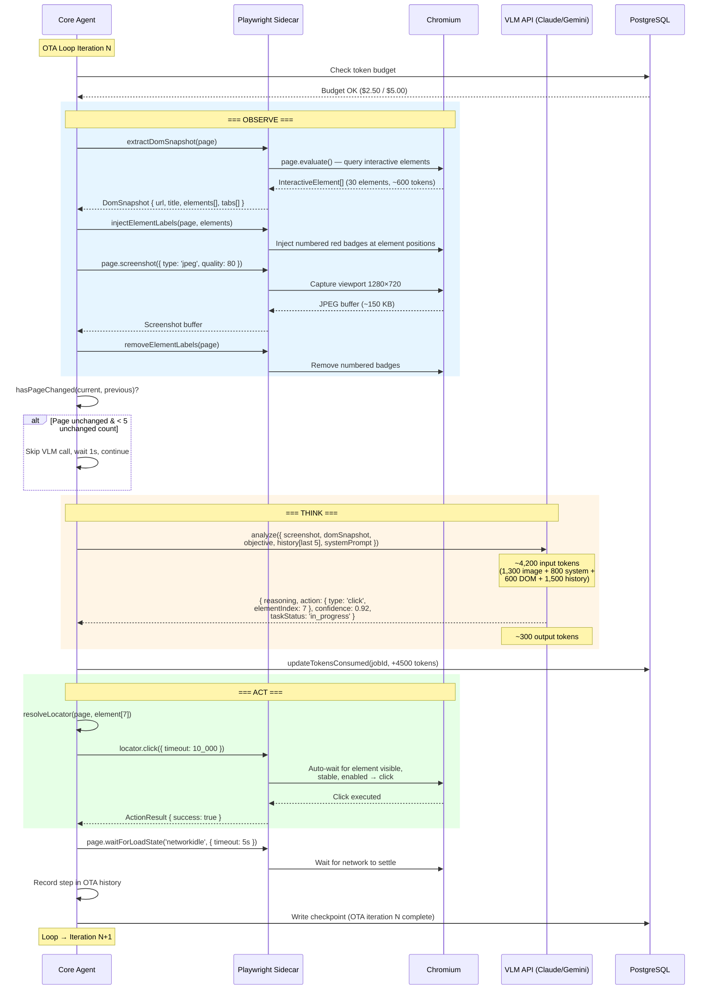
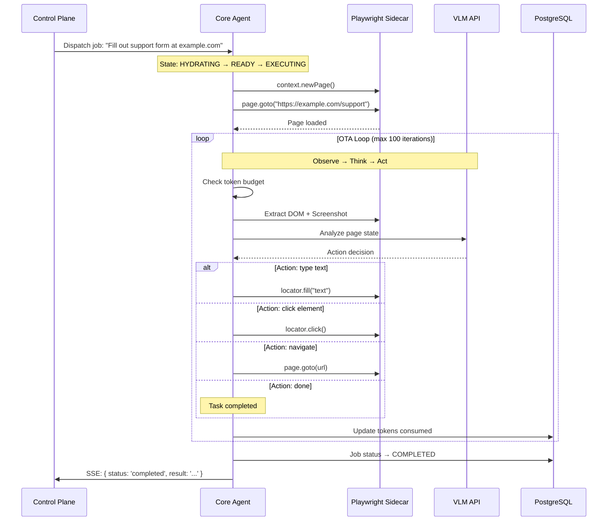
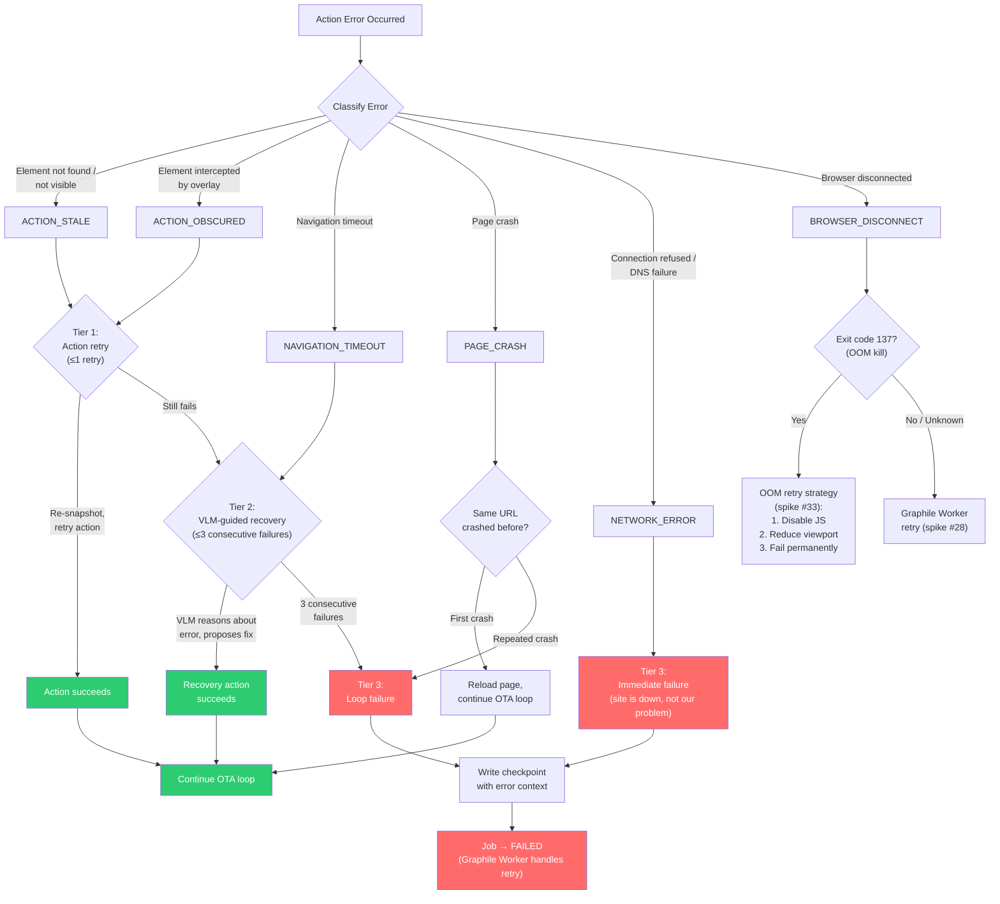

# Spike #35 — Playwright: Observe-Think-Act Loop Design

**Status:** Proposed
**Date:** 2026-02-24
**Author:** Cortex Plane Team
**Depends on:** [Spike #33 — Agent Pods: Security Model](./033-pod-security.md), [Spike #34 — Agent Lifecycle State Machine](./034-agent-lifecycle.md)

---

## Table of Contents

1. [Context](#context)
2. [Question 1: Screenshot Format — PNG vs JPEG](#question-1-screenshot-format--png-vs-jpeg)
3. [Question 2: DOM Capture — Full HTML vs Accessibility Tree](#question-2-dom-capture--full-html-vs-accessibility-tree)
4. [Question 3: VLM Integration — Model Selection for Spatial Reasoning](#question-3-vlm-integration--model-selection-for-spatial-reasoning)
5. [Question 4: Action Dispatch — CDP vs Playwright High-Level API](#question-4-action-dispatch--cdp-vs-playwright-high-level-api)
6. [Question 5: Multi-Tab — Tab Focus Decision Logic](#question-5-multi-tab--tab-focus-decision-logic)
7. [Question 6: Error Recovery — Page Crash, Timeout, Element Not Found](#question-6-error-recovery--page-crash-timeout-element-not-found)
8. [Question 7: Asset Storage — Screenshots on PVC](#question-7-asset-storage--screenshots-on-pvc)
9. [Question 8: Rate Limiting — Token Burn Control](#question-8-rate-limiting--token-burn-control)
10. [Artifact: OTA Loop Sequence Diagram](#artifact-ota-loop-sequence-diagram)
11. [Artifact: Screenshot Capture Configuration](#artifact-screenshot-capture-configuration)
12. [Artifact: VLM Prompt Template for Spatial Analysis](#artifact-vlm-prompt-template-for-spatial-analysis)
13. [Artifact: Error Recovery Decision Tree](#artifact-error-recovery-decision-tree)
14. [Artifact: Token Budget Analysis Per Loop Iteration](#artifact-token-budget-analysis-per-loop-iteration)
15. [Design Decisions](#design-decisions)
16. [Open Questions](#open-questions)

---

## Context

The spec (§14.1) describes a three-phase browser interaction loop: Observe (screenshot + DOM), Think (VLM analysis), Act (Playwright action dispatch). Spikes #33 and #34 define the pod security model and agent lifecycle — the Playwright sidecar runs as a co-located container with 2Gi memory, dropped capabilities, and its own `/dev/shm` emptyDir. Spike #33's OOM handling strategy (§Artifact: OOM Handling Strategy) covers crash recovery for Chromium.

This spike fills the gap: what happens *inside* the OTA loop? How does the agent observe the browser, reason about what it sees, and dispatch precise actions? Every design choice here trades off between three competing concerns:

1. **Accuracy.** The agent must identify the correct element and execute the right action.
2. **Token cost.** Screenshots are expensive — a single 1280×720 image consumes ~1,300 tokens in Claude's vision API. At $15/MTok for Opus input, each screenshot costs ~$0.02. A 50-iteration task costs $1 in screenshots alone.
3. **Latency.** Each OTA loop iteration takes 3–8 seconds (screenshot + VLM inference + action). The loop frequency determines task completion speed.

### Scope Boundary

This spike covers the **OTA loop mechanics**: screenshot capture, DOM observation, VLM reasoning, action dispatch, and error handling. It does NOT cover:

- **User-facing browser UI** (spec §14.2–14.4) — VNC streaming, annotation layer, bidirectional control. These are presentation concerns for a future spike.
- **Cookie/auth handoff** (spec §14.3) — session injection from user browser to Playwright. Separate authentication spike.
- **Playwright OOM recovery** (spike #33) — already defined. This spike references it.

### Hard Constraints

| Constraint | Implication |
|---|---|
| Playwright sidecar: 2Gi memory, 1 CPU (spike #33) | Single browser context, limited concurrent pages. Heavy SPAs may OOM. |
| `readOnlyRootFilesystem: true` (spike #33) | Screenshots written to emptyDir `/workspace` or `/tmp`, not container filesystem. |
| Egress: HTTPS 443 only, private IPs blocked (spike #33) | Playwright can reach public sites. Cannot reach internal homelab services or LAN hosts. |
| Agent pod is a k8s Job, `restartPolicy: Never` (spike #34) | If the OTA loop crashes, the entire job fails. Recovery via Graphile Worker retry. |
| Token budget per job (spike #34) | OTA loops must track cumulative token spend. Budget exhaustion stops the loop. |
| `terminationGracePeriodSeconds: 65` (spike #34) | During drain, in-flight OTA iterations have 45 seconds to complete or abort. |

---

## Question 1: Screenshot Format — PNG vs JPEG

**Question:** What image format should screenshots use? What resolution? What compression settings optimize for context window efficiency?

**Decision:** JPEG at quality 80, 1280×720 resolution. Not PNG.

### Format Comparison

| Criterion | PNG | JPEG (q80) | WebP (q80) |
|---|---|---|---|
| **File size** (1280×720, typical web page) | 800 KB–2 MB | 80–200 KB | 60–150 KB |
| **Text legibility** | Lossless — perfect | Excellent at q80. Artifacts appear below q60. | Excellent |
| **Color accuracy** | Exact | Sufficient for UI analysis | Sufficient |
| **Transparency** | Supported | Not supported | Supported |
| **VLM token cost** (Claude) | ~1,300 tokens* | ~1,300 tokens* | Not natively supported by all VLMs |
| **Capture time** (Playwright) | 50–150ms | 20–60ms | 30–80ms |
| **Bandwidth** (agent → VLM API) | High — 1 MB average | Low — 150 KB average | Lowest |

*Claude's vision API tokenizes images based on dimensions, not file size. A 1280×720 image is resized to fit within the model's tiling grid and costs approximately 1,300 tokens regardless of format. JPEG's advantage is not fewer tokens — it's faster capture, smaller storage, and faster HTTP upload to the VLM API.

### Why JPEG, Not PNG

1. **File size = upload latency.** Each OTA iteration sends the screenshot to the VLM API over HTTPS. A 1.5 MB PNG takes 120ms to upload on a 100 Mbps connection; a 150 KB JPEG takes 12ms. Over 50 iterations, PNG adds 5.4 seconds of cumulative upload time.

2. **Storage footprint.** Screenshots are stored on the workspace emptyDir (500Mi limit, spike #33). At 50 screenshots per task, PNG would consume 75 MB; JPEG consumes 7.5 MB. PNG risks filling the workspace volume during long tasks.

3. **Token cost is identical.** Claude's vision API (and Gemini's) tokenizes based on image dimensions after internal resizing, not file format. A 1280×720 PNG and a 1280×720 JPEG at quality 80 produce the same number of tokens. The format choice has zero impact on API cost.

4. **Text legibility at q80.** JPEG quality 80 preserves sharp text edges. Artifacts become visible at quality 60 and below — small font text (10px) shows ringing artifacts that could mislead the VLM. Quality 80 is the sweet spot: 10× smaller than PNG with no perceptible quality loss for UI analysis.

5. **WebP is better but riskier.** WebP at quality 80 is 20–30% smaller than JPEG with equal or better quality. However, not all VLM APIs natively support WebP (Claude does; Gemini does; some providers don't). JPEG is universally supported. If we add WebP support later, it's a one-line format change.

### Resolution: 1280×720

| Resolution | Token Cost (Claude) | UI Detail Level | Recommended Use |
|---|---|---|---|
| 640×480 | ~340 tokens | Low — small text illegible, icons blurry | Not recommended |
| 1024×768 | ~860 tokens | Medium — most UI readable, some small elements unclear | Acceptable fallback |
| **1280×720** | **~1,300 tokens** | **High — all standard UI text readable, buttons identifiable** | **Default** |
| 1920×1080 | ~2,600 tokens | Very high — pixel-perfect, but 2× token cost | Only when 1280×720 is insufficient |

Why 1280×720:

- **Matches common viewport sizes.** Most web applications are designed for 1280px+ width. Narrower viewports trigger responsive breakpoints that change layout — the agent would see a mobile view, not the desktop view.
- **Token cost is manageable.** At ~1,300 tokens per screenshot and $15/MTok (Opus input), each screenshot costs $0.019. A 50-iteration task spends $0.97 on screenshots.
- **Sufficient detail.** Body text at 14px+, button labels, form field placeholders, navigation items — all legible at 1280×720. Only fine-print text (<10px) becomes marginal.

### Viewport and DPR

```typescript
const SCREENSHOT_CONFIG = {
  viewport: { width: 1280, height: 720 },
  deviceScaleFactor: 1,    // CSS pixels = device pixels. No HiDPI.
  format: 'jpeg' as const,
  quality: 80,
  fullPage: false,         // Viewport only, not full scroll height.
  // fullPage screenshots of long pages can be 5000px+ tall,
  // blowing up token cost to 8K+ tokens.
} as const;
```

`deviceScaleFactor: 1` is critical. Setting DPR to 2 (Retina) quadruples the pixel count (2560×1440 actual pixels), doubling token cost with no accuracy benefit — VLMs don't gain spatial reasoning from subpixel detail.

`fullPage: false` captures only the visible viewport. Full-page screenshots of scrollable content produce enormous images (1280×5000+) that explode token costs. If the agent needs below-the-fold content, it scrolls and takes a new viewport screenshot.

---

## Question 2: DOM Capture — Full HTML vs Accessibility Tree

**Question:** Should the agent capture the full HTML DOM, or a structured accessibility tree? Can the accessibility tree replace screenshots?

**Decision:** Use a simplified accessibility tree as the primary structural signal, paired with the screenshot for spatial reasoning. Not full HTML.

### Options Evaluated

| Approach | Size (typical page) | Useful Content | Token Cost |
|---|---|---|---|
| **Full HTML** (`page.content()`) | 200 KB–2 MB | Low — bloated with CSS classes, SVG paths, tracking scripts, inline styles | 50K–500K tokens — exceeds context window |
| **Outer HTML of visible elements** | 20–100 KB | Medium — still contains irrelevant attributes | 5K–25K tokens |
| **Accessibility tree** (`page.accessibility.snapshot()`) | 2–15 KB | High — role, name, value, description, focused state | 500–4,000 tokens |
| **Custom DOM extraction** | 5–20 KB | High — tailored to agent needs | 1,500–5,000 tokens |

### Why Accessibility Tree

1. **Information density.** The accessibility tree contains exactly what the VLM needs to reason about interactive elements: role (button, link, textbox, checkbox), name (the visible label), value (current input value), and state (disabled, checked, expanded). Full HTML buries this information under `<div class="css-1a2b3c flex items-center gap-2 px-4 py-2 bg-blue-500 hover:bg-blue-600 rounded-lg">`.

2. **Predictable size.** A complex dashboard page with 200+ interactive elements produces a 10 KB accessibility tree. The same page's HTML is 500 KB. The accessibility tree fits comfortably in the VLM prompt alongside the screenshot; full HTML would consume the entire context window.

3. **Semantic structure.** The tree reflects the user-facing structure, not the implementation structure. A React component tree with 15 nested `<div>`s wrapping a button appears as a single `{ role: 'button', name: 'Submit' }` in the accessibility tree. This is what the agent needs.

4. **Built-in element identification.** Playwright's accessibility API returns a tree where each node can be mapped back to a DOM element via ARIA attributes or role+name selectors. The VLM can reference elements by their accessibility name ("click the 'Submit' button"), and the agent can translate that to a Playwright selector (`page.getByRole('button', { name: 'Submit' })`).

### Accessibility Tree Limitations

The accessibility tree misses:

- **Visual layout.** The tree is hierarchical, not spatial. It doesn't tell you that the "Submit" button is in the bottom-right corner. The screenshot provides spatial context.
- **Non-interactive visual elements.** Images, decorative icons, charts, and visual indicators (color-coded status badges) aren't in the accessibility tree. The screenshot captures these.
- **Custom widgets.** Poorly-built web applications may have interactive elements without proper ARIA attributes. These appear in the screenshot but not the tree.

This is why the design uses **both**: the accessibility tree for structural identification, the screenshot for spatial reasoning and visual context. Neither alone is sufficient.

### Custom DOM Extraction

Playwright's `page.accessibility.snapshot()` has limitations — it returns a tree rooted at the document, including off-screen elements. For OTA loop efficiency, we extract a filtered subset:

```typescript
interface DomSnapshot {
  url: string;
  title: string;
  /** Visible interactive elements with bounding boxes. */
  elements: InteractiveElement[];
  /** Viewport dimensions. */
  viewport: { width: number; height: number };
}

interface InteractiveElement {
  /** Unique index for this element (used in VLM response to identify targets). */
  index: number;
  /** ARIA role or tag name. */
  role: string;
  /** Accessible name (visible text, aria-label, or alt text). */
  name: string;
  /** Current value (for inputs, selects, checkboxes). */
  value?: string;
  /** Bounding box in viewport coordinates. */
  bbox: { x: number; y: number; width: number; height: number };
  /** Whether the element is currently focused. */
  focused: boolean;
  /** Additional attributes: href for links, type for inputs. */
  attributes: Record<string, string>;
}
```

The extraction function runs in the browser context via `page.evaluate()`:

```typescript
async function extractDomSnapshot(page: Page): Promise<DomSnapshot> {
  return page.evaluate(() => {
    const interactiveSelectors = [
      'a[href]', 'button', 'input', 'select', 'textarea',
      '[role="button"]', '[role="link"]', '[role="tab"]',
      '[role="menuitem"]', '[role="checkbox"]', '[role="radio"]',
      '[role="switch"]', '[role="combobox"]', '[role="listbox"]',
      '[contenteditable="true"]',
    ];

    const elements: InteractiveElement[] = [];
    let index = 0;

    for (const selector of interactiveSelectors) {
      for (const el of document.querySelectorAll(selector)) {
        const rect = el.getBoundingClientRect();

        // Skip elements outside the viewport.
        if (rect.bottom < 0 || rect.top > window.innerHeight ||
            rect.right < 0 || rect.left > window.innerWidth ||
            rect.width === 0 || rect.height === 0) {
          continue;
        }

        // Skip hidden elements.
        const style = window.getComputedStyle(el);
        if (style.display === 'none' || style.visibility === 'hidden' ||
            style.opacity === '0') {
          continue;
        }

        elements.push({
          index: index++,
          role: el.getAttribute('role') || el.tagName.toLowerCase(),
          name: (el as HTMLElement).innerText?.slice(0, 100) ||
                el.getAttribute('aria-label') ||
                el.getAttribute('alt') ||
                el.getAttribute('placeholder') || '',
          value: (el as HTMLInputElement).value || undefined,
          bbox: {
            x: Math.round(rect.x),
            y: Math.round(rect.y),
            width: Math.round(rect.width),
            height: Math.round(rect.height),
          },
          focused: document.activeElement === el,
          attributes: {
            ...(el.getAttribute('href') && { href: el.getAttribute('href')! }),
            ...(el.getAttribute('type') && { type: el.getAttribute('type')! }),
            ...(el.getAttribute('name') && { name: el.getAttribute('name')! }),
            ...((el as HTMLElement).dataset.testid && { testid: (el as HTMLElement).dataset.testid! }),
          },
        });
      }
    }

    return {
      url: window.location.href,
      title: document.title,
      elements,
      viewport: { width: window.innerWidth, height: window.innerHeight },
    };
  });
}
```

### Element Index Overlay

To help the VLM correlate the DOM snapshot with the screenshot, we inject numbered labels onto the page before taking the screenshot:

```typescript
async function injectElementLabels(page: Page, elements: InteractiveElement[]): Promise<void> {
  await page.evaluate((els) => {
    // Remove previous labels.
    document.querySelectorAll('[data-ota-label]').forEach(el => el.remove());

    for (const el of els) {
      const label = document.createElement('div');
      label.setAttribute('data-ota-label', String(el.index));
      label.style.cssText = `
        position: fixed;
        left: ${el.bbox.x - 2}px;
        top: ${el.bbox.y - 14}px;
        background: #e74c3c;
        color: white;
        font-size: 10px;
        font-weight: bold;
        padding: 1px 3px;
        border-radius: 2px;
        z-index: 999999;
        pointer-events: none;
        font-family: monospace;
      `;
      label.textContent = String(el.index);
      document.body.appendChild(label);
    }
  }, elements);
}

async function removeElementLabels(page: Page): Promise<void> {
  await page.evaluate(() => {
    document.querySelectorAll('[data-ota-label]').forEach(el => el.remove());
  });
}
```

The VLM sees numbered red badges on the screenshot and a corresponding numbered list in the DOM snapshot. It references elements by index: "Click element [7]" rather than attempting pixel coordinate estimation.

---

## Question 3: VLM Integration — Model Selection for Spatial Reasoning

**Question:** Which model should power the "Think" phase? Claude Opus 4.6 vision? Gemini 3.1 Pro? Both?

**Decision:** Claude Opus 4.6 as the primary VLM. Gemini 3.1 Pro as a fallback. The interface abstracts the provider so swapping is a config change.

### Model Comparison for OTA Tasks

| Criterion | Claude Opus 4.6 | Gemini 3.1 Pro |
|---|---|---|
| **Image understanding** | Excellent — identifies UI elements, reads text, understands layout | Excellent — strong spatial reasoning, native multimodal |
| **Structured output** | Reliable JSON output with tool use / system prompt constraints | Reliable JSON output with response schema |
| **Bounding box accuracy** | Good — can estimate element locations when asked, but not pixel-precise | Good — similar capability, Google has invested in grounding |
| **Context window** | 200K tokens | 1M tokens |
| **Vision token cost** | ~1,300 tokens per 1280×720 image | ~1,100 tokens per 1280×720 image (slightly more efficient tiling) |
| **Input pricing** | $15/MTok (Opus) | $3.50/MTok (Pro) |
| **Output pricing** | $75/MTok (Opus) | $10.50/MTok (Pro) |
| **Latency (vision)** | 3–6 seconds for analysis | 2–4 seconds for analysis |
| **API reliability** | High | High |

### Why Claude Opus Primary, Gemini Fallback

1. **Consistency with the rest of the stack.** Cortex Plane uses Claude as its primary LLM for agent reasoning (spec §4.2). Using the same provider for browser analysis keeps the prompt engineering consistent and reduces the number of API keys, billing accounts, and provider-specific error handling paths.

2. **Tool use integration.** The OTA loop's "Think" phase produces a structured action (click element X, type "foo" into element Y, scroll down). Claude's tool use API is a natural fit — the VLM response is a tool call, not free-form text that needs parsing. This eliminates a class of output parsing failures.

3. **Cost is acceptable at Opus rates.** A single OTA iteration at Opus rates costs approximately $0.06 (see Token Budget Analysis). A 30-iteration task costs $1.80. This is significant but manageable for agent tasks that would take a human 10+ minutes.

4. **Gemini as cost-optimized fallback.** For high-volume, low-complexity browser tasks (data extraction, form filling with clear labels), Gemini 3.1 Pro provides equivalent accuracy at ~4× lower cost. The agent configuration (`model_config` JSONB in the agent table, spike #25) specifies which VLM to use per agent. Cost-sensitive agents use Gemini; accuracy-critical agents use Opus.

### Provider Abstraction

```typescript
interface VlmProvider {
  analyze(params: VlmAnalysisParams): Promise<VlmAnalysisResult>;
}

interface VlmAnalysisParams {
  screenshot: Buffer;       // JPEG bytes
  domSnapshot: DomSnapshot;
  objective: string;        // Current task objective
  history: OtaStep[];       // Previous loop iterations for context
  systemPrompt: string;
}

interface VlmAnalysisResult {
  reasoning: string;        // Chain-of-thought explanation
  action: BrowserAction;    // Structured action to execute
  confidence: number;       // 0–1 confidence in the action
  taskStatus: 'in_progress' | 'completed' | 'stuck' | 'failed';
}

type BrowserAction =
  | { type: 'click'; elementIndex: number }
  | { type: 'type'; elementIndex: number; text: string }
  | { type: 'select'; elementIndex: number; value: string }
  | { type: 'scroll'; direction: 'up' | 'down'; pixels: number }
  | { type: 'navigate'; url: string }
  | { type: 'wait'; seconds: number; reason: string }
  | { type: 'screenshot'; region?: { x: number; y: number; width: number; height: number } }
  | { type: 'done'; result: string };
```

The `VlmProvider` interface lets the agent swap between Claude and Gemini without changing the OTA loop logic. The provider translates the common `VlmAnalysisParams` into provider-specific API calls (Claude tool use, Gemini function calling).

### Why NOT Pixel Coordinates

Some browser automation approaches ask the VLM to output pixel coordinates for click targets ("click at (450, 320)"). This is fragile:

1. **VLMs are not pixel-precise.** Claude and Gemini estimate coordinates with ±20–50px error. A 40px-wide button at (450, 320) could be missed if the VLM estimates (470, 340).
2. **Coordinates shift between screenshots.** Dynamic content, animations, and layout reflows change element positions between the screenshot capture and the action execution.
3. **Element indices are robust.** The numbered overlay + DOM snapshot gives the VLM a symbolic reference ("element [7]") that maps to a stable Playwright selector. Playwright's auto-waiting and element stability checks handle any minor layout shifts.

The element index approach converts the spatial reasoning problem into a classification problem: "which numbered element should I interact with?" Classification is what VLMs do best.

---

## Question 4: Action Dispatch — CDP vs Playwright High-Level API

**Question:** Should the agent dispatch actions via Chrome DevTools Protocol (CDP) directly, or use Playwright's high-level API (`page.click()`, `page.fill()`, etc.)?

**Decision:** Playwright's high-level API for all standard interactions. CDP only for operations Playwright doesn't expose natively.

### Comparison

| Criterion | Playwright High-Level API | CDP Direct |
|---|---|---|
| **Auto-waiting** | Built-in: waits for element to be visible, stable, enabled, not obscured | None — fires immediately, may hit stale/invisible elements |
| **Retry on failure** | Built-in actionability checks with configurable timeout | Manual retry implementation required |
| **Element identification** | `getByRole()`, `getByText()`, `getByLabel()` — semantic selectors | `DOM.querySelector()` — CSS selectors only |
| **Input simulation** | Fires all associated events (focus, keydown, keypress, keyup, input, change) | `Input.dispatchMouseEvent` fires only the specified event — forms may not register input |
| **Shadow DOM** | Transparent — Playwright pierces shadow roots | Requires `DOM.describeNode` with `pierce: true` |
| **iframe handling** | `frame.locator()` — seamless cross-frame interaction | Manual `Page.getFrameTree`, `Target.attachToTarget` |
| **Error messages** | Descriptive: "element is not visible", "element is disabled" | Raw protocol errors: "Could not find node" |
| **Maintenance** | Stable API — breaking changes are rare and documented | CDP is Chrome-internal — methods change between Chrome versions |

### Playwright API for Standard Actions

The element index from the DOM snapshot maps to a Playwright locator:

```typescript
async function executeAction(
  page: Page,
  action: BrowserAction,
  elements: InteractiveElement[],
): Promise<ActionResult> {
  // Remove the number overlay labels before executing actions.
  await removeElementLabels(page);

  switch (action.type) {
    case 'click': {
      const el = elements[action.elementIndex];
      if (!el) throw new ActionError(`Element [${action.elementIndex}] not found`);
      const locator = resolveLocator(page, el);
      await locator.click({ timeout: 10_000 });
      return { success: true, action: `Clicked element [${action.elementIndex}]: ${el.name}` };
    }

    case 'type': {
      const el = elements[action.elementIndex];
      if (!el) throw new ActionError(`Element [${action.elementIndex}] not found`);
      const locator = resolveLocator(page, el);
      await locator.fill(action.text, { timeout: 10_000 });
      return { success: true, action: `Typed "${action.text}" into [${action.elementIndex}]` };
    }

    case 'select': {
      const el = elements[action.elementIndex];
      if (!el) throw new ActionError(`Element [${action.elementIndex}] not found`);
      const locator = resolveLocator(page, el);
      await locator.selectOption(action.value, { timeout: 10_000 });
      return { success: true, action: `Selected "${action.value}" in [${action.elementIndex}]` };
    }

    case 'scroll': {
      await page.mouse.wheel(0, action.direction === 'down' ? action.pixels : -action.pixels);
      return { success: true, action: `Scrolled ${action.direction} ${action.pixels}px` };
    }

    case 'navigate': {
      await page.goto(action.url, { timeout: 30_000, waitUntil: 'domcontentloaded' });
      return { success: true, action: `Navigated to ${action.url}` };
    }

    case 'wait': {
      await page.waitForTimeout(action.seconds * 1000);
      return { success: true, action: `Waited ${action.seconds}s: ${action.reason}` };
    }

    case 'done': {
      return { success: true, action: `Task completed: ${action.result}`, done: true };
    }

    default:
      throw new ActionError(`Unknown action type: ${(action as BrowserAction).type}`);
  }
}
```

### Locator Resolution Strategy

The element index maps to a Playwright locator using a priority chain:

```typescript
function resolveLocator(page: Page, element: InteractiveElement): Locator {
  // Priority 1: data-testid (most stable, if available).
  if (element.attributes.testid) {
    return page.getByTestId(element.attributes.testid);
  }

  // Priority 2: Role + name (semantic, resilient to refactors).
  if (element.role && element.name) {
    const roleMapping: Record<string, string> = {
      a: 'link', button: 'button', input: 'textbox',
      select: 'combobox', textarea: 'textbox',
      checkbox: 'checkbox', radio: 'radio',
    };
    const ariaRole = roleMapping[element.role] || element.role;
    return page.getByRole(ariaRole as any, { name: element.name });
  }

  // Priority 3: Bounding box click (last resort).
  // Click the center of the element's bounding box.
  const centerX = element.bbox.x + element.bbox.width / 2;
  const centerY = element.bbox.y + element.bbox.height / 2;
  return page.locator(`xpath=//body`).and(
    page.locator(`:nth-match(*, 1)`),
  );
  // Fallback: coordinate-based click via page.mouse.click().
  // This bypasses Playwright's auto-waiting — use only when locators fail.
}

/** Fallback: coordinate-based click when locator resolution fails. */
async function clickByCoordinates(
  page: Page,
  element: InteractiveElement,
): Promise<void> {
  const centerX = element.bbox.x + element.bbox.width / 2;
  const centerY = element.bbox.y + element.bbox.height / 2;
  await page.mouse.click(centerX, centerY);
}
```

### When CDP Is Necessary

| Operation | Why CDP | Playwright Alternative |
|---|---|---|
| **Network interception (advanced)** | CDP `Fetch.requestPaused` gives granular control over individual requests | Playwright `page.route()` covers 95% of cases |
| **Performance tracing** | CDP `Tracing.start/end` | Playwright Trace Viewer (higher-level) |
| **Console message filtering** | CDP `Runtime.consoleAPICalled` with detail | `page.on('console')` (sufficient) |
| **Cookie manipulation** | CDP `Network.setCookie` with SameSite control | `context.addCookies()` (sufficient for auth handoff) |
| **PDF generation with options** | CDP `Page.printToPDF` with header/footer templates | `page.pdf()` (wraps CDP, sufficient) |

For the OTA loop, **no CDP calls are needed**. All observe-think-act operations use Playwright's high-level API. CDP is reserved for future features (auth handoff, performance profiling) that are out of scope for this spike.

---

## Question 5: Multi-Tab — Tab Focus Decision Logic

**Question:** How does the agent decide which tab to focus when multiple tabs are open?

**Decision:** The OTA loop operates on a single active page. Multi-tab handling is event-driven: the agent responds to new tabs (popups, `target="_blank"`) and decides whether to follow or close them. It does not proactively manage a tab pool.

### The Single-Page Default

Most browser automation tasks operate on a single page: navigate, interact, extract, move on. The OTA loop captures the screenshot and DOM snapshot from the **active page** — the one the agent is currently working with. Multi-tab complexity arises only when:

1. **A click opens a new tab** (popup, `target="_blank"` link).
2. **The task requires comparing content across tabs** (e.g., "compare product prices on two sites").
3. **An auth flow redirects through a new tab** (OAuth callback).

### New Tab Handling

```typescript
class OtaTabManager {
  private activePage: Page;
  private readonly context: BrowserContext;
  private readonly maxTabs = 3;

  constructor(context: BrowserContext) {
    this.context = context;
    this.activePage = context.pages()[0]!;

    // Listen for new pages (tabs/popups).
    context.on('page', (newPage) => this.onNewPage(newPage));
  }

  private async onNewPage(newPage: Page): Promise<void> {
    const pages = this.context.pages();

    // Enforce tab limit — close oldest non-active tab if at max.
    if (pages.length > this.maxTabs) {
      const oldest = pages.find(p => p !== this.activePage && p !== newPage);
      if (oldest) await oldest.close();
    }

    // Wait for the new page to load before deciding.
    try {
      await newPage.waitForLoadState('domcontentloaded', { timeout: 10_000 });
    } catch {
      // Page failed to load — close it and stay on current tab.
      await newPage.close();
      return;
    }

    // Record the tab event in the OTA history for the VLM to reason about.
    this.tabEvents.push({
      type: 'new_tab',
      url: newPage.url(),
      title: await newPage.title(),
      timestamp: Date.now(),
    });

    // Auto-follow: switch to the new tab.
    // The VLM will decide whether to stay or go back in the next iteration.
    this.activePage = newPage;
  }

  getActivePage(): Page {
    return this.activePage;
  }

  async switchTo(pageIndex: number): Promise<void> {
    const pages = this.context.pages();
    if (pageIndex < 0 || pageIndex >= pages.length) {
      throw new Error(`Tab index ${pageIndex} out of range (${pages.length} tabs)`);
    }
    this.activePage = pages[pageIndex]!;
    await this.activePage.bringToFront();
  }
}
```

### VLM Tab Context

When multiple tabs are open, the DOM snapshot includes a tab list:

```typescript
interface DomSnapshot {
  url: string;
  title: string;
  elements: InteractiveElement[];
  viewport: { width: number; height: number };
  /** All open tabs. Active tab is marked. */
  tabs: { index: number; url: string; title: string; active: boolean }[];
}
```

The VLM can issue tab-switching actions:

```typescript
type BrowserAction =
  // ... existing actions ...
  | { type: 'switch_tab'; tabIndex: number };
```

### Tab Limit: 3

Three concurrent tabs is the hard limit. Rationale:

1. **Memory.** Each tab consumes 100–300 MB in Chromium. Three tabs at 300 MB = 900 MB, leaving 1.1 GB of the 2Gi Playwright container limit for Chromium overhead.
2. **Complexity.** More tabs = more context for the VLM = higher token cost per iteration. Three tabs means the VLM must reason about at most 3 page states per iteration.
3. **Practical use cases.** No identified browser automation task requires more than 3 simultaneous tabs. Auth flows (main page + OAuth popup) need 2. Comparison tasks need 2–3.

---

## Question 6: Error Recovery — Page Crash, Navigation Timeout, Element Not Found

**Question:** What's the retry strategy for browser-level errors? Page crashes, navigation timeouts, stale elements?

**Decision:** Three-tier error handling: action-level retry (immediate, 2 attempts), step-level recovery (VLM-guided, 3 attempts), loop-level failure (checkpoint and abort).

### Error Classification

| Error | Category | Frequency | Retry Value |
|---|---|---|---|
| Element not found / not visible | `ACTION_STALE` | High — dynamic pages change between snapshot and action | High — re-snapshot resolves it |
| Element intercepted by overlay | `ACTION_OBSCURED` | Medium — cookie banners, modals, tooltips | High — VLM can dismiss the overlay |
| Navigation timeout | `NAVIGATION_TIMEOUT` | Medium — slow servers, CDN issues | Medium — may resolve on retry |
| Page crash (`page.on('crash')`) | `PAGE_CRASH` | Low — Chromium renderer crash | Low — usually repeats on same page |
| `net::ERR_CONNECTION_REFUSED` | `NETWORK_ERROR` | Low — target site is down | None — not our problem |
| JavaScript error on page | `PAGE_JS_ERROR` | Medium — broken site JS | None — not our problem |
| Playwright browser disconnected | `BROWSER_DISCONNECT` | Low — OOM kill or Playwright crash | Medium — restart browser (spike #33 OOM strategy) |

### Tier 1: Action-Level Retry

When a Playwright action fails, retry once after a fresh observation:

```typescript
async function executeActionWithRetry(
  page: Page,
  action: BrowserAction,
  elements: InteractiveElement[],
  maxRetries: number = 1,
): Promise<ActionResult> {
  for (let attempt = 0; attempt <= maxRetries; attempt++) {
    try {
      return await executeAction(page, action, elements);
    } catch (error) {
      if (attempt === maxRetries) throw error;

      const classification = classifyBrowserError(error);

      if (classification === 'ACTION_STALE' || classification === 'ACTION_OBSCURED') {
        // Re-snapshot: elements may have moved or an overlay appeared.
        await page.waitForTimeout(500);
        const freshSnapshot = await extractDomSnapshot(page);
        elements = freshSnapshot.elements;
        continue;
      }

      // Non-retryable at this tier.
      throw error;
    }
  }
  throw new Error('unreachable');
}
```

### Tier 2: Step-Level Recovery (VLM-Guided)

If the action retry fails, the error is reported back to the VLM in the next OTA iteration. The VLM sees what went wrong and chooses a recovery strategy:

```typescript
interface OtaStep {
  iteration: number;
  observation: {
    screenshot: Buffer;
    domSnapshot: DomSnapshot;
  };
  analysis: VlmAnalysisResult;
  actionResult: ActionResult | ActionError;
}
```

The VLM receives the error in the history:

```
Previous action: Click element [7] ("Submit" button)
Result: FAILED — Element [7] is obscured by another element at (640, 360).

You are seeing a new screenshot. The page may have changed.
What should you do next?
```

The VLM might respond: "A cookie consent banner is blocking the button. I'll click 'Accept Cookies' [element 23] first, then retry clicking 'Submit'." This is VLM-guided recovery — the model reasons about the failure and proposes a fix.

If the same action fails 3 times consecutively, the loop escalates to Tier 3.

### Tier 3: Loop-Level Failure

After 3 consecutive failed actions (or a non-recoverable error like page crash or browser disconnect):

```typescript
const MAX_CONSECUTIVE_FAILURES = 3;
const MAX_TOTAL_ITERATIONS = 100;

async function runOtaLoop(
  page: Page,
  objective: string,
  vlmProvider: VlmProvider,
  signal: AbortSignal,
): Promise<OtaResult> {
  const history: OtaStep[] = [];
  let consecutiveFailures = 0;

  for (let iteration = 0; iteration < MAX_TOTAL_ITERATIONS; iteration++) {
    if (signal.aborted) break;

    // === OBSERVE ===
    const elements = await extractDomSnapshot(page);
    await injectElementLabels(page, elements.elements);
    const screenshot = await page.screenshot({
      type: 'jpeg',
      quality: 80,
    });
    await removeElementLabels(page);

    // === THINK ===
    const analysis = await vlmProvider.analyze({
      screenshot,
      domSnapshot: elements,
      objective,
      history: history.slice(-5), // Last 5 steps for context
      systemPrompt: OTA_SYSTEM_PROMPT,
    });

    if (analysis.taskStatus === 'completed') {
      return { success: true, result: analysis.action, iterations: iteration + 1 };
    }

    if (analysis.taskStatus === 'stuck') {
      consecutiveFailures++;
      if (consecutiveFailures >= MAX_CONSECUTIVE_FAILURES) {
        return {
          success: false,
          error: `Agent stuck after ${MAX_CONSECUTIVE_FAILURES} consecutive failures`,
          iterations: iteration + 1,
        };
      }
      continue;
    }

    // === ACT ===
    try {
      const result = await executeActionWithRetry(page, analysis.action, elements.elements);
      history.push({ iteration, observation: { screenshot, domSnapshot: elements }, analysis, actionResult: result });
      consecutiveFailures = 0;

      if (result.done) {
        return { success: true, result: analysis.action, iterations: iteration + 1 };
      }

      // Wait for page to settle after action.
      await page.waitForLoadState('networkidle', { timeout: 5_000 }).catch(() => {});
    } catch (error) {
      history.push({ iteration, observation: { screenshot, domSnapshot: elements }, analysis, actionResult: error as ActionError });
      consecutiveFailures++;

      if (consecutiveFailures >= MAX_CONSECUTIVE_FAILURES) {
        return {
          success: false,
          error: `${MAX_CONSECUTIVE_FAILURES} consecutive action failures. Last error: ${(error as Error).message}`,
          iterations: iteration + 1,
        };
      }
    }
  }

  return {
    success: false,
    error: `Max iterations (${MAX_TOTAL_ITERATIONS}) exceeded`,
    iterations: MAX_TOTAL_ITERATIONS,
  };
}
```

### Browser Disconnect Recovery

When the Playwright browser disconnects (OOM kill, spike #33), the OTA loop cannot recover inline — the browser is gone. The error propagates up to the agent's tool handler, which classifies it as `RESOURCE_EXHAUSTION` and invokes the OOM retry strategy (spike #33: retry with disabled JS, then reduced viewport, then fail permanently).

```typescript
async function handleBrowserDisconnect(error: Error, page: Page): Promise<never> {
  if (error.message.includes('browser has been closed') ||
      error.message.includes('Connection closed')) {
    throw new BrowserCrashError(
      'Playwright browser disconnected — likely OOM kill. ' +
      'Job will be retried with reduced browser settings.',
      { cause: error },
    );
  }
  throw error;
}
```

---

## Question 7: Asset Storage — Screenshots on PVC

**Question:** Where are screenshots stored? How long are they retained? Are they cleaned up?

**Decision:** Screenshots stored on the workspace emptyDir. Retained for the lifetime of the pod (ephemeral). Optionally persisted to PVC for audit, cleaned up after 7 days.

### Storage Strategy

| Storage Tier | Location | Retention | Purpose |
|---|---|---|---|
| **Hot (ephemeral)** | `/workspace/screenshots/` on emptyDir | Pod lifetime | OTA loop working data. Deleted when pod exits. |
| **Warm (audit, optional)** | `/data/sessions/{jobId}/screenshots/` on PVC | 7 days | Post-mortem debugging, audit trail. Cleaned by maintenance task. |

### Ephemeral Storage (Default)

Screenshots are written to the workspace emptyDir during the OTA loop. The emptyDir has a 500Mi size limit (spike #33). Screenshot management:

```typescript
const SCREENSHOT_DIR = '/workspace/screenshots';

class ScreenshotManager {
  private readonly maxScreenshots = 100;
  private readonly maxStorageMb = 200;
  private count = 0;

  async save(screenshot: Buffer, iteration: number): Promise<string> {
    const filename = `${SCREENSHOT_DIR}/ota-${String(iteration).padStart(4, '0')}.jpg`;
    await fs.writeFile(filename, screenshot);
    this.count++;

    // Evict oldest screenshots if limits reached.
    if (this.count > this.maxScreenshots) {
      await this.evictOldest(10);
    }

    return filename;
  }

  private async evictOldest(count: number): Promise<void> {
    const files = await fs.readdir(SCREENSHOT_DIR);
    const sorted = files.sort(); // Lexicographic = chronological (zero-padded).
    for (const file of sorted.slice(0, count)) {
      await fs.unlink(`${SCREENSHOT_DIR}/${file}`);
      this.count--;
    }
  }
}
```

At 150 KB per screenshot (JPEG q80, 1280×720), 100 screenshots consume 15 MB — well within the 500Mi emptyDir limit. The 200 MB soft limit provides headroom for other workspace files.

### Audit Storage (Optional)

For agents that require post-mortem analysis (debugging why an OTA task failed, compliance audits), screenshots are copied to the PVC at the end of each OTA iteration:

```typescript
const AUDIT_DIR = `/data/sessions/${jobId}/screenshots`;

async function persistForAudit(
  screenshot: Buffer,
  iteration: number,
  metadata: { url: string; action: string },
): Promise<void> {
  const basename = `ota-${String(iteration).padStart(4, '0')}`;
  await fs.writeFile(`${AUDIT_DIR}/${basename}.jpg`, screenshot);
  await fs.writeFile(`${AUDIT_DIR}/${basename}.json`, JSON.stringify(metadata));
}
```

### Cleanup

Audit screenshots are cleaned by a maintenance CronJob:

```yaml
apiVersion: batch/v1
kind: CronJob
metadata:
  name: screenshot-cleanup
  namespace: cortex
spec:
  schedule: "0 3 * * *"  # Daily at 3 AM
  jobTemplate:
    spec:
      template:
        spec:
          containers:
            - name: cleanup
              image: busybox:1.37
              command:
                - sh
                - -c
                - find /data/sessions/*/screenshots -mtime +7 -delete
              volumeMounts:
                - name: sessions
                  mountPath: /data/sessions
          restartPolicy: OnFailure
          volumes:
            - name: sessions
              persistentVolumeClaim:
                claimName: agent-workspaces
```

7-day retention balances debuggability (most post-mortems happen within 48 hours) against storage costs. At 100 screenshots per task and 50 tasks per day, audit storage grows at ~750 MB/day. 7 days = ~5.25 GB, well within the PVC capacity.

---

## Question 8: Rate Limiting — Token Burn Control

**Question:** How fast can the OTA loop run without burning excessive tokens? What governs the loop frequency?

**Decision:** The loop runs as fast as the VLM responds — no artificial throttle. Rate control comes from token budgets (spike #34), iteration limits, and visual change detection to skip redundant observations.

### Loop Timing Breakdown

| Phase | Duration | Notes |
|---|---|---|
| **Observe** (screenshot + DOM) | 50–150ms | Playwright screenshot capture + `page.evaluate()` for DOM extraction |
| **Think** (VLM inference) | 3–8 seconds | API latency + model inference. Dominates the loop. |
| **Act** (Playwright action) | 100–500ms | Click, type, navigate. `waitForLoadState` adds 0–5 seconds. |
| **Total per iteration** | **3.5–14 seconds** | Typical: 5–7 seconds |

The VLM inference (Think phase) is the bottleneck. The loop naturally runs at 8–15 iterations per minute. Artificial throttling (e.g., "wait 2 seconds between iterations") would slow task completion without saving tokens — the VLM call is the expensive part, and it happens exactly once per iteration regardless of pacing.

### Token Cost Per Iteration

| Component | Input Tokens | Output Tokens | Cost (Opus) | Cost (Gemini Pro) |
|---|---|---|---|---|
| Screenshot (1280×720 JPEG) | ~1,300 | — | $0.0195 | $0.0046 |
| System prompt (OTA template) | ~800 | — | $0.012 | $0.0028 |
| DOM snapshot (30 elements) | ~600 | — | $0.009 | $0.0021 |
| History (last 5 steps, compressed) | ~1,500 | — | $0.0225 | $0.0053 |
| **Input subtotal** | **~4,200** | — | **$0.063** | **$0.0147** |
| VLM response (reasoning + action) | — | ~300 | $0.0225 | $0.0032 |
| **Total per iteration** | **~4,200** | **~300** | **$0.0855** | **$0.0179** |

### Cost Per Task

| Task Complexity | Iterations | Cost (Opus) | Cost (Gemini Pro) |
|---|---|---|---|
| Simple (fill a form, 5 fields) | 8–12 | $0.68–$1.03 | $0.14–$0.21 |
| Medium (navigate dashboard, extract data) | 20–30 | $1.71–$2.57 | $0.36–$0.54 |
| Complex (multi-page workflow with decisions) | 40–60 | $3.42–$5.13 | $0.72–$1.07 |
| Maximum (100 iterations, hard limit) | 100 | $8.55 | $1.79 |

### Token Budget Integration

The OTA loop checks the job's token budget (spike #34) before each VLM call:

```typescript
async function otaLoopWithBudget(
  page: Page,
  objective: string,
  vlmProvider: VlmProvider,
  tokenBudget: TokenBudget,
  jobId: string,
  signal: AbortSignal,
): Promise<OtaResult> {
  for (let iteration = 0; iteration < MAX_TOTAL_ITERATIONS; iteration++) {
    if (signal.aborted) break;

    // Check token budget before the expensive VLM call.
    const consumed = await getTokensConsumed(jobId);
    if (consumed.cost_usd + ESTIMATED_COST_PER_ITERATION > tokenBudget.maxCostUsdPerJob) {
      return {
        success: false,
        error: `Token budget would be exceeded. Consumed: $${consumed.cost_usd.toFixed(2)}, ` +
               `Budget: $${tokenBudget.maxCostUsdPerJob.toFixed(2)}`,
        iterations: iteration,
      };
    }

    // ... observe, think, act ...

    // Update consumed tokens after VLM call.
    await updateTokensConsumed(jobId, {
      input: consumed.input + analysisTokens.input,
      output: consumed.output + analysisTokens.output,
      cost_usd: consumed.cost_usd + analysisTokens.cost_usd,
    });
  }
}

const ESTIMATED_COST_PER_ITERATION = 0.09; // $0.09 at Opus rates — slight overestimate for safety
```

### Visual Change Detection

The most effective token-saving optimization: skip the VLM call if the page hasn't changed since the last observation.

```typescript
async function hasPageChanged(
  currentScreenshot: Buffer,
  previousScreenshot: Buffer | null,
  threshold: number = 0.02, // 2% pixel difference
): Promise<boolean> {
  if (!previousScreenshot) return true;

  // Fast structural comparison: if the JPEG file sizes differ by >10%,
  // the page has changed. No pixel-level comparison needed.
  const sizeDiff = Math.abs(currentScreenshot.length - previousScreenshot.length);
  const sizeRatio = sizeDiff / previousScreenshot.length;
  if (sizeRatio > 0.10) return true;
  if (sizeRatio < 0.01) return false;

  // Medium comparison: compare a hash of the screenshot bytes.
  // Two identical-looking pages produce identical JPEGs (deterministic encoding).
  const currentHash = createHash('sha256').update(currentScreenshot).digest('hex');
  const previousHash = createHash('sha256').update(previousScreenshot).digest('hex');
  return currentHash !== previousHash;
}
```

When the page hasn't changed (common after a `wait` action or when waiting for an async operation), the loop skips the VLM call and re-checks after a short delay:

```typescript
if (!await hasPageChanged(screenshot, previousScreenshot)) {
  // Page unchanged — no need to call the VLM.
  await page.waitForTimeout(1_000);
  unchangedCount++;

  if (unchangedCount >= 5) {
    // Page has been static for 5 seconds. Ask the VLM what to do.
    // (Maybe we need to scroll, or the task is done.)
    unchangedCount = 0;
    // Fall through to the VLM call.
  } else {
    continue; // Skip this iteration.
  }
}
unchangedCount = 0;
previousScreenshot = screenshot;
```

This optimization eliminates ~30% of VLM calls in typical tasks (form filling where the page doesn't change between typing into different fields).

---

## Artifact: OTA Loop Sequence Diagram



### Full OTA Task Lifecycle



---

## Artifact: Screenshot Capture Configuration

```typescript
/**
 * Screenshot capture configuration for the OTA loop.
 *
 * These values are optimized for the tradeoff between
 * VLM accuracy, token cost, and capture speed.
 */
export const SCREENSHOT_CONFIG = {
  /** Viewport dimensions. 1280×720 is the sweet spot:
   *  - Triggers desktop layout (not mobile responsive breakpoints)
   *  - ~1,300 tokens in Claude vision
   *  - All standard UI text (14px+) is legible */
  viewport: {
    width: 1280,
    height: 720,
  },

  /** Device scale factor. 1 = no HiDPI.
   *  DPR 2 would quadruple pixel count and double token cost
   *  with no accuracy benefit for element identification. */
  deviceScaleFactor: 1,

  /** Image format. JPEG at quality 80 provides:
   *  - 10× smaller files than PNG (150 KB vs 1.5 MB)
   *  - Identical token cost (VLM tokenizes by dimensions, not format)
   *  - No perceptible quality loss for UI text and buttons */
  format: 'jpeg' as const,
  quality: 80,

  /** Capture viewport only, not full scrollable page.
   *  Full-page screenshots of long pages produce 1280×5000+ images
   *  that cost 5,000+ tokens. Scroll and re-capture instead. */
  fullPage: false,

  /** Maximum screenshots retained in ephemeral storage.
   *  At 150 KB each, 100 screenshots = 15 MB. */
  maxScreenshots: 100,

  /** Maximum total screenshot storage (MB) on workspace emptyDir. */
  maxStorageMb: 200,

  /** Directory for ephemeral screenshots. */
  screenshotDir: '/workspace/screenshots',

  /** Visual change detection threshold.
   *  JPEG file size difference ratio below which the page is
   *  considered unchanged. 0.01 = 1% size difference. */
  changeThresholdRatio: 0.01,
} as const;

/**
 * Playwright browser context options for OTA agents.
 */
export const BROWSER_CONTEXT_OPTIONS = {
  viewport: SCREENSHOT_CONFIG.viewport,
  deviceScaleFactor: SCREENSHOT_CONFIG.deviceScaleFactor,

  /** Standard desktop user agent. Avoids mobile-specific layouts
   *  and bot detection that blocks headless Chrome. */
  userAgent: 'Mozilla/5.0 (X11; Linux x86_64) AppleWebKit/537.36 ' +
             '(KHTML, like Gecko) Chrome/131.0.0.0 Safari/537.36',

  /** Accept English content. */
  locale: 'en-US',

  /** Standard timezone for consistent date/time rendering. */
  timezoneId: 'UTC',

  /** Disable geolocation — agents don't need it. */
  geolocation: undefined,
  permissions: [],

  /** Enable JavaScript by default.
   *  Disabled on OOM retry (spike #33 retry strategy). */
  javaScriptEnabled: true,

  /** Ignore HTTPS errors — agents may interact with staging sites
   *  using self-signed certificates. */
  ignoreHTTPSErrors: true,
} as const;
```

---

## Artifact: VLM Prompt Template for Spatial Analysis

```typescript
export const OTA_SYSTEM_PROMPT = `You are a browser automation agent executing a specific task. You interact with web pages through an Observe-Think-Act loop.

## How This Works

Each turn, you receive:
1. A screenshot of the current browser viewport (1280×720).
2. A list of interactive elements with numbered indices [0], [1], [2], etc. These numbers appear as red badges on the screenshot.
3. The history of your previous actions and their results.

You must respond with:
1. Your reasoning about the current page state and what to do next.
2. A single action to execute.

## Rules

- Reference elements by their index number: "Click element [7]" not "Click the Submit button at coordinates (450, 320)".
- Execute one action per turn. After the action, you will see a new screenshot.
- If an element you need is below the fold, scroll down first.
- If a modal, popup, or cookie banner is blocking your target, dismiss it first.
- If the page hasn't loaded yet, use a wait action.
- If you are stuck (same error 3+ times), report taskStatus: "stuck".
- When the task is complete, use the "done" action with a summary of what was accomplished.
- Stay focused on the objective. Do not explore unrelated pages or click unnecessary elements.

## Available Actions

- click: Click an element by index.
- type: Type text into an input element by index.
- select: Select an option in a dropdown by index and value.
- scroll: Scroll up or down by a pixel amount.
- navigate: Go to a specific URL.
- wait: Wait for a specified number of seconds (max 10).
- switch_tab: Switch to a different browser tab by index.
- done: Task is complete. Provide the result.

## Important

- The numbered red badges [0], [1], [2]... on the screenshot correspond to the elements list.
- Some elements may be partially visible or obscured. Note this in your reasoning.
- Form fields may have validation. If a submit fails, check for error messages.
- After clicking a link or button, the page may change. Wait for the new page to load before acting.
`;

/**
 * Build the user message for a single OTA iteration.
 */
export function buildOtaUserMessage(params: {
  objective: string;
  domSnapshot: DomSnapshot;
  history: OtaStep[];
  errorContext?: string;
}): string {
  const { objective, domSnapshot, history, errorContext } = params;

  let message = `## Objective\n${objective}\n\n`;

  message += `## Current Page\n`;
  message += `URL: ${domSnapshot.url}\n`;
  message += `Title: ${domSnapshot.title}\n\n`;

  if (domSnapshot.tabs.length > 1) {
    message += `## Open Tabs\n`;
    for (const tab of domSnapshot.tabs) {
      message += `${tab.active ? '→ ' : '  '}[${tab.index}] ${tab.title} (${tab.url})\n`;
    }
    message += `\n`;
  }

  message += `## Interactive Elements\n`;
  for (const el of domSnapshot.elements) {
    let line = `[${el.index}] ${el.role}`;
    if (el.name) line += `: "${el.name}"`;
    if (el.value) line += ` (value: "${el.value}")`;
    if (el.focused) line += ` [FOCUSED]`;
    if (el.attributes.href) line += ` → ${el.attributes.href}`;
    message += `${line}\n`;
  }

  if (history.length > 0) {
    message += `\n## Recent Actions\n`;
    for (const step of history.slice(-5)) {
      const result = 'success' in step.actionResult
        ? `✓ ${step.actionResult.action}`
        : `✗ ${(step.actionResult as ActionError).message}`;
      message += `Step ${step.iteration}: ${result}\n`;
    }
  }

  if (errorContext) {
    message += `\n## Error\n${errorContext}\n`;
  }

  message += `\nWhat action should you take next?`;

  return message;
}
```

### VLM Tool Definition (Claude Tool Use)

```typescript
export const OTA_ACTION_TOOL = {
  name: 'browser_action',
  description: 'Execute a browser action based on the current page state.',
  input_schema: {
    type: 'object' as const,
    properties: {
      reasoning: {
        type: 'string',
        description: 'Your step-by-step reasoning about the current state and why you chose this action.',
      },
      action: {
        type: 'object',
        properties: {
          type: {
            type: 'string',
            enum: ['click', 'type', 'select', 'scroll', 'navigate', 'wait', 'switch_tab', 'done'],
          },
          elementIndex: {
            type: 'number',
            description: 'Index of the target element (for click, type, select).',
          },
          text: {
            type: 'string',
            description: 'Text to type (for type action).',
          },
          value: {
            type: 'string',
            description: 'Value to select (for select action) or result summary (for done action).',
          },
          direction: {
            type: 'string',
            enum: ['up', 'down'],
            description: 'Scroll direction.',
          },
          pixels: {
            type: 'number',
            description: 'Pixels to scroll (default 500).',
          },
          url: {
            type: 'string',
            description: 'URL to navigate to.',
          },
          seconds: {
            type: 'number',
            description: 'Seconds to wait (max 10).',
          },
          tabIndex: {
            type: 'number',
            description: 'Tab index to switch to.',
          },
          result: {
            type: 'string',
            description: 'Task completion summary (for done action).',
          },
        },
        required: ['type'],
      },
      confidence: {
        type: 'number',
        description: 'Confidence in this action (0.0 to 1.0).',
      },
      taskStatus: {
        type: 'string',
        enum: ['in_progress', 'completed', 'stuck', 'failed'],
        description: 'Current status of the overall task.',
      },
    },
    required: ['reasoning', 'action', 'confidence', 'taskStatus'],
  },
};
```

---

## Artifact: Error Recovery Decision Tree



### Error Classification Function

```typescript
type BrowserErrorClass =
  | 'ACTION_STALE'
  | 'ACTION_OBSCURED'
  | 'NAVIGATION_TIMEOUT'
  | 'PAGE_CRASH'
  | 'NETWORK_ERROR'
  | 'BROWSER_DISCONNECT'
  | 'UNKNOWN';

function classifyBrowserError(error: unknown): BrowserErrorClass {
  if (!(error instanceof Error)) return 'UNKNOWN';

  const msg = error.message.toLowerCase();

  // Element stale or not found.
  if (msg.includes('element is not attached') ||
      msg.includes('element is not visible') ||
      msg.includes('element is outside of the viewport') ||
      msg.includes('no element matches selector') ||
      msg.includes('waiting for selector')) {
    return 'ACTION_STALE';
  }

  // Element obscured by another element.
  if (msg.includes('element is not enabled') ||
      msg.includes('intercept') ||
      msg.includes('element receives pointer events')) {
    return 'ACTION_OBSCURED';
  }

  // Navigation timeout.
  if (msg.includes('timeout') && (msg.includes('goto') || msg.includes('navigation'))) {
    return 'NAVIGATION_TIMEOUT';
  }

  // Page crash.
  if (msg.includes('page crashed') || msg.includes('target crashed')) {
    return 'PAGE_CRASH';
  }

  // Network error.
  if (msg.includes('net::err_') || msg.includes('dns') || msg.includes('connection refused')) {
    return 'NETWORK_ERROR';
  }

  // Browser disconnected (OOM or process crash).
  if (msg.includes('browser has been closed') ||
      msg.includes('connection closed') ||
      msg.includes('target page, context or browser has been closed')) {
    return 'BROWSER_DISCONNECT';
  }

  return 'UNKNOWN';
}
```

---

## Artifact: Token Budget Analysis Per Loop Iteration

### Per-Iteration Cost Breakdown

```
┌─────────────────────────────────────────────────────────────┐
│  OTA Loop — Single Iteration Token Budget                   │
│                                                             │
│  ┌─── INPUT TOKENS ──────────────────────────────────┐      │
│  │                                                    │      │
│  │  Screenshot (1280×720 JPEG)         ~1,300 tokens  │      │
│  │  System prompt (OTA template)         ~800 tokens  │      │
│  │  DOM snapshot (30 elements)           ~600 tokens  │      │
│  │  History (last 5 steps)             ~1,500 tokens  │      │
│  │  ──────────────────────────────────────────────    │      │
│  │  INPUT TOTAL                        ~4,200 tokens  │      │
│  └────────────────────────────────────────────────────┘      │
│                                                             │
│  ┌─── OUTPUT TOKENS ─────────────────────────────────┐      │
│  │                                                    │      │
│  │  Reasoning (chain-of-thought)         ~200 tokens  │      │
│  │  Action (structured JSON)             ~100 tokens  │      │
│  │  ──────────────────────────────────────────────    │      │
│  │  OUTPUT TOTAL                          ~300 tokens  │      │
│  └────────────────────────────────────────────────────┘      │
│                                                             │
│  ┌─── COST ──────────────────────────────────────────┐      │
│  │                                                    │      │
│  │  Claude Opus 4.6:                                  │      │
│  │    Input:  4,200 × $15/MTok  = $0.063              │      │
│  │    Output:   300 × $75/MTok  = $0.023              │      │
│  │    TOTAL PER ITERATION       = $0.086              │      │
│  │                                                    │      │
│  │  Gemini 3.1 Pro:                                   │      │
│  │    Input:  4,200 × $3.50/MTok = $0.015             │      │
│  │    Output:   300 × $10.50/MTok = $0.003            │      │
│  │    TOTAL PER ITERATION         = $0.018            │      │
│  └────────────────────────────────────────────────────┘      │
└─────────────────────────────────────────────────────────────┘
```

### Cost Scaling Table

| Iterations | Opus Cost | Gemini Pro Cost | Typical Task |
|---|---|---|---|
| 5 | $0.43 | $0.09 | Click a link, read a page |
| 10 | $0.86 | $0.18 | Fill a short form |
| 20 | $1.71 | $0.36 | Navigate a dashboard, extract data |
| 30 | $2.57 | $0.54 | Multi-step form with validation |
| 50 | $4.28 | $0.90 | Complex multi-page workflow |
| 100 | $8.55 | $1.79 | Maximum (hard limit) |

### Token Budget Recommendations

| Agent Type | Max Iterations | VLM Provider | Budget Per Job | Rationale |
|---|---|---|---|---|
| **Data extraction** | 30 | Gemini Pro | $2.00 | High-volume, low-complexity. Gemini is cost-effective. |
| **Form filling** | 50 | Gemini Pro | $3.00 | Moderate complexity. Gemini handles well. |
| **Admin dashboard** | 50 | Claude Opus | $5.00 | Complex decisions, needs stronger reasoning. |
| **E2E testing** | 100 | Gemini Pro | $5.00 | Many steps, but deterministic — Gemini sufficient. |
| **General browser agent** | 100 | Claude Opus | $10.00 | Unpredictable tasks, needs best reasoning. |

### Cost Optimization Strategies

| Strategy | Token Savings | Complexity | Recommendation |
|---|---|---|---|
| **Visual change detection** (skip VLM if page unchanged) | ~30% | Low | Day 1 — already designed (Question 8) |
| **History compression** (summarize old steps, not verbatim) | ~15% | Low | Day 1 — summarize steps older than 3 iterations |
| **Reduced resolution** (1024×768 on retry) | ~35% per image | Trivial | OOM retry only (spike #33) |
| **Gemini for simple pages** (auto-detect form vs complex UI) | ~75% | Medium | Day 2 — model routing based on DOM complexity |
| **Cached DOM snapshots** (skip DOM extraction if no navigation) | ~5% | Low | Day 1 — trivial optimization |
| **Streaming** (process VLM output as it arrives) | 0% tokens, ~1s latency | Medium | Day 2 — start action before full response |

---

## Design Decisions

### 1. JPEG Over PNG

**Decision:** JPEG at quality 80 for all OTA screenshots.

**Rationale:** Token cost is identical (VLMs tokenize by dimensions, not format). JPEG is 10× smaller, which means faster upload to VLM APIs, lower storage footprint, and no risk of filling the workspace emptyDir during long tasks. Quality 80 preserves all UI text legibility. PNG's lossless encoding provides no benefit when the consumer is a VLM, not a human pixel-peeper.

### 2. Element Index Labels Over Pixel Coordinates

**Decision:** Inject numbered red badges onto the page before screenshot capture. VLM references elements by index, not by pixel coordinates.

**Rationale:** VLMs estimate pixel coordinates with ±20–50px error — too imprecise for small buttons and links. Element indices convert spatial reasoning into classification (which numbered element?) — a task VLMs excel at. The index maps to a Playwright locator that uses auto-waiting and stability checks, providing reliable action dispatch even when page layout shifts between screenshot and action.

### 3. Playwright API Over CDP

**Decision:** Use Playwright's high-level API for all standard browser interactions. No CDP for the OTA loop.

**Rationale:** Playwright's API provides auto-waiting, actionability checks, shadow DOM piercing, and descriptive error messages. CDP provides none of these — raw protocol calls are fragile and version-dependent. No OTA loop operation requires CDP capabilities that Playwright doesn't expose.

### 4. Claude Opus Primary, Gemini Fallback

**Decision:** Claude Opus 4.6 as default VLM. Gemini 3.1 Pro as cost-optimized alternative. Provider is a per-agent config choice.

**Rationale:** Consistency with the rest of the Cortex Plane stack (Claude is the primary LLM). Claude's tool use API provides structured output without parsing. Gemini is ~4× cheaper and equally capable for simple tasks — configured per-agent based on cost sensitivity.

### 5. 100-Iteration Hard Limit

**Decision:** Maximum 100 OTA loop iterations per job. No exceptions.

**Rationale:** At $0.086 per iteration (Opus), 100 iterations costs $8.55. This is the maximum acceptable cost for a single browser automation task. If a task can't complete in 100 iterations, it's either stuck in a loop or too complex for automated browser interaction. The token budget (spike #34) provides a cost-based limit that may fire earlier.

### 6. Three-Tier Error Recovery

**Decision:** Action retry (immediate) → VLM-guided recovery (model reasons about the error) → Loop failure (checkpoint and abort).

**Rationale:** Most browser automation errors are transient (element not visible, intercepted by overlay) and resolve after a re-observation. Feeding the error to the VLM enables intelligent recovery ("dismiss the cookie banner first"). Three consecutive failures indicate a fundamental problem — continuing would burn tokens without progress. The escalation tiers match the error severity.

### 7. Ephemeral Screenshot Storage by Default

**Decision:** Screenshots stored on workspace emptyDir (deleted when pod exits). Optional PVC persistence for audit.

**Rationale:** Screenshots are intermediate data — useful during the OTA loop execution, rarely needed after. Storing them on the emptyDir avoids PVC management overhead and storage growth. Audit-mode agents opt into PVC persistence with a 7-day cleanup.

---

## Open Questions

1. **Accessibility tree vs custom DOM extraction.** The current design uses a custom `page.evaluate()` extraction. Playwright's `page.accessibility.snapshot()` provides a cleaner, more complete tree (including ARIA live regions, descriptions, and hierarchical structure). Should we use it as a primary source and supplement with bounding box data from `element.boundingBox()`? The custom extraction is faster and produces a flatter structure, but may miss semantically important elements that have ARIA attributes but don't match the hardcoded selector list.

2. **Element label persistence across actions.** The current design injects labels before screenshot, then removes them before action dispatch. This means there's a brief period where the page has overlay labels that could interfere with layout. An alternative: capture the screenshot with labels, but dispatch actions using a label-free page state. The current approach handles this correctly (remove before action), but should we verify that the label injection doesn't trigger layout reflows that shift element positions?

3. **Multi-page task decomposition.** A complex task like "log into the admin panel, navigate to User Management, find user John, reset his password" involves 15+ OTA iterations across multiple pages. Should the agent decompose this into sub-tasks (each with its own loop), or run one continuous loop? Sub-tasks would allow checkpointing between pages (resume from "already logged in, on User Management page") but add orchestration complexity.

4. **VLM response caching.** If two consecutive screenshots are visually identical but the VLM is still called (because the 5-unchanged threshold hasn't been reached), we're burning tokens for an identical analysis. Should we implement a VLM response cache keyed by screenshot hash? The risk: page state may have changed without visual changes (e.g., JavaScript variables, network state). The benefit: ~10% additional token savings.

5. **Concurrent OTA loops.** Can an agent run multiple OTA loops simultaneously (e.g., one per tab)? This would require multiple VLM calls in parallel and careful tab management. The current design assumes one loop per job. Concurrent loops would multiply token cost and complexity. Defer unless a use case demands it.

6. **Playwright Trace Viewer integration.** Spec §14.2 mentions "Playwright Trace Viewer captures DOM snapshots, network requests, and console logs." Should the OTA loop enable Playwright tracing (`context.tracing.start()`) for every task, or only for debugging/audit mode? Tracing adds ~10% overhead to Playwright operations and generates large trace files (~50 MB for a 50-iteration task).

7. **OTA loop as a tool vs dedicated mode.** Should the OTA loop be a tool that the agent's main LLM invokes ("use the browser to fill this form"), or a dedicated execution mode where the entire agent loop IS the OTA loop? The current design assumes the OTA loop is a tool — the agent decides when to use the browser and passes an objective. The alternative (dedicated mode) would eliminate one layer of LLM reasoning but reduce flexibility.

8. **Egress for non-HTTPS sites.** The NetworkPolicy (spike #33) blocks all egress except port 443. Agents cannot browse HTTP-only sites. Is this acceptable? Some internal tools, staging environments, and legacy sites only serve HTTP. Options: (a) add port 80 to the egress policy for Playwright pods specifically, (b) require all target sites to use HTTPS, (c) deploy a forward proxy that upgrades HTTP to HTTPS. Option (b) is simplest but may block legitimate use cases.
