# Spike #36 — Approval Gates: UX & Integration Design

**Status:** Proposed
**Date:** 2026-02-24
**Author:** Cortex Plane Team
**Depends on:** [Spike #24 — Job State Machine](./024-job-state-machine.md), [Spike #25 — Agent Registry & Session Mapping](./025-agent-registry-session-mapping.md), [Spike #26 — Checkpoint & Approval Schema](./026-checkpoint-approval-schema.md), [Spike #28 — Graphile Retry, Timeout & Shutdown](./028-graphile-patterns.md)

---

## Table of Contents

1. [Context](#context)
2. [Question 1: Which Actions Require Approval?](#question-1-which-actions-require-approval)
3. [Question 2: Telegram Inline Button Layout](#question-2-telegram-inline-button-layout)
4. [Question 3: Dashboard Approval Queue](#question-3-dashboard-approval-queue)
5. [Question 4: Timeout, Auto-Reject & Escalation](#question-4-timeout-auto-reject--escalation)
6. [Question 5: Token Security](#question-5-token-security)
7. [Question 6: Multi-Approver Gates](#question-6-multi-approver-gates)
8. [Question 7: Audit Trail](#question-7-audit-trail)
9. [Question 8: Notification Routing](#question-8-notification-routing)
10. [Artifact: Approval Flow Sequence Diagrams (Per Channel)](#artifact-approval-flow-sequence-diagrams-per-channel)
11. [Artifact: Telegram Inline Button Spec](#artifact-telegram-inline-button-spec)
12. [Artifact: Dashboard Wireframe — Approval Queue](#artifact-dashboard-wireframe--approval-queue)
13. [Artifact: Token Generation & Validation Spec](#artifact-token-generation--validation-spec)
14. [Artifact: Audit Log Schema](#artifact-audit-log-schema)
15. [Design Decisions](#design-decisions)
16. [Open Questions](#open-questions)

---

## Context

Spike #26 established the approval data model — the `approval_request` table, token generation algorithm, checkpoint integration, and the core approve/deny/expire lifecycle. That spike answered *how the machine works*. This spike answers *how humans interact with it*.

The approval gate system is a critical human-in-the-loop mechanism. It pauses agent execution at high-risk decision points and routes a notification to the right human, on the right channel, with enough context to make an informed approve/deny decision in seconds rather than minutes. A poorly designed approval UX is worse than no approval at all — if humans rubber-stamp approvals because the UI is confusing or context-free, the gate provides security theater, not security.

### Scope

This spike covers:

1. **Action classification.** Which agent actions trigger approval gates, and how the list is configured.
2. **Channel-specific UX.** Telegram inline buttons, Discord reactions, dashboard queue — the human interface for each channel.
3. **Timeout and escalation.** What happens when nobody responds.
4. **Token security.** Building on spike #26's token spec with UX-specific concerns (deep links, callback data, expiry display).
5. **Multi-approver scenarios.** When one approval isn't enough.
6. **Audit trail.** What gets logged, where, and in what schema.
7. **Notification routing.** How the system decides who gets the approval request and on which channel.

### Out of Scope

- Checkpoint schema internals (spike #26).
- Job state machine transitions (spike #24).
- Graphile Worker cron mechanics (spike #28).
- Dashboard framework selection or component library (future spike).

### Hard Constraints

| Constraint | Implication |
|---|---|
| Spike #26: `approval_request` table exists | We build on this schema; extend only with additive columns |
| Spike #26: SHA-256 hashed tokens | UX must never display the plaintext token to the user in a copyable form |
| Stateless control plane | Any control plane replica handles any approval callback |
| Cross-channel session continuity (spike #25) | Approval can be initiated on Telegram and resolved on the dashboard |
| PostgreSQL is the single source of truth | All approval state lives in the database, not in Telegram message state or dashboard session state |
| Telegram Bot API constraints | Inline keyboards max 8 buttons per row, callback_data max 64 bytes |
| Agent pods are ephemeral | The agent is not running while awaiting approval; it resumes from checkpoint |

---

## Question 1: Which Actions Require Approval?

**Decision: Configurable per agent with a platform-level default deny-list. Agents declare their approval policy in `agent.skill_config`.**

### Platform Default Deny-List

The platform ships with a static list of actions that *always* require approval regardless of agent configuration. These are actions where the blast radius is catastrophic or irreversible:

| Action Type | Description | Rationale |
|---|---|---|
| `deploy_production` | Any deployment to a production environment | Irreversible customer-facing impact |
| `git_force_push` | `git push --force` to any protected branch | Destroys remote history |
| `delete_resource` | Deleting infrastructure resources (k8s, DNS, databases) | Data loss, service outage |
| `send_external_email` | Sending email to external recipients | Reputation damage, compliance risk |
| `financial_transaction` | Any action involving money (API billing, purchases) | Direct financial exposure |
| `credential_rotation` | Rotating API keys, certificates, secrets | Can lock out services if done wrong |
| `database_migration` | Running DDL against production databases | Schema changes are difficult to reverse |

### Agent-Level Configuration

Each agent declares its approval policy in `agent.skill_config.approval`:

```json
{
  "approval": {
    "token_ttl_seconds": 86400,
    "max_ttl_seconds": 604800,
    "policy": "default_deny",
    "require_approval": [
      "deploy_staging",
      "create_pull_request",
      "run_expensive_query"
    ],
    "skip_approval": [
      "git_commit",
      "run_tests",
      "read_file"
    ],
    "cost_threshold_usd": 5.00,
    "approvers": ["user-account-uuid-1"]
  }
}
```

- **`policy`**: `"default_deny"` (every action requires approval unless in `skip_approval`) or `"default_allow"` (only actions in `require_approval` or the platform deny-list need approval). Default: `"default_allow"`.
- **`require_approval`**: Actions that this agent must get approval for, beyond the platform deny-list.
- **`skip_approval`**: Actions that this agent can perform without approval. Cannot override the platform deny-list — if an agent tries to put `deploy_production` in `skip_approval`, the platform deny-list wins. Logged as a configuration warning.
- **`cost_threshold_usd`**: If a single action's estimated cost exceeds this threshold, approval is required regardless of the action type. Enables budget-gating without enumerating every possible expensive action.
- **`approvers`**: Optional list of `user_account` UUIDs who can approve this agent's requests. If empty, the session owner approves.

### Resolution Algorithm

```
function requiresApproval(action: AgentAction, agentConfig: ApprovalConfig): boolean {
  // 1. Platform deny-list: always requires approval.
  if (PLATFORM_DENY_LIST.includes(action.type)) return true;

  // 2. Cost threshold gate.
  if (action.estimatedCostUsd > agentConfig.cost_threshold_usd) return true;

  // 3. Agent-level require list.
  if (agentConfig.require_approval.includes(action.type)) return true;

  // 4. Policy-based default.
  if (agentConfig.policy === 'default_deny') {
    return !agentConfig.skip_approval.includes(action.type);
  }

  // default_allow: not in any deny list, so allow.
  return false;
}
```

### Why Not a Pure Static List?

Different agents have different risk profiles. A DevOps agent deploying to staging might need approval for every `kubectl apply`, while a research agent reading public APIs needs approval for nothing except the platform deny-list. A static list forces all agents into the same approval friction, which either over-gates safe agents (user fatigue, rubber-stamping) or under-gates risky agents.

### Why Not Fully Dynamic (LLM-Decides)?

The LLM should never decide whether its own action requires approval. That's the fox guarding the henhouse. The approval policy is a *constraint on the agent*, not a *capability of the agent*. The agent can't opt out of approval any more than a k8s pod can opt out of resource limits.

---

## Question 2: Telegram Inline Button Layout

**Decision: Two-row inline keyboard with Approve/Reject on row 1 and Details on row 2. Callback data uses a compact binary-safe format within Telegram's 64-byte limit.**

### Button Layout

```
┌──────────────────────────────────────────────────────┐
│  🔒 Approval Required                                │
│                                                      │
│  Agent: devops-01                                    │
│  Action: Deploy to staging                           │
│  Job: #847                                           │
│                                                      │
│  "kubectl apply -f deploy/staging/app.yaml"          │
│                                                      │
│  ⏰ Expires: 24h (Feb 25, 10:30 UTC)                 │
│                                                      │
│  ┌─────────────┐  ┌─────────────┐                    │
│  │ ✅ Approve   │  │ ❌ Reject    │                    │
│  └─────────────┘  └─────────────┘                    │
│  ┌─────────────────────────────┐                     │
│  │ 📋 Details                   │                     │
│  └─────────────────────────────┘                     │
└──────────────────────────────────────────────────────┘
```

**Row 1:** `Approve` and `Reject` side by side. These are the primary actions. Side-by-side placement prevents accidental taps — the user must deliberately choose one or the other.

**Row 2:** `Details` as a full-width button. Opens an expanded view with the full `action_details` JSONB — command arguments, affected resources, estimated cost, diff preview. This is a secondary action; most approvals should be decidable from the summary in the message body.

### Why Not a "Comment" Button?

A comment/reason field for rejections is valuable for the audit trail, but Telegram inline buttons don't support freeform text input. Instead, after the user taps `Reject`, the bot sends a follow-up message: *"Why are you rejecting this? Reply to this message with your reason (or send /skip to reject without a reason)."* The bot captures the next message in the conversation as the rejection reason.

### Post-Decision State

After the user taps `Approve` or `Reject`, the inline keyboard is replaced with a confirmation message:

```
┌──────────────────────────────────────────────────────┐
│  ✅ Approved by Alice at 10:32 UTC                    │
│                                                      │
│  Agent: devops-01                                    │
│  Action: Deploy to staging                           │
│  Job: #847                                           │
└──────────────────────────────────────────────────────┘
```

The inline keyboard is removed via `editMessageReplyMarkup` — the buttons disappear, preventing double-tap. The message text is updated to show the decision.

### Callback Data Format

Telegram limits `callback_data` to 64 bytes. The approval request ID (UUIDv7) is 36 bytes as a string, leaving only 28 bytes for action type and metadata. We use a compact format:

```
apr:<action>:<request_id_hex>
```

- `apr:` — 4-byte prefix for routing. The bot's callback handler dispatches to the approval module.
- `<action>` — single character: `a` (approve), `r` (reject), `d` (details).
- `<request_id_hex>` — the approval_request UUID encoded as 32 hex characters (no hyphens).

**Examples:**
```
apr:a:0192d4e8b7c64f3a8e1b5d9f7c2a4e6b    (38 bytes — approve)
apr:r:0192d4e8b7c64f3a8e1b5d9f7c2a4e6b    (38 bytes — reject)
apr:d:0192d4e8b7c64f3a8e1b5d9f7c2a4e6b    (38 bytes — details)
```

38 bytes fits comfortably within the 64-byte limit, leaving room for future extensions.

### Callback Handler Flow

```typescript
interface TelegramApprovalCallback {
  action: 'a' | 'r' | 'd';
  approvalRequestId: string;
}

function parseApprovalCallback(data: string): TelegramApprovalCallback | null {
  const match = data.match(/^apr:([ard]):([a-f0-9]{32})$/);
  if (!match) return null;
  const [, action, hexId] = match;
  // Convert hex back to UUID format: 8-4-4-4-12
  const uuid = `${hexId!.slice(0, 8)}-${hexId!.slice(8, 12)}-${hexId!.slice(12, 16)}-${hexId!.slice(16, 20)}-${hexId!.slice(20)}`;
  return { action: action as 'a' | 'r' | 'd', approvalRequestId: uuid };
}
```

### Security: Callback Origin Verification

Telegram's callback queries include the user's Telegram ID. The control plane:

1. Resolves the Telegram user ID to a `user_account_id` via `channel_mapping`.
2. Checks if this user is an authorized approver for this request (either the designated `approver_user_account_id` or, if null, any user with the `approve` permission).
3. If unauthorized, responds with `answerCallbackQuery({ text: "You are not authorized to approve this request." })`.

The approval token is *not* embedded in the callback data. The callback identifies the `approval_request` by ID; the control plane retrieves the token hash from the database and processes the decision server-side. This prevents token leakage through Telegram's callback infrastructure.

---

## Question 3: Dashboard Approval Queue

**Decision: Dedicated "Approvals" page in the dashboard with a filterable queue view. Each approval card shows enough context for the reviewer to decide without navigating away.**

### Queue View

The approval queue is the primary dashboard surface for human reviewers. It displays all pending approval requests, sorted by urgency (time until expiry).

```
┌──────────────────────────────────────────────────────────────────┐
│  Approvals                                              [Filter ▾]│
│                                                                   │
│  ┌─ Pending (3) ──────────────────────────────────────────────┐  │
│  │                                                             │  │
│  │  ┌───────────────────────────────────────────────────────┐  │  │
│  │  │ 🔴 URGENT — Expires in 2h 15m                         │  │  │
│  │  │                                                       │  │  │
│  │  │ Agent: devops-01         Job: #847                    │  │  │
│  │  │ Action: deploy_production                             │  │  │
│  │  │ Summary: Deploy v2.4.1 to production cluster          │  │  │
│  │  │                                                       │  │  │
│  │  │ Details:                                              │  │  │
│  │  │   Image: ghcr.io/org/app:v2.4.1                      │  │  │
│  │  │   Cluster: prod-us-east-1                             │  │  │
│  │  │   Replicas: 3                                         │  │  │
│  │  │   Changes: +142 -38 across 7 files                    │  │  │
│  │  │                                                       │  │  │
│  │  │ Requested: 21h 45m ago by session owner (Alice)       │  │  │
│  │  │                                                       │  │  │
│  │  │  [✅ Approve]  [❌ Reject]  [📋 Full Context]          │  │  │
│  │  └───────────────────────────────────────────────────────┘  │  │
│  │                                                             │  │
│  │  ┌───────────────────────────────────────────────────────┐  │  │
│  │  │ 🟡 Normal — Expires in 18h 30m                        │  │  │
│  │  │                                                       │  │  │
│  │  │ Agent: research-02       Job: #851                    │  │  │
│  │  │ Action: send_external_email                           │  │  │
│  │  │ Summary: Send weekly report to client@example.com     │  │  │
│  │  │                                                       │  │  │
│  │  │ Details:                                              │  │  │
│  │  │   To: client@example.com                              │  │  │
│  │  │   Subject: Weekly Progress Report — Week 8            │  │  │
│  │  │   Preview: "Hi team, here's the summary..."           │  │  │
│  │  │                                                       │  │  │
│  │  │ Requested: 5h 30m ago by session owner (Bob)          │  │  │
│  │  │                                                       │  │  │
│  │  │  [✅ Approve]  [❌ Reject]  [📋 Full Context]          │  │  │
│  │  └───────────────────────────────────────────────────────┘  │  │
│  │                                                             │  │
│  └─────────────────────────────────────────────────────────────┘  │
│                                                                   │
│  ┌─ Recent Decisions (7 today) ────────────────────────────────┐  │
│  │                                                             │  │
│  │  ✅ #845 — deploy_staging — Approved by Alice (2h ago)     │  │
│  │  ❌ #843 — git_force_push — Rejected by Bob (4h ago)       │  │
│  │  ⏰ #840 — credential_rotation — Expired (6h ago)          │  │
│  │  ✅ #838 — deploy_staging — Approved by Alice (8h ago)     │  │
│  │  ...                                                       │  │
│  └─────────────────────────────────────────────────────────────┘  │
└───────────────────────────────────────────────────────────────────┘
```

### Information the Reviewer Needs

Each approval card displays:

| Field | Source | Purpose |
|---|---|---|
| **Urgency indicator** | Computed from `expires_at - now()` | Red (< 4h), Yellow (< 12h), Green (> 12h) |
| **Agent name** | `agent.name` via `approval_request.requested_by_agent_id` | Who's asking |
| **Job ID** | `approval_request.job_id` | Link to full job detail page |
| **Action type** | `approval_request.action_summary` | What the agent wants to do |
| **Action details** | `approval_request.action_details` JSONB | Structured details rendered by action type |
| **Time since request** | `approval_request.created_at` | How long the agent has been blocked |
| **Expiry countdown** | `approval_request.expires_at` | Urgency signal |
| **Session owner** | `session.user_account_id` → `user_account.display_name` | Who started the task |
| **Execution context** | `job.checkpoint.execution_log` | What the agent has already done (steps 1-N of M) |

### "Full Context" View

Clicking `Full Context` expands an inline panel (or navigates to a detail page) showing:

1. **Execution log** — the checkpoint's `execution_log` array rendered as a timeline. Shows what the agent has done so far and which step triggered the gate.
2. **Conversation summary** — the checkpoint's `memory_context.conversation_summary`. Explains the agent's reasoning chain.
3. **Accumulated facts** — key facts the agent has gathered. Provides domain context for the decision.
4. **JSONL buffer excerpt** — the last 10-20 events from the session buffer, showing the agent's recent tool calls and LLM responses.
5. **Diff preview** — for code-related actions (`deploy_*`, `git_*`), a rendered diff of the changes.

### Filter Controls

| Filter | Options | Default |
|---|---|---|
| Status | Pending, Approved, Rejected, Expired | Pending |
| Agent | All agents / specific agent | All |
| Action type | All / specific type | All |
| Urgency | All / Urgent only (< 4h) | All |
| Assigned to | My approvals / All | My approvals |

### Real-Time Updates

The approval queue uses Server-Sent Events (SSE) for real-time updates. When an approval is decided (on any channel — Telegram, API, another dashboard session), the queue updates immediately without polling. The SSE connection is per-user, filtered by the user's `user_account_id`:

```
GET /api/approvals/stream
Accept: text/event-stream

event: approval_created
data: {"id": "...", "action_summary": "Deploy to staging", ...}

event: approval_decided
data: {"id": "...", "decision": "approved", "decided_by": "Alice"}

event: approval_expired
data: {"id": "...", "expired_at": "2026-02-25T10:30:00Z"}
```

### Rejection Reason Modal

When the reviewer clicks `Reject` on the dashboard, a modal appears with a text input for the rejection reason. Unlike Telegram (where freeform input requires a follow-up message), the dashboard can collect the reason inline. The reason is stored in `approval_request.reason`.

---

## Question 4: Timeout, Auto-Reject & Escalation

**Decision: Default 24-hour timeout with auto-reject (not auto-approve). Configurable per agent. Two-tier escalation model: reminder notification at 75% of TTL, escalation to fallback approver at 90% of TTL.**

### Timeout Behavior

When an approval request expires without a decision:

1. The Graphile Worker cron task (running every 60 seconds, per spike #28) detects expired requests.
2. The request's `decision` is set to `'expired'`.
3. The job transitions to `FAILED` with `error_message: "Approval timed out after <duration>."`.
4. Notifications are sent to all channels: *"Approval request expired. Job #847 has been failed."*

### Why Auto-Reject, Not Auto-Approve?

Auto-approve on timeout would mean: *"If nobody is paying attention, proceed with the dangerous action."* This inverts the entire security model. The approval gate exists because the action is high-risk. If nobody reviewed it, the safe default is to block, not to proceed.

An operator who wants auto-approve behavior can set a very long TTL (7 days) and monitor the queue. But the system will never silently approve.

### Configurable TTL

```json
{
  "approval": {
    "token_ttl_seconds": 86400,
    "max_ttl_seconds": 604800
  }
}
```

Per spike #26, TTL is configurable per agent via `agent.skill_config.approval`. The platform enforces a maximum (`max_ttl_seconds`, default 7 days) to prevent indefinitely pending approvals from accumulating.

### Escalation Model

Two timed escalation events, calculated as percentages of the TTL:

```
T=0                  T=75%               T=90%              T=100%
│                     │                   │                   │
▼                     ▼                   ▼                   ▼
Request created       Reminder sent       Escalation sent     Auto-reject
                      to original         to fallback
                      approver(s)         approver(s)
```

**At 75% of TTL (default: 18 hours into a 24-hour window):**

A reminder notification is sent to the original approver(s) on all their linked channels:

```
⏰ Reminder: Approval request for Job #847 expires in 6 hours.
Agent devops-01 wants to: Deploy to staging.
[Approve] [Reject] [Details]
```

**At 90% of TTL (default: 21.6 hours into a 24-hour window):**

An escalation notification is sent to the fallback approver. The fallback approver is configured in `agent.skill_config.approval`:

```json
{
  "approval": {
    "escalation": {
      "reminder_pct": 75,
      "escalation_pct": 90,
      "fallback_approvers": ["user-account-uuid-supervisor"]
    }
  }
}
```

If no `fallback_approvers` are configured, the escalation notification goes to all users with the `admin` role (resolved from `user_account` where the user has admin privileges).

The escalation message makes the urgency clear:

```
🚨 Escalated: Approval request for Job #847 expires in 2h 24m.
Original approver(s) have not responded.
Agent devops-01 wants to: Deploy to staging.
[Approve] [Reject] [Details]
```

### Implementation

Escalation events are implemented as Graphile Worker scheduled jobs, not as polling:

```typescript
// When creating the approval request:
const expiresAt = new Date(Date.now() + ttlMs);
const reminderAt = new Date(Date.now() + ttlMs * reminderPct / 100);
const escalationAt = new Date(Date.now() + ttlMs * escalationPct / 100);

await worker.addJob('approval_reminder', { approvalRequestId }, { runAt: reminderAt });
await worker.addJob('approval_escalation', { approvalRequestId }, { runAt: escalationAt });
```

If the approval is decided before the reminder/escalation fires, the scheduled job checks the `approval_request.decision` field and exits early (no-op). This is simpler than canceling the scheduled job.

---

## Question 5: Token Security

**Decision: Building on spike #26's 256-bit token spec. This section addresses UX-specific security concerns: deep link construction, callback data safety, and expiry display.**

### Deep Link Construction

For Telegram, the approval/rejection flow uses inline buttons (callback_data), not deep links. The token never appears in a URL that the user clicks. This eliminates:

- Token leakage through browser history.
- Token leakage through HTTP referrer headers.
- Token leakage through link preview services.

For the dashboard, the approval flow uses an authenticated session. The user navigates to `/approvals`, sees the queue, and clicks Approve/Reject. The dashboard makes an API call with the user's session cookie — no token in the URL.

For the REST API (programmatic approval), the token is submitted in the request body, not as a URL parameter:

```http
POST /api/approvals/decide
Content-Type: application/json
Authorization: Bearer <session_token>

{
  "approval_request_id": "0192d4e8-b7c6-4f3a-8e1b-5d9f7c2a4e6b",
  "decision": "approved",
  "reason": null
}
```

The approval is authorized by the user's session, not by the approval token. The `approval_request_id` identifies which request to approve. The control plane verifies that the authenticated user is an authorized approver.

### Why Remove Token from the API?

Spike #26 designed the API around submitting the plaintext token. This spike refines that design:

- **Telegram:** Uses `approval_request_id` in callback data (not the token). The control plane resolves the request server-side.
- **Dashboard:** Uses the user's authenticated session + `approval_request_id`. No token needed.
- **API:** Uses `Authorization` header (existing session/API key auth) + `approval_request_id`.

The token remains as an *internal security mechanism* — it's stored hashed in the database and used as a single-use guard against the (already unlikely) scenario of concurrent or replay attacks. But it's not exposed to users through any channel's UX.

**Trade-off acknowledged:** This means the approval flow always requires authentication. There's no "click this link to approve without logging in" flow. This is intentional — anonymous approval links are a phishing vector. A leaked link would grant approval power to anyone.

### Expiry Display

All approval notifications display the expiry time in two formats:

1. **Relative:** "Expires in 24h" — immediately comprehensible.
2. **Absolute:** "Feb 25, 10:30 UTC" — unambiguous across timezones.

The dashboard countdown updates in real-time via JavaScript (`setInterval` with 1-minute resolution). Telegram messages are not updated — they show the absolute expiry set at send time.

### Token Revocation

When a job transitions out of `WAITING_FOR_APPROVAL` for any reason (approval, rejection, expiry, manual cancellation by an operator), the approval token is invalidated:

1. `approval_request.decision` is set (no longer `NULL`).
2. `job.approval_token` is set to `NULL`.
3. `job.approval_expires_at` is set to `NULL`.

Any subsequent attempt to approve the same request returns a clear error:

- Telegram: `answerCallbackQuery({ text: "This request has already been decided." })`
- Dashboard: Toast notification: "This request has already been decided."
- API: `409 Conflict` with body `{ "error": "approval_already_decided" }`.

---

## Question 6: Multi-Approver Gates

**Decision: Single-approver by default. Multi-approver (quorum) as an opt-in configuration for specific action types. Implemented as multiple `approval_request` rows per gate with a quorum counter.**

### When Multi-Approver Is Needed

Most approval gates are fine with a single approver. But some actions have high enough blast radius that a single person shouldn't have unilateral authority:

| Scenario | Quorum | Rationale |
|---|---|---|
| Deploy to staging | 1 of 1 | Low-risk; single approver is sufficient |
| Deploy to production | 2 of 3 | High-risk; prevents single point of failure in judgment |
| Delete production database | 2 of 2 | Catastrophic; requires unanimous agreement |
| Credential rotation | 1 of 1 | Medium-risk; single approver plus audit trail is sufficient |

### Configuration

```json
{
  "approval": {
    "gates": {
      "deploy_production": {
        "quorum": 2,
        "approvers": [
          "user-account-uuid-alice",
          "user-account-uuid-bob",
          "user-account-uuid-charlie"
        ]
      },
      "delete_resource": {
        "quorum": 2,
        "approvers": [
          "user-account-uuid-alice",
          "user-account-uuid-bob"
        ]
      }
    }
  }
}
```

- **`quorum`**: Number of approvals required. Must be ≤ number of approvers.
- **`approvers`**: List of `user_account` UUIDs who can approve this gate. Notifications are sent to all of them.

If `quorum` is not specified, it defaults to `1`. If `approvers` is not specified, the session owner is the sole approver.

### Data Model Extension

Multi-approver gates use the existing `approval_request` table from spike #26, with one addition:

```sql
ALTER TABLE approval_request ADD COLUMN gate_id UUID;
ALTER TABLE approval_request ADD COLUMN quorum_required INTEGER NOT NULL DEFAULT 1;

COMMENT ON COLUMN approval_request.gate_id IS
  'Groups multiple approval_request rows for the same gate. NULL for single-approver gates.';
COMMENT ON COLUMN approval_request.quorum_required IS
  'Number of approvals required to proceed. Default: 1 (single approver).';
```

For a multi-approver gate with quorum 2 of 3:

1. The control plane creates **3** `approval_request` rows with the same `gate_id` and `quorum_required = 2`.
2. Each row targets a different `approver_user_account_id`.
3. Each approver receives their own notification.
4. When an approver approves, the control plane counts: `SELECT COUNT(*) FROM approval_request WHERE gate_id = $1 AND decision = 'approved'`.
5. If count ≥ `quorum_required`, the job transitions to `RUNNING`.
6. If any approver rejects, the entire gate is rejected (veto power). All other pending requests for the same `gate_id` are marked `'expired'`.

### Why Veto Power?

If 2 of 3 is the quorum, a single rejection could still allow the remaining 2 to approve. But in practice, a rejection signals a concern that should block the action until the concern is addressed. The agent can re-request approval after the issue is resolved. This is safer than majority-rules for high-risk operations.

### Dashboard Display for Multi-Approver

```
┌───────────────────────────────────────────────────────┐
│ 🔒 Deploy to production — 2 of 3 approvals needed     │
│                                                       │
│ ✅ Alice — Approved (2h ago)                           │
│ ⏳ Bob — Pending                                       │
│ ⏳ Charlie — Pending                                   │
│                                                       │
│ Progress: [████░░░░░░] 1/2                             │
│                                                       │
│  [✅ Approve]  [❌ Reject]  [📋 Full Context]           │
└───────────────────────────────────────────────────────┘
```

---

## Question 7: Audit Trail

**Decision: Three-layer audit trail — `approval_request` table (structured data), `job_history` table (state transitions), and JSONL session buffer (raw events). Each layer serves a different consumer.**

### What Gets Logged

| Event | `approval_request` | `job_history` | JSONL Buffer |
|---|---|---|---|
| Approval gate triggered | New row created | `RUNNING → WAITING_FOR_APPROVAL` transition | `APPROVAL_REQUEST` event |
| Notification sent | `notification_channels` JSONB updated | — | `APPROVAL_NOTIFICATION` event |
| Reminder sent | — | — | `APPROVAL_REMINDER` event |
| Escalation sent | — | — | `APPROVAL_ESCALATION` event |
| Approved | `decision = 'approved'`, `decided_by`, `used_at` | `WAITING_FOR_APPROVAL → RUNNING` transition | `APPROVAL_DECISION` event |
| Rejected | `decision = 'denied'`, `decided_by`, `reason` | `WAITING_FOR_APPROVAL → FAILED` transition | `APPROVAL_DECISION` event |
| Expired | `decision = 'expired'` | `WAITING_FOR_APPROVAL → FAILED` transition | `APPROVAL_DECISION` event |
| Unauthorized attempt | — | — | `APPROVAL_UNAUTHORIZED` event |

### Audit Log Event Schema (JSONL Buffer)

```typescript
interface ApprovalAuditEvent extends BufferEvent {
  type: 'APPROVAL_REQUEST' | 'APPROVAL_NOTIFICATION' | 'APPROVAL_REMINDER'
      | 'APPROVAL_ESCALATION' | 'APPROVAL_DECISION' | 'APPROVAL_UNAUTHORIZED';
  data: {
    approval_request_id: string;
    gate_id: string | null;
    action_type: string;
    action_summary: string;
    action_details: Record<string, unknown>;
    // Present for DECISION events
    decision?: 'approved' | 'denied' | 'expired';
    decided_by?: string;          // user_account_id
    decided_by_name?: string;     // display_name (for readability)
    decided_via_channel?: string; // 'telegram' | 'discord' | 'dashboard' | 'api'
    reason?: string;
    // Present for NOTIFICATION events
    channel_type?: string;
    channel_user_id?: string;
    message_id?: string;
    // Present for UNAUTHORIZED events
    attempted_by?: string;
    attempted_via_channel?: string;
    rejection_reason?: string;    // 'not_authorized' | 'expired' | 'already_decided'
    // Context snapshot
    checkpoint_step_index?: number;
    checkpoint_step_id?: string;
    job_status?: string;
  };
}
```

### Context Snapshot

When the approval gate is triggered, the audit event includes a snapshot of the agent's context at that moment:

- `checkpoint_step_index` and `checkpoint_step_id` — where the agent was in its workflow.
- `job_status` — the job's status at the time of the event.
- `action_details` — the full JSONB details of what the agent wants to do.

This snapshot is immutable. Even if the job's state changes later (e.g., the approval is granted and the agent resumes), the audit event preserves what the state was *at the time the gate was triggered*.

### Retention

| Layer | Retention | Rationale |
|---|---|---|
| `approval_request` table | Indefinite | Permanent compliance record. Rows are small (~1 KB). Even at 100 approvals/day, this is 36 MB/year. |
| `job_history` table | Indefinite | State transition audit. Per spike #24. |
| JSONL buffer | 30 days | Operational diagnostics. Events are verbose (~500 bytes each). Rotated and archived per spike #31. |

### Querying the Audit Trail

**Compliance query: "Who approved what in the last 30 days?"**

```sql
SELECT
  ar.created_at AS requested_at,
  ar.action_summary,
  ar.decision,
  ar.decided_by,
  ua.display_name AS approver_name,
  ar.reason,
  ar.used_at AS decided_at,
  a.name AS agent_name,
  j.id AS job_id
FROM approval_request ar
JOIN agent a ON a.id = ar.requested_by_agent_id
JOIN job j ON j.id = ar.job_id
LEFT JOIN user_account ua ON ua.id = ar.decided_by
WHERE ar.created_at > now() - INTERVAL '30 days'
ORDER BY ar.created_at DESC;
```

**Operational query: "Show me all expired approvals (missed by humans)."**

```sql
SELECT
  ar.created_at AS requested_at,
  ar.expires_at,
  ar.action_summary,
  a.name AS agent_name,
  ar.approver_user_account_id
FROM approval_request ar
JOIN agent a ON a.id = ar.requested_by_agent_id
WHERE ar.decision = 'expired'
ORDER BY ar.expires_at DESC;
```

---

## Question 8: Notification Routing

**Decision: Route to all of the approver's linked channels, with a per-user preference for the primary channel. The dashboard always shows pending approvals regardless of notification routing.**

### Routing Algorithm

```
function routeApprovalNotification(request: ApprovalRequest): NotificationTarget[] {
  // 1. Determine approver(s).
  const approvers = request.approver_user_account_id
    ? [request.approver_user_account_id]
    : getSessionOwner(request.job_id);

  const targets: NotificationTarget[] = [];

  for (const approverId of approvers) {
    // 2. Look up all linked channels.
    const channels = getChannelMappings(approverId);

    // 3. Check user preference.
    const prefs = getUserNotificationPrefs(approverId);

    if (prefs.approval_channels === 'all') {
      // Send to all linked channels.
      for (const ch of channels) {
        targets.push({ userId: approverId, channel: ch });
      }
    } else if (prefs.approval_channels === 'primary_only') {
      // Send to the user's primary channel only.
      const primary = channels.find(ch => ch.channel_type === prefs.primary_channel);
      if (primary) {
        targets.push({ userId: approverId, channel: primary });
      }
    }

    // 4. Dashboard is always included (not a push notification — pull-based via SSE).
    targets.push({ userId: approverId, channel: { channel_type: 'dashboard' } });
  }

  return targets;
}
```

### User Notification Preferences

Stored in `user_account.preferences` (JSONB):

```json
{
  "notifications": {
    "approval_channels": "all",
    "primary_channel": "telegram",
    "quiet_hours": {
      "enabled": false,
      "start": "22:00",
      "end": "08:00",
      "timezone": "America/New_York"
    }
  }
}
```

- **`approval_channels`**: `"all"` (send to every linked channel) or `"primary_only"` (send only to the primary channel). Default: `"all"`.
- **`primary_channel`**: The channel type to use when `"primary_only"` is selected. Default: the first linked channel.
- **`quiet_hours`**: During quiet hours, approval notifications are suppressed on push channels (Telegram, Discord) but remain visible on the dashboard. The escalation timer still runs — if quiet hours would cause a timeout, the escalation fires to fallback approvers who may be in a different timezone.

### Channel-Specific Formatting

Each channel adapter implements `sendApprovalRequest(userId, request)` from the `ChannelAdapter` interface (spec.md §15.3). The adapter is responsible for formatting the notification appropriately:

| Channel | Format |
|---|---|
| **Telegram** | Message with inline keyboard (see [Question 2](#question-2-telegram-inline-button-layout)) |
| **Discord** | Embed with action buttons (Discord Interaction components) |
| **Dashboard** | Approval card in the queue (see [Question 3](#question-3-dashboard-approval-queue)) |
| **API** | No notification — API consumers poll or subscribe via SSE |

### Discord Button Spec

Discord uses message components (buttons) similar to Telegram inline buttons:

```typescript
const approvalMessage: DiscordMessagePayload = {
  embeds: [{
    title: '🔒 Approval Required',
    description: `Agent **${agentName}** wants to: **${actionSummary}**`,
    fields: [
      { name: 'Job', value: `#${jobId}`, inline: true },
      { name: 'Expires', value: `<t:${expiresAtUnix}:R>`, inline: true },
    ],
    color: 0xFFA500, // Orange
  }],
  components: [{
    type: 1, // ActionRow
    components: [
      {
        type: 2, // Button
        style: 3, // Success (green)
        label: 'Approve',
        custom_id: `apr:a:${requestIdHex}`,
      },
      {
        type: 2,
        style: 4, // Danger (red)
        label: 'Reject',
        custom_id: `apr:r:${requestIdHex}`,
      },
      {
        type: 2,
        style: 2, // Secondary (gray)
        label: 'Details',
        custom_id: `apr:d:${requestIdHex}`,
      },
    ],
  }],
};
```

Discord's `custom_id` limit is 100 characters (more generous than Telegram's 64-byte limit), so the same `apr:<action>:<hex_id>` format works.

### Notification Deduplication

If the same approval request sends notifications to multiple channels and the user approves on one channel, the other channels' buttons/notifications must be updated to reflect the decision. The control plane:

1. After processing the decision, iterates through `approval_request.notification_channels`.
2. For each channel with a `message_id`, calls the adapter's update method:
   - Telegram: `editMessageText` + `editMessageReplyMarkup` (remove buttons, update text).
   - Discord: `editMessage` (update embed color to green/red, remove buttons).
   - Dashboard: SSE event triggers real-time update.

---

## Artifact: Approval Flow Sequence Diagrams (Per Channel)

### Telegram Flow

```mermaid
sequenceDiagram
    participant A as Agent Pod
    participant CP as Control Plane
    participant DB as PostgreSQL
    participant W as Graphile Worker
    participant TG as Telegram Adapter
    participant U as User (Telegram)

    Note over A: Agent reaches approval gate

    A->>CP: requestApproval({ action, details })
    CP->>CP: Generate token, hash with SHA-256
    CP->>DB: INSERT approval_request
    CP->>DB: UPDATE job SET status = WAITING_FOR_APPROVAL

    A->>DB: Write checkpoint (status: awaiting_approval)
    Note over A: Agent pod terminates

    CP->>DB: Resolve approver's channel_mappings
    CP->>TG: sendApprovalRequest(chatId, request)

    TG->>U: Message with inline keyboard<br/>[Approve] [Reject] [Details]

    alt User taps Approve
        U->>TG: callback_query: apr:a:<request_id_hex>
        TG->>CP: handleCallback({ action: 'a', requestId })
        CP->>DB: Verify user is authorized approver
        CP->>DB: UPDATE approval_request SET decision='approved'
        CP->>DB: UPDATE job SET status='RUNNING'
        CP->>W: addJob('run_agent', { jobId })
        CP->>TG: editMessageText("✅ Approved by Alice")
        CP->>TG: editMessageReplyMarkup(remove buttons)
        TG->>U: Updated message (buttons removed)

        W->>A: New pod resumes from checkpoint

    else User taps Reject
        U->>TG: callback_query: apr:r:<request_id_hex>
        TG->>CP: handleCallback({ action: 'r', requestId })
        CP->>TG: sendMessage("Why are you rejecting?<br/>Reply or /skip")
        U->>TG: "The staging env isn't ready yet"
        TG->>CP: handleRejectionReason(requestId, reason)
        CP->>DB: UPDATE approval_request SET decision='denied', reason=...
        CP->>DB: UPDATE job SET status='FAILED'
        CP->>TG: editMessageText("❌ Rejected by Alice: staging not ready")

    else User taps Details
        U->>TG: callback_query: apr:d:<request_id_hex>
        TG->>CP: handleCallback({ action: 'd', requestId })
        CP->>DB: SELECT action_details FROM approval_request
        CP->>TG: sendMessage(formatted action details)
        Note over U: Original keyboard remains active

    else No response (timeout)
        Note over W: Cron fires at 75% TTL
        W->>TG: sendMessage("⏰ Reminder: expires in 6h")
        Note over W: Cron fires at 90% TTL
        W->>TG: sendMessage("🚨 Escalated: expires in 2h 24m")
        Note over W: Cron fires at 100% TTL
        W->>DB: UPDATE approval_request SET decision='expired'
        W->>DB: UPDATE job SET status='FAILED'
        W->>TG: editMessageText("⏰ Expired — job failed")
    end
```



### Dashboard Flow

```mermaid
sequenceDiagram
    participant CP as Control Plane
    participant DB as PostgreSQL
    participant SSE as SSE Stream
    participant D as Dashboard
    participant U as User (Browser)

    CP->>DB: INSERT approval_request
    CP->>SSE: Emit approval_created event

    SSE->>D: event: approval_created
    D->>U: New card appears in queue

    U->>D: Clicks "Full Context"
    D->>CP: GET /api/approvals/{id}/context
    CP->>DB: SELECT checkpoint, session buffer
    CP-->>D: Context payload
    D->>U: Expanded context panel

    alt User clicks Approve
        U->>D: Clicks "Approve"
        D->>CP: POST /api/approvals/decide<br/>{ approval_request_id, decision: "approved" }
        CP->>DB: Verify user authorization
        CP->>DB: UPDATE approval_request, job
        CP-->>D: 200 OK
        D->>U: Card updated: "✅ Approved"
        CP->>SSE: Emit approval_decided event
        Note over SSE: Other dashboard sessions update

    else User clicks Reject
        U->>D: Clicks "Reject"
        D->>U: Modal: "Rejection reason?"
        U->>D: Types reason, clicks "Reject"
        D->>CP: POST /api/approvals/decide<br/>{ ..., decision: "denied", reason: "..." }
        CP->>DB: UPDATE approval_request, job
        CP-->>D: 200 OK
        D->>U: Card updated: "❌ Rejected"
    end
```



### REST API Flow (Programmatic)


---

## Artifact: Telegram Inline Button Spec

### Message Template

```typescript
interface TelegramApprovalMessage {
  chat_id: number;
  text: string;
  parse_mode: 'HTML';
  reply_markup: {
    inline_keyboard: InlineKeyboardButton[][];
  };
}

function buildApprovalMessage(
  chatId: number,
  request: ApprovalRequest,
  agentName: string,
): TelegramApprovalMessage {
  const expiresIn = formatDuration(request.expires_at.getTime() - Date.now());
  const expiresAt = request.expires_at.toISOString().replace('T', ' ').slice(0, 19) + ' UTC';
  const requestIdHex = request.id.replace(/-/g, '');

  return {
    chat_id: chatId,
    text: [
      '🔒 <b>Approval Required</b>',
      '',
      `<b>Agent:</b> ${escapeHtml(agentName)}`,
      `<b>Action:</b> ${escapeHtml(request.action_summary)}`,
      `<b>Job:</b> #${request.job_id.slice(0, 8)}`,
      '',
      formatActionPreview(request.action_details),
      '',
      `⏰ Expires: ${expiresIn} (${expiresAt})`,
    ].join('\n'),
    parse_mode: 'HTML',
    reply_markup: {
      inline_keyboard: [
        [
          { text: '✅ Approve', callback_data: `apr:a:${requestIdHex}` },
          { text: '❌ Reject', callback_data: `apr:r:${requestIdHex}` },
        ],
        [
          { text: '📋 Details', callback_data: `apr:d:${requestIdHex}` },
        ],
      ],
    },
  };
}
```

### Callback Data Format Specification

| Field | Bytes | Format | Description |
|---|---|---|---|
| Prefix | 4 | `apr:` | Fixed routing prefix |
| Action | 1 | `a`, `r`, `d` | Approve, Reject, Details |
| Separator | 1 | `:` | Delimiter |
| Request ID | 32 | Hex (no hyphens) | `approval_request.id` as lowercase hex |
| **Total** | **38** | | 26 bytes under the 64-byte limit |

### Post-Decision Message Update

```typescript
async function updateApprovalMessage(
  bot: TelegramBot,
  chatId: number,
  messageId: number,
  decision: 'approved' | 'denied' | 'expired',
  decidedBy: string,
  agentName: string,
  actionSummary: string,
): Promise<void> {
  const icon = decision === 'approved' ? '✅' : decision === 'denied' ? '❌' : '⏰';
  const verb = decision === 'approved' ? 'Approved' : decision === 'denied' ? 'Rejected' : 'Expired';
  const byLine = decision === 'expired' ? '' : ` by ${escapeHtml(decidedBy)}`;

  const text = [
    `${icon} <b>${verb}${byLine}</b>`,
    '',
    `<b>Agent:</b> ${escapeHtml(agentName)}`,
    `<b>Action:</b> ${escapeHtml(actionSummary)}`,
  ].join('\n');

  // Remove inline keyboard and update text.
  await bot.editMessageText(text, {
    chat_id: chatId,
    message_id: messageId,
    parse_mode: 'HTML',
  });

  // editMessageText implicitly removes the reply_markup if not provided.
}
```

### Error Responses (answerCallbackQuery)

| Scenario | Response Text | Alert |
|---|---|---|
| Not authorized | "You are not authorized to approve this request." | `show_alert: true` |
| Already decided | "This request has already been decided." | `show_alert: true` |
| Token expired | "This approval request has expired." | `show_alert: true` |
| Success (approve) | "✅ Approved" | `show_alert: false` |
| Success (reject) | "❌ Rejection recorded. Reply with a reason or /skip." | `show_alert: false` |

---

## Artifact: Dashboard Wireframe — Approval Queue

### Page Layout

```
┌─────────────────────────────────────────────────────────────────────────┐
│  ┌──────┐                                                              │
│  │ Logo │  Cortex Plane          Agents  Jobs  [Approvals]  Settings   │
│  └──────┘                                                     👤 Alice │
├─────────────────────────────────────────────────────────────────────────┤
│                                                                         │
│  Approvals                                                              │
│                                                                         │
│  ┌──────────┐  ┌──────────┐  ┌──────────┐                              │
│  │ Pending  │  │ Decided  │  │ Expired  │         🔍 Search...          │
│  │   (3)    │  │  Today   │  │  Today   │                              │
│  │  active  │  │   (7)    │  │   (1)    │                              │
│  └──────────┘  └──────────┘  └──────────┘                              │
│                                                                         │
│  Filters:  Agent: [All ▾]  Action: [All ▾]  Assigned: [Mine ▾]         │
│                                                                         │
│  ┌─────────────────────────────────────────────────────────────────┐    │
│  │                                                                 │    │
│  │  ┌─── Card 1 ───────────────────────────────────────────────┐  │    │
│  │  │  🔴 URGENT                                  Expires: 2h  │  │    │
│  │  │                                                          │  │    │
│  │  │  devops-01 → deploy_production                           │  │    │
│  │  │  "Deploy v2.4.1 to production cluster"                   │  │    │
│  │  │                                                          │  │    │
│  │  │  ┌─ Context ──────────────────────────────────────────┐  │  │    │
│  │  │  │  Image: ghcr.io/org/app:v2.4.1                    │  │  │    │
│  │  │  │  Cluster: prod-us-east-1                          │  │  │    │
│  │  │  │  Step 5 of 7 — previous: "Tests passed (14/14)"   │  │  │    │
│  │  │  └────────────────────────────────────────────────────┘  │  │    │
│  │  │                                                          │  │    │
│  │  │  Requested 21h ago          Session owner: Alice         │  │    │
│  │  │                                                          │  │    │
│  │  │  ┌────────────┐  ┌───────────┐  ┌──────────────────┐   │  │    │
│  │  │  │ ✅ Approve  │  │ ❌ Reject  │  │ 📋 Full Context  │   │  │    │
│  │  │  └────────────┘  └───────────┘  └──────────────────┘   │  │    │
│  │  └──────────────────────────────────────────────────────────┘  │    │
│  │                                                                 │    │
│  │  ┌─── Card 2 ───────────────────────────────────────────────┐  │    │
│  │  │  🟡 NORMAL                                 Expires: 18h  │  │    │
│  │  │                                                          │  │    │
│  │  │  research-02 → send_external_email                       │  │    │
│  │  │  "Send weekly report to client@example.com"              │  │    │
│  │  │  ...                                                     │  │    │
│  │  └──────────────────────────────────────────────────────────┘  │    │
│  │                                                                 │    │
│  │  ┌─── Card 3 (Multi-Approver) ──────────────────────────────┐  │    │
│  │  │  🟢 NORMAL                                 Expires: 22h  │  │    │
│  │  │                                                          │  │    │
│  │  │  devops-01 → delete_resource                             │  │    │
│  │  │  "Delete staging database: stg-postgres-01"              │  │    │
│  │  │                                                          │  │    │
│  │  │  Approvals: 1/2 required                                 │  │    │
│  │  │  ✅ Bob (3h ago)  ⏳ Alice (pending)  ⏳ Charlie (pending) │  │    │
│  │  │  ...                                                     │  │    │
│  │  └──────────────────────────────────────────────────────────┘  │    │
│  │                                                                 │    │
│  └─────────────────────────────────────────────────────────────────┘    │
│                                                                         │
│  ── Recent Decisions ──────────────────────────────────────────────     │
│                                                                         │
│  ✅ #845 deploy_staging — Alice — 2h ago                                │
│  ❌ #843 git_force_push — Bob — "Branch protection rule" — 4h ago       │
│  ⏰ #840 credential_rotation — Expired — 6h ago                         │
│                                                                         │
└─────────────────────────────────────────────────────────────────────────┘
```

### Responsive Behavior

| Viewport | Layout |
|---|---|
| Desktop (>1200px) | Full layout as shown above |
| Tablet (768-1200px) | Cards stack vertically, filter bar collapses to dropdown |
| Mobile (<768px) | Single-column card list, bottom sheet for details and rejection modal |

### API Endpoints

| Endpoint | Method | Purpose |
|---|---|---|
| `/api/approvals` | GET | List approval requests with filters |
| `/api/approvals/:id` | GET | Get single approval request with full context |
| `/api/approvals/:id/context` | GET | Get expanded context (checkpoint, buffer excerpt) |
| `/api/approvals/decide` | POST | Submit approval/rejection decision |
| `/api/approvals/stream` | GET (SSE) | Real-time approval events |

### Query Parameters for Listing

```
GET /api/approvals?status=pending&agent_id=...&action_type=...&assigned_to=me&sort=expires_at&order=asc&limit=20&cursor=...
```

---

## Artifact: Token Generation & Validation Spec

This artifact consolidates and extends spike #26's token spec with UX-specific flows.

### Token Lifecycle (Comprehensive)


### Token Generation (from spike #26, unchanged)

```typescript
import { randomBytes, createHash } from 'node:crypto';

const TOKEN_PREFIX = 'cortex_apr';
const TOKEN_VERSION = 1;
const TOKEN_ENTROPY_BYTES = 32; // 256 bits

function generateApprovalToken(): { plaintext: string; hash: string } {
  const entropy = randomBytes(TOKEN_ENTROPY_BYTES);
  const encoded = entropy.toString('base64url');
  const plaintext = `${TOKEN_PREFIX}_${TOKEN_VERSION}_${encoded}`;
  const hash = createHash('sha256').update(plaintext).digest('hex');
  return { plaintext, hash };
}
```

### Validation Flow (UX-Aware)

```typescript
interface ApprovalDecisionRequest {
  approval_request_id: string;
  decision: 'approved' | 'denied';
  reason?: string;
  channel: 'telegram' | 'discord' | 'dashboard' | 'api';
}

async function processApprovalDecision(
  db: Kysely<Database>,
  worker: WorkerUtils,
  userId: string,
  request: ApprovalDecisionRequest,
): Promise<{ success: boolean; error?: string }> {
  // 1. Fetch the approval request.
  const approvalReq = await db
    .selectFrom('approval_request')
    .selectAll()
    .where('id', '=', request.approval_request_id)
    .executeTakeFirst();

  if (!approvalReq) {
    return { success: false, error: 'not_found' };
  }

  // 2. Check if already decided.
  if (approvalReq.decision !== null) {
    return { success: false, error: 'already_decided' };
  }

  // 3. Check expiry.
  if (approvalReq.expires_at < new Date()) {
    return { success: false, error: 'expired' };
  }

  // 4. Check authorization.
  if (approvalReq.approver_user_account_id !== null
      && approvalReq.approver_user_account_id !== userId) {
    return { success: false, error: 'not_authorized' };
  }

  // 5. For multi-approver gates, check if this user already voted.
  if (approvalReq.gate_id) {
    const existingVote = await db
      .selectFrom('approval_request')
      .select('id')
      .where('gate_id', '=', approvalReq.gate_id)
      .where('approver_user_account_id', '=', userId)
      .where('decision', 'is not', null)
      .executeTakeFirst();

    if (existingVote) {
      return { success: false, error: 'already_voted' };
    }
  }

  // 6. Execute the decision atomically.
  await db.transaction().execute(async (tx) => {
    await tx
      .updateTable('approval_request')
      .set({
        decision: request.decision,
        decided_by: userId,
        reason: request.reason ?? null,
        used_at: new Date(),
      })
      .where('id', '=', request.approval_request_id)
      .where('decision', 'is', null) // Single-use guard
      .execute();

    // 7. For multi-approver, check quorum.
    if (approvalReq.gate_id && request.decision === 'approved') {
      const approvedCount = await tx
        .selectFrom('approval_request')
        .select(({ fn }) => fn.countAll().as('count'))
        .where('gate_id', '=', approvalReq.gate_id)
        .where('decision', '=', 'approved')
        .executeTakeFirst();

      const count = Number(approvedCount?.count ?? 0);
      if (count < approvalReq.quorum_required) {
        // Quorum not yet met — don't transition the job.
        return;
      }
    }

    // 8. For rejections in multi-approver gates, veto all pending.
    if (approvalReq.gate_id && request.decision === 'denied') {
      await tx
        .updateTable('approval_request')
        .set({ decision: 'expired' })
        .where('gate_id', '=', approvalReq.gate_id)
        .where('decision', 'is', null)
        .execute();
    }

    // 9. Transition the job.
    if (request.decision === 'approved') {
      await tx
        .updateTable('job')
        .set({
          status: 'RUNNING',
          approval_token: null,
          approval_expires_at: null,
        })
        .where('id', '=', approvalReq.job_id)
        .execute();
    } else {
      await tx
        .updateTable('job')
        .set({
          status: 'FAILED',
          approval_token: null,
          approval_expires_at: null,
          error: JSON.stringify({
            message: request.reason
              ? `Denied by ${userId}: ${request.reason}`
              : `Denied by ${userId}`,
          }),
        })
        .where('id', '=', approvalReq.job_id)
        .execute();
    }
  });

  // 10. Side effects (outside transaction).
  if (request.decision === 'approved') {
    await worker.addJob('run_agent', { jobId: approvalReq.job_id });
  }

  // 11. Update notifications on all channels.
  await updateApprovalNotifications(db, approvalReq, request.decision, userId);

  // 12. Emit SSE event.
  emitSSE('approval_decided', {
    id: approvalReq.id,
    decision: request.decision,
    decided_by: userId,
  });

  return { success: true };
}
```

---

## Artifact: Audit Log Schema

### SQL DDL (Additive to Spike #26)

```sql
-- =============================================================================
-- Spike #36: Approval Gates UX — Additive Schema Changes
-- =============================================================================
-- Extends approval_request table from spike #26 with multi-approver support.
-- No changes to the core approval_request structure.
-- =============================================================================

-- ---------------------------------------------------------------------------
-- Alter: approval_request — add gate_id and quorum_required
-- ---------------------------------------------------------------------------
ALTER TABLE approval_request ADD COLUMN gate_id UUID;
ALTER TABLE approval_request ADD COLUMN quorum_required INTEGER NOT NULL DEFAULT 1;

COMMENT ON COLUMN approval_request.gate_id IS
  'Groups multiple approval_request rows for the same approval gate. NULL for single-approver gates.';
COMMENT ON COLUMN approval_request.quorum_required IS
  'Number of approvals required to pass this gate. Default: 1 (single approver).';

-- Constraint: quorum must be at least 1.
ALTER TABLE approval_request ADD CONSTRAINT chk_quorum_min
  CHECK (quorum_required >= 1);

-- Index: find all requests for the same gate (quorum counting).
CREATE INDEX idx_approval_request_gate_id ON approval_request (gate_id)
  WHERE gate_id IS NOT NULL;

-- ---------------------------------------------------------------------------
-- Table: approval_audit_log
-- ---------------------------------------------------------------------------
-- Dedicated audit table for approval-related events that don't fit the
-- approval_request lifecycle (e.g., unauthorized attempts, notification
-- delivery failures, escalation events).
-- ---------------------------------------------------------------------------
CREATE TABLE approval_audit_log (
  id              UUID PRIMARY KEY DEFAULT gen_random_uuid(),
  approval_request_id UUID REFERENCES approval_request(id) ON DELETE SET NULL,
  job_id          UUID REFERENCES job(id) ON DELETE SET NULL,
  event_type      TEXT NOT NULL,
  actor_user_id   UUID REFERENCES user_account(id) ON DELETE SET NULL,
  actor_channel   TEXT,
  details         JSONB NOT NULL DEFAULT '{}',
  created_at      TIMESTAMPTZ NOT NULL DEFAULT now()
);

COMMENT ON TABLE approval_audit_log IS
  'Supplementary audit log for approval gate events beyond the approval_request lifecycle.';
COMMENT ON COLUMN approval_audit_log.event_type IS
  'Event type: notification_sent, notification_failed, reminder_sent, escalation_sent, unauthorized_attempt, decision_conflict.';

-- Index: query by approval request.
CREATE INDEX idx_audit_log_request ON approval_audit_log (approval_request_id, created_at DESC);

-- Index: query by job.
CREATE INDEX idx_audit_log_job ON approval_audit_log (job_id, created_at DESC);

-- Index: query by event type (e.g., all unauthorized attempts).
CREATE INDEX idx_audit_log_event_type ON approval_audit_log (event_type, created_at DESC);
```

### Event Types

| `event_type` | Description | `details` JSONB |
|---|---|---|
| `notification_sent` | Approval notification successfully sent to a channel | `{ channel_type, channel_user_id, message_id }` |
| `notification_failed` | Failed to send notification | `{ channel_type, channel_user_id, error }` |
| `reminder_sent` | 75% TTL reminder notification sent | `{ channel_type, channel_user_id, ttl_remaining_seconds }` |
| `escalation_sent` | 90% TTL escalation notification sent | `{ channel_type, channel_user_id, fallback_approver_id }` |
| `unauthorized_attempt` | User attempted to approve/reject without authorization | `{ attempted_action, rejection_reason }` |
| `decision_conflict` | Concurrent approval attempt (second user tried after first consumed) | `{ attempted_action, conflicting_decision }` |
| `quorum_reached` | Multi-approver gate reached quorum | `{ gate_id, quorum_required, approvals_received }` |
| `veto_applied` | Multi-approver gate vetoed by single rejection | `{ gate_id, vetoed_by, pending_cancelled }` |

### TypeScript Types

```typescript
export interface ApprovalAuditLogEntry {
  id: string;
  approval_request_id: string | null;
  job_id: string | null;
  event_type: ApprovalAuditEventType;
  actor_user_id: string | null;
  actor_channel: string | null;
  details: Record<string, unknown>;
  created_at: Date;
}

export type ApprovalAuditEventType =
  | 'notification_sent'
  | 'notification_failed'
  | 'reminder_sent'
  | 'escalation_sent'
  | 'unauthorized_attempt'
  | 'decision_conflict'
  | 'quorum_reached'
  | 'veto_applied';

// Kysely table definition
export interface ApprovalAuditLogTable {
  id: Generated<string>;
  approval_request_id: string | null;
  job_id: string | null;
  event_type: string;
  actor_user_id: string | null;
  actor_channel: string | null;
  details: Generated<Record<string, unknown>>;
  created_at: Generated<Date>;
}
```

---

## Design Decisions

### 1. Configurable Approval Policy with Platform Deny-List Override

**Decision:** Agent-level configuration with an immutable platform deny-list.

**Rationale:** Different agents have different risk profiles. A DevOps agent deploying to staging has different approval needs than a research agent calling public APIs. But certain actions (production deployments, force-pushes, credential rotation) are universally dangerous and must always require approval regardless of agent configuration. The platform deny-list provides a security floor; agent configuration provides per-agent tuning.

### 2. Telegram Callback Data Uses Request ID, Not Token

**Decision:** Embed the `approval_request.id` in callback data, not the plaintext approval token.

**Rationale:** The token is a security credential — it should never appear in Telegram's infrastructure (callback data is stored on Telegram's servers). By using the request ID, the control plane resolves the token server-side. Even if Telegram's callback infrastructure is compromised, the attacker gets request IDs (useless without authentication), not tokens.

### 3. No Anonymous Approval Links

**Decision:** All approval flows require authentication. No "click this link to approve" without being logged in.

**Rationale:** Anonymous approval links are a phishing vector. A leaked link grants approval power to anyone. By requiring authentication (Telegram identity, dashboard session, API key), the system ensures that only authorized users can approve, even if a notification is forwarded.

### 4. Auto-Reject on Timeout (Never Auto-Approve)

**Decision:** Expired approvals fail the job. The system never auto-approves.

**Rationale:** The approval gate exists because the action is high-risk. If nobody reviewed it, the safe default is to block. Auto-approve on timeout would mean "if nobody is paying attention, do the dangerous thing" — the inverse of the intended security model.

### 5. Two-Tier Escalation (Reminder + Fallback)

**Decision:** Reminder at 75% TTL to the original approver, escalation at 90% TTL to a fallback approver.

**Rationale:** Most timeouts happen because the approver didn't see the notification (busy, wrong channel, quiet hours). A reminder catches the common case. Escalation catches the rare case where the original approver is truly unavailable. Both fire as Graphile Worker scheduled jobs — cheap and reliable.

### 6. Multi-Approver with Veto Power

**Decision:** Single rejection vetoes the entire gate, even if quorum hasn't been reached.

**Rationale:** In a 2-of-3 quorum, a rejection signals a concern that should block the action. Allowing the remaining two to override would undermine the purpose of requiring multiple approvals. The agent can re-request approval after addressing the concern.

### 7. Three-Layer Audit Trail

**Decision:** `approval_request` table (structured, permanent), `approval_audit_log` table (event-level, permanent), and JSONL buffer (raw events, 30-day retention).

**Rationale:** Each layer serves a different consumer. The `approval_request` table serves compliance queries ("who approved what"). The `approval_audit_log` table captures events that don't fit the request lifecycle (unauthorized attempts, notification failures). The JSONL buffer provides raw operational diagnostics. No single layer serves all three needs.

### 8. SSE for Real-Time Dashboard Updates

**Decision:** Server-Sent Events for the dashboard approval queue, not WebSocket or polling.

**Rationale:** SSE is simpler than WebSocket (no connection upgrade, no framing, no ping/pong), works through HTTP/2 proxies, and is sufficient for unidirectional updates. The dashboard only needs to *receive* events, not send them — SSE is the right tool. Polling would create unnecessary load; WebSocket would add complexity for no benefit.

---

## Open Questions

1. **Approval delegation.** Can an approver delegate their approval authority to another user for a time period (vacation coverage)? This would require a delegation table and runtime delegation resolution. Defer to a future spike when the use case materializes.

2. **Bulk approval from dashboard.** The wireframe shows individual approve/reject buttons per card. Should there be a "select all + bulk approve" action? This is a convenience feature — the API supports individual decisions. Bulk approval would be a frontend-only feature calling the API in a loop. No schema change needed.

3. **Approval rate monitoring.** Should the dashboard show metrics like "average time to approve" and "approval rate by agent"? Useful for identifying agents that request too many approvals (gate fatigue) or approvers who are consistently slow. Computable from `approval_request` data without schema changes.

4. **Mobile push notifications.** Telegram and Discord have native mobile push. For dashboard-only users, should the platform send mobile push notifications (PWA push, or a dedicated mobile app)? PWA push is possible with service workers but adds complexity. Defer until dashboard-only users exist.

5. **Approval request modification.** Can an agent *update* an existing approval request (e.g., change the action details) without creating a new one? Currently, the agent would need to cancel the old request and create a new one. Allowing in-place updates could confuse approvers who already reviewed the original request. Keep the current model: cancel + re-request.

6. **Per-action approval templates.** Should the `action_details` JSONB follow a schema per action type (e.g., `deploy_production` always has `image`, `cluster`, `replicas`)? This would enable richer rendering in the dashboard. Currently, `action_details` is unstructured. Consider defining per-action schemas in a future spike when the rendering requirements are clearer.
