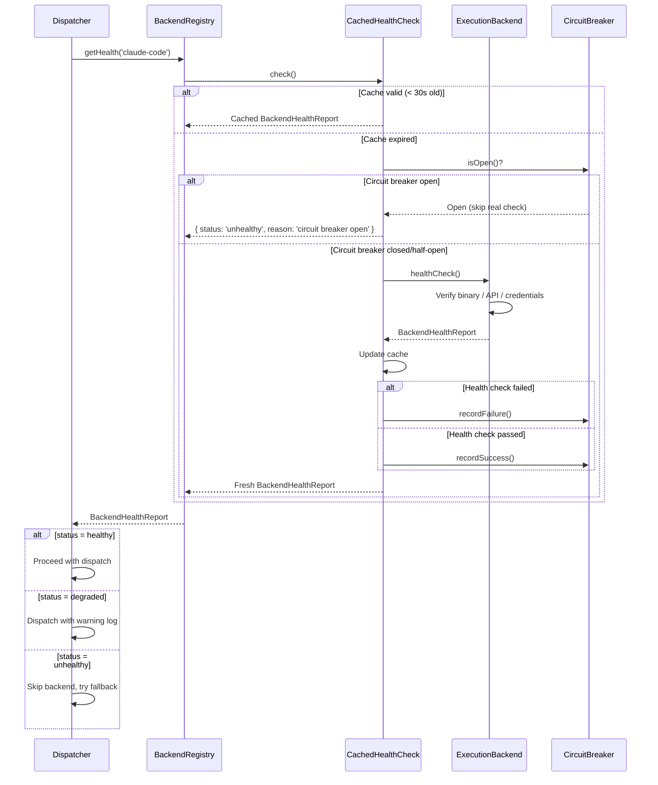
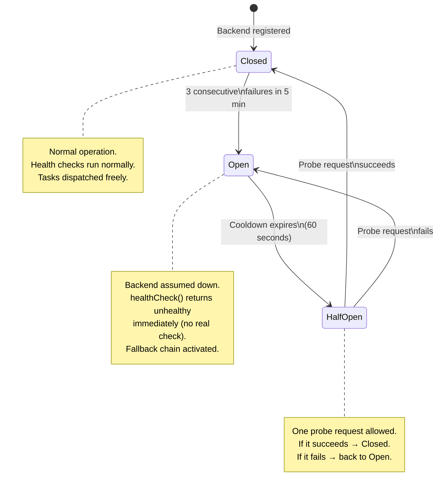

# Spike #37 — Execution Backends: Adapter Interface Design

**Status:** Proposed
**Date:** 2026-02-24
**Author:** Cortex Plane Team
**Depends on:** [Spike #24 — Job State Machine](./024-job-state-machine.md), [Spike #28 — Graphile Retry, Timeout & Shutdown](./028-graphile-patterns.md), [Spike #34 — Agent Lifecycle](./034-agent-lifecycle.md)

---

## Table of Contents

1. [Context](#context)
2. [Question 1: What Methods Does ExecutionBackend Need?](#question-1-what-methods-does-executionbackend-need)
3. [Question 2: Input Normalization](#question-2-input-normalization)
4. [Question 3: Output Normalization](#question-3-output-normalization)
5. [Question 4: Backend Selection](#question-4-backend-selection)
6. [Question 5: Rate Limiting — WIP Limits Per Backend](#question-5-rate-limiting--wip-limits-per-backend)
7. [Question 6: Streaming Intermediate Output](#question-6-streaming-intermediate-output)
8. [Question 7: Timeout — Backend-Specific or Global?](#question-7-timeout--backend-specific-or-global)
9. [Question 8: Health Check Protocol](#question-8-health-check-protocol)
10. [Artifact: ExecutionBackend Interface](#artifact-executionbackend-interface)
11. [Artifact: Task and Result Type Definitions](#artifact-task-and-result-type-definitions)
12. [Artifact: Claude Code Adapter Spec](#artifact-claude-code-adapter-spec)
13. [Artifact: Backend Registry Pattern](#artifact-backend-registry-pattern)
14. [Artifact: Health Check Protocol](#artifact-health-check-protocol)
15. [Design Decisions](#design-decisions)
16. [Open Questions](#open-questions)

---

## Context

The spec (§1) states the architectural principle: "The platform acts as a control plane — the persistent brain and orchestrator — while pluggable coding models (Claude Code, Codex) serve as ephemeral execution backends." Spikes #24 and #28 define how the control plane dispatches work, retries failures, and manages timeouts. Spike #34 defines the agent pod lifecycle. But none of these spikes define the **interface** between the control plane and the execution backends themselves.

Today the system has no formal contract for what an execution backend provides, how tasks are expressed independently of the backend, or how results are normalized across different providers. This spike closes that gap.

### The Problem

Each coding model has different invocation semantics:

| Backend          | Invocation                         | Output                            | Streaming           | Lifecycle          |
| ---------------- | ---------------------------------- | --------------------------------- | ------------------- | ------------------ |
| **Claude Code**  | CLI subprocess (`claude -p`)       | stdout + file diffs + exit code   | Yes (stdout stream) | Process per task   |
| **Codex**        | REST API                           | Response object with file patches | Yes (SSE)           | Stateless API call |
| **Aider**        | CLI subprocess (`aider --message`) | stdout + file diffs + exit code   | Yes (stdout stream) | Process per task   |
| **Custom/local** | Varies                             | Varies                            | Maybe               | Varies             |

Without an adapter interface, the control plane must contain backend-specific code in the job execution path. Adding a new backend means modifying the orchestration layer — violating the open/closed principle.

### Design Goal

A single `ExecutionBackend` interface that:

1. Normalizes task description (prompt + context + constraints) into a backend-agnostic format.
2. Normalizes results (files changed, stdout, exit code, artifacts) into a unified format.
3. Supports backend selection (per-agent config, fallback chains).
4. Enforces WIP limits per backend (don't overwhelm a local Claude Code process).
5. Enables streaming intermediate output from all backends.
6. Exposes health checks so the dispatcher knows which backends are available.

### Hard Constraints

| Constraint                                                           | Implication                                                         |
| -------------------------------------------------------------------- | ------------------------------------------------------------------- |
| Agent pods are k8s Jobs with `restartPolicy: Never` (spike #33, #34) | Backend adapters run inside the agent pod, not as separate services |
| PostgreSQL checkpoint is the resume point (spike #26)                | Backend execution must produce checkpointable state                 |
| Heartbeats every 30s (spike #28)                                     | Long-running backend calls must not block the heartbeat timer       |
| Error classification into TRANSIENT/PERMANENT/TIMEOUT (spike #28)    | Backend errors must be classifiable by the existing error taxonomy  |
| Channel adapters are npm packages (spec §15.3)                       | Execution backends follow the same packaging pattern                |
| Token budget per job (spike #34)                                     | Backend adapters must report token consumption                      |

---

## Question 1: What Methods Does ExecutionBackend Need?

**Question:** What's the minimal interface surface? Start? Status? Cancel? StreamOutput? GetResult?

**Decision:** Five core methods, two lifecycle methods, one metadata accessor. The interface mirrors the ChannelAdapter pattern (spec §15.3) for consistency.

### Method Analysis

| Method              | Purpose                                                             | Required? | Rationale                                       |
| ------------------- | ------------------------------------------------------------------- | --------- | ----------------------------------------------- |
| `start()`           | Initialize the backend (verify binary exists, warm connection pool) | Yes       | Backend may need setup before first task        |
| `stop()`            | Graceful shutdown (kill subprocesses, close connections)            | Yes       | Drain protocol (spike #34) needs clean teardown |
| `healthCheck()`     | Verify the backend is available and ready to accept work            | Yes       | Pre-dispatch validation, circuit breaker input  |
| `executeTask()`     | Submit a task and return a handle for tracking                      | Yes       | Core dispatch method                            |
| `cancel()`          | Abort a running task                                                | Yes       | Drain, timeout, and user-initiated cancellation |
| `getCapabilities()` | Report what the backend supports (streaming, file edit, etc.)       | Yes       | Backend selection and feature negotiation       |

### Why `executeTask()` Returns a Handle, Not a Result

A naive interface would be `executeTask(task: ExecutionTask): Promise<ExecutionResult>`. This blocks the caller for the entire execution duration — minutes for complex tasks. During that time:

1. The heartbeat timer can't fire (if the event loop is blocked, which it isn't in async code, but the _conceptual_ problem remains: how does the caller observe progress?).
2. The caller can't cancel the task.
3. The caller can't stream intermediate output.
4. The caller can't checkpoint partial progress.

Instead, `executeTask()` returns an `ExecutionHandle` — a lightweight object that provides methods to observe, cancel, and await the task:

```typescript
const handle = await backend.executeTask(task)

// Stream output as it arrives.
for await (const event of handle.events()) {
  if (event.type === "output") {
    buffer.append(event)
  }
  if (event.type === "files_changed") {
    checkpoint.recordFileChange(event)
  }
}

// Or await the final result.
const result = await handle.result()
```

This pattern is analogous to `child_process.spawn()` returning a `ChildProcess` handle, not a promise of the final output. The caller controls the observation strategy.

### Why Not Separate `streamOutput()` and `getResult()`?

Earlier designs had `streamOutput(taskId): AsyncIterable<OutputEvent>` and `getResult(taskId): Promise<ExecutionResult>` as standalone methods. This creates a coupling problem: the caller must track task IDs and coordinate between two methods. The handle pattern encapsulates both — the handle _is_ the task reference, and it provides both streaming and final-result access.

---

## Question 2: Input Normalization

**Question:** How do we express a task regardless of backend? Prompt + context + constraints?

**Decision:** Three-part task structure: **instruction** (what to do), **context** (what to know), and **constraints** (what limits apply). This maps cleanly to every backend's native input format.

### The Problem

Different backends accept different input shapes:

| Backend     | Expects                                                                           |
| ----------- | --------------------------------------------------------------------------------- |
| Claude Code | `claude -p "prompt text"` with `--allowedTools`, `--model`, working directory set |
| Codex       | JSON body: `{ instructions, context, model, ... }`                                |
| Aider       | `aider --message "prompt" --file path1 --file path2`                              |

If the control plane constructs backend-specific payloads, adding a new backend requires modifying the dispatch logic. The adapter's job is to translate from a universal task format to the backend's native format.

### Task Structure

```typescript
interface ExecutionTask {
  /** Unique task ID (UUIDv7). Used for idempotency and tracking. */
  id: string

  /** The job this task belongs to. */
  jobId: string

  /** The agent executing this task. */
  agentId: string

  /** What to do — the core instruction. */
  instruction: TaskInstruction

  /** What the backend needs to know — files, history, memory. */
  context: TaskContext

  /** Resource and behavioral limits. */
  constraints: TaskConstraints
}
```

#### Instruction

The instruction is the "what" — a prompt string with optional structured metadata:

```typescript
interface TaskInstruction {
  /** The primary prompt text. Backend-agnostic natural language. */
  prompt: string

  /**
   * Structured goal type. Helps the backend optimize its approach.
   * 'code_edit': Modify existing files.
   * 'code_generate': Create new files.
   * 'code_review': Analyze code without modification.
   * 'shell_command': Execute commands and report results.
   * 'research': Gather information, no code changes.
   */
  goalType: "code_edit" | "code_generate" | "code_review" | "shell_command" | "research"

  /** Optional list of target file paths the task should focus on. */
  targetFiles?: string[]

  /** Previous conversation turns for multi-step tasks. */
  conversationHistory?: ConversationTurn[]
}

interface ConversationTurn {
  role: "user" | "assistant"
  content: string
}
```

#### Context

The context is the "what to know" — information the backend needs to understand the environment:

```typescript
interface TaskContext {
  /** Absolute path to the workspace root (mounted PVC). */
  workspacePath: string

  /** Agent identity and persona (from IDENTITY.md). */
  systemPrompt: string

  /** Relevant memories retrieved from Qdrant (pre-fetched during hydration). */
  memories: string[]

  /**
   * Files to preload into the backend's context.
   * Key: relative path from workspace root. Value: file content.
   * Only include files critical to the task — don't dump the entire repo.
   */
  relevantFiles: Record<string, string>

  /** Environment variables to expose to the backend (filtered, no secrets by default). */
  environment: Record<string, string>
}
```

#### Constraints

The constraints are the "what limits apply" — resource, time, and behavioral boundaries:

```typescript
interface TaskConstraints {
  /** Maximum execution time in milliseconds. Backend must self-terminate after this. */
  timeoutMs: number

  /** Maximum tokens the backend may consume (input + output combined). */
  maxTokens: number

  /** LLM model to use (backend maps this to its native model identifier). */
  model: string

  /** Tools the backend is allowed to use. Empty array = no tool use. */
  allowedTools: string[]

  /** Tools the backend must NOT use. Takes precedence over allowedTools. */
  deniedTools: string[]

  /** Maximum number of LLM turns (prevents infinite loops). */
  maxTurns: number

  /** Whether the backend may make network requests. */
  networkAccess: boolean

  /** Whether the backend may execute shell commands. */
  shellAccess: boolean
}
```

### Translation Examples

The adapter translates `ExecutionTask` to the backend's native format:

**Claude Code:**

```typescript
// ExecutionTask → claude CLI arguments
const args = [
  "--print", // Non-interactive
  "--output-format",
  "stream-json", // Structured streaming output
  "--model",
  task.constraints.model,
  "--max-turns",
  String(task.constraints.maxTurns),
  ...task.constraints.allowedTools.flatMap((t) => ["--allowedTools", t]),
  ...task.constraints.deniedTools.flatMap((t) => ["--deniedTools", t]),
]

// Prompt = system prompt + instruction + context
const prompt = [
  task.context.systemPrompt,
  task.instruction.prompt,
  ...task.context.memories.map((m) => `<memory>${m}</memory>`),
].join("\n\n")
```

**Codex (hypothetical):**

```typescript
// ExecutionTask → Codex API request body
const body = {
  instructions: task.instruction.prompt,
  model: task.constraints.model,
  context: {
    files: Object.entries(task.context.relevantFiles).map(([path, content]) => ({ path, content })),
    system_prompt: task.context.systemPrompt,
  },
  limits: {
    max_tokens: task.constraints.maxTokens,
    timeout_seconds: task.constraints.timeoutMs / 1000,
  },
}
```

### Why Three Parts, Not a Flat Struct?

A flat struct (`{ prompt, model, timeout, files, ... }`) works but doesn't communicate intent. The three-part structure tells adapter authors:

1. **Instruction** — read this to understand what the user wants. Map to the backend's prompt/instruction field.
2. **Context** — read this to configure the backend's environment. Map to working directory, system prompt, context files.
3. **Constraints** — read this to set limits. Map to CLI flags, API parameters, or wrapper logic.

An adapter that ignores the distinction still works (it's just TypeScript properties). But an adapter author who reads the interface immediately knows where each concern belongs.

---

## Question 3: Output Normalization

**Question:** What's the unified result format? Files changed, stdout, exit code, artifacts?

**Decision:** A structured `ExecutionResult` that captures everything the control plane needs: success/failure status, files changed, stdout/stderr, token usage, and arbitrary artifacts. Backends that produce richer output (e.g., Claude Code's structured JSON stream) map into this format; backends that produce less (e.g., raw stdout) fill what they can.

### Result Structure

```typescript
interface ExecutionResult {
  /** The task ID this result corresponds to. */
  taskId: string

  /** Overall execution outcome. */
  status: ExecutionStatus

  /** Exit code from the backend process (0 = success). Null if not applicable (API-based backends). */
  exitCode: number | null

  /** Human-readable summary of what was done. Generated by the backend or extracted from output. */
  summary: string

  /** Files that were created, modified, or deleted. */
  fileChanges: FileChange[]

  /** Combined stdout from the backend process. */
  stdout: string

  /** Combined stderr from the backend process. */
  stderr: string

  /** Token usage for this execution. */
  tokenUsage: TokenUsage

  /** Arbitrary structured artifacts produced by the backend. */
  artifacts: ExecutionArtifact[]

  /** Wall-clock execution duration in milliseconds. */
  durationMs: number

  /** Error details if status is 'failed' or 'timed_out'. */
  error?: ExecutionError
}

type ExecutionStatus = "completed" | "failed" | "timed_out" | "cancelled"

interface FileChange {
  /** Relative path from workspace root. */
  path: string

  /** What happened to the file. */
  operation: "created" | "modified" | "deleted"

  /** Unified diff (if available). Null for deletions or when diff isn't captured. */
  diff: string | null
}

interface TokenUsage {
  /** Input tokens consumed. */
  inputTokens: number

  /** Output tokens consumed. */
  outputTokens: number

  /** Estimated cost in USD (backend-specific pricing). */
  costUsd: number

  /** Cache read tokens (if the backend supports prompt caching). */
  cacheReadTokens: number

  /** Cache creation tokens. */
  cacheCreationTokens: number
}

interface ExecutionArtifact {
  /** Artifact type — backends define their own types. */
  type: string

  /** Artifact name (for display). */
  name: string

  /** Artifact content. Could be text, JSON, base64-encoded binary, or a file path. */
  content: string

  /** MIME type of the content. */
  mimeType: string
}

interface ExecutionError {
  /** Error message. */
  message: string

  /** Error classification for retry decisions (maps to spike #28's ErrorClassification). */
  classification: "transient" | "permanent" | "timeout" | "resource"

  /** Backend-specific error code. */
  code?: string

  /** Whether the task may have produced partial side effects. */
  partialExecution: boolean
}
```

### What Each Backend Populates

| Field         | Claude Code                                            | Codex (API)                      | Aider                           |
| ------------- | ------------------------------------------------------ | -------------------------------- | ------------------------------- |
| `exitCode`    | Process exit code                                      | `null`                           | Process exit code               |
| `summary`     | Extracted from `result` event in JSON stream           | From API response body           | Parsed from stdout              |
| `fileChanges` | Parsed from `diff` events or post-execution `git diff` | From API response `file_patches` | Post-execution `git diff`       |
| `stdout`      | Captured from subprocess stdout                        | N/A (empty string)               | Captured from subprocess stdout |
| `stderr`      | Captured from subprocess stderr                        | N/A (empty string)               | Captured from subprocess stderr |
| `tokenUsage`  | Parsed from `usage` events in JSON stream              | From API response `usage` field  | Not available (zeros)           |
| `artifacts`   | Screenshots, browser captures from tool use            | Code patches as artifacts        | None                            |
| `durationMs`  | Measured by adapter                                    | Measured by adapter              | Measured by adapter             |

### Handling Missing Data

Not all backends produce all fields. The adapter fills what it can and uses sensible defaults:

- `tokenUsage` defaults to `{ inputTokens: 0, outputTokens: 0, costUsd: 0, cacheReadTokens: 0, cacheCreationTokens: 0 }` if the backend doesn't report usage. The token budget (spike #34) treats zero-usage as "unknown cost" and does not count it toward the limit. This means backends that don't report usage bypass the token budget — an acceptable trade-off since such backends (local models, Aider) typically don't have per-token costs.
- `summary` defaults to the last N characters of stdout if the backend doesn't produce a structured summary.
- `fileChanges` can be computed by the adapter from a `git diff` against the workspace after execution, regardless of what the backend reports.

### Why `fileChanges` Instead of Full File Contents?

Storing full file contents in the result would be redundant — the files are already on the workspace PVC. The `fileChanges` list provides:

1. **Auditability.** The control plane logs what changed without reading the filesystem.
2. **Checkpoint integration.** The checkpoint can record which files were modified for rollback.
3. **Approval gate input.** The approval gate (spike #36) can show diffs to the human reviewer.
4. **Lightweight serialization.** Diffs are typically 1-10 KB; full files could be megabytes.

The adapter computes `fileChanges` by either:

- Parsing the backend's native diff output (Claude Code's JSON stream includes diffs).
- Running `git diff --name-status` before and after execution.

---

## Question 4: Backend Selection

**Question:** Per-agent config? Fallback chain? Try Claude Code → fallback to Codex?

**Decision:** Per-agent backend configuration with ordered fallback chains. The agent's `model_config` JSONB field specifies the primary backend and fallback order. The dispatcher tries each backend in order until one succeeds or all fail.

### Configuration Schema

The agent's `model_config` JSONB column (spike #25) already stores model configuration. We extend it with backend selection:

```typescript
interface AgentModelConfig {
  /** Primary execution backend. */
  backend: string // e.g., 'claude-code'

  /** Model to use with the primary backend. */
  model: string // e.g., 'claude-sonnet-4-5-20250929'

  /** Ordered fallback chain. Tried left-to-right if the primary fails. */
  fallbackChain: BackendFallback[]

  /** Backend-specific configuration overrides. */
  backendConfig: Record<string, Record<string, unknown>>
}

interface BackendFallback {
  /** Backend identifier (must be registered in the BackendRegistry). */
  backend: string

  /** Model to use with this fallback backend. */
  model: string

  /** Error classifications that trigger this fallback. */
  triggerOn: Array<"transient" | "permanent" | "timeout" | "resource">
}
```

### Example Agent Configuration

```json
{
  "backend": "claude-code",
  "model": "claude-sonnet-4-5-20250929",
  "fallbackChain": [
    {
      "backend": "codex",
      "model": "codex-mini-latest",
      "triggerOn": ["resource", "timeout"]
    }
  ],
  "backendConfig": {
    "claude-code": {
      "binaryPath": "/usr/local/bin/claude",
      "maxTurns": 20
    },
    "codex": {
      "apiBaseUrl": "https://api.openai.com/v1",
      "maxTokens": 100000
    }
  }
}
```

### Fallback Logic

```typescript
async function dispatchTask(
  task: ExecutionTask,
  config: AgentModelConfig,
  registry: BackendRegistry,
): Promise<ExecutionResult> {
  // 1. Try the primary backend.
  const primary = registry.get(config.backend)
  if (!primary) {
    throw new PermanentError(`Backend '${config.backend}' not registered`)
  }

  const primaryHealth = await primary.healthCheck()
  if (primaryHealth.status === "healthy") {
    try {
      const handle = await primary.executeTask({
        ...task,
        constraints: {
          ...task.constraints,
          model: config.model,
        },
      })
      return await handle.result()
    } catch (err) {
      const classification = classifyBackendError(err)
      return tryFallbacks(task, config, registry, classification)
    }
  }

  // Primary unhealthy — go straight to fallbacks.
  return tryFallbacks(task, config, registry, "resource")
}

async function tryFallbacks(
  task: ExecutionTask,
  config: AgentModelConfig,
  registry: BackendRegistry,
  triggerClassification: string,
): Promise<ExecutionResult> {
  for (const fallback of config.fallbackChain) {
    if (!fallback.triggerOn.includes(triggerClassification as FallbackTrigger)) {
      continue
    }

    const backend = registry.get(fallback.backend)
    if (!backend) continue

    const health = await backend.healthCheck()
    if (health.status !== "healthy") continue

    try {
      const handle = await backend.executeTask({
        ...task,
        constraints: {
          ...task.constraints,
          model: fallback.model,
        },
      })
      return await handle.result()
    } catch {
      continue // Try next fallback.
    }
  }

  throw new Error("All backends failed — primary and all fallbacks exhausted")
}
```

### Why Per-Agent, Not Global?

Different agents have different backend requirements:

- A **DevOps agent** that manages infrastructure might need Claude Code's shell access and tool use — Codex can't do that.
- A **code review agent** that only reads code could use any backend — Codex is cheaper and faster.
- A **browser automation agent** needs Playwright integration, which only works with Claude Code's MCP tools.

Global backend selection would force all agents onto the same backend, or require complex routing rules. Per-agent configuration is simple: each agent declares its preferred backend and fallbacks. The dispatcher reads the config and acts.

### Fallback Triggers

Not all failures should trigger a fallback:

- **`transient`**: Don't fallback — the primary will recover. Retry with backoff (spike #28).
- **`permanent`**: Fallback — the primary cannot serve this request (wrong model, invalid input).
- **`timeout`**: Fallback — the primary is too slow (overloaded, large task).
- **`resource`**: Fallback — the primary is at capacity (WIP limit, rate limit).

The `triggerOn` array lets each fallback specify which error types activate it. A fallback configured with `triggerOn: ["resource", "timeout"]` activates when the primary is overloaded or slow, but not when the request itself is invalid.

---

## Question 5: Rate Limiting — WIP Limits Per Backend

**Question:** How do we enforce WIP limits per backend?

**Decision:** Semaphore-based WIP limiting per backend instance, tracked in the BackendRegistry. Each backend declares its concurrency limit; the dispatcher acquires a permit before dispatching and releases it when the task completes or fails.

### The Problem

Claude Code runs as a local subprocess. Running 10 concurrent Claude Code processes on a 2-CPU pod will OOM the node. Codex is an API — it can handle many concurrent requests, but the API has rate limits. Each backend has different concurrency characteristics:

| Backend                  | Concurrency Model                                  | Practical Limit                    |
| ------------------------ | -------------------------------------------------- | ---------------------------------- |
| Claude Code (subprocess) | One process per task. Each consumes 500MB–1GB RAM. | 1–2 concurrent tasks per agent pod |
| Codex (API)              | Stateless HTTP. Rate limited by API provider.      | 5–10 concurrent requests           |
| Aider (subprocess)       | One process per task. Similar to Claude Code.      | 1–2 concurrent tasks per agent pod |

### Semaphore Design

```typescript
interface BackendCapacity {
  /** Maximum concurrent tasks this backend can handle. */
  maxConcurrent: number

  /** Current number of active tasks. */
  activeTasks: number
}
```

The BackendRegistry tracks capacity per backend:

```typescript
class BackendSemaphore {
  private active = 0
  private readonly waiters: Array<{
    resolve: () => void
    reject: (err: Error) => void
  }> = []

  constructor(private readonly maxConcurrent: number) {}

  async acquire(timeoutMs: number): Promise<SemaphoreRelease> {
    if (this.active < this.maxConcurrent) {
      this.active++
      return { release: () => this.release() }
    }

    // Queue the request — wait for a slot to open.
    return new Promise<SemaphoreRelease>((resolve, reject) => {
      const timer = setTimeout(() => {
        const idx = this.waiters.findIndex((w) => w.resolve === wrappedResolve)
        if (idx !== -1) this.waiters.splice(idx, 1)
        reject(new Error(`Backend semaphore timeout after ${timeoutMs}ms`))
      }, timeoutMs)

      const wrappedResolve = (): void => {
        clearTimeout(timer)
        this.active++
        resolve({ release: () => this.release() })
      }

      this.waiters.push({ resolve: wrappedResolve, reject })
    })
  }

  private release(): void {
    this.active--
    const next = this.waiters.shift()
    if (next) {
      next.resolve()
    }
  }

  get available(): number {
    return this.maxConcurrent - this.active
  }
}

interface SemaphoreRelease {
  release(): void
}
```

### Integration with Dispatch

```typescript
async function dispatchWithWipLimit(
  task: ExecutionTask,
  backend: ExecutionBackend,
  semaphore: BackendSemaphore,
): Promise<ExecutionResult> {
  // Acquire a slot — wait up to 30 seconds.
  const permit = await semaphore.acquire(30_000)

  try {
    const handle = await backend.executeTask(task)
    return await handle.result()
  } finally {
    permit.release()
  }
}
```

### Why In-Process Semaphore, Not Database Lock?

Agent pods are k8s Jobs with `restartPolicy: Never` (spike #33, #34). Each pod processes one job. The WIP limit is per-backend _within a single pod_. Since each pod is a single process, an in-process semaphore is correct.

If future multi-pod agents need cross-pod WIP limits (e.g., "only 3 Claude Code processes across the entire cluster"), the semaphore would be replaced with a PostgreSQL advisory lock or a Redis-based distributed semaphore. That's a future optimization — day one has one job per pod.

### Default Concurrency Limits

```typescript
const DEFAULT_CONCURRENCY: Record<string, number> = {
  "claude-code": 1, // Subprocess, memory-heavy
  codex: 5, // API, rate-limit-bound
  aider: 1, // Subprocess, memory-heavy
}
```

Claude Code defaults to 1 concurrent task because:

1. Each Claude Code process consumes 500MB–1GB of RAM.
2. Agent pods have a 1Gi memory limit (spec §12.2).
3. Running 2+ concurrent processes risks OOM kill (exit code 137).

The limit is configurable via `backendConfig`:

```json
{
  "backendConfig": {
    "claude-code": {
      "maxConcurrent": 2
    }
  }
}
```

---

## Question 6: Streaming Intermediate Output

**Question:** Can we stream intermediate output from all backends?

**Decision:** Yes, through a unified `AsyncIterable<OutputEvent>` on the execution handle. Backends that support native streaming (Claude Code JSON stream, Codex SSE) map their events into the unified format. Backends that don't support streaming emit periodic synthetic events from stdout buffering.

### Output Event Types

```typescript
type OutputEvent =
  | OutputTextEvent
  | OutputToolUseEvent
  | OutputToolResultEvent
  | OutputFileChangeEvent
  | OutputProgressEvent
  | OutputUsageEvent
  | OutputErrorEvent
  | OutputCompleteEvent

interface OutputTextEvent {
  type: "text"
  timestamp: string
  content: string // Incremental text (not cumulative)
}

interface OutputToolUseEvent {
  type: "tool_use"
  timestamp: string
  toolName: string
  toolInput: Record<string, unknown>
}

interface OutputToolResultEvent {
  type: "tool_result"
  timestamp: string
  toolName: string
  output: string
  isError: boolean
}

interface OutputFileChangeEvent {
  type: "file_change"
  timestamp: string
  path: string
  operation: "created" | "modified" | "deleted"
}

interface OutputProgressEvent {
  type: "progress"
  timestamp: string
  /** 0.0 to 1.0, or null if progress is indeterminate. */
  percent: number | null
  message: string
}

interface OutputUsageEvent {
  type: "usage"
  timestamp: string
  tokenUsage: TokenUsage
}

interface OutputErrorEvent {
  type: "error"
  timestamp: string
  message: string
  classification: "transient" | "permanent" | "timeout" | "resource"
}

interface OutputCompleteEvent {
  type: "complete"
  timestamp: string
  result: ExecutionResult
}
```

### Streaming Architecture

```
┌──────────────────────────────────────────────┐
│  Agent Pod                                    │
│                                              │
│  ┌────────────┐     ┌──────────────────┐     │
│  │ Execution  │     │  Backend Adapter  │     │
│  │ Dispatcher │────▶│  (Claude Code)    │     │
│  └─────┬──────┘     │                  │     │
│        │            │  ┌────────────┐  │     │
│        │            │  │ claude -p  │  │     │
│        │            │  │ subprocess │  │     │
│        │            │  └─────┬──────┘  │     │
│        │            │        │ stdout  │     │
│        │            │        ▼         │     │
│        │            │  ┌────────────┐  │     │
│        │            │  │ JSON Stream│  │     │
│        │            │  │   Parser   │  │     │
│        │            │  └─────┬──────┘  │     │
│        │            │        │         │     │
│        │            │        ▼         │     │
│        │            │  OutputEvent     │     │
│        │            │  AsyncIterable   │     │
│        │            └───────┬──────────┘     │
│        │                    │                │
│        ▼                    ▼                │
│  ┌──────────────────────────────────┐        │
│  │        JSONL Buffer              │        │
│  │   (append each OutputEvent)      │        │
│  └──────────────────────────────────┘        │
│        │                                     │
│        ▼                                     │
│  ┌──────────────────────────────────┐        │
│  │    SSE to Control Plane          │        │
│  │ (forward events for dashboard)   │        │
│  └──────────────────────────────────┘        │
└──────────────────────────────────────────────┘
```

### Backend-Specific Streaming

**Claude Code** natively streams structured JSON events when invoked with `--output-format stream-json`. The adapter parses these into `OutputEvent`:

```typescript
async function* parseClaudeCodeStream(subprocess: ChildProcess): AsyncGenerator<OutputEvent> {
  const rl = readline.createInterface({ input: subprocess.stdout! })

  for await (const line of rl) {
    const event = JSON.parse(line)

    switch (event.type) {
      case "assistant":
        yield {
          type: "text",
          timestamp: new Date().toISOString(),
          content: event.message.content
            .filter((b: { type: string }) => b.type === "text")
            .map((b: { text: string }) => b.text)
            .join(""),
        }
        break

      case "tool_use":
        yield {
          type: "tool_use",
          timestamp: new Date().toISOString(),
          toolName: event.tool.name,
          toolInput: event.tool.input,
        }
        break

      case "tool_result":
        yield {
          type: "tool_result",
          timestamp: new Date().toISOString(),
          toolName: event.tool.name,
          output: event.tool.output ?? "",
          isError: event.tool.is_error ?? false,
        }
        break

      case "result":
        // Final result — collect file changes and yield complete.
        const fileChanges = await computeFileChanges(subprocess.cwd)
        yield {
          type: "complete",
          timestamp: new Date().toISOString(),
          result: mapToExecutionResult(event, fileChanges),
        }
        break
    }
  }
}
```

**Non-streaming backends** (or backends with only raw stdout) use a polling adapter:

```typescript
async function* pollStdout(
  subprocess: ChildProcess,
  intervalMs: number = 1000,
): AsyncGenerator<OutputEvent> {
  let buffer = ""

  subprocess.stdout!.on("data", (chunk: Buffer) => {
    buffer += chunk.toString()
  })

  while (!subprocess.killed) {
    if (buffer.length > 0) {
      yield {
        type: "text",
        timestamp: new Date().toISOString(),
        content: buffer,
      }
      buffer = ""
    }
    await new Promise((r) => setTimeout(r, intervalMs))
  }

  // Flush remaining.
  if (buffer.length > 0) {
    yield {
      type: "text",
      timestamp: new Date().toISOString(),
      content: buffer,
    }
  }
}
```

### Why AsyncIterable, Not Callbacks or EventEmitter?

1. **Backpressure.** `AsyncIterable` with `for await...of` naturally applies backpressure — the consumer pulls events at its own pace. If the JSONL buffer writer is slow, the iteration pauses. EventEmitters push events without backpressure, potentially buffering unbounded data.
2. **Composition.** Async iterables compose with standard language features (`for await`, `yield*`, `Array.fromAsync`). No `.on()` / `.off()` / `.removeListener()` lifecycle management.
3. **Cancellation.** Breaking out of `for await...of` triggers the generator's `return()` method, which can clean up resources. No manual unsubscribe.

---

## Question 7: Timeout — Backend-Specific or Global?

**Question:** Backend-specific or global? What if Claude Code takes 10 min for a large task?

**Decision:** Layered timeouts. The global job-level timeout (spike #28) is the outer boundary. Within that, backend-specific timeouts apply. The backend adapter enforces its own timeout and reports `timed_out` status; the job-level timeout is the backstop.

### Timeout Hierarchy

```
┌──────────────────────────────────────────────────────────┐
│  Job-level timeout (spike #28)                            │
│  Default: 3600s (1 hour)                                  │
│  Source: agent.resource_limits.timeout_seconds             │
│  Enforced by: Graphile Worker job_expiry + step timeout   │
│                                                          │
│  ┌────────────────────────────────────────────────────┐   │
│  │  Backend task timeout (this spike)                  │   │
│  │  From: task.constraints.timeoutMs                   │   │
│  │  Enforced by: backend adapter                       │   │
│  │                                                    │   │
│  │  ┌──────────────────────────────────────────────┐   │   │
│  │  │  Backend-internal timeouts                    │   │   │
│  │  │  LLM call: 300s, inter-chunk: 60s            │   │   │
│  │  │  Tool call: 30–120s (per-tool)                │   │   │
│  │  │  Enforced by: backend's own timeout logic     │   │   │
│  │  └──────────────────────────────────────────────┘   │   │
│  └────────────────────────────────────────────────────┘   │
└──────────────────────────────────────────────────────────┘
```

### Default Timeout Per Backend

| Backend     | Default Task Timeout | Rationale                                                                       |
| ----------- | -------------------- | ------------------------------------------------------------------------------- |
| Claude Code | 600s (10 min)        | Complex multi-tool tasks can take 5–10 minutes. 10 min is generous but bounded. |
| Codex       | 300s (5 min)         | API-based, typically faster. 5 min is more than enough.                         |
| Aider       | 600s (10 min)        | Similar to Claude Code — subprocess-based, complex tasks.                       |

### What If Claude Code Takes 10 Minutes?

This is expected behavior for large tasks. The timeout hierarchy handles it:

1. **Backend task timeout (10 min):** If the Claude Code process hasn't exited after 10 minutes, the adapter sends SIGTERM to the subprocess, waits 10 seconds, then SIGKILL. The result is `{ status: 'timed_out', partialExecution: true }`.

2. **Job-level timeout (1 hour):** If the task times out, the job's step-level logic decides: retry with the same backend, fall back to a different backend, or fail the job.

3. **Configurable per task:** The control plane can set `task.constraints.timeoutMs` based on estimated complexity. A simple linting task gets 60 seconds; a full feature implementation gets 600 seconds.

### Timeout Enforcement in the Adapter

```typescript
async executeTask(task: ExecutionTask): Promise<ExecutionHandle> {
  const timeoutMs = task.constraints.timeoutMs;

  const subprocess = spawn(this.binaryPath, args, { cwd: task.context.workspacePath });

  const timeoutTimer = setTimeout(() => {
    subprocess.kill('SIGTERM');
    setTimeout(() => {
      if (!subprocess.killed) subprocess.kill('SIGKILL');
    }, 10_000);
  }, timeoutMs);

  // ... return handle with events() and result() ...
}
```

### Why Not a Single Global Timeout?

A single global timeout (e.g., "all tasks must complete in 5 minutes") fails because:

1. **Variance is high.** A code review of 3 files takes 30 seconds. A multi-file refactor takes 8 minutes. A single timeout that accommodates both is either too short (kills legitimate work) or too long (doesn't catch stuck processes).
2. **Backends have different performance profiles.** Claude Code with extended thinking enabled takes longer than Codex. The timeout should reflect the backend's characteristics.
3. **The caller knows the task complexity.** The control plane, which constructed the task, has the best estimate of how long it should take. Embedding that estimate in `task.constraints.timeoutMs` is more precise than a static default.

---

## Question 8: Health Check Protocol

**Question:** How do we know a backend is available before dispatching?

**Decision:** Each backend implements a `healthCheck()` method that returns a structured health report. The dispatcher calls this before every task dispatch. The BackendRegistry aggregates health status for dashboard visibility and circuit breaker decisions.

### Health Check Return Type

```typescript
interface BackendHealthReport {
  /** Backend identifier. */
  backendId: string

  /** Current health status. */
  status: "healthy" | "degraded" | "unhealthy"

  /** Human-readable reason for non-healthy status. */
  reason?: string

  /** Timestamp of this health check. */
  checkedAt: string

  /** Latency of the health check itself (ms). A slow health check suggests degradation. */
  latencyMs: number

  /** Backend-specific details. */
  details: Record<string, unknown>
}
```

### Three-State Health Model

| Status      | Meaning                                                                         | Dispatcher Behavior                                                 |
| ----------- | ------------------------------------------------------------------------------- | ------------------------------------------------------------------- |
| `healthy`   | Backend is fully operational. Ready to accept tasks.                            | Dispatch normally.                                                  |
| `degraded`  | Backend is functional but impaired (slow response, reduced capacity, warnings). | Dispatch with caution. Log warning. Consider fallback if available. |
| `unhealthy` | Backend cannot accept tasks.                                                    | Skip. Try fallback chain.                                           |

### Backend-Specific Health Checks

**Claude Code (subprocess):**

```typescript
async healthCheck(): Promise<BackendHealthReport> {
  const start = Date.now();

  try {
    // 1. Verify the binary exists and is executable.
    await access(this.binaryPath, constants.X_OK);

    // 2. Run a minimal invocation to verify the binary works.
    const result = await execFile(this.binaryPath, ['--version'], {
      timeout: 5_000,
    });

    // 3. Check if the API key is configured (environment variable).
    const hasApiKey = !!process.env.ANTHROPIC_API_KEY;

    const latencyMs = Date.now() - start;

    if (!hasApiKey) {
      return {
        backendId: 'claude-code',
        status: 'unhealthy',
        reason: 'ANTHROPIC_API_KEY not configured',
        checkedAt: new Date().toISOString(),
        latencyMs,
        details: { version: result.stdout.trim(), hasApiKey: false },
      };
    }

    return {
      backendId: 'claude-code',
      status: latencyMs > 3000 ? 'degraded' : 'healthy',
      reason: latencyMs > 3000 ? `Health check slow: ${latencyMs}ms` : undefined,
      checkedAt: new Date().toISOString(),
      latencyMs,
      details: { version: result.stdout.trim(), hasApiKey: true },
    };
  } catch (err) {
    return {
      backendId: 'claude-code',
      status: 'unhealthy',
      reason: err instanceof Error ? err.message : 'Unknown error',
      checkedAt: new Date().toISOString(),
      latencyMs: Date.now() - start,
      details: {},
    };
  }
}
```

**Codex (API):**

```typescript
async healthCheck(): Promise<BackendHealthReport> {
  const start = Date.now();

  try {
    // Lightweight API call to verify connectivity and auth.
    const response = await fetch(`${this.apiBaseUrl}/models`, {
      headers: { Authorization: `Bearer ${this.apiKey}` },
      signal: AbortSignal.timeout(5_000),
    });

    const latencyMs = Date.now() - start;

    if (response.status === 401) {
      return {
        backendId: 'codex',
        status: 'unhealthy',
        reason: 'Authentication failed (401)',
        checkedAt: new Date().toISOString(),
        latencyMs,
        details: { httpStatus: 401 },
      };
    }

    if (response.status === 429) {
      return {
        backendId: 'codex',
        status: 'degraded',
        reason: 'Rate limited (429)',
        checkedAt: new Date().toISOString(),
        latencyMs,
        details: { httpStatus: 429 },
      };
    }

    return {
      backendId: 'codex',
      status: latencyMs > 3000 ? 'degraded' : 'healthy',
      reason: latencyMs > 3000 ? `Slow response: ${latencyMs}ms` : undefined,
      checkedAt: new Date().toISOString(),
      latencyMs,
      details: { httpStatus: response.status },
    };
  } catch (err) {
    return {
      backendId: 'codex',
      status: 'unhealthy',
      reason: err instanceof Error ? err.message : 'Unknown error',
      checkedAt: new Date().toISOString(),
      latencyMs: Date.now() - start,
      details: {},
    };
  }
}
```

### Health Check Caching

Health checks should be fast (< 5 seconds), but calling them before every task dispatch adds latency. The BackendRegistry caches health results:

```typescript
class CachedHealthCheck {
  private cache: BackendHealthReport | null = null
  private readonly ttlMs: number

  constructor(
    private readonly backend: ExecutionBackend,
    ttlMs: number = 30_000, // 30 seconds
  ) {
    this.ttlMs = ttlMs
  }

  async check(): Promise<BackendHealthReport> {
    if (this.cache && Date.now() - new Date(this.cache.checkedAt).getTime() < this.ttlMs) {
      return this.cache
    }
    this.cache = await this.backend.healthCheck()
    return this.cache
  }

  invalidate(): void {
    this.cache = null
  }
}
```

Cache TTL: 30 seconds. This means a backend that goes down is detected within 30 seconds. For active dispatching, this is fast enough — the dispatcher checks health, gets a cached result, and proceeds. If the dispatch fails (the cached result was stale), the dispatcher invalidates the cache and checks again.

### Circuit Breaker Integration

The health check feeds the per-backend circuit breaker (analogous to the per-agent circuit breaker in spike #34):

```typescript
interface BackendCircuitBreaker {
  /** Number of consecutive failures before tripping. */
  failureThreshold: number // Default: 3

  /** Window for counting failures. */
  windowMs: number // Default: 5 minutes

  /** Cooldown before allowing a probe request. */
  cooldownMs: number // Default: 60 seconds

  /** Current state. */
  state: "closed" | "open" | "half-open"
}
```

When the circuit breaker is open:

1. `healthCheck()` returns `unhealthy` immediately (no actual check).
2. After the cooldown, one "probe" request is allowed (half-open state).
3. If the probe succeeds, the circuit closes. If it fails, the cooldown restarts.

---

## Artifact: ExecutionBackend Interface

```typescript
/**
 * ExecutionBackend defines the contract between the control plane and a
 * pluggable coding model (Claude Code, Codex, Aider, etc.).
 *
 * Each backend is an npm package: @cortex-plane/backend-claude-code,
 * @cortex-plane/backend-codex, etc.
 *
 * The interface follows the same pattern as ChannelAdapter (spec §15.3):
 * lifecycle methods (start/stop), a health check, and domain-specific
 * operations (executeTask).
 */
export interface ExecutionBackend {
  /** Unique identifier for this backend type (e.g., 'claude-code', 'codex'). */
  readonly backendId: string

  /**
   * Initialize the backend. Called once during agent boot (BOOTING state).
   * Verify binary existence, warm connection pools, validate API keys.
   * Throw if the backend cannot be initialized — this is a fatal error.
   */
  start(config: Record<string, unknown>): Promise<void>

  /**
   * Graceful shutdown. Called during DRAINING state.
   * Kill active subprocesses, close connections, release resources.
   * Must complete within the drain deadline (45 seconds, spike #34).
   */
  stop(): Promise<void>

  /**
   * Check if the backend is available and ready to accept tasks.
   * Must complete within 5 seconds. Must not throw — return unhealthy status instead.
   */
  healthCheck(): Promise<BackendHealthReport>

  /**
   * Submit a task for execution. Returns immediately with an ExecutionHandle
   * that provides streaming events and final result.
   *
   * Does NOT block until completion. The caller uses the handle to observe
   * progress, cancel, or await the result.
   *
   * @throws if the task cannot be started (invalid config, backend not started).
   *         Does NOT throw for execution failures — those are reported in the result.
   */
  executeTask(task: ExecutionTask): Promise<ExecutionHandle>

  /**
   * Report the backend's capabilities. Used by the dispatcher for feature
   * negotiation and backend selection.
   */
  getCapabilities(): BackendCapabilities
}

/**
 * Handle returned by executeTask(). Provides observation, cancellation,
 * and result retrieval for a running task.
 */
export interface ExecutionHandle {
  /** The task ID. */
  readonly taskId: string

  /**
   * Async iterable of output events. Yields events as they arrive from
   * the backend. The iterable completes when the task finishes (success,
   * failure, timeout, or cancellation).
   *
   * Supports backpressure — the consumer controls the iteration rate.
   */
  events(): AsyncIterable<OutputEvent>

  /**
   * Await the final result. Resolves when the task completes.
   * If events() is being consumed concurrently, result() resolves
   * when the 'complete' event is emitted.
   */
  result(): Promise<ExecutionResult>

  /**
   * Cancel the running task. Sends SIGTERM to the subprocess or
   * cancels the API request. The result will have status 'cancelled'.
   *
   * @param reason - Human-readable cancellation reason for audit logging.
   */
  cancel(reason: string): Promise<void>
}

/**
 * What the backend can do. Used for backend selection and
 * feature negotiation.
 */
export interface BackendCapabilities {
  /** Whether the backend supports streaming output events. */
  supportsStreaming: boolean

  /** Whether the backend can modify files in the workspace. */
  supportsFileEdit: boolean

  /** Whether the backend can execute shell commands. */
  supportsShellExecution: boolean

  /** Whether the backend reports token usage. */
  reportsTokenUsage: boolean

  /** Whether the backend supports cancellation mid-execution. */
  supportsCancellation: boolean

  /** Supported goal types (from TaskInstruction.goalType). */
  supportedGoalTypes: TaskInstruction["goalType"][]

  /** Maximum context window size in tokens (for the backend's default model). */
  maxContextTokens: number
}
```

---

## Artifact: Task and Result Type Definitions

```typescript
// ──────────────────────────────────────────────────
// Task Types
// ──────────────────────────────────────────────────

/**
 * A backend-agnostic task description. The adapter translates this
 * into the backend's native format (CLI args, API body, etc.).
 */
export interface ExecutionTask {
  /** Unique task ID (UUIDv7). */
  id: string

  /** The job this task belongs to. */
  jobId: string

  /** The agent executing this task. */
  agentId: string

  /** What to do. */
  instruction: TaskInstruction

  /** What the backend needs to know. */
  context: TaskContext

  /** Resource and behavioral limits. */
  constraints: TaskConstraints
}

export interface TaskInstruction {
  /** The primary prompt text. Backend-agnostic natural language. */
  prompt: string

  /**
   * Structured goal type.
   * - 'code_edit': Modify existing files.
   * - 'code_generate': Create new files.
   * - 'code_review': Analyze code without modification.
   * - 'shell_command': Execute commands and report results.
   * - 'research': Gather information, no code changes.
   */
  goalType: "code_edit" | "code_generate" | "code_review" | "shell_command" | "research"

  /** Target file paths the task should focus on. */
  targetFiles?: string[]

  /** Previous conversation turns for multi-step tasks. */
  conversationHistory?: ConversationTurn[]
}

export interface ConversationTurn {
  role: "user" | "assistant"
  content: string
}

export interface TaskContext {
  /** Absolute path to the workspace root. */
  workspacePath: string

  /** Agent identity and persona (system prompt). */
  systemPrompt: string

  /** Relevant memories from Qdrant. */
  memories: string[]

  /** Files to preload. Key: relative path, Value: content. */
  relevantFiles: Record<string, string>

  /** Environment variables to expose. */
  environment: Record<string, string>
}

export interface TaskConstraints {
  /** Maximum execution time (ms). */
  timeoutMs: number

  /** Maximum tokens (input + output). */
  maxTokens: number

  /** LLM model identifier. */
  model: string

  /** Allowed tools (empty = no tools). */
  allowedTools: string[]

  /** Denied tools (takes precedence over allowed). */
  deniedTools: string[]

  /** Maximum LLM turns. */
  maxTurns: number

  /** Whether the backend may make network requests. */
  networkAccess: boolean

  /** Whether the backend may execute shell commands. */
  shellAccess: boolean
}

// ──────────────────────────────────────────────────
// Result Types
// ──────────────────────────────────────────────────

export interface ExecutionResult {
  /** Task ID this result corresponds to. */
  taskId: string

  /** Execution outcome. */
  status: ExecutionStatus

  /** Process exit code. Null for API-based backends. */
  exitCode: number | null

  /** Human-readable summary. */
  summary: string

  /** Files created, modified, or deleted. */
  fileChanges: FileChange[]

  /** Combined stdout. */
  stdout: string

  /** Combined stderr. */
  stderr: string

  /** Token consumption. */
  tokenUsage: TokenUsage

  /** Structured artifacts. */
  artifacts: ExecutionArtifact[]

  /** Wall-clock duration (ms). */
  durationMs: number

  /** Error details (if status is 'failed' or 'timed_out'). */
  error?: ExecutionError
}

export type ExecutionStatus = "completed" | "failed" | "timed_out" | "cancelled"

export interface FileChange {
  /** Relative path from workspace root. */
  path: string
  operation: "created" | "modified" | "deleted"
  /** Unified diff. Null for deletions or when unavailable. */
  diff: string | null
}

export interface TokenUsage {
  inputTokens: number
  outputTokens: number
  costUsd: number
  cacheReadTokens: number
  cacheCreationTokens: number
}

export interface ExecutionArtifact {
  type: string
  name: string
  content: string
  mimeType: string
}

export interface ExecutionError {
  message: string
  /** Maps to spike #28's ErrorClassification. */
  classification: "transient" | "permanent" | "timeout" | "resource"
  code?: string
  /** Whether the task may have produced partial side effects. */
  partialExecution: boolean
}

// ──────────────────────────────────────────────────
// Output Event Types (Streaming)
// ──────────────────────────────────────────────────

export type OutputEvent =
  | OutputTextEvent
  | OutputToolUseEvent
  | OutputToolResultEvent
  | OutputFileChangeEvent
  | OutputProgressEvent
  | OutputUsageEvent
  | OutputErrorEvent
  | OutputCompleteEvent

export interface OutputTextEvent {
  type: "text"
  timestamp: string
  content: string
}

export interface OutputToolUseEvent {
  type: "tool_use"
  timestamp: string
  toolName: string
  toolInput: Record<string, unknown>
}

export interface OutputToolResultEvent {
  type: "tool_result"
  timestamp: string
  toolName: string
  output: string
  isError: boolean
}

export interface OutputFileChangeEvent {
  type: "file_change"
  timestamp: string
  path: string
  operation: "created" | "modified" | "deleted"
}

export interface OutputProgressEvent {
  type: "progress"
  timestamp: string
  percent: number | null
  message: string
}

export interface OutputUsageEvent {
  type: "usage"
  timestamp: string
  tokenUsage: TokenUsage
}

export interface OutputErrorEvent {
  type: "error"
  timestamp: string
  message: string
  classification: "transient" | "permanent" | "timeout" | "resource"
}

export interface OutputCompleteEvent {
  type: "complete"
  timestamp: string
  result: ExecutionResult
}

// ──────────────────────────────────────────────────
// Health Check Types
// ──────────────────────────────────────────────────

export interface BackendHealthReport {
  backendId: string
  status: "healthy" | "degraded" | "unhealthy"
  reason?: string
  checkedAt: string
  latencyMs: number
  details: Record<string, unknown>
}
```

---

## Artifact: Claude Code Adapter Spec

The Claude Code adapter is the **reference implementation** — the first backend built, and the template for all others.

### Package

`@cortex-plane/backend-claude-code` — an npm package in the monorepo at `packages/backend-claude-code/`.

### Architecture

```
┌─────────────────────────────────────────────────┐
│  ClaudeCodeBackend implements ExecutionBackend    │
│                                                 │
│  start()                                        │
│    ├── Verify binary: which claude               │
│    ├── Check version: claude --version            │
│    └── Validate ANTHROPIC_API_KEY env var         │
│                                                 │
│  healthCheck()                                   │
│    ├── Binary accessible? (fs.access X_OK)       │
│    ├── API key present?                          │
│    └── Return BackendHealthReport                │
│                                                 │
│  executeTask(task)                               │
│    ├── Translate ExecutionTask → CLI args         │
│    ├── Spawn subprocess: claude --print ...       │
│    ├── Wire stdout → JSON stream parser          │
│    ├── Create ExecutionHandle                     │
│    └── Return handle (non-blocking)              │
│                                                 │
│  stop()                                          │
│    ├── SIGTERM to active subprocess              │
│    ├── Wait 10s for clean exit                   │
│    └── SIGKILL if still alive                    │
│                                                 │
│  getCapabilities()                               │
│    └── { supportsStreaming: true,                │
│          supportsFileEdit: true,                 │
│          supportsShellExecution: true,            │
│          reportsTokenUsage: true,                │
│          supportsCancellation: true,              │
│          supportedGoalTypes: [...all],            │
│          maxContextTokens: 200_000 }             │
└─────────────────────────────────────────────────┘
```

### Task Translation

```typescript
import { spawn, type ChildProcess } from "node:child_process"
import { createInterface } from "node:readline"

export class ClaudeCodeBackend implements ExecutionBackend {
  readonly backendId = "claude-code"

  private binaryPath = "claude"
  private activeProcess: ChildProcess | null = null

  async start(config: Record<string, unknown>): Promise<void> {
    if (config.binaryPath) {
      this.binaryPath = config.binaryPath as string
    }

    // Verify the binary exists.
    const { execFile } = await import("node:child_process")
    const { promisify } = await import("node:util")
    const execFileAsync = promisify(execFile)

    const { stdout } = await execFileAsync(this.binaryPath, ["--version"], {
      timeout: 10_000,
    })
    // stdout contains version string; log it for diagnostics.
  }

  async stop(): Promise<void> {
    if (this.activeProcess && !this.activeProcess.killed) {
      this.activeProcess.kill("SIGTERM")

      await Promise.race([
        new Promise<void>((resolve) => {
          this.activeProcess!.on("exit", () => resolve())
        }),
        new Promise<void>((resolve) => setTimeout(resolve, 10_000)),
      ])

      if (!this.activeProcess.killed) {
        this.activeProcess.kill("SIGKILL")
      }
    }
  }

  async executeTask(task: ExecutionTask): Promise<ExecutionHandle> {
    const args = this.buildArgs(task)
    const prompt = this.buildPrompt(task)

    const subprocess = spawn(this.binaryPath, [...args, prompt], {
      cwd: task.context.workspacePath,
      env: {
        ...process.env,
        ...task.context.environment,
      },
      stdio: ["pipe", "pipe", "pipe"],
    })

    this.activeProcess = subprocess

    return new ClaudeCodeHandle(task.id, subprocess, task.context.workspacePath)
  }

  private buildArgs(task: ExecutionTask): string[] {
    const args: string[] = [
      "--print",
      "--output-format",
      "stream-json",
      "--model",
      task.constraints.model,
      "--max-turns",
      String(task.constraints.maxTurns),
    ]

    for (const tool of task.constraints.allowedTools) {
      args.push("--allowedTools", tool)
    }

    for (const tool of task.constraints.deniedTools) {
      args.push("--deniedTools", tool)
    }

    return args
  }

  private buildPrompt(task: ExecutionTask): string {
    const parts: string[] = []

    // System context.
    if (task.context.systemPrompt) {
      parts.push(task.context.systemPrompt)
    }

    // Memories.
    for (const memory of task.context.memories) {
      parts.push(`<memory>\n${memory}\n</memory>`)
    }

    // Conversation history.
    if (task.instruction.conversationHistory?.length) {
      parts.push("Previous conversation:")
      for (const turn of task.instruction.conversationHistory) {
        parts.push(`${turn.role}: ${turn.content}`)
      }
    }

    // Target files.
    if (task.instruction.targetFiles?.length) {
      parts.push(`Focus on these files: ${task.instruction.targetFiles.join(", ")}`)
    }

    // The instruction itself.
    parts.push(task.instruction.prompt)

    return parts.join("\n\n")
  }

  getCapabilities(): BackendCapabilities {
    return {
      supportsStreaming: true,
      supportsFileEdit: true,
      supportsShellExecution: true,
      reportsTokenUsage: true,
      supportsCancellation: true,
      supportedGoalTypes: [
        "code_edit",
        "code_generate",
        "code_review",
        "shell_command",
        "research",
      ],
      maxContextTokens: 200_000,
    }
  }

  // healthCheck() — see Question 8 for full implementation.
  async healthCheck(): Promise<BackendHealthReport> {
    // ... (see Question 8)
    return {
      backendId: "claude-code",
      status: "healthy",
      checkedAt: new Date().toISOString(),
      latencyMs: 0,
      details: {},
    }
  }
}
```

### ExecutionHandle Implementation

```typescript
class ClaudeCodeHandle implements ExecutionHandle {
  readonly taskId: string
  private subprocess: ChildProcess
  private workspacePath: string
  private resultPromise: Promise<ExecutionResult>
  private resolveResult!: (result: ExecutionResult) => void
  private collectedEvents: OutputEvent[] = []
  private stdout = ""
  private stderr = ""
  private startTime: number

  constructor(taskId: string, subprocess: ChildProcess, workspacePath: string) {
    this.taskId = taskId
    this.subprocess = subprocess
    this.workspacePath = workspacePath
    this.startTime = Date.now()

    this.resultPromise = new Promise<ExecutionResult>((resolve) => {
      this.resolveResult = resolve
    })

    // Capture stderr.
    subprocess.stderr?.on("data", (chunk: Buffer) => {
      this.stderr += chunk.toString()
    })
  }

  async *events(): AsyncIterable<OutputEvent> {
    const rl = createInterface({ input: this.subprocess.stdout! })

    for await (const line of rl) {
      if (!line.trim()) continue

      let parsed: Record<string, unknown>
      try {
        parsed = JSON.parse(line)
      } catch {
        // Non-JSON line — emit as raw text.
        this.stdout += line + "\n"
        const event: OutputTextEvent = {
          type: "text",
          timestamp: new Date().toISOString(),
          content: line,
        }
        this.collectedEvents.push(event)
        yield event
        continue
      }

      const events = this.mapClaudeEvent(parsed)
      for (const event of events) {
        this.collectedEvents.push(event)
        yield event

        if (event.type === "complete") {
          this.resolveResult(event.result)
        }
      }
    }

    // Process exited — if we haven't yielded a 'complete' event, build one.
    const exitCode = await new Promise<number | null>((resolve) => {
      this.subprocess.on("exit", (code) => resolve(code))
    })

    if (!this.collectedEvents.some((e) => e.type === "complete")) {
      const result = await this.buildFinalResult(exitCode)
      const event: OutputCompleteEvent = {
        type: "complete",
        timestamp: new Date().toISOString(),
        result,
      }
      this.collectedEvents.push(event)
      this.resolveResult(result)
      yield event
    }
  }

  async result(): Promise<ExecutionResult> {
    return this.resultPromise
  }

  async cancel(reason: string): Promise<void> {
    if (!this.subprocess.killed) {
      this.subprocess.kill("SIGTERM")

      await Promise.race([
        new Promise<void>((r) => this.subprocess.on("exit", () => r())),
        new Promise<void>((r) => setTimeout(r, 10_000)),
      ])

      if (!this.subprocess.killed) {
        this.subprocess.kill("SIGKILL")
      }
    }

    this.resolveResult({
      taskId: this.taskId,
      status: "cancelled",
      exitCode: this.subprocess.exitCode,
      summary: `Cancelled: ${reason}`,
      fileChanges: [],
      stdout: this.stdout,
      stderr: this.stderr,
      tokenUsage: {
        inputTokens: 0,
        outputTokens: 0,
        costUsd: 0,
        cacheReadTokens: 0,
        cacheCreationTokens: 0,
      },
      artifacts: [],
      durationMs: Date.now() - this.startTime,
    })
  }

  private mapClaudeEvent(event: Record<string, unknown>): OutputEvent[] {
    // Map Claude Code's stream-json events to OutputEvent.
    // Implementation depends on the exact Claude Code JSON stream format.
    // See Question 6 for the mapping logic.
    const events: OutputEvent[] = []
    const type = event.type as string

    if (type === "assistant" && event.message) {
      const message = event.message as { content: Array<{ type: string; text?: string }> }
      const text = message.content
        .filter((b) => b.type === "text")
        .map((b) => b.text ?? "")
        .join("")
      if (text) {
        this.stdout += text
        events.push({ type: "text", timestamp: new Date().toISOString(), content: text })
      }
    }

    if (type === "result") {
      const result = event as Record<string, unknown>
      const usage = result.usage as { input_tokens?: number; output_tokens?: number } | undefined
      events.push({
        type: "usage",
        timestamp: new Date().toISOString(),
        tokenUsage: {
          inputTokens: usage?.input_tokens ?? 0,
          outputTokens: usage?.output_tokens ?? 0,
          costUsd: 0, // Computed by caller based on model pricing.
          cacheReadTokens: 0,
          cacheCreationTokens: 0,
        },
      })
    }

    return events
  }

  private async buildFinalResult(exitCode: number | null): Promise<ExecutionResult> {
    // Compute file changes via git diff.
    const fileChanges = await this.computeFileChanges()

    // Extract token usage from collected events.
    const usageEvent = this.collectedEvents.find((e) => e.type === "usage") as
      | OutputUsageEvent
      | undefined

    return {
      taskId: this.taskId,
      status: exitCode === 0 ? "completed" : "failed",
      exitCode,
      summary: this.stdout.slice(-500), // Last 500 chars as summary fallback.
      fileChanges,
      stdout: this.stdout,
      stderr: this.stderr,
      tokenUsage: usageEvent?.tokenUsage ?? {
        inputTokens: 0,
        outputTokens: 0,
        costUsd: 0,
        cacheReadTokens: 0,
        cacheCreationTokens: 0,
      },
      artifacts: [],
      durationMs: Date.now() - this.startTime,
      error:
        exitCode !== 0
          ? {
              message: this.stderr || `Process exited with code ${exitCode}`,
              classification: exitCode === 137 ? "resource" : "permanent",
              partialExecution: true,
            }
          : undefined,
    }
  }

  private async computeFileChanges(): Promise<FileChange[]> {
    // Use git diff to detect workspace changes.
    const { execFile } = await import("node:child_process")
    const { promisify } = await import("node:util")
    const exec = promisify(execFile)

    try {
      const { stdout } = await exec("git", ["diff", "--name-status", "HEAD"], {
        cwd: this.workspacePath,
        timeout: 5_000,
      })

      return stdout
        .trim()
        .split("\n")
        .filter(Boolean)
        .map((line) => {
          const [status, ...pathParts] = line.split("\t")
          const path = pathParts.join("\t")
          const operation: FileChange["operation"] =
            status === "A" ? "created" : status === "D" ? "deleted" : "modified"
          return { path, operation, diff: null }
        })
    } catch {
      return [] // Git not available or not a repo.
    }
  }
}
```

---

## Artifact: Backend Registry Pattern

The BackendRegistry is a singleton that manages all registered backends. It provides backend lookup, health aggregation, and lifecycle management.

### Registry Interface

```typescript
/**
 * Central registry for execution backends. The control plane creates one
 * registry at startup and registers all configured backends.
 *
 * The registry is NOT a service locator anti-pattern — backends are
 * registered explicitly at startup, not discovered at runtime.
 */
export class BackendRegistry {
  private readonly backends = new Map<string, ExecutionBackend>()
  private readonly healthChecks = new Map<string, CachedHealthCheck>()
  private readonly semaphores = new Map<string, BackendSemaphore>()

  /**
   * Register a backend. Called during agent boot (BOOTING state).
   * Calls backend.start() to initialize it.
   */
  async register(
    backend: ExecutionBackend,
    config: Record<string, unknown>,
    maxConcurrent: number,
  ): Promise<void> {
    if (this.backends.has(backend.backendId)) {
      throw new Error(`Backend '${backend.backendId}' already registered`)
    }

    await backend.start(config)

    this.backends.set(backend.backendId, backend)
    this.healthChecks.set(backend.backendId, new CachedHealthCheck(backend, 30_000))
    this.semaphores.set(backend.backendId, new BackendSemaphore(maxConcurrent))
  }

  /**
   * Get a registered backend by ID.
   * Returns undefined if not registered.
   */
  get(backendId: string): ExecutionBackend | undefined {
    return this.backends.get(backendId)
  }

  /**
   * Get the cached health status for a backend.
   */
  async getHealth(backendId: string): Promise<BackendHealthReport | undefined> {
    const check = this.healthChecks.get(backendId)
    return check?.check()
  }

  /**
   * Get all backend health statuses (for dashboard/API).
   */
  async getAllHealth(): Promise<BackendHealthReport[]> {
    const reports: BackendHealthReport[] = []
    for (const [, check] of this.healthChecks) {
      reports.push(await check.check())
    }
    return reports
  }

  /**
   * Acquire a WIP semaphore permit for a backend.
   */
  async acquirePermit(backendId: string, timeoutMs: number): Promise<SemaphoreRelease> {
    const semaphore = this.semaphores.get(backendId)
    if (!semaphore) {
      throw new Error(`No semaphore for backend '${backendId}'`)
    }
    return semaphore.acquire(timeoutMs)
  }

  /**
   * Invalidate the health cache for a backend (e.g., after a failure).
   */
  invalidateHealth(backendId: string): void {
    this.healthChecks.get(backendId)?.invalidate()
  }

  /**
   * List all registered backend IDs.
   */
  list(): string[] {
    return [...this.backends.keys()]
  }

  /**
   * Graceful shutdown — stop all backends.
   */
  async stopAll(): Promise<void> {
    const stops = [...this.backends.values()].map((b) => b.stop())
    await Promise.allSettled(stops)
    this.backends.clear()
    this.healthChecks.clear()
    this.semaphores.clear()
  }
}
```

### Registration at Boot

```typescript
// In the agent pod's boot sequence (BOOTING → HYDRATING):
const registry = new BackendRegistry()

// Register backends based on agent config.
const agentConfig = await loadAgentConfig(agentId)
const modelConfig = agentConfig.model_config as AgentModelConfig

// Primary backend.
const primaryBackend = createBackend(modelConfig.backend)
const backendSpecificConfig = modelConfig.backendConfig[modelConfig.backend] ?? {}
const maxConcurrent =
  (backendSpecificConfig.maxConcurrent as number) ?? DEFAULT_CONCURRENCY[modelConfig.backend] ?? 1

await registry.register(primaryBackend, backendSpecificConfig, maxConcurrent)

// Fallback backends.
for (const fallback of modelConfig.fallbackChain) {
  const fb = createBackend(fallback.backend)
  const fbConfig = modelConfig.backendConfig[fallback.backend] ?? {}
  const fbConcurrent =
    (fbConfig.maxConcurrent as number) ?? DEFAULT_CONCURRENCY[fallback.backend] ?? 1

  await registry.register(fb, fbConfig, fbConcurrent)
}
```

### Factory Function

```typescript
function createBackend(backendId: string): ExecutionBackend {
  switch (backendId) {
    case "claude-code":
      return new ClaudeCodeBackend()
    // Future:
    // case 'codex':
    //   return new CodexBackend();
    // case 'aider':
    //   return new AiderBackend();
    default:
      throw new Error(`Unknown backend: '${backendId}'`)
  }
}
```

### Why a Registry, Not Direct Construction?

1. **Lifecycle management.** The registry calls `start()` on registration and `stop()` on shutdown for all backends. Without it, each backend's lifecycle must be managed individually — error-prone.
2. **Health aggregation.** The dashboard and API need a single endpoint to query all backend statuses. The registry provides `getAllHealth()`.
3. **WIP enforcement.** Semaphores are per-backend. The registry co-locates the backend instance with its semaphore, preventing a caller from dispatching without acquiring a permit.
4. **Testability.** In tests, the registry can be populated with mock backends. The dispatch logic doesn't change.

---

## Artifact: Health Check Protocol

### Protocol Summary



### Health Check Timing

| Backend     | What's Checked                                                 | Expected Latency | Timeout |
| ----------- | -------------------------------------------------------------- | ---------------- | ------- |
| Claude Code | Binary exists (`fs.access`), `--version` runs, API key present | 50–200ms         | 5s      |
| Codex       | `/models` API endpoint responds, auth valid                    | 200–500ms        | 5s      |
| Aider       | Binary exists, `--version` runs, API key present               | 50–200ms         | 5s      |

### Health Check Frequency

| Trigger            | When                                                       |
| ------------------ | ---------------------------------------------------------- |
| **Pre-dispatch**   | Before every task dispatch (uses cache, not a real check)  |
| **Cache miss**     | When cached result is > 30 seconds old                     |
| **Post-failure**   | After a task fails (cache invalidated, forces fresh check) |
| **Dashboard poll** | Every 15 seconds (via `getAllHealth()` API endpoint)       |

### Circuit Breaker States



### Circuit Breaker Implementation

```typescript
class BackendCircuitBreaker {
  private failures: number[] = [] // Timestamps of failures
  private state: "closed" | "open" | "half-open" = "closed"
  private openedAt: number = 0

  private readonly failureThreshold: number
  private readonly windowMs: number
  private readonly cooldownMs: number

  constructor(
    config: {
      failureThreshold?: number
      windowMs?: number
      cooldownMs?: number
    } = {},
  ) {
    this.failureThreshold = config.failureThreshold ?? 3
    this.windowMs = config.windowMs ?? 5 * 60 * 1000
    this.cooldownMs = config.cooldownMs ?? 60 * 1000
  }

  isOpen(): boolean {
    if (this.state === "closed") return false

    if (this.state === "open") {
      // Check if cooldown has elapsed.
      if (Date.now() - this.openedAt >= this.cooldownMs) {
        this.state = "half-open"
        return false // Allow one probe.
      }
      return true
    }

    // half-open: allow one probe.
    return false
  }

  recordFailure(): void {
    const now = Date.now()
    this.failures.push(now)

    // Prune old failures outside the window.
    this.failures = this.failures.filter((t) => now - t < this.windowMs)

    if (this.failures.length >= this.failureThreshold) {
      this.state = "open"
      this.openedAt = now
    }
  }

  recordSuccess(): void {
    if (this.state === "half-open") {
      this.state = "closed"
      this.failures = []
    }
  }
}
```

---

## Design Decisions

### 1. Handle Pattern Over Direct Promise

**Decision:** `executeTask()` returns an `ExecutionHandle`, not a `Promise<ExecutionResult>`.

**Rationale:** The handle pattern provides three capabilities that a direct promise cannot: streaming observation via `events()`, mid-execution cancellation via `cancel()`, and separation of "task started" from "task completed." A direct promise conflates starting and completing — the caller must wait for the full result before doing anything with the task. The handle lets the caller start observing immediately, write events to the JSONL buffer as they arrive, and cancel if a timeout or SIGTERM occurs. The marginal complexity (one extra type) is negligible compared to the flexibility gained.

### 2. Three-Part Task Structure (Instruction/Context/Constraints)

**Decision:** Split the task into instruction, context, and constraints — three explicit groups with different adapter-mapping semantics.

**Rationale:** A flat struct with 15 fields forces adapter authors to read every field and decide what it maps to. The three-part structure is a conceptual guide: instruction → prompt, context → environment, constraints → limits. It also enables backend selection: a backend that doesn't support `shellAccess` can reject the task at dispatch time by checking `constraints.shellAccess`, without parsing the prompt. The trade-off is slightly more verbose type definitions, which is acceptable for a contract that multiple adapters will implement.

### 3. Per-Agent Backend Config, Not Global

**Decision:** Backend selection and fallback chains are per-agent (stored in `model_config` JSONB), not system-wide.

**Rationale:** Agents have different capability requirements. A DevOps agent needs shell access; a code review agent doesn't. A browser agent needs Playwright; a CLI agent doesn't. Global backend selection would either force all agents onto the most capable (most expensive) backend, or require an external routing layer. Per-agent config is simple: the agent's definition specifies what it needs. Adding a new agent with different backend requirements means adding a database row, not deploying new routing logic.

### 4. In-Process Semaphore for WIP Limits

**Decision:** Use an in-process semaphore for per-backend concurrency limiting, not a distributed lock.

**Rationale:** Agent pods process one job at a time (k8s Jobs, spike #33/34). The WIP limit within a pod is a local concern — a single Claude Code subprocess per pod. An in-process semaphore is correct for this scope. Distributed WIP limits (across pods, across the cluster) would require PostgreSQL advisory locks or a Redis semaphore — unnecessary complexity when each pod is independently constrained. If future warm-pool pods process multiple concurrent jobs, the semaphore still works (it's per-backend, not per-job). Cross-pod coordination is deferred until there's a concrete need.

### 5. Health Check Caching with 30-Second TTL

**Decision:** Cache health check results for 30 seconds.

**Rationale:** Without caching, every task dispatch incurs a 50–500ms health check. At 10 dispatches per minute, that's 5 seconds of latency per minute — noticeable but not critical. Caching reduces this to one check per 30 seconds. The risk: a backend goes down, and up to 30 seconds of tasks are dispatched to it. Mitigation: dispatch failures invalidate the cache, triggering a fresh check before the next attempt. The 30-second window is short enough that a single failed dispatch is the worst case.

### 6. AsyncIterable for Streaming, Not EventEmitter

**Decision:** Use `AsyncIterable<OutputEvent>` for streaming, not Node.js EventEmitter.

**Rationale:** EventEmitter has three problems for this use case: no backpressure (fast backends overwhelm slow consumers), manual lifecycle management (`.on()` requires `.off()` to prevent leaks), and no native composition with async/await. AsyncIterable solves all three: `for await...of` pauses iteration when the consumer is slow, cleanup runs automatically when the loop exits, and the API is idiomatic TypeScript. The trade-off is that AsyncIterable is pull-based (consumer-driven), which could theoretically add latency if the consumer is slow to iterate. In practice, the consumer is a JSONL append — sub-millisecond — so this is not a concern.

---

## Open Questions

1. **Workspace isolation between backends.** If a fallback chain runs two different backends on the same workspace (Claude Code fails → Codex retries), the second backend sees the workspace state left by the first (potentially partially modified). Should the adapter create a git stash or branch before each backend attempt, enabling rollback if the attempt fails? This adds complexity but prevents corrupted workspace state from cascading.

2. **Model identifier mapping.** `task.constraints.model` uses a universal model identifier (e.g., `claude-sonnet-4-5-20250929`). Different backends may use different model identifiers for the same underlying model. Should the adapter handle the mapping internally, or should `backendConfig` include a model map? Internal mapping is simpler; external mapping is more flexible.

3. **Token cost calculation.** `TokenUsage.costUsd` requires knowing the model's per-token pricing. Should each adapter embed a pricing table, or should a shared pricing service exist? Pricing changes frequently — embedding it in the adapter means redeploying when prices change. A shared service means one more dependency. Defer until the second backend is implemented.

4. **Backend-specific tools.** Claude Code has MCP tool support; Codex has its own tool format; Aider has no tool API. The `allowedTools` and `deniedTools` constraints use tool names — but tool names may differ across backends. Should the adapter translate tool names, or should there be a universal tool taxonomy? Start with Claude Code's tool names as the canonical set; translate in other adapters.

5. **Multi-step tasks.** Some tasks require multiple LLM turns within a single `executeTask()` call (Claude Code's `--max-turns`). Others require the control plane to orchestrate multiple sequential `executeTask()` calls with checkpoint writes between them. Which is the right granularity for the interface? The current design supports both — the adapter decides whether to run multi-turn internally or yield after each turn. Document the recommended pattern when the second backend is built.

6. **Warm subprocess pool.** For Claude Code, spawning a new process for each task incurs a 1–3 second startup cost. A warm pool of pre-spawned processes (like a database connection pool) could reduce latency. This is separate from the warm pod pool (spike #34) — it's about process reuse within a single pod. Defer until cold-start latency is measured as a problem.

7. **Secrets injection.** The adapter needs API keys (`ANTHROPIC_API_KEY` for Claude Code, `OPENAI_API_KEY` for Codex). These are injected via k8s Secrets (spike #13). Should the adapter read them from environment variables directly, or should the registry inject them during `start()`? Environment variables are simpler and follow k8s conventions; injection via `start()` is more testable. Use environment variables for day one; refactor to injection if testing requires it.
